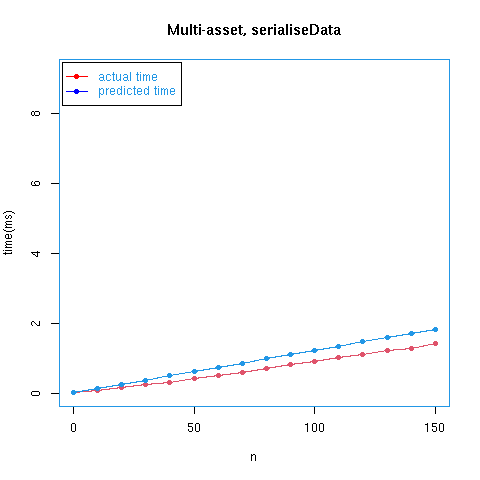

# Serialising TxOut objects
### May 2022

This note reports on some experiments comparing different methods of serialising
`TxOut` objects in on-chain Plutus Core code.


## Background
Plutus Core is a version of the untyped lambda calculus extended with a number
of so-called "built-in types" (like integers and bytestrings) and "built-in
functions" (or just _builtins_) operating on those types (for example,
functions for performing arithmetic on integers and concatenating bytestrings).
Built-in functions are implemented as Haskell functions which can be called from
Plutus Core.

Validation code for Cardano smart contracts can be generated by writing Haskell
code which is converted to Plutus Core using a compiler plugin.  This process
converts algebraic Haskell types into Plutus Core using the _Scott
  encoding_, which represents values of these types as (possibly large) lambda
terms.  The process of converting Haskell values to Plutus Core values is referred to as _lifting_.

In addition, Plutus Core contains a built-in type called `BuiltinData` which is
a newtype wrapper round the Haskell type (see
[plutus-core/plutus-core/src/PlutusCore/Data.hs](https://github.com/input-output-hk/plutus/blob/master/plutus-core/plutus-core/src/PlutusCore/Data.hs)
in the [`plutus` repository](https://github.com/input-output-hk/plutus).

```
data Data =
      Constr Integer [Data]
    | Map [(Data, Data)]
    | List [Data]
    | I Integer
    | B ByteString
```

This type can be used to encode algebraic types more efficiently than
the Scott encoding and is used for a number of purposes in the Cardano
blockchain, including passing redeemer objects and information about the current
transaction into on-chain validators.  Typeclass methods called `toBuiltinData` and
`fromBuiltinData` are provided which can be used to convert Scott encoded datatypes
into `BuiltinData` and vice-versa.  These can be used on-chain, but are not built-in
functions: they are standard Haskell code translated into Plutus Core (but make
use of low-level builtins for constructing and destructing `BuiltinData` objects).

Information about UTXOs can be passed to a validator using the `TxOut` type (see
eg
[plutus-ledger-api/src/Plutus/V1/Ledger/Tx.hs](https://github.com/input-output-hk/plutus/blob/master/plutus-ledger-api/src/Plutus/V1/Ledger/Tx.hs)
in the `plutus` repository)  encoded as `BuiltinData`.  This will generally be
translated into the Scott form using `fromBuiltinData` for processing within the
validator.

### Serialisation

The Hydra team has a need to serialise `TxOut` objects into bytestrings on the
chain, and to this end has implemented an on-chain CBOR encoder: see
`plutus-cbor` in the `hydra-poc` repository.  However, Plutus Core now has a
built-in function called `serialiseData` which can be used to convert
`BuiltinData` objects into bytestrings (see [PR
4447](https://github.com/input-output-hk/plutus/pull/4447)).  The purpose of
this note is to compare this with the CBOR encoding library.  The `hydra-poc`
repository contains some benchmarks for the CBOR library, and I backported
`serialiseData` to work with the version of the Plutus interpreter in that
repository (the `hydra-poc` code is based on a version of Plutus from September
2021, and it was too difficult to update it to work with the current version of
Plutus) and extended the benchmarks to include that as well.  I also had to
re-run part of the cost model creation process in order to obtain an CPU time
model for `serialiseData` on that version of the evaluator.

### Existing benchmarks
The main purpose of the existing benchmarks is to measure the cost of encoding
`TxOut` objects on-chain, specifically to get some idea of how many objects can
be serialised in a reasonable time.  There is an executable called
`encoding-cost` which constructs complete validators which serialise
`TxOut` objects and executes them using the actual ledger code, running the
Plutus Core evaluator to report the expected cost of running the code.  There is
also a set of Criterion benchmarks called `bench` which measures the
running time of the `plutus-cbor` code vis-a-vis the execution time of
the `cborg` library: note however that this involves the execution of
Haskell code, not Plutus Core code.

The benchmarks work with two types of data:
  * (A) Lists of `TxOut` objects of varying lengths, each object containing some amount of Ada.
  * (B) Single `TxOut` objects containing multi-asset values with varying
        numbers of assets.

### Cost model predictions and real times
The Plutus infrastructure includes a cost model for Plutus Core which assigns
CPU and memory costs to Plutus Core programs (also called _scripts_). The
Plutus Core evaluator can be run in _counting mode_ where it adds up the
costs of all of the operations it performs and returns the result to the user,
and it can also be run in _restricting mode_ where a budget is supplied
in advance and the evaluator adds up costs during execution, terminating the
program if the given budget is exceeded.  The idea is that programs (which are
fully deterministic) are run in counting mode off chain to obtain some cost $c$,
then run on chain with a budget at least as large as $c$.  Users have to pay a
fee proportional to $c$ in order to have their script executed.

The cost model is based on benchmarks for each builtin run on a specific
reference machine, with one CPU cost unit representing 1 picosecond of execution
time on that machine. The cost of a script as given by the cost model is not an
exact measure of execution time, but should be roughly proportional to real
execution time (with different constants of proportionality on different
machines/architectures/operating systems).  Tests with a large number of
realistic validation scripts (which are not themselves used in the generation of
the cost model) show that execution time as predicted by the cost model is
generally accurate to within &plusmn;20%.  However, the `serialiseData` function
is somewhat difficult to cost (see [PR 4480](https://github.com/input-output-hk/plutus/pull/4480), especially the last
comment), so there is some uncertainty about how accurate the cost model
predictions will be for scripts involving `serialiseData`. The cost is based on
worst case behaviour, and may overestimate the cost of serialising `TxOut`
objects: part of the purpose of these experiments was to check that.

Memory costs are given in terms of 64-bit words, and are a rough approximation
to the total amount of memory which we expect to be consumed by objects created
by builtins during the execution of a script. We don't attempt to account for
garbage collection or temporary memory used during the execution of a builtin,
so the figures shouldn't be regarded as being hugely accurate (although they do
contribute to script execution fees): their main purpose is to disallow scripts
which consume very large amounts of memory.

# New benchmarks

I added two main extensions to the `plutus-cbor` benchmarks:

* The [`encoding-cost`](./plutus-cbor/exe/Main.hs) executable reports the
  execution costs of validators performing simulated on-chain serialisation
  using the plutus-cbor library; I added some extra code to perform
  serialisation by converting data on-chain (not literally on the blockchain,
  but entirely in Plutus Core) to `BuiltinData` and then calling
  `serialiseData`.  The costs reported by this are costs according to the Plutus
  Core cost model, which are supposed to be an approximation of the time and
  memory usage of the program.

*  I also added some Criterion benchmarks ([`bench-plc`](./plutus-cbor/bench/BenchPlc.hs)) which create
  Plutus Core scripts (not full validators) which just serialise some TxOut
  objects: the benchmarks report actual execution times on our benchmarking
  machine, and thus provide a check on the accuracy of the cost model (recall
  the comments earlier about difficulties assigning costs to `serialiseData`).
  These benchmarks don't include all the extra validation overhead, but are
  still useful for comparison of different serialisation methods. Serialisation
  is performed in three different ways: the two mentioned above together with
  one which just measures the time `serialiseData` takes to serialise `BuiltinData`
  objects which have been created by converting `TxOut` objects off-chain
  (i.e., in Haskell: the resulting data objects are embedded in the scripts).
  This gives us some idea of the cost incurred by calling `toBuiltinData` on the chain
  (there's more on this later).

Both of these use `TxOut` data of the types A and B mentioned earlier.

### Results for `encoding-cost`

The results produced by the `encoding-cost` executable for budgets (not actual
excution times) for full validators are shown below. The "mem" and "cpu"
columns show the total memory usage and CPU time according to the cost model.
The CPU times have been adjusted from picoseconds to microseconds by dividing by
$10^6$ in order to make them easier to read.  The "%mem" and "%cpu" costs show
the costs as percentages of maximum memory and CPU budgets of 1,000,000 and
1,000,000,000 respectively, after subtracting baseline validators which contain
exactly the same data but don't perform any serialisation; this is the same
method used in the original `encoding-cost` executable.

----------------------------------------------------------------

#### List of n ADA-only `TxOut`s, serialised using `plutus-cbor` on-chain

|   n   |     mem     |      cpu      |   %mem   |  %cpu    |
|------:|------------:|--------------:|---------:|---------:|
|   0   |    367164   |   135 &mu;s   |  0.16%   |   0.07%  |
|  10   |   2083761   |   919 &mu;s   | 10.56%   |   5.28%  |
|  20   |   3793414   |  1698 &mu;s   | 20.88%   |  10.43%  |
|  30   |   5517128   |  2485 &mu;s   | 31.34%   |  15.66%  |
|  40   |   7236890   |  3269 &mu;s   | 41.75%   |  20.85%  |
|  50   |   9014323   |  4084 &mu;s   | 52.77%   |  26.38%  |
|  60   |  10817658   |  4912 &mu;s   | 64.06%   |  32.05%  |
|  70   |  12569405   |  5712 &mu;s   | 74.79%   |  37.41%  |
|  80   |  14372964   |  6540 &mu;s   | 86.06%   |  43.06%  |
|  90   |  16159679   |  7358 &mu;s   | 97.15%   |  48.60%  |
| 100   |  18003565   |  8206 &mu;s   |108.84%   |  54.46%  |
| 110   |  19796882   |  9027 &mu;s   |119.99%   |  60.02%  |
| 120   |  21633695   |  9871 &mu;s   |131.58%   |  65.83%  |
| 130   |  23481888   | 10720 &mu;s   |143.30%   |  71.69%  |
| 140   |  25360284   | 11585 &mu;s   |155.32%   |  77.72%  |
| 150   |  27213772   | 12437 &mu;s   |167.08%   |  83.59%  |

----------------------------------------------------------------


#### List of n ADA-only `TxOut`s, serialised using  `serialiseData . toBuiltinData` on-chain

|   n   |     mem     |      cpu      |   %mem    |  %cpu    |
|------:|------------:|--------------:|----------:|---------:|
|   0   |     359728  |    133 &mu;s  |   0.08%   |   0.05%  |
|  10   |    1501760  |    678 &mu;s  |   4.74%   |   2.87%  |
|  20   |    2643108  |   1219 &mu;s  |   9.38%   |   5.64%  |
|  30   |    3784456  |   1761 &mu;s  |  14.01%   |   8.42%  |
|  40   |    4925462  |   2301 &mu;s  |  18.64%   |  11.17%  |
|  50   |    6067836  |   2847 &mu;s  |  23.31%   |  14.01%  |
|  60   |    7210552  |   3394 &mu;s  |  27.99%   |  16.88%  |
|  70   |    8351558  |   3934 &mu;s  |  32.61%   |  19.63%  |
|  80   |    9493590  |   4479 &mu;s  |  37.27%   |  22.45%  |
|  90   |   10634938  |   5020 &mu;s  |  41.91%   |  25.22%  |
| 100   |   11777312  |   5566 &mu;s  |  46.58%   |  28.06%  |
| 110   |   12918318  |   6106 &mu;s  |  51.20%   |  30.82%  |
| 120   |   14060008  |   6649 &mu;s  |  55.85%   |  33.61%  |
| 130   |   15201698  |   7192 &mu;s  |  60.49%   |  36.41%  |
| 140   |   16343730  |   7737 &mu;s  |  65.15%   |  39.23%  |
| 150   |   17485078  |   8278 &mu;s  |  69.79%   |  42.00%  |

----------------------------------------------------------------


#### Single n-asset `TxOut`, serialised using `plutus-cbor` on-chain

|   n  |     mem     |      cpu      |   %mem    |   %cpu   |
|-----:|------------:|--------------:|----------:|---------:|
|   0  |     432372  |    165 &mu;s  |   0.41%   |   0.18%  |
|  10  |    1205297  |    546 &mu;s  |   6.39%   |   3.43%  |
|  20  |    1995028  |    937 &mu;s  |  12.54%   |   6.77%  |
|  30  |    2797416  |   1335 &mu;s  |  18.82%   |  10.18%  |
|  40  |    3593053  |   1728 &mu;s  |  25.03%   |  13.54%  |
|  50  |    4400901  |   2128 &mu;s  |  31.37%   |  16.97%  |
|  60  |    5209712  |   2527 &mu;s  |  37.71%   |  20.39%  |
|  70  |    6042110  |   2940 &mu;s  |  44.29%   |  23.95%  |
|  80  |    6872659  |   3351 &mu;s  |  50.85%   |  27.49%  |
|  90  |    7719599  |   3770 &mu;s  |  57.58%   |  31.11%  |
| 100  |    8562297  |   4187 &mu;s  |  64.26%   |  34.71%  |
| 110  |    9424324  |   4614 &mu;s  |  71.14%   |  38.42%  |
| 120  |   10273085  |   5034 &mu;s  |  77.88%   |  42.05%  |
| 130  |   11137359  |   5462 &mu;s  |  84.78%   |  45.75%  |
| 140  |   12020689  |   5899 &mu;s  |  91.87%   |  49.56%  |
| 150  |   12906430  |   6338 &mu;s  |  98.98%   |  53.37%  |

----------------------------------------------------------------

#### Single n-asset `TxOut`, serialised using `serialiseData . toBuiltinData` on-chain

|   n  |     mem     |      cpu      |   %mem    |   %cpu   |
|-----:|------------:|--------------:|----------:|---------:|
|   0  |     419492  |    164 &mu;s  |   0.28%   |   0.18%  |
|  10  |     760276  |    331 &mu;s  |   1.94%   |   1.28%  |
|  20  |    1101064  |    498 &mu;s  |   3.60%   |   2.38%  |
|  30  |    1441862  |    667 &mu;s  |   5.27%   |   3.50%  |
|  40  |    1782640  |    833 &mu;s  |   6.93%   |   4.59%  |
|  50  |    2123428  |   1000 &mu;s  |   8.59%   |   5.69%  |
|  60  |    2464208  |   1167 &mu;s  |  10.26%   |   6.79%  |
|  70  |    2805004  |   1335 &mu;s  |  11.92%   |   7.90%  |
|  80  |    3145788  |   1502 &mu;s  |  13.58%   |   9.00%  |
|  90  |    3486586  |   1670 &mu;s  |  15.25%   |  10.11%  |
| 100  |    3827370  |   1837 &mu;s  |  16.91%   |  11.21%  |
| 110  |    4168160  |   2005 &mu;s  |  18.58%   |  12.32%  |
| 120  |    4508932  |   2170 &mu;s  |  20.24%   |  13.40%  |
| 130  |    4849710  |   2336 &mu;s  |  21.90%   |  14.49%  |
| 140  |    5190504  |   2504 &mu;s  |  23.57%   |  15.61%  |
| 150  |    5531286  |   2670 &mu;s  |  25.23%   |  16.70%  |

----------------------------------------------------------------


The results suggest that using `serialiseData` is about 66%  of the cost of
using `plutus-cbor` for lists of Ada-only `TxOut` objects (in terms of both CPU
usage and memory), and that for single multi-asset `TxOut`s the cost is about
45% .  They should also give some idea of how many `TxOut`s it will be feasible
to serialise within the time limits enforced by the chain.  It should also be
taken into account that **the current version of the Plutus Core evaluator
  is about twice as fast as the one used in these experiments** (and this is
reflected in the cost model), so we can expect some improvement on the
results above.


### Results for `bench-plc`

The results for the `bench-plc` benchmarks are shown below; note that all of the
graphs have the same vertical scale.  Execution times as predicted by the cost
model (obtained from `encoding-cost`) are shown in <span
style="color:blue">blue</span> and actual execution times of the benchmarks are
shown in <span style="color:red">red</span>.  The first two graphs in each group
show reasonable agreement between predictions and reality.  These graphs
represent the same serialisation methods as for the `encoding-cost` results,
which suggests that we can be reasonably confident about the accuracy of the
latter.  For emphasis, we repeat that `encoding-cost` uses full validators but
the `bench-plc` scripts only perform serialisation: this is because it was too
difficult to obtain real execution times of full validator scripts.

-------------------------------------------------

#### Serialisation times for Ada-only `TxOut`s


------------------------------------------------
#### Serialisation time for multi-asset `TxOut`s




-----------------------------------------------

Note though that in the final graph in each group the prediction is a
considerable overestimate of the actual execution time. Closer examination of
the data suggests that we are typically overestimating by a factor of 10--15.
The reason for this is probably that these benchmarks measure _only_ the
execution time of `serialiseData` whereas the second graph in each group also
includes the cost of `toBuiltinData`, which involves traversing Scott-encoded data
structures to convert them into `BuiltinData`.  As mentioned earlier, the cost model
for `serialiseData` is conservative because its worst-case behaviour, which
seems to occur for objects which contain large numbers of integers, is much
worse than its typical behaviour. The `TxOut` objects which we're dealing with
here typically consist mostly of hashes (for which I think serialisation is
effectively the identity function) and so are cheaper than the worst case.
Having said that, I'm not entirely sure why this discrepancy doesn't throw the
results for the second graphs out more, but it is noticeable that those graphs
both show overestimated times but the first graphs (which don't involve
`serialiseData`) show slightly underestimated times.  It may be that the
discrepancy is just swallowed up by the larger overall times.

### Can we avoid the overhead of `toBuiltinData`?

In order to call `serialiseData` it is necessary to convert Scott-encoded data
structures into `BuiltinData` objects, and this requires on-chain traversal of
potentially large objects: the results of the previous section suggest that this
can introduce quite a lot of overhead.  But in the case of Hydra, where do these
objects come from?  I don't know exactly, but they're presumably obtained from
the context object or the redeemer for the current transaction in the form of
`BuiltinData`, which has to undergo conversion to Scott encoded data via the
`fromBuiltinData` function, the inverse of `toBuiltinData`.  If this is the case
then it may be possible to get `BuiltinData` encodings of `TxOut` objects
directly from the context/redeemer and serialise those **without having to call
`toBuiltinData` on-chain**, which could lead to a considerable decrease in
serialisation times.

### Serialised sizes of scripts

The `encoding-cost` executable also reports the serialised sizes of the scripts
in the previous section, and we record them here for completeness.

-------------------------------------------------

#### Serialisation sizes for Ada-only `TxOut`s
|   n  | `plutus-cbor`| `serialiseData`, `toBuiltinData` on-chain  |  `serialiseData`, `toBuiltinData` off-chain  |  
|-----:|-------------:|------------:|-----------:|
|   0  |      715     |    533      |     39     |
|  10  |     1455     |   1500      |    823     |
|  20  |     2226     |   2394      |   1535     |
|  30  |     3037     |   3288      |   2248     |
|  40  |     3770     |   4144      |   2926     |
|  50  |     4532     |   5146      |   3744     |
|  60  |     5243     |   6183      |   4597     |
|  70  |     6035     |   7041      |   5275     |
|  80  |     6787     |   8008      |   6058     |
|  90  |     7586     |   8901      |   6771     |
| 100  |     8335     |   9904      |   7589     |
| 110  |     9102     |  10761      |   8267     |
| 120  |     9793     |  11692      |   9015     |
| 130  |    10532     |  12621      |   9763     |
| 140  |    11316     |  13585      |  10546     |
| 150  |    12072     |  14479      |  11258     |

---------------------------------------------------------------------
#### Serialisation sizes for multi-asset `TxOut`s
|   n  | `plutus-cbor`| `serialiseData`, `toBuiltinData` on-chain  |  `serialiseData`, `toBuiltinData` off-chain  |  
|-----:|-------------:|------------:|-----------:|
|   0  |       726    |     542     |      87    |
|  10  |      1692    |    1282     |     632    |
|  20  |      2586    |    2053     |    1212    |
|  30  |      3480    |    2864     |    1833    |
|  40  |      4336    |    3597     |    2369    |
|  50  |      5338    |    4359     |    2935    |
|  60  |      6375    |    5070     |    3451    |
|  70  |      7233    |    5862     |    4050    |
|  80  |      8200    |    6614     |    4606    |
|  90  |      9093    |    7413     |    5211    |
| 100  |     10096    |    8162     |    5763    |
| 110  |     10953    |    8929     |    6337    |
| 120  |     11884    |    9620     |    6832    |
| 130  |     12813    |   10359     |    7375    |
| 140  |     13777    |   11143     |    7964    |
| 150  |     14671    |   11899     |    8525    |
---------------------------------------------------------------------

Somewhat surprisingly, for lists of Ada-only `TxOut`s the serialised scripts for
`serialiseData . toBuiltinData` are generally _larger_ (by up to 20%) than those
for `plutus-cbor` (which contain a compiled version of the library), and ones
where `toBuiltinData` is performed "off-chain" are about 10 smaller than the
`plutus-cbor` ones.  For multi-asset scripts, the situation is different:
scripts using `serialiseData . toBuiltinData` are about 20% smaller than the
`plutus-cbor` ones and the ones where `toBuiltinData` is performed off-chain are
typically about 60% of the size of the plutus-cbor ones.  More
investigation/thought will be required to explain the discrepancy between the
Ada-only and the multi-asset scripts.