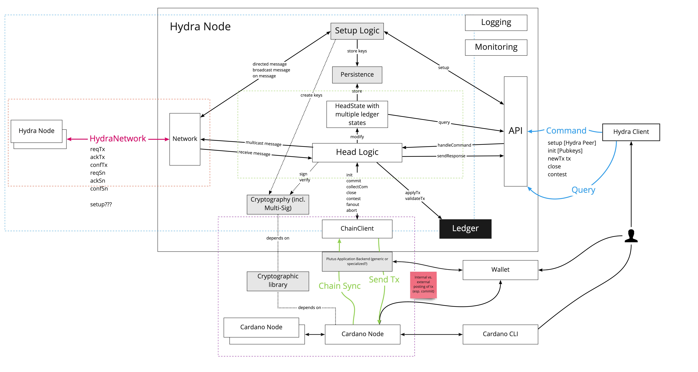

Welcome to the Hydra Proof-of-Concept (POC) documentation.

This technical documentation does contain some additional information about the
architecture and inner workings of a `hydra-node` and the [Hydra Head
protocol](https://eprint.iacr.org/2020/299.pdf).

:warning: This project is still prototypical and exploratory work - it is NOT ready for production (yet). :warning:

Thus, the documentation here is also a work in progress and is certainly not
complete. However, we do want to improve it and would like to hear from any
[questions](https://github.com/input-output-hk/hydra-poc/#question-contributing)
you might have (so we can at the very least compile an FAQ).

# Hydra Head protocol

The greater [vision of
Hydra](https://iohk.io/en/blog/posts/2020/03/26/enter-the-hydra-scaling-distributed-ledgers-the-evidence-based-way/)
involves a whole suite of layer-two protocols to achieve greater scalability in
many different use cases.

The [Hydra Head](https://eprint.iacr.org/2020/299.pdf) protocol is one of them
and forms the foundation for more advanced deployment scenarios and introduces
isomorphic, multi-party state channels. This is also the protocol on which we
focused most so far and implemented a proof of concept for.

There exist various flavors and extensions of the Hydra Head protocol, but let's
have a look at a full life cycle of a basic Hydra Head and how it allows for
isomorphic state transfer between layer 1 and layer 2.

A Hydra Head is formed by a group of online and responsive participants. They
**init** a Head by announcing several Head-specific parameters including the
participants list. Then each of the participants **commits** unspent transaction
outputs (UTXO) from the Cardano main-chain to it, before all the UTXO are
**collected** and made available in a Hydra Head as initial state (**U0**).

While open, they can use the Hydra Head via a `hydra-node` just the same as they
would be using the Cardano blockchain via a `cardano-node` by submitting
transactions to it (that's the **isomporphism** property). When UTXO are spent
and new UTXO are created in a Hydra Head, all participantes are required to
acknowledge and agree on the new state in so-called snapshots (**U1..n**)

Any participant can **close** the Head using an agreed state, when for example
they wish to use some UTXO on the mainnet or another party misbehaves or stalls
the Head evolution. There is a mechanism to **contest** the final state on the
main chain for a Head-specific contestation period, which a **fanout**
transaction does distribute in the end.

This is not the full picture though, as the protocol also allows to **abort**
Head initialization and protocol extensions for incremental commits and
decommits, as well as optimistic head closures (without contestation period) are
possible.

# Hydra Node Architecture

We use _Architecture Decision Records (ADR)_ for a lightweight technical
documentation about our principles and significant design decisions. The
architecture itself then is just a result of all accepted ADRs, which have not
been deprecated or superseeded. An up-to-date index of still relevant ADRs is
kept [here](./adr/README.md).

The following diagram represents the internal structure of the Hydra Node and the interactions between its components.

**Legend**:
- Grayed boxes represent components which are not developed yet
- Black boxes represent components which are expected to be used as _black box_, eg. without any knowledge of their inner workings.
- Arrows depict the flow of data (Requests, messages, responses...)
- We represent some components that are not part of the Hydra node proper for legibility's sake

## Components

> **TODO**: Move as haddock comments to each module/function

Please refer to each component's internal documentation for details.

* The [HydraNode](https://github.com/input-output-hk/hydra-poc/blob/d24c04e138acd333c3d47f97bb214957785fde08/hydra-node/src/Hydra/Node.hs) is a handle to all other components' handles
  * This handle is used by the main loop to `processNextEvent` and `processEffect`
* The [HeadLogic](https://github.com/input-output-hk/hydra-poc/blob/d24c04e138acd333c3d47f97bb214957785fde08/hydra-node/src/Hydra/HeadLogic.hs) component implements the Head Protocol's _state machine_ as a _pure function_.
  * The protocol is described in two parts in the [Hydra paper](https://iohk.io/en/research/library/papers/hydrafast-isomorphic-state-channels/):
    * One part detailing how the Head deals with _clients input_, eg. [ClientRequest](https://github.com/input-output-hk/hydra-poc/blob/d24c04e138acd333c3d47f97bb214957785fde08/hydra-node/src/Hydra/HeadLogic.hs#L43):
    * Another part detailing how the Head reacts to _peers input_ provided by the network, eg. [HydraMessage](https://github.com/input-output-hk/hydra-poc/blob/d24c04e138acd333c3d47f97bb214957785fde08/hydra-node/src/Hydra/HeadLogic.hs#L78):
* The [OnChain](https://github.com/input-output-hk/hydra-poc/blob/d24c04e138acd333c3d47f97bb214957785fde08/hydra-node/src/Hydra/Node.hs#L154) client implements the _Head-Chain Interaction_ part of the protocol
  * Incoming and outgoing on-chain transactions are modelled as an [OnChainTx](https://github.com/input-output-hk/hydra-poc/blob/d24c04e138acd333c3d47f97bb214957785fde08/hydra-node/src/Hydra/HeadLogic.hs#L88) data type that abstracts away the details of the structure of the transaction.
* The [Network](https://github.com/input-output-hk/hydra-poc/blob/d24c04e138acd333c3d47f97bb214957785fde08/hydra-node/src/Hydra/Network.hs) component provides the Node an asynchronous messaging interface to the Hydra Network, e.g to other Hydra nodes
  * Incoming and outgoing messages are modelled as [HydraMessage](https://github.com/input-output-hk/hydra-poc/blob/d24c04e138acd333c3d47f97bb214957785fde08/hydra-node/src/Hydra/HeadLogic.hs#L78) data type
  * We have a [ouroboros-network](https://github.com/input-output-hk/ouroboros-network/tree/master/ouroboros-network-framework) based implementation of the network component (we had another one using [ZeroMQ](https://zeromq.org/))
    * The [Ouroboros](https://github.com/input-output-hk/hydra-poc/blob/d24c04e138acd333c3d47f97bb214957785fde08/hydra-node/src/Hydra/Network/Ouroboros.hs) based network layer implements a dumb [FireForget](https://github.com/input-output-hk/hydra-poc/blob/d24c04e138acd333c3d47f97bb214957785fde08/hydra-node/src/Hydra/Network/Ouroboros/Type.hs#L27) protocol. Contrary to other protocols implemented in Ouroboros, this is a push-based protocol
* The main constituent of the Head's state is the [Ledger](https://github.com/input-output-hk/hydra-poc/blob/d24c04e138acd333c3d47f97bb214957785fde08/hydra-node/src/Hydra/Ledger.hs) which allows the head to maintain and update the state of _Seen_ or _Confirmed_ transactions and UTxOs according to its protocol.
  * [MaryTest](https://github.com/input-output-hk/hydra-poc/blob/d24c04e138acd333c3d47f97bb214957785fde08/hydra-node/src/Hydra/Ledger/MaryTest.hs) provides a more concrete implementation based on a Mary-era Shelley ledger, but with test cryptographic routines
* Structured logging is implemented using [IOHK monitoring framework](https://github.com/input-output-hk/iohk-monitoring-framework) which provides backend for [contra-tracer](https://hackage.haskell.org/package/contra-tracer) generic logging
  * Each component defines its own tracing messages as a datatype and they are aggregated in the [HydraLog](https://github.com/input-output-hk/hydra-poc/blob/d24c04e138acd333c3d47f97bb214957785fde08/hydra-node/src/Hydra/Logging/Messages.hs) datatype. Specialized `Tracer`s can be passed around from the top-level one using `contramap` to peel one layer of the onion
  * Configuration of the main tracer is done via the [withTracer](https://github.com/input-output-hk/hydra-poc/blob/d24c04e138acd333c3d47f97bb214957785fde08/hydra-node/src/Hydra/Logging.hs) wrapper function
* Metrics and monitoring are piggy-backed on tracing events:
  * Monitoring collection is configured at start of the hydra-node
  * Traced events are [interpreted](https://github.com/input-output-hk/hydra-poc/blob/d24c04e138acd333c3d47f97bb214957785fde08/hydra-node/src/Hydra/Logging/Monitoring.hs) as contributing to some specific metric value without trace producers needing to be aware of how this process happens
  * Metrics are exposed using [Prometheus](https://prometheus.io/docs/instrumenting/exposition_formats/) format over URI `/metrics` from an HTTP server started on a configurable port.
