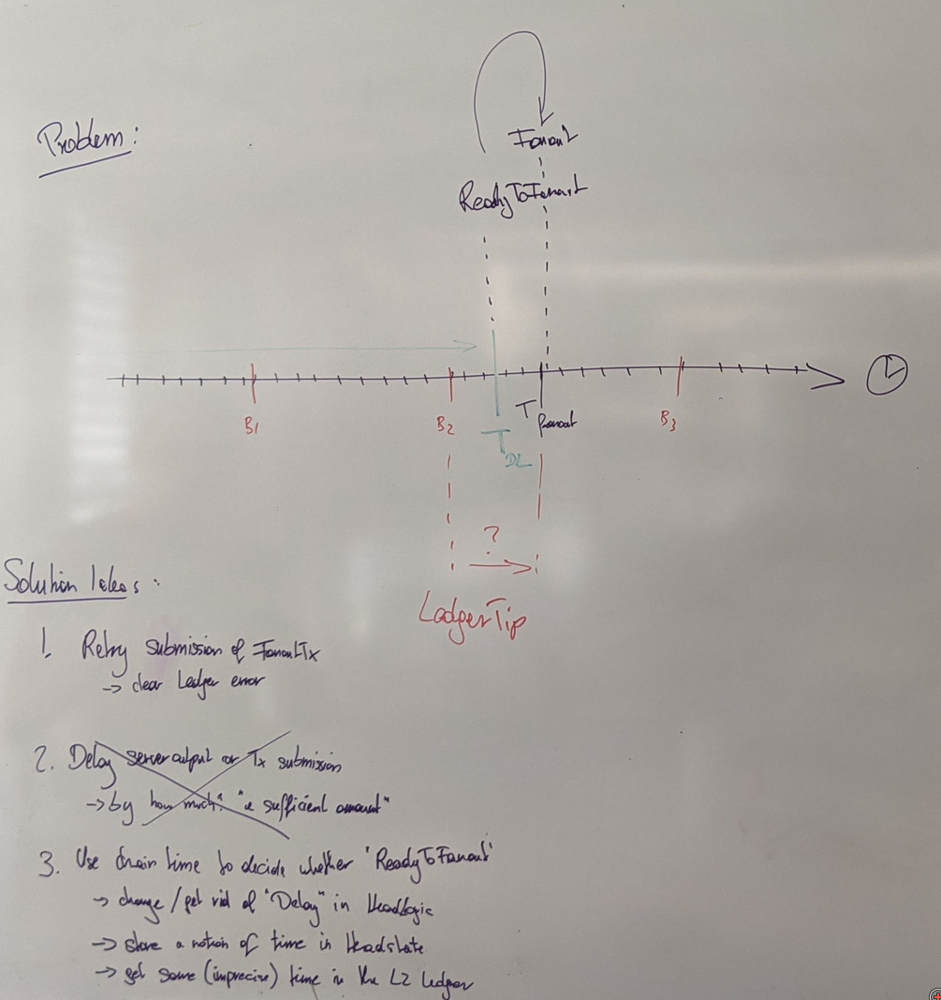

## Status

Proposed

## Context

* The Hydra Head protocol is expected to be isomorphic to the ledger it runs on. That means, it should support the same transaction formats and (if desired) use the same ledger rules as the layer 1.

* Cardano is our layer 1 and its consensus layer separates time into discrete steps, where each step is called a `Slot`. The network is expected to evolve strictly monotonically on this time scale and so slot numbers (`SlotNo`) are always increasing.

* The Cardano mainnet has a block scheduled every 20 seconds, although it may take longer.
  - This is because `slotLength = 1.0` and every 20th slot is "active" with `f = 0.05`.
  - The consensus protocol requires `k` blocks to be produced within `3k/f` slots, where `k = 2160` on mainnet.

* Transactions on Cardano may have a validity range with a lower and upper bound given as `SlotNo`.

* Wall-clock time can be converted to slots (and back) using an `EraHistory` or `EpochInterpreter` provided by the consensus layer of the cardano node. This is required as the slot lengths could change over time.
  - All past points in time since the `SystemStart` can be converted.
  - Future points in time can **only** be converted in the "safe zone", practically being at least `3k/f` slots (TODO: cross check). Refer to chapter 17 *Time* on the [consensus spec](https://hydra.iohk.io/build/16997794/download/1/report.pdf) for more details.

* The Hydra Head protocol allows `close` and `contest` transactions only up before a deadline `T_final`, and `fanout` transactions before the deadline.
  - In the current implementation the deadline is upper validity of `closed` plus the contestation period.
  - We also consider protocol variants which push out the deadline by the contestation period on each `contest`.
  - Contestation periods may very well be longer than the stability window of the protocol. For example: 7 days, while the mainnet stability window is more like 36 hours.

* We have encountered two problems with handling time in the past
  - Trying to convert wall-clock time to slots of the Head protocol deadline led to `PastHorizonException` (when using very low security parameter `k`)
  - Trying to `fanout` after the deadline, but before another block has been seen by the L1 ledger led to `OutsideValidityIntervalUTxO`.
  
* The second problem scenario and solution ideas are roughly visible on this whiteboard:

## Decision

* The head logic uses wall-clock time to track time and only convert to/from slots when constructing/observing transactions in the chain layer.
  - This ensures that transactions we post or see on the chain can be converted to/from slots.
  - The head logic would use `UTCTime` for points in time and `NominalDiffTime` for durations.
  - The chain layer converts these using the `SystemStart` and `EraHistory` into `SlotNo`.

* The chain layer informs the logic layer whenever time passed (on the chain) using a new `Tick` event.
  - For the direct chain implementation, this is whenever we see a block in the chain sync protocol.
  - Per above decision, the `Tick` shall contain a `UTCTime` corresponding to the new "now" as seen through the block chain.

## Consequences

* Conversion from `UTCTime -> SlotNo` and vice versa stays local to the chain layer.

* The `HeadLogic` can track chain time in its state and condition `ReadyToFanout` upon seeing it pass the deadline.
  - Ensures clients only see `ReadyToFanout` when a following `Fanout` would be really possible.
  - Makes the `Delay` effect redundant and we can remove it (only delay via reenqueue on the `Wait` outcome)

* By introducing `Tick` events, `IOSim` will not be able to detect non-progress (deadlocks).
  - This means we cannot rely on early exit of simulations anymore and need to determine meaningful simulation endings instead of `waitUntilTheEndOfTime`.

* We get a first, rough notion of time for free in our L2 and can support "timed transactions" with same resolution as the L1.
  - Tracking time in the state makes it trivial to provide it to the ledger when we `applyTransaction`.
  - Of course we could extend the fidelity of this feature using the system clock for "dead reckoning" between blocks. The conversion of wall clock to slot could even be configurable using an L2 `slotLength` analogous to L1 (although we might not want/need this).
