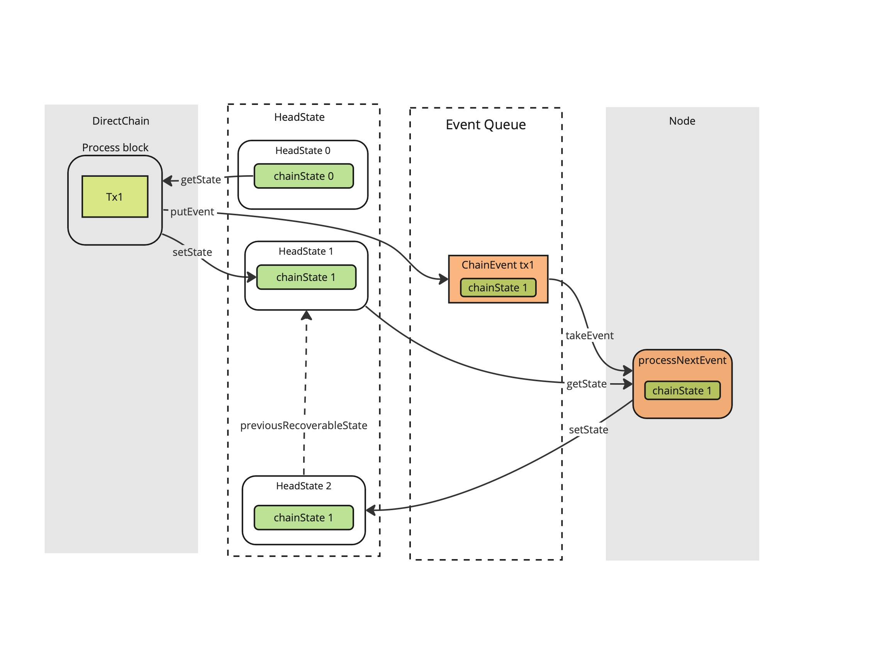

## Status

Accepted

## Context

* [ADR 18](2022-04-13_018-single-state.md) merged both headState and chainState in one single state in the Hydra node, giving the chain layer a way to _fetch_ and update the chainState when observing a chain event.
* Having the headState containing the chainState made persistency easier to deal with: we ensure that we always save cohesive states.
* When opening our first head on mainnet we suffered from a [commit/rollback issue](https://github.com/input-output-hk/hydra/issues/784) that was the result of a race condition in the management of the chainState as implemented in the context of [ADR 18](2022-04-13_018-single-state.md).
* Reproducing the issue by introducing rollbacks in the model based tests, we discovered that, as a client of a hydra-node, we had no idea how to deal with the rollback event as it is defined now.
* [#185](https://github.com/input-output-hk/hydra/issues/185) plans to improve rollback management.

The following picture details the race condition through an exemple:

1. The DirectChain component fetch some `chainState 0` from the `headState`

1. The DirectChain component observes a transaction and it

* publishes an event about this observation
* updates the `headState` with some `chainState 1`

1. The Node processes the event and emits a new `headState` with a `previousRecoverableState` in case a rollback later happens

The problem is that `HeadState 2` in the figure should point to a previous
recoverable head state containing `chainState 0` and not `chainState 1`.

Updating the chain state only in the `HeadLogic` leads to problems when several transactions are in the same block. This can be mitigated by keeping a volatile chain state locally while analysing the block. But then it leads to race conditions issues if, for some reason, blocks are produced faster than they are processed by the HeadLogic. Low probability in production but higher when testing.

## Decision

* We supersede [ADR 18](2022-04-13_018-single-state.md) with the current ADR.
* A local chain state is re-introduced in the chain component, not shared with the head logic.
* A copy of the chain state is kept in the head state to keep the benefits of [ADR 18](2022-04-13_018-single-state.md) regarding persistency.
* The rollback event is removed from the API until [#185](https://github.com/input-output-hk/hydra/issues/185).

## Consequences

* The rollback logic is removed from the HeadLogic and only maintained in the chain component.
* The Rollback event carries the ChainState.
* At the node startup, we initialize the chain layer with the persisted chainState
