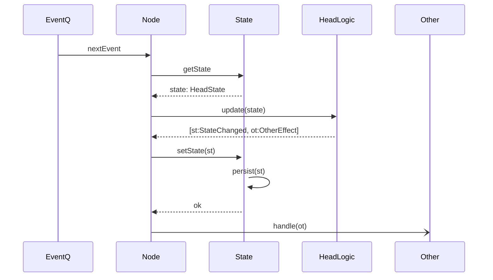

## Status

Proposed

## Context

* The state of a Hydra Head is currently persisted as a whole upon each `NewState` _outcome_ from the `update` function: The new state is serialised and the `state` file is overwritten with the corresponding bytes. While this is a straightforward strategy to implement, it has a huge impact on the performance of a Hydra Head as serialising a large data structure like the `HeadState` and completely overwriting a file is costly
  * We revisited our benchmarks and [found](https://github.com/input-output-hk/hydra/issues/186#issuecomment-1584292265) that persistence was the major bottleneck when measuring roundtrip confirmation time,e g. the time it takes from a client's perspective to submit a transaction and observe in a `ConfirmedSnapshot`
* Furthermore, the way we currently handle changes to the `HeadState` in the hydra-node, while conceptually being an `Effect` is handled differently from other `Effect`s: The state is updated transactionally through a dedicated `modifyHeadState` function in the core loop of processing events, and _then_ effects are processed.

## Decision

Implement state persistence using [_Event Sourcing_](https://thinkbeforecoding.com/post/2013/07/28/Event-Sourcing-vs-Command-Sourcing). Practically, this means:

1. Replace the `NewState` outcome with a `StateChanged` _event_ which can be part of the `Outcome` of `HeadLogic`'s `update` function, representing the _change_ to be applied to the current state.
2. Add a dedicated [handle](/adr/4) to manage `StateChanged` events, applying them, and maintaining current `HeadState`
3. Persist `StateChanged`s in an append-only log
4. Upon node startup, reread `StateChanged` events log and reapply those to reset the `HeadState`
3. _(Optional)_: Make `StateChanged` _invertible_

The following sequence diagram illustrates new event handling in the `HeadLogic`:

## Consequences

-  :racehorse: The main expected consequence of this change is an increase of the overall performance of Hydra Head network
-  While _Effect handlers_ might be asynchronous, `StateChanged` handler _must_ be synchronous to ensure consistency and durability of state changes
- An longer term consequence is the possibilities this change introduces with respect to `ServerOutput` handling and client's access to a head's state:
  - Instead of having the `HeadLogic` emits directly a `ClientEffect`, the latter could be the result of a client-centric _interpretation_ of a `StateChanged`
  - Pushing this a little further, we could maintain a _Query Model_ for clients with a dedicated [Query API](https://github.com/input-output-hk/hydra/discussions/686) to ease implementation of stateless clients
- Crashing nodes could catch-up with the Head's state by requesting `StateChanged` changes they are missing
- Calling `StateChanged` an _event_ while treating it in the code alongside _effects_ might introduce some confusion as we already use the word [Event](https://github.com/input-output-hk/hydra/blob/45913954eb18ef550a31017daa443cee6720a00c/hydra-node/src/Hydra/HeadLogic.hs#L64) to designate the inputs to the Head logic state machine. We might want at some later point to unify the terminology
