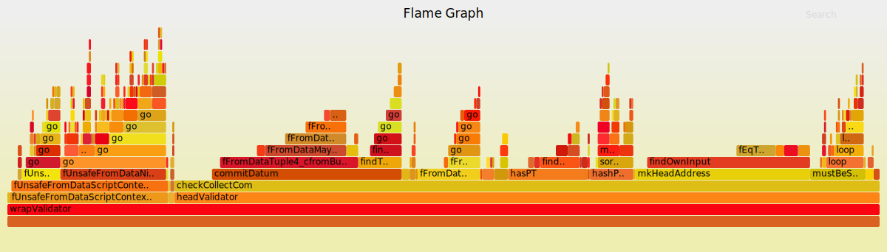

# Profiling Hydra scripts

This tutorial explains how to profile Hydra scripts and is intended for contributors to the `hydra-node`.

## Overview

For every pull request and the latest `master` branch, we compute typical transaction costs in terms of size, memory, and CPU usage of the Hydra protocol transactions on Cardano. You can view the latest results [here](https://hydra.family/head-protocol/benchmarks/transaction-cost).

Such benchmarks provide a comprehensive overview of the constraints for a given transaction, including maximum transaction size and percent of maximum memory and CPU budget. For a detailed assessment, we analyze _all_ scripts that run within a given transaction.

To gain detailed insights into _what exactly_ results in excessive memory or CPU usage, we need to profile the scripts as they validate a transaction.

Follow the instructions provided by the [`Plutus`](https://github.com/input-output-hk/plutus) project [here](https://plutus.readthedocs.io/en/latest/howtos/profiling-scripts.html), adapted for the `hydra` codebase.


## Isolating a transaction to profile

First, isolate the specific Cardano transaction you want to profile. For example, let's investigate what the `increment` transaction
for `5` parties in the `tx-cost` benchmark is spending most time and memory on.

The benchmark computes many transactions with the growing number of participants in `computeIncrementCost`:

```haskell
computeIncrementCost = do
  interesting <- catMaybes <$> mapM compute [1, 2, 3, 5, 10, 50]
  -- [...]
 where
  compute numParties = do
    (ctx, st, utxo', tx) <- genIncrementTx numParties
    cctx <- pickChainContext ctx
    let utxo = getKnownUTxO st <> getKnownUTxO cctx <> utxo'
    case checkSizeAndEvaluate tx utxo of
      -- [...]
```

Here, isolate the transaction for `5` parties by replacing the list passed to `mapM compute` with `[5]`.

## Compiling a script for profiling

The `increment` transaction utilizes the `vDeposit` and `vHead` validator scripts. To enable profiling, add the following directive to the modules [`Hydra.Contract.Deposit`](pathname:///haddock/hydra-plutus/Hydra-Contract-Deposit.html) and [`Hydra.Contract.Head`](pathname:///haddock/hydra-plutus/Hydra-Contract-Head.html):

```
{-# OPTIONS_GHC -fplugin-opt Plinth.Plugin:profile-all #-}
```

## Acquiring an executable script

You can achieve this using
[`prepareTxScripts`](pathname:///haddock/hydra-tx/Hydra-Ledger-Cardano-Evaluate.html#v:prepareTxScripts).
To acquire and save the fully applied scripts from the transaction onto disk, run:

```haskell
-- [...]
(ctx, st, utxo', tx) <- genIncrementTx numParties
cctx <- pickChainContext ctx
let utxo = getKnownUTxO st <> getKnownUTxO cctx <> utxo'
scripts <- either die pure $ prepareTxScripts tx utxo
forM_ (zip [1 ..] scripts) $ \(i, s) -> writeFileBS ("scripts-" <> show i <> ".flat") s
-- [...]
```

After running the corresponding code (`tx-cost` in our example), you will have
`scripts-{1,2,...}.flat` files in the current directory.

Script sizes should help in identifying the larger `vHead` script from the smaller `vDeposit` script. In the profile, the names of original `plutus-tx` functions will be retained, which should make it clear at the latest.

## Running the script and analyzing the results

To perform this step, use the following tools available through Nix:

```
nix shell nixpkgs#flamegraph github:input-output-hk/plutus#x86_64-linux.plutus.library.plutus-project-924.hsPkgs.plutus-core.components.exes.traceToStacks github:input-output-hk/plutus#x86_64-linux.plutus.library.plutus-project-924.hsPkgs.plutus-core.components.exes.uplc
```

To produce the profile log as explained above, you need to use a different input format since `prepareTxScripts` retains the original name annotations.

```
uplc evaluate -t -i scripts-1.flat --if flat-namedDeBruijn --trace-mode LogsWithBudgets -o logs
```

Check for a `logs` file output. If not present, ensure the script was compiled with profiling enabled as specified.

Finally, you can inspect the logs or generate flame graph SVGs as outlined in the original tutorial:

```
cat logs | traceToStacks | flamegraph.pl > cpu.svg
cat logs | traceToStacks --column 2 | flamegraph.pl > mem.svg
```

Here's an example of a memory profile for a `5` party `collectCom` (kept as a historical illustration; the `collectCom` transaction itself has been removed since [ADR-33](../adr/2026-03-10_033-directly-open-head.md)):



:::tip
Open the SVG in a browser to interactively search and explore the profile in detail.
:::
