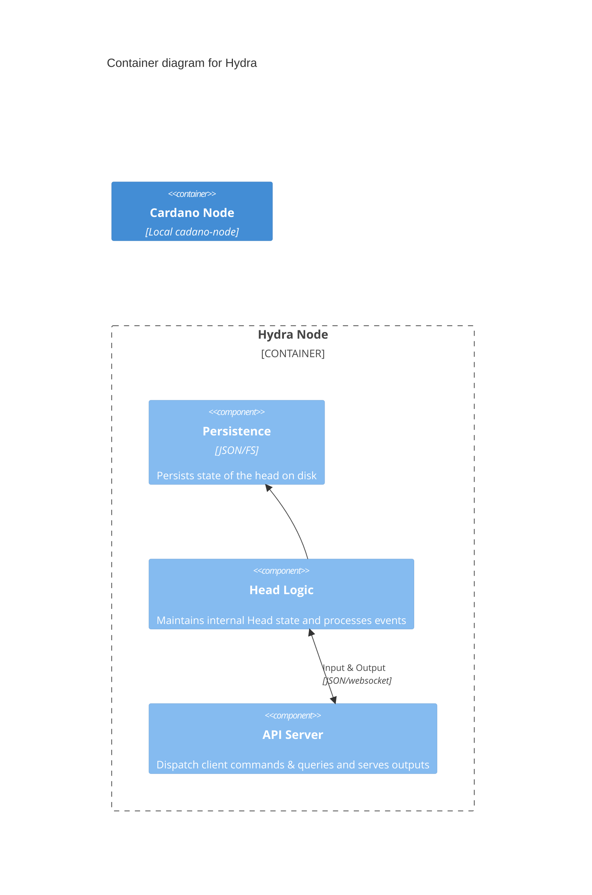

# Hydra Node Architecture

This document describes the architecture of the current implementation of a `hydra-node`.




Current implementation of a `hydra-node` consists of couple of layers:
  + _Networking_
  + _Direct Chain_
  + _Head Logic_
  + _Plutus Contracts_
  + _API_
  + _Persistence_

### Networking layer

Networking layer is responsible for all of the network communication between
hydra-nodes. This is Ouroboros based implementation, asynchronous by nature and
using push based protocol. Messages are exchanged between nodes on each event
and currently there is no message authentication in place. We rely on a fact
that we know each peers IP address and a port and _trust_ these messages
blindly. There are [plans](https://github.com/input-output-hk/hydra/issues/727)
on introducing message signing to improve on security properties of the hydra
protocol.

### Direct Chain layer

This layer is using `Node-to-Client` protocol and is responsible for observing
and submitting transactions. It _talks_ directly to locally spun cardano-node
and internally it uses a queue to capture observed transactions and store the
ones that should be posted. Contains `off-chain` code that knows how to
construct `hydra-node` relevant transactions. Hydra internal wallet is also part
of this layer for now and it is needed to sign/submit the transactions inside of
a `Hydra Head`. This wallet will
[soon](https://github.com/input-output-hk/hydra/issues/215) not be a part of
`hydra-node`.

### Head Logic layer

This core layer is the heart of Hydra state machine. It accepts the client
inputs, reacts to network messages from peers and chain layer events. The state
machine is capable of going back to some previous state (ie. when a rollback
happens) and Head logic also contains the _off-chain_ state needed when
constructing the Head transactions.

### Plutus contracts

Contains all of the Hydra contracts needed for Head protocol operation.
Currently the contracts are written using `Plutus-Tx`. The scripts are optimized
using custom `ScriptContext` and error codes for now.

### API layer

`hydra-node` exposes a websocket API server used to send commands from a client
to the `hydra-node`. Current API documentation can be found
[here](https://hydra.family/head-protocol/unstable/api-reference). Upon start
the API server loads all historical messages from persistence layer and serves
them to clients in case they are interested in observing them. We currently use
`Query Params` to control the API server outputs so the clients have couple of
configuration options:

``` sh
/?history=yes -- serves prior history of messages if there is one (default)
/?history=no -- prevents the output of historical messages
/?tx-output=json -- view transactions encoded as json (default)
/?tx-output=cbor -- view transactions encoded as cbor
/?snapshot-utxo=yes -- include `Snapshot` UTxO's in the output (default)
/?snapshot-utxo=no -- exclude `Snapshot` UTxO's from the output
```

### Persistence

All API server outputs and the `hydra-node` state is preserved on disk. The
persistence layer is responsible for loading the historical messages/hydra state
from disk and also storing them. For the time being there was no need to make
this layer more complex or use a database.
