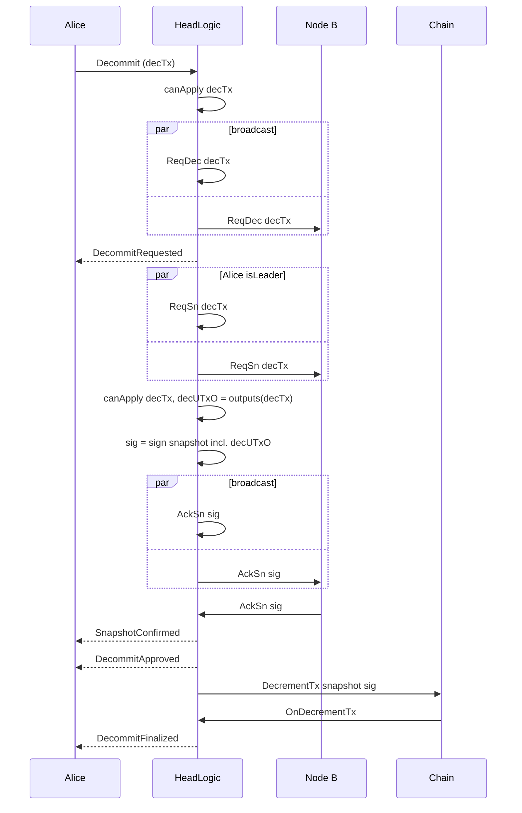
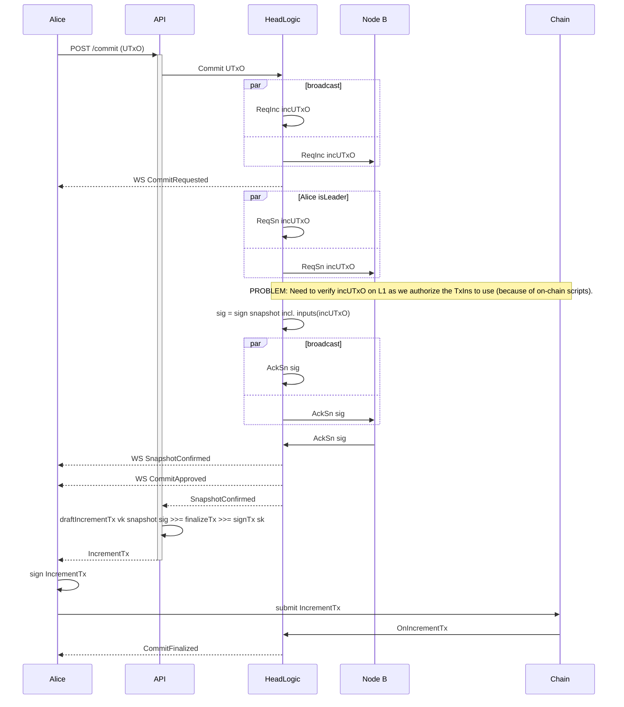

# Learn

```mdx-code-block
import DocCardList from '@theme/DocCardList';
import {useDocsSidebar} from '@docusaurus/theme-common/internal';

<DocCardList items={useDocsSidebar().items.filter(({ docId }) => docId != "index")}/>
```

### Incremental Decommits



### Incremental Commits

Scenario: Alice wants to commit some `UTxO` owned by her private key to the
Open Head. Similarly to "external" commit this means that the node can only
prepare balance and sign the transaction but Alice still needs to add her
signature and submit the transaction to the chain.


