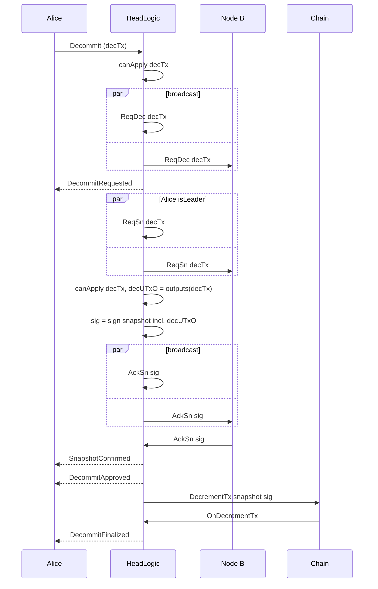

# Learn

```mdx-code-block
import DocCardList from '@theme/DocCardList';
import {useDocsSidebar} from '@docusaurus/theme-common/internal';

<DocCardList items={useDocsSidebar().items.filter(({ docId }) => docId != "index")}/>
```

### Incremental Decommits



