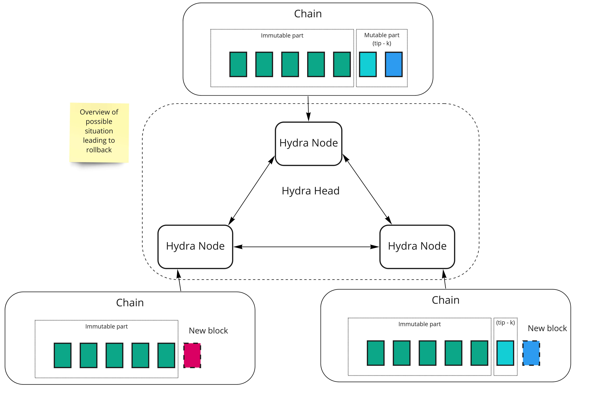
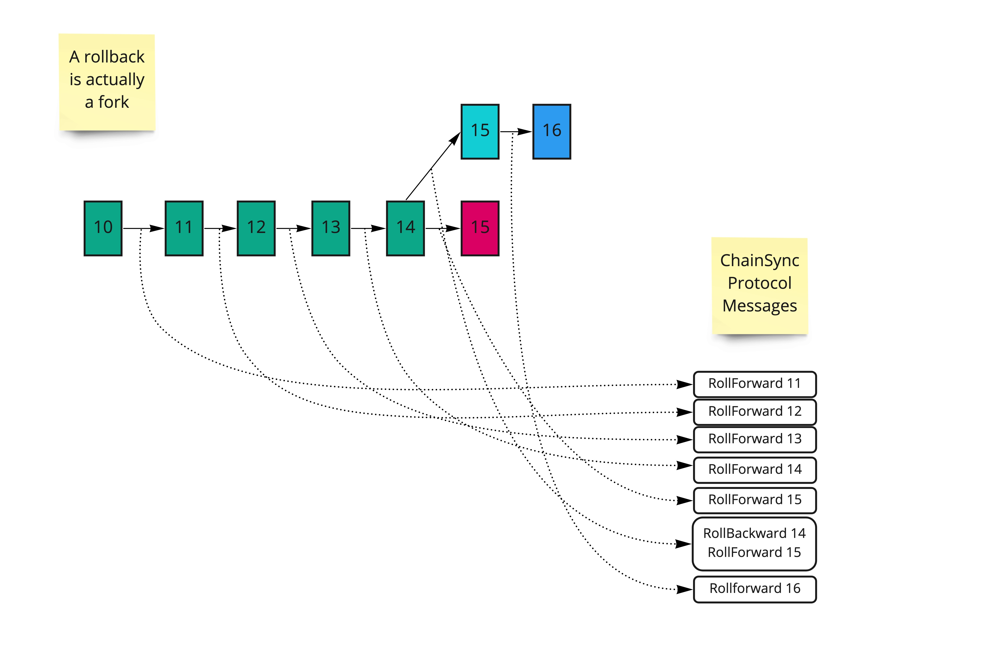

# Handling Rollbacks

Rollbacks are an integral part of the behaviour of the Cardano chain: Any application built on top of Cardano and synchronizing its behaviour with the chain must be prepared to occasionally observe such _rollbacks_ and Hydra is no exception.

This short document explains what rollbacks are and where they come from, and how Hydra Heads handle them.

## What are rollbacks really?

Rollbacks happen on the Cardano chain, or any other truly decentralised blockchain for that matter, because it is essentially  _asynchronous_ in nature, eg. each node has its own view of the state of chain which it updates by communicating with other nodes, exchanging messages about known blocks, and this process takes time. New blocks are produced, which may be valid or invalid, and the state of the chain is _eventually consistent_, all nodes agreeing on the state of the chain only after some number of blocks have been processed.

Actually, _Rollbacks_ is a misnomer and we should rather talk about _forks_. Let's see what this means from the perspective of three nodes running a Hydra Head. The following picture represents each node's view of the Layer 1 chain.

The _immutable part_ is guaranteed to be identical on all nodes, being `k` blocks in the past from current _tip_ (on the mainnet `k` is 2160). Here, node 2 receives a new block that's identical node 1 but node 3 receives a different block. Eventually, as node 3's chain is shorter than the other's it will be superseded by a longer one hence _rolled back_.

What happens for the node's _Direct Chain_ observer is detailed in the following picture:

When new blocks are available, the `ChainSync` client receives a `RollForward` message with each new block. When a fork happens, it will first receive a `RollBackward` message with a _point_, which identifies the slot and block hash at which point the chain has been rolled back (abstracted as a single number in the figure), then resume receiving new blocks through `RollForward` messages.

## How do they impact Hydra Node?

Rollbacks are problematic because, when a transaction is observed on-chain, it potentially changes the state of the Head, first by _Initialising_ it, then collecting the _Commits_, opening the head through the _CollectCom_ transaction and ultimately _Closing_ it and _Fanoutting_ the Head's final UTxO.

The following picture illustrates the issue of a rollback leading to potentially conflicting `Commit`  transactions:

If the Head does not properly handle the rollback, then it risks being in an inconsistent state w.r.t other nodes taking part in the Head. It is thus important that a rollback observed at the level of the `Direct` chain component be propagated to the `HeadLogic` in order for the latter to reset its state to be consistent with whatever happened on layer 1.

The consequences of a rollback on the Head's state are different depending at which point the Head is rolled back:
1. If the rollback happens before or after the Head is open, eg. before the `CollectCom` transaction or after the `Close`, then things are relatively straightforward: We can just reset the Head's state to the point it was before the rolled back transaction was observed,
2. If it happens while the Head is open, eg. the `CollectCom` transaction is rolled back, it's much more problematic because the node has already started exchanging messages with its peers and its state no longer depends only on the chain.

## How do we handle them?

:::warning

🛠 Hydra currently handles rollback gracefully in simple cases, eg. case 1 above, and does not try to do anything clever when a `CollectCom` happens which can lead easily to a Head becoming stale: Because one node is desynchronised from other nodes (it has observed a rollback of a `Collectcom` transaction, reset its state before that, thus lost track of everything that happened while the Head was open), it will be necessary to close the head.
:::

Rollbacks handling has been partially deactivated in hydra by [ADR-23](https://github.com/input-output-hk/hydra/blob/master/docs/adr/2023-04-26_023-single-state.md). This section shall be updated with a more appropriate and detailed rollback handling with issue [#185](https://github.com/input-output-hk/hydra/issues/185).
