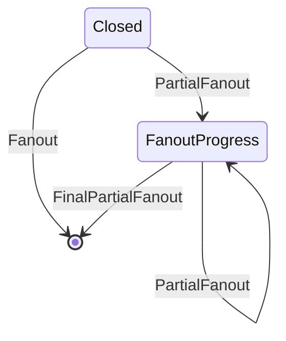

# Partial fanout

When a head is closed, a single `Fanout` transaction distributes the whole UTxO
set back to layer 1 at once, and that transaction has to fit under the layer 1
size and execution budgets. _Partial fanout_ lifts that ceiling: the UTxO set is
distributed over several transactions, each carrying a _subset_ of the outputs,
until the head is empty.

There are two ways to drive it:

- a plain `Fanout` builds the single full transaction and checks whether it would
  fit; when it would not, the head is drained automatically over as many steps as
  it takes
- a `PartialFanout` names the subset to distribute next, so a client decides what
  leaves the head first and in which order



These are the on-chain states and the transactions between them, not client
commands: a `Fanout` command posts the single `Fanout` transaction when the whole
set fits, and otherwise walks the same `PartialFanout` path. Both terminal
transactions, `Fanout` and `FinalPartialFanout`, burn the head tokens; the
intermediate `PartialFanout` steps neither mint nor burn.

This page explains how partial fanout works under the hood. For how to drive it
from a client, see the [Selective fanout](../../how-to/selective-fanout) how-to.

## The accumulator

The head does not store the individual UTxOs on-chain while it is open. Instead
it keeps a single _commitment_ to the confirmed snapshot, a
[`HydraAccumulator`](pathname:///haddock/hydra-tx/Hydra-Tx-Accumulator.html).

The snapshot's UTxO set, together with any pending commit or decommit, is turned
into elements: each output is serialised to its `BuiltinData` bytes and hashed
down to one _element_, a scalar. The elements `s₁, …, sₙ` define a polynomial

```
A(X) = (X − s₁)·(X − s₂)·…·(X − sₙ)
```

which is committed as a single `BLS12-381` G1 point `A(τ)·G1`. This point is the
_accumulator commitment_. Identical outputs hash to identical elements, so the
accumulator is a multiset and keeps their multiplicity.

While the head is open, all parties sign a blake2b-256 hash of that commitment,
the `accumulatorHash`, and the `OpenDatum` carries it. `Close` verifies the
signature and stores the commitment point itself in the `ClosedDatum`, checking
that hashing the point reproduces the signed hash. So a whole snapshot, however
many outputs it has, is pinned on-chain by one 48-byte group element.

## Membership proofs

To fan out a subset `S` of the outputs, the node has to prove that `S` really was
part of the committed set. `S` defines its own polynomial
`P_S(X) = ∏(X − sᵢ)` over just the subset elements. Since every subset element
is a root of `A(X)`, `P_S(X)` divides `A(X)` exactly, leaving a quotient

```
A(X) = Q(X)·P_S(X)
```

The node commits the quotient over G1 as `Q(τ)·G1`, the _membership proof_, using
[`createMembershipProofFromUTxO`](pathname:///haddock/hydra-tx/Hydra-Tx-Accumulator.html#v:createMembershipProofFromUTxO).
On-chain, the head validator's
[`checkMembershipPairing`](pathname:///haddock/hydra-plutus/Hydra-Contract-CRS.html#v:checkMembershipPairing)
check verifies the KZG pairing identity

```
e(A(τ)·G1, G2) = e(Q(τ)·G1, P_S(τ)·G2)
```

If this holds, then `A(X) = Q(X)·P_S(X)`, so `S` is genuinely a subset of the
committed UTxO set.

The same pairing check runs on every fanout transaction, but only the full
`Fanout` and the closing `FinalPartialFanout` carry an explicit proof in their
redeemer. An intermediate `PartialFanout` needs no separate proof: the quotient
over the distributed subset is exactly the accumulator over the outputs that
remain, which the step has to publish in the continuing head output anyway. The
validator uses that new commitment as the proof, which both verifies membership
and forces the remaining accumulator to be correct.

## The CRS

To evaluate `P_S(τ)·G2` on-chain the validator needs the _powers of tau_ in G2:

```
[G2, τ·G2, τ²·G2, …]
```

This list is the _common reference string_ (CRS). The validator multiplies these
points by the coefficients of `P_S(X)` (a multi-scalar multiplication) to obtain
`P_S(τ)·G2`, then runs the pairing. The matching G1 powers are used off-chain to
build the proof.

The CRS is published on-chain as its own output by the same `publish-scripts`
command that publishes the head reference script, and it carries the G2 points as
its inline datum. Fanout transactions reference it as a reference input, named by
the redeemer.

The validator does not identify that reference input by its address at all: it
resolves whatever output the redeemer points at and then binds its exact datum,
by comparing a hash of the G2 points against a canonical hash compiled into the
script. Binding only the location would let an attacker supply a different CRS
whose secret they know and forge membership proofs, so the datum itself has to be
the canonical one.

:::info

Because the CRS is part of the script registry, a `hydra-node` pointed at
scripts published before the CRS existed refuses to start with a
`MissingScript "νCRS"` error. Re-publish the scripts, or use a transaction id
published for a version that includes it.

:::

## Trusted setup

The powers of tau are generated from a secret `τ` that must be known to nobody. If
anyone learned `τ` they could forge a membership proof for a subset that was never
in the head and steal funds from a closed head. That is the scope of the
assumption: the pairing check only guards fanout, and snapshot signing, the
on-chain transitions of an open head and layer 2 transaction validity do not rely
on it. The secret is never held in one place: it comes
from a _powers-of-tau ceremony_ where many participants each contribute
randomness, and the setup stays safe as long as at least one participant
discarded their part.

Hydra reuses the [EIP-4844](https://eips.ethereum.org/EIPS/eip-4844) trusted setup
from the Ethereum KZG ceremony, which had roughly 140,000 participants. The setup
bytes are embedded into the binary at compile time and pinned by a SHA-256 digest,
so every node uses the same canonical CRS and the file can be verified
independently against the published ceremony output.

## Driving a fanout

A client picks _what_ leaves the head; the node decides how to cut that into
transactions.

Each `PartialFanout` client input names a subset of UTxOs. For that selection the
node:

- builds and submits the layer 1 transaction, splitting the selection over several
  transactions when it does not fit in one
- reduces the head output value by the value of the distributed outputs
- stores the commitment of the _remaining_ accumulator in the continuing head
  output's `FanoutProgressDatum`

The next step proves its subset against that remaining commitment, and so on.
Every step, partial or final, is only valid after the contestation deadline has
passed.

How many outputs go into one transaction is not something a client chooses or
needs to know. The chain layer runs a binary search
([`findFittingFanoutTx`](pathname:///haddock/hydra-node/Hydra-Chain-Direct-Handlers.html#v:findFittingFanoutTx))
for the largest number of outputs whose transaction still fits the layer 1 size
limit and script execution budget, so a large selection is drained over as many
steps as needed. The search is local: candidate transactions are built and
evaluated against those limits in the node, and only the winning one is submitted.
Nothing is submitted speculatively and rejected by the chain.

The last transaction cannot be an ordinary partial step: it must be the _final_
fanout, which distributes the rest and burns the head tokens. The node handles
that boundary itself. Once the head is in `FanoutProgress`, a selection covering
everything that is left is posted as the final transaction. Selecting the whole
set out of a freshly closed head is instead treated as a plain `Fanout`, which is
what it means, and takes the single-transaction or automatic-drain path above.

A selection that is empty, or that is not contained in what is left, is refused
with a `CommandFailed` and changes nothing.

Fanout is also sticky: either command moves the head into `FanoutProgress` right
away, before anything lands on chain, and from then on the plain `Fanout` is
refused with a `CommandFailed`, so the head has to be drained with further
`PartialFanout` commands. The one way back is the initiating transaction failing
to post before anything has been distributed, in which case the node reverts the
head to `Closed` rather than wedging it.

## Caveats

### Head size limit

The embedded trusted setup provides 4096 G1 powers of tau, and an accumulator over
`n` elements needs `n + 1` of them. A snapshot can therefore commit to at most
**4095** outputs, counting any pending commit or decommit alongside the UTxO set.
A requested snapshot that would exceed this is rejected with
`ReqSnUTxOSetTooLarge`, so the head cannot reach a state it would be unable to fan
out.

### How much fits in one step

Two separate limits bound a single fanout transaction:

- the layer 1 transaction size and script execution budget, which is what binds
  in practice. See the [transaction costs](pathname:///benchmarks/transaction-cost)
  benchmarks for the measured chunk sizes
- the length of the deployed CRS. Verifying a subset of `N` outputs needs `N + 1`
  G2 points, and the CRS output currently carries 30 of them (`defaultItems`), so
  no step can distribute more than **29** outputs regardless of budget. Raising
  this means re-publishing the CRS output with more points, up to the 65 G2 points
  the trusted setup provides

### UTxO sizing

Every fanned-out output has to satisfy the layer 1 min-UTxO rule, so the head must
hold enough ada to back each output it will produce. Outputs that carry native
tokens are larger, cost more to verify, and so fewer of them fit per step.

### Who pays

The party that issues a step submits and pays for that layer 1 transaction. Only
the node that issued a command advances the fanout, so if it goes offline any other
party can resume by issuing `PartialFanout` for the remaining set.

### Ada overhead

A head output always holds a bit of ada beyond the sum of its layer 2 UTxOs, the
`headAdaOverhead`. This is the min-UTxO overhead of the head output itself. It is
set once at init time and stays invariant for the head's lifetime, propagated
unchanged through `Close` and every fanout step so that value conservation checks
line up. The final fanout accounts for it separately from the distributed outputs,
which returns it to the party that submits that last transaction.

### Unburned tokens

:::caution

Partial fanout does not fully solve the [unburned-token stuck-head problem](https://github.com/cardano-scaling/hydra/issues/2334),
see also [known issues](../../known-issues).

Every fanout transaction balances the head output value exactly: nothing can be
distributed that the head output does not hold, and the final transaction has to
empty it, so everything left must either go into a distributed output or be burned
(the ada overhead above being the one exception). Native tokens can fail either
half of that.

A token minted inside the head exists on layer 2 but never entered the head output
on layer 1, so any step selecting the UTxO carrying it cannot balance. The other
outputs still fan out normally, but that one never does, and since the last
transaction has to distribute everything that is left, the head cannot be finalized.

A token the head output does hold but cannot burn, for instance one under a foreign
policy, leaves nowhere for that value to go. Intermediate steps are unaffected here,
since they never mint or burn and simply leave it in the continuing head output. A
participant can recover everything down to the last transaction by selecting their
own UTxOs, but that final transaction cannot be posted and the residual head output
stays stuck.

:::
