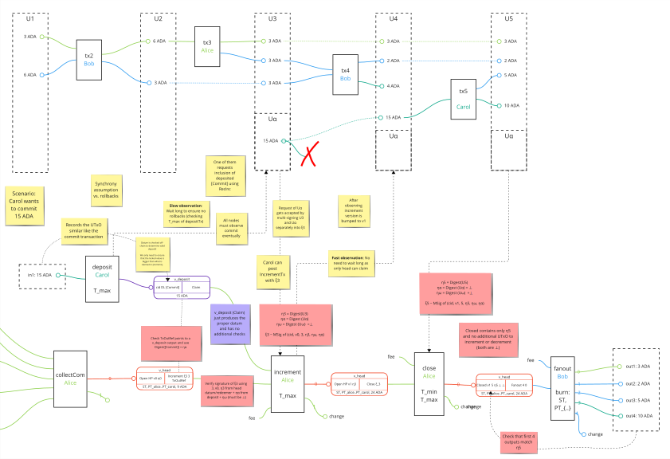

# Protocol

Additional implementation-specific documentation for the Hydra Head protocol and extensions like incremental decommits.

## General notes on incremental commits/decommits

Especially, incremental commit and decommit are additions to the originally researched [Hydra Head protocol](https://eprint.iacr.org/2020/299.pdf) and deserve more explanation how they work under the hood. 

For now these two new additions run sequentially so we are doing one thing at a time, at least for now, while we will think about batching certain actions in the future if the need for that arises.

It is only possible to either commit or decommit - we don't allow snapshots with both fields specified for simplicity. This restriction might be lifted later on - once we are sure this simpler version works nicely.

## Incremental commits

Incremental commits allow anyone to lock up `UTxO` from L1 and make it available on L2 for transacting inside of a running Hydra Head. For a user, the process of doing an incremental commit is very similar to doing a normal commit before the Head is in the `Open` state. From a protocol standpoint though, the process is quite different as it requires users to first lock up funds in a `deposit` transaction before the head can collect it in an `incrementTx`. Should the depositted UTxO not be collected, a user can recover their funds in a `recoverTx`.

### Deposit flow

The nominal case of depositing and later incrementing funds starts with a user request to `POST /commit`, which will draft a `depositTx` analogously what users know from the normal commit workflow.

:::info
See [commit](./commit.md) for more details about the commit API.
:::

A successful API response includes a `depositTx` that needs to be signed and submitted by the user in order to lock the specified `UTxO` at a deposit script address. The `hydra-node` of all participants will observe the deposit transaction and the snapshot leader _should_ request inclusion of the UTxO via a snapshot. With this snapshot an `incrementTx` can be posted that will update the Head state `UTxO` on L1 and upon observing this make the committed `UTxO` available on L2.

The overall sequence diagram of a deposit and later increment across the `hydra-node`:

### Tracking deposits

Once a hydra-node observes a deposit transaction it will record the deposit as pending in its local state. There can be many pending deposits but the new Snapshot will include them one by one.

:::info
Note that any node that posts increment transaction will also pay the fees even if the deposit will not be owned by them on L2.
:::

Upon observing increment transaction we remove the corresponding deposit from the local pending deposits and the process can start again.

:::note
Since we can potentially request many deposits, the leader will increment only one of them. While others stay pending. An honest snapshot leader _should_ consider all pending deposit and try to include it in a snapshot.
:::

To avoid potential races between observing the `depositTx` and adding the funds via an `incrementTx` to the Head, each deposit locks up funds until a **deposit deadline**. If that deposit deadline is sufficiently far enough in the future, a `hydra-node` will be picking up the deposit. Users, however, may only [recover](#recover-flow) the funds *after* the deadline has passed.

### Recover flow

If a deposit was not picked up by the head participants, the user can recover their funds _after the deposit deadline_ by sending a `DELETE /commits/<tx-id>` request to the `hydra-node`. This will trigger a `recoverTx` to be created and submitted to the L1 chain.

### Rollback resistance

In a perfect world the processes as explained above would be sufficient. However, the Cardano L1 is evolved using a probabilistic consensus algorithm and [rollbacks](./rollbacks) need to be considered.

Lets consider this example scenario of depositing funds into a head as an L1 transaction trace with L2 snapshots:

The biggest risk of chain re-organization attacks, which would be "adversarial rollbacks", comes from an attacker to be able to trick an honest `hydra-node` into making a funds on the L2 available which are in fact not locked up on the L1; i.e. a double spend of deposited funds.

As indicated on the transaction trace example above, a successful incremental commit consists of two sequential L1 transactions: `depositTx` and `incrementTx`. Malicious rollbacks and double spending of their inputs need to be considered.

For `incrementTx`, the input is governed by the deposit validator which ensures funds can only be spent into the destined head before the **deposit deadline** (by anyone using a `recoverTx` after the deadline). Hence, any rollbacks _before_ this deadline can be mitigated by re-submitting the same (or a new) `incrementTx`. It is vital though, that the deadline is _far enough_ in the future to not be prone to yet more chain re-organization and run out of time mitigating eventually. As the deposit deadline is only relevant for the pessimistic case, we can pick fairly *high values* without affecting user experience. For example: **1 week**, equating to roughly 5x the worst case settlement time of Cardano.

For `depositTx`, the inputs may very well be spent by an attacker and an honest `hydra-node` should be cautious in observing a deposit as settled before signing a snapshot that authorizes addition of those funds to the L2 state. To mitigate this, a **deposit period** analogous to the contestation period of close/contest phase is introduced. A valid deposit must have an upper validity to indicate when it was created (at latest) and record the deposit deadline in the output datum (see [specification](./specification.md)). An honest `hydra-node` will only consider deposits that are **older** than the deposit period and when the deadline is **further out** than the deposit period. While the deposit period will delay all increments by at least that time, a `hydra-node` can configure the risk it is willing to take using this period. For example: **1 hour** means that roughly after 180 blocks on `mainnet` we would only see a rollback including the `depositTx` with `0.01%` likelihood, assuming a `15%` adversarial stake fairly conservative grinding power. See [this excellent explanation and calculator](https://aiken-lang.org/fundamentals/what-i-wish-i-knew#transaction-latency-vs-finality) in the Aiken docs.

In summary, a deposit may only be picked up while `Active` in the following deposit life cycle:

## Incremental decommits

Incremental decommits allow us to take some L2 `UTxO` and bring it to the L1 while the Head protocol is running.

Users of a Hydra head can request decommits UTxO from L1 by sending a `POST /decommit` request with a so-called **decommit transaction** in the request body. Hydra node validates this transaction by applying it to its local `UTxO` set. If it applies, it will broadcast a `ReqDec` message signalling to other parties that we want to produce a new `Snapshot` that contains the same `UTxO` to decommit. The snapshot leader may request such a snapshot and once it is signed by everyone, any of the participant nodes posts a `decrementTx` that will produce a corresponding output on the L1.

:::info
The decommit transaction is necessary to prove to the head participants that the decommitted UTxO can be spent by the requestor.
:::

As the decommit is first decided on the L2 with full consensus and no honest node would approve further spending of funds to be decommitted, we do not need to specially consider rollbacks in this scenario.

