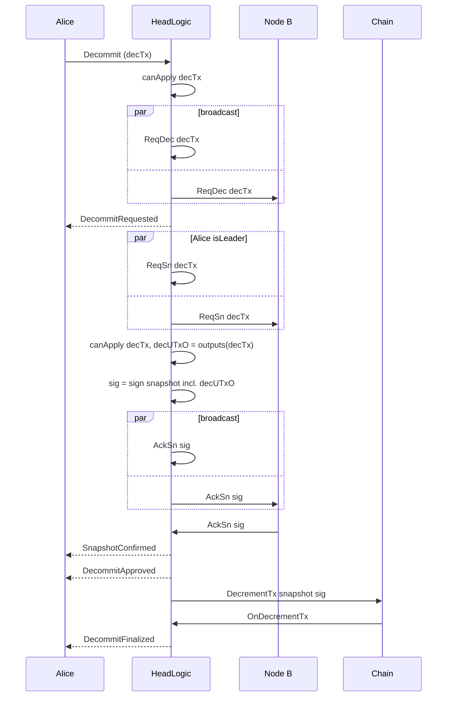

# Protocol

Additional implementation-specific documentation for the Hydra Head protocol and extensions like incremental decommits.

### Incremental Decommits

```mermaid
sequenceDiagram
    Alice->>HeadLogic: Decommit (decTx)
    HeadLogic->>HeadLogic: canApply decTx

    par broadcast
        HeadLogic->>HeadLogic: ReqDec decTx
    and
        HeadLogic->>Node B: ReqDec decTx
    end

    HeadLogic -->> Alice: DecommitRequested

    par Alice isLeader
        HeadLogic->>HeadLogic: ReqSn decTx
    and
        HeadLogic->>Node B: ReqSn decTx
    end

    HeadLogic->>HeadLogic: canApply decTx, decUTxO =  outputs(decTx)
    HeadLogic->>HeadLogic: sig = sign snapshot incl. decUTxO

    par broadcast
        HeadLogic->>HeadLogic: AckSn sig
    and
        HeadLogic->>Node B: AckSn sig
    end

    Node B->>HeadLogic: AckSn sig

    HeadLogic -->> Alice: SnapshotConfirmed
    HeadLogic -->> Alice: DecommitApproved

    HeadLogic ->> Chain: DecrementTx snapshot sig
    Chain ->> HeadLogic: OnDecrementTx
    HeadLogic -->> Alice: DecommitFinalized
```
