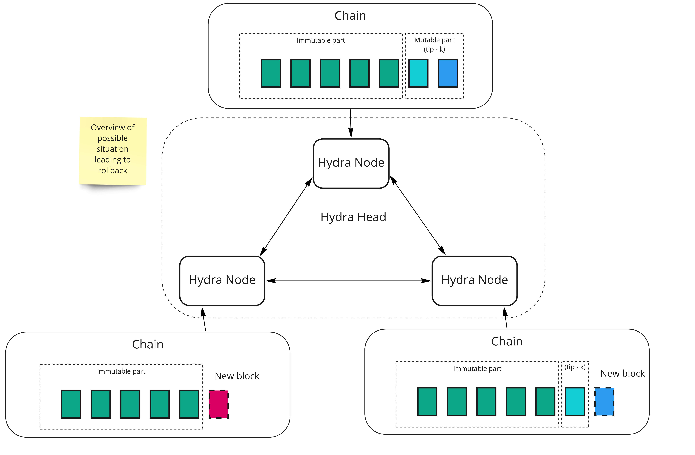
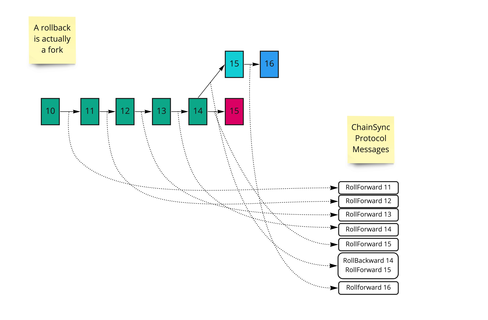
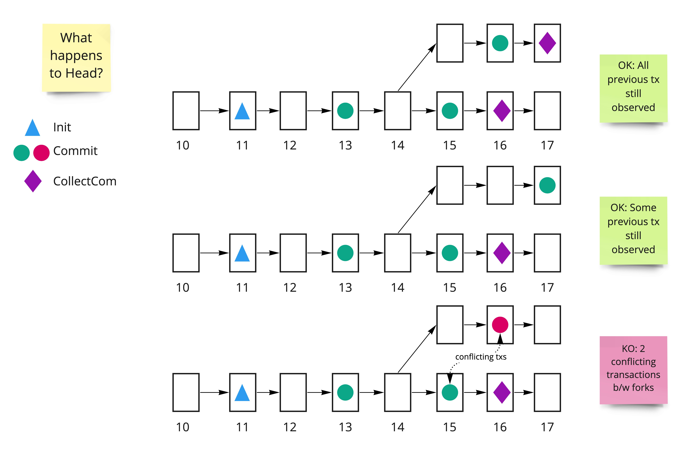

# Handling rollbacks

Rollbacks are fundamental to the operation of the Cardano chain. Any application built on Cardano, including Hydra, must anticipate occasional rollbacks, which are reversals of confirmed transactions due to chain reorganization or other consensus adjustments.

This document provides an overview of rollbacks, their origins, and details how Hydra heads manage them.

## Understanding rollbacks

Rollbacks occur on the Cardano chain, and other decentralized blockchains, due to its _asynchronous_ nature. Each node maintains its own view of the chain's state, updating it through communication with other nodes. This process involves exchanging messages about known blocks, which can lead to new blocks being produced that may be valid or invalid. As a result, the chain's state is _eventually consistent_, with all nodes agreeing on its state after processing a certain number of blocks.

In reality, 'rollbacks' are a misnomer; it's more accurate to refer to these events as 'forks'. Let's delve into what this means from the perspective of three nodes running a Hydra head. The following diagram illustrates each node's view of the layer 1 chain.

The _immutable part_ is guaranteed to be identical on all nodes, extending `k` blocks in the past from the current _tip_ (on the mainnet, `k` is 2160). Here's an example scenario: node 2 receives a new block identical to node 1's view, but node 3 receives a different one. Eventually, because node 3's chain is shorter than the others, it will be superseded by a longer chain, resulting in a rollback.

The impact on the node's _direct chain_ observer is detailed in the following diagram:

When new blocks become available, the `ChainSync` client receives a `RollForward` message for each new block. In the event of a fork, it first receives a `RollBackward` message indicating a _point_ that identifies the slot and block hash where the rollback occurred (represented as a single number in the figure). After this rollback point, the client resumes receiving new blocks through `RollForward` messages.

## How do rollbacks impact the Hydra node?

Rollbacks pose challenges because when a transaction is observed on-chain, it can alter the state of the head in several stages: opening it via `Init`, observing deposits (`CommitRecorded`/`CommitFinalized`), and ultimately _closing_ it and _fanning out_ the head's final UTXO.

The following diagram illustrates the issue where a rollback can lead to potentially conflicting deposit transactions:

If the head does not properly handle the rollback, it risks becoming inconsistent with other nodes participating in the head. Therefore, any rollback observed at the `Direct` chain component level must be promptly communicated to the `HeadLogic`. This ensures that the `HeadLogic` can reset its state to maintain consistency with the changes on layer 1.

The consequences of a rollback on the head's state vary depending on when the rollback occurs:

1. If the rollback occurs before or after the head is opened – for example, before the `Init` transaction or after the `Close` – the resolution is relatively straightforward: the head's state can be reset to the point it was at before the rolled-back transaction was observed.

2. If the rollback occurs while the head is open – for instance, if a deposit or `Close` transaction is rolled back – it poses greater challenges. At this point, the node has already begun exchanging messages with its peers, and its state no longer depends solely on the blockchain.

## How do we handle them?

The guiding principle is that layer 2 state never rolls back: snapshots and their signatures are irrevocable, so the node instead makes sure layer 1 eventually converges with what layer 2 already agreed on. Only layer 1 derived state is rewound.

For deposits and incremental commits/decommits while the head is open, this works as follows:

- The node keeps a slot-indexed history of the pending deposits. On a rollback it rewinds this view to the rolled-back slot: a deposit whose deposit transaction was rolled back stops being tracked (until re-observed on the new chain), and a deposit whose consuming transaction (increment or recover) was rolled back becomes tracked again.

- When an increment or decrement transaction settles on-chain (`CommitFinalized`/`DecommitFinalized`), the node retains the signed snapshot that authorized it, together with the slot the settlement was observed at. If a later rollback reaches past that slot, the settling transaction was erased from the chain and the node re-posts it from the retained snapshot. This also covers the case where newer snapshots were confirmed in the meantime (see [#2741](https://github.com/cardano-scaling/hydra/issues/2741)).

- A deposit whose finalized increment was rolled back is *only* eligible for that re-post: it cannot be recovered (its funds are already accounted for in the head, so an on-chain recover would corrupt the layer 2 ledger) and it is never proposed for a new snapshot (the already-signed snapshot claims it).

If the settling transaction is re-observed on the new chain — whether it survived the fork, was re-included from the mempool, or was re-posted by any party — the corresponding state transition applies idempotently and the head continues as normal.

:::warning

🛠 Some rollback scenarios while the head is open remain out of scope of this mechanism: a rollback spanning more than one finalized increment, an increment that can no longer be re-posted because the deposit deadline passed (the deposit period must be sized to cover worst-case rollback depth plus re-posting time), or a rollback of the `Init` itself. These can lead to a head becoming stale, and the head will need to be closed.
:::

Rollback handling has been partially deactivated in Hydra per [ADR-23](/adr/23). This section will be updated with a more comprehensive and refined rollback handling approach with issue [#185](https://github.com/cardano-scaling/hydra/issues/185).
