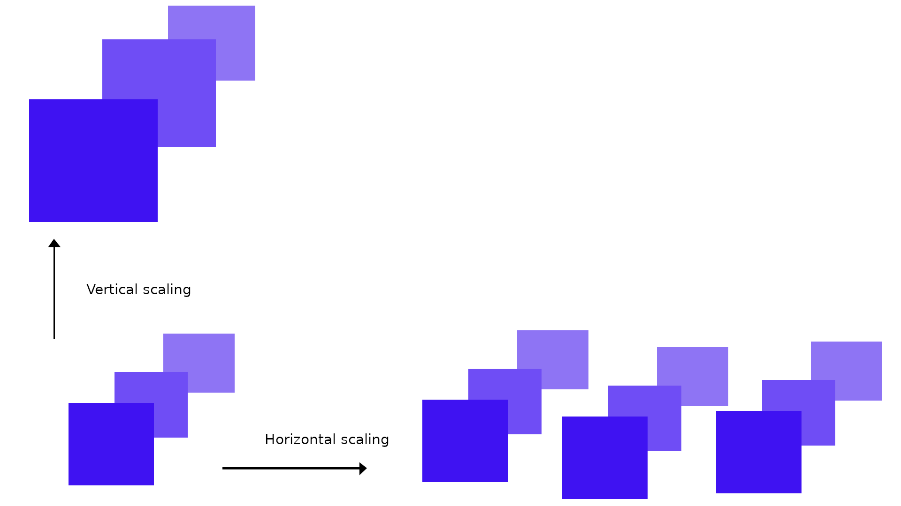

# Scalability

Decentralized systems, including blockchains, face fundamental scalability limitations due to their reliance on global transaction replication to ensure security. This constraint is commonly known as the blockchain trilemma, where _decentralization_, _security_, and _scalability_ counteract each other. Although Cardano employs an efficient consensus algorithm, its global distribution among thousands of block-producing nodes results in block creation approximately every twenty seconds. During peak transaction times, this can lead to increased settlement times as transactions may not be included in the immediate next block.

There are two primary approaches to scaling systems: vertical and horizontal scaling.

## Vertical scaling

Vertical scaling enhances system performance by increasing resources available to existing system instances. For Cardano, this could involve increasing block size or reducing block time. However, vertical scaling is limited by network latency and the processing power of block-producing nodes. Each block requires roughly five seconds to propagate through the network, ensuring security through multiple validation steps. Raising system requirements can reduce decentralization, as fewer individuals may be able to run such nodes.

## Horizontal scaling

Horizontal scaling improves overall system performance by adding more instances alongside each other. This might involve creating multiple sidechains that operate in parallel to the main chain, each producing blocks at regular intervals. Unlike vertical scaling, horizontal scaling has no direct limit, allowing many sidechains to connect to the layer 1 blockchain. However, this method fragments the system state, necessitating additional work to transfer state between instances.

## Layer 1 and layer 2 solutions

Layer 1 solutions aim to improve scalability by adapting the underlying ledger protocols directly. However, they face inherent limitations due to the complexity of the settlement process, which involves extensive data exchange among a large, dynamic set of participants.

Layer 2 solutions, such as state channels, offer an alternative approach by overlaying new protocols on top of the blockchain. These solutions allow parties to securely transfer funds to an off-chain protocol instance, conduct transactions independently of the blockchain, and return the final state to the blockchain when needed. This method does not require additional trust assumptions beyond those of the underlying blockchain and can be highly efficient when all participants behave as expected.

Read more about layer 2 solutions and their types in the next section. 

## State channels and the Hydra Head protocol

The Hydra Head protocol is a form of state channel and can be classified as a horizontal scaling solution. Multiple instances can be deployed to offload transactions and enhance the overall scalability of the system. Due to its isomorphic nature, it provides a flexible way to determine the level of decentralization for each instance and offers a mostly frictionless method to transfer state between the main chain and individual Hydra heads. 

State channels allow parts of the state from the layer 1 blockchain to be validated off-chain by the concerned parties. Once the computation is complete, the parties return the final agreed-upon state to the layer 1 blockchain. This construction eliminates the 20-second block time limit, enabling state evolution as quickly as the involved parties approve.

In conclusion, the Hydra Head protocol enables operators to balance the trade-off between decentralization, security, and scalability differently from the underlying blockchain, thereby meeting the specific needs of individual applications.

