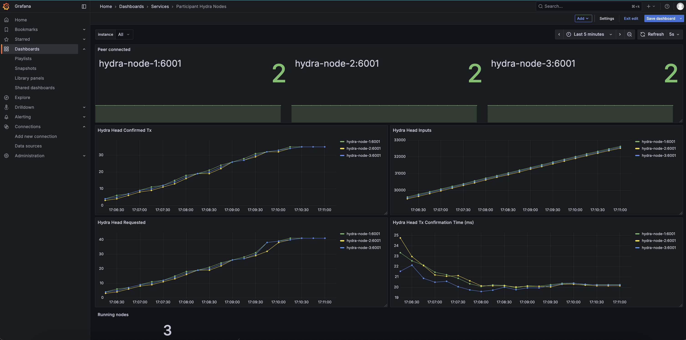

# Getting started
To get started quickly, we'll walk you through the standard demo setup, which includes:

* A cluster of three `hydra-nodes`, each directly connected to the others and configured with one of three Hydra credentials: `Alice`, `Bob`, or `Carol`
* A single `cardano-node` producing blocks used as a (very fast) local `devnet`
* The `hydra-tui` example for clients to interact with the individual `hydra-node`.

This tutorial uses [Docker](https://www.docker.com/get-started) to install the nodes, so ensure Docker is installed. If you want to explore alternative ways of running the tools, see a [variant of this tutorial](./getting-started-without-docker.md) or the [testnet tutorial](./tutorial/index.md), which uses pre-built binaries. The documentation pages on [installation](./installation) and [configuration](./configuration) provide more details.

Additionally, the `hydra-tui` uses the HTTP/WebSocket API provided by the `hydra-node` behind the scenes. The [testnet tutorial](./tutorial/index.md) will show how to use this API using low-level commands, or you can see the [API reference](https://hydra.family/head-protocol/unstable/api-reference) for more details.

<details>
<summary>Video demonstration (a bit dated)</summary>

<iframe style={{width: '100%', height: '480px'}} src="https://www.youtube.com/embed/dJk5_kB3BM4" title="Hydra Head Demo" frameborder="0" allow="accelerometer; autoplay; clipboard-write; encrypted-media; gyroscope; picture-in-picture" allowfullscreen="true"></iframe>

</details>

:::caution OS Compatibility
These instructions have been tested only on Linux environments (Ubuntu, NixOS). If you're on Windows or Mac OS X, you might need to adapt to use [Volumes](https://docs.docker.com/storage/volumes/).
:::

## Preparation

All commands below are written as if executed from the `demo` folder in the project repository. Ensure you clone the repository, switch into the `demo` folder, and pull the latest Docker images:

```shell
git clone git@github.com:cardano-scaling/hydra.git
cd hydra/demo
docker compose pull
```

:::info Shortcut
For convenience, we provide a script `./run-docker.sh`, which combines all the following steps. It also performs a few sanity checks to prevent potential issues.
:::

## Set up the devnet

Next, prepare the devnet configuration to bootstrap a local Cardano blockchain.
**Note** that we use a simplified variant of Cardano that does not require any stake pools.

```shell
./prepare-devnet.sh
```

Bring the Cardano node up with:

```shell
docker compose up -d cardano-node
```

Verify that the devnet is up-and-running by checking the logs with:
```shell
docker compose logs cardano-node -f
```

You should see traces containing `TraceAdoptedBlock`, which means that the devnet is producing blocks .. nice!


:::info
Do not wait too long between these two commands. If you get `TraceNoLedgerView` errors from the Cardano node, the genesis start time is too far in the past, and you need to update them by running `prepare-devnet.sh` again.
:::

:::tip
You can use [jq](https://jqlang.github.io/jq/) to follow the logs and see the node update kinds with the
following command:

```
docker compose logs -f --no-log-prefix cardano-node | jq -Rr 'fromjson? | .data.kind'
```
:::


Next, we need to give Alice, Bob, and Carol some UTXOs for committing and ada for paying fees. To do this, use the `seed-devnet.sh` script, which uses the `cardano-cli` within the already running `cardano-node` container:

```shell
./seed-devnet.sh
```

## Start Hydra nodes

Finally, now that the on-chain preparations are done, we can bring the Hydra network (all three nodes for Alice, Bob, and Carol) up by running:

```shell
docker compose up -d hydra-node-{1,2,3}
```

Using `compose`, you can start the demo Terminal-based User Interface (`hydra-tui`) to interact with Hydra nodes. There are three preconfigured TUI services in the `compose` definition: `hydra-tui-1`, `hydra-tui-2`, and `hydra-tui-3`. To connect to the first Hydra node in a terminal, run the following command:

```shell
docker compose run hydra-tui-1
```

This will start a full-blown terminal interface loaded with signing keys corresponding to the first Hydra node. In other terminals, you can start other nodes in a similar fashion targeting `hydra-tui-2` and `hydra-tui-3` services.

## Use the head

Using the terminal interface of any node, you can now `[i]nit` the Hydra head and `[c]ommit` pre-distributed funds to it. Note that these steps are near-instant as the devnet is producing blocks much faster than a public testnet or the mainnet. After committing from all nodes, the head will automatically open, and you can also use the `hydra-tui` or the API to create new transactions and submit them to the Hydra head.


## Monitoring

We provide a minimal monitoring setup using Prometheus and Grafana to give you insight into the node's activity, including snapshot processing and peer connectivity.

:::info Note
This setup focuses solely on the metrics exposed by the Hydra nodes and does not cover system-level metrics like CPU, memory, disk, or network usage.
:::

Hydra nodes expose [Prometheus](https://prometheus.io/)-compliant _metrics_ through an HTTP server, available on the standard `/metrics` endpoint.

:::info Shortcut
Reference the [Operating Hydra nodes guide](./how-to/operating-hydra.md#monitoring) for a more in-depth explanation on available metrics.
:::

### Start the monitoring stack

Bring up Prometheus and Grafana:

```shell
docker compose up -d prometheus grafana
```

Prometheus will scrape the `/metrics` endpoint of each Hydra node automatically.

Grafana is preconfigured with a minimal dashboard visualizing key metrics from each node:

| Panel                                    | Metric                               | Description                                                                              |
| ---------------------------------------- | ------------------------------------ | ---------------------------------------------------------------------------------------- |
| **Hydra Head Confirmed Tx**              | `hydra_head_confirmed_tx`            | Number of snapshots confirmed by the Hydra head                                          |
| **Hydra Head Inputs**                    | `hydra_head_inputs`                  | Number of inputs processed by the head                                                   |
| **Hydra Head Tx Confirmation Time (ms)** | `hydra_head_tx_confirmation_time_ms` | Average time taken to confirm snapshots on the Hydra head (from request to confirmation) |
| **Peer Connected**                       | `hydra_head_peers_connected`         | Number of peers each node is currently connected to                                      |
| **Hydra Head Requested**                 | `hydra_head_requested_tx`            | Number of requested transactions received by the node (incoming ReqTx messages)          |

### Using Grafana

1. Open Grafana in your browser at `http://localhost:3000`.
2. Default login credentials are `admin/admin`.
3. Explore the preconfigured dashboard or create your own panels using Prometheus queries.
4. Use the top-left `instance` dropdown to inspect metrics per Hydra node.
5. Hover on any graph or stat panel to see per-node values in real time.

### Dashboard Preview


