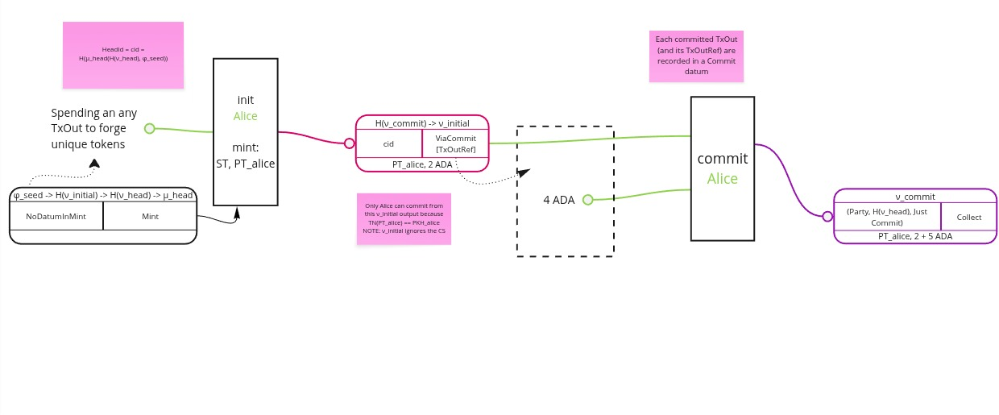

# Best practices for dApp developers


- Any dApp developer building on Hydra would benefit from the
example/information on which validator checks are in order if we want to make
sure the funds we want to commit are ending up in the correct Hydra Head
instance.

- In this document we would like to hightlight the necessary checks for the
user written validators and give concrete examples (using `PlutusTx`).

- Let's start by taking a look at the graph showing how exactly the commit process looks like:


<sub> Here rectangulars represent transactions and you can see the UTxO (with rounded corners) depicting transaction inputs and outputs together with their contents (datums, redeemers and assets)</sub>

- Commit transaction takes as the input initial output crafted specially for every Head participant. Initial output contains information on `HeadId` in its redeemer and the datum caries information on what exactly are we trying to commit (which `TxOutRef`'s are to be committed, sorted beforehand).

- Initial validator is parametarized by the commit validator hash so in the user crafted validator it should be sufficient to check that:
  - Initial input with correct hash is spent into the commit transaction.
  - Initial input contains correct Head ID in it's redeemer.

- dApp builders can utilize script redeemer to carry this information. Let's start with building the actual validator from the user perspective!

#### Building a secure user validator

In order to build any dApp on Hydra users want to commit their scripts into a
Head. This brings custom programmability into the Head protocol and various
dApps could be imagined.

As a first step we should start by building such validator together with it's
necessary checks.

For this we will start with the basic `exampleValidator` that doesn't do anything yet:


```Haskell
exampleValidator ::
  () ->
  () ->
  ScriptContext ->
  Bool
exampleValidator _ _ _ = True

exampleSecureValidatorScript :: PlutusScript
exampleSecureValidatorScript =
  PlutusScriptSerialised $
    serialiseCompiledCode
      $$( PlutusTx.compile
            [||wrap exampleValidator||]
        )
 where
  wrap = wrapValidator @() @()
```
:::warning
Code examples here are just explanatory and are not suitable for production use!
They serve the purpose of giving dApp developers a general idea on how to check commit goes to the right Head instance.
:::

We mentioned we will use redeemer in our validator to carry information we need to do the actual checks. Let's define the redeemer first:

```Haskell
data R =
  R
   { expectedHeadId :: CurrencySymbol
   , expectedInitialValidator :: ScriptHash
   } deriving stock (Show, Generic)

unstableMakeIsData ''R

```

- To get the information on Hydra scripts hashes:


```
hydra-node -- --hydra-script-catalogue
{
 "commitScriptHash": "61458bc2f297fff3cc5df6ac7ab57cefd87763b0b7bd722146a1035c",
 "commitScriptSize": 685,
 "depositScriptHash": "ae01dade3a9c346d5c93ae3ce339412b90a0b8f83f94ec6baa24e30c",
 "depositScriptSize": 1102,
 "headScriptHash": "a1442faf26d4ec409e2f62a685c1d4893f8d6bcbaf7bcb59d6fa1340",
 "headScriptSize": 14599,
 "initialScriptHash": "c8a101a5c8ac4816b0dceb59ce31fc2258e387de828f02961d2f2045",
 "initialScriptSize": 2652,
 "mintingScriptHash": "fd173b993e12103cd734ca6710d364e17120a5eb37a224c64ab2b188",
 "mintingScriptSize": 5284
}
```

- Now we are able to start working on validator checks. First, let's make sure correct initial input is spent. In order to do that we could grab all inputs and
make sure there is exactly one script input which `Address` corresponds to the initial validator hash we have set in our own script redeemer:

```Haskell
  initialInput = findInitialInput expectedInitialValidator

  findInitialInput :: ScriptHash -> Maybe TxInInfo
  findInitialInput initialScriptHash =
    let allInputs = txInfoInputs info
     in find (isInitialAddress initialScriptHash . txOutAddress . txInInfoResolved) allInputs

  -- Check if an address is a script address with the specified script hash
  isInitialAddress :: ScriptHash -> Address -> Bool
  isInitialAddress expectedHash addr =
    case addressCredential addr of
      ScriptCredential vh -> vh == expectedHash
      PubKeyCredential _ -> False
```

- To check the correctness of the Head ID we can try to decode the initial datum which holds the `CurrencySymbol` of a Head and compare it with what is set in our
own script redeemer:

```Haskell
  extractDatum =
    case initialInput of
      Nothing -> traceError "Initial input not found"
      Just i ->
        case decodeDatum (txInInfoResolved i) of
          Just cs -> Just cs
          Nothing -> Nothing

  decodeDatum :: TxOut -> Maybe CurrencySymbol
  decodeDatum txOut = case txOutDatum txOut of
    OutputDatum d -> fromBuiltinData (getDatum d)
    _ -> Nothing

```


<details>
  <summary>Complete validator example </summary>
```

exampleValidator ::
  () ->
  R ->
  ScriptContext ->
  Bool
exampleValidator _ redeemer ctx =
  checkInitialInputIsSpent
    && checkCorrectHeadId
 where
  checkInitialInputIsSpent =
    traceIfFalse "Initial input not found" (isNothing initialInput)

  checkCorrectHeadId =
    case extractDatum of
      Nothing -> traceError "Could not decode initial datum"
      Just headId -> traceIfFalse "HeadId is not correct" $ headId == expectedHeadId

  extractDatum =
    case initialInput of
      Nothing -> traceError "Initial input not found"
      Just i ->
        case decodeDatum (txInInfoResolved i) of
          Just cs -> Just cs
          Nothing -> Nothing

  decodeDatum :: TxOut -> Maybe CurrencySymbol
  decodeDatum txOut = case txOutDatum txOut of
    OutputDatum d -> fromBuiltinData (getDatum d)
    _ -> Nothing

  initialInput = findInitialInput expectedInitialValidator

  findInitialInput :: ScriptHash -> Maybe TxInInfo
  findInitialInput initialScriptHash =
    let allInputs = txInfoInputs info
     in find (isInitialAddress initialScriptHash . txOutAddress . txInInfoResolved) allInputs

  -- Check if an address is a script address with the specified script hash
  isInitialAddress :: ScriptHash -> Address -> Bool
  isInitialAddress expectedHash addr =
    case addressCredential addr of
      ScriptCredential vh -> vh == expectedHash
      PubKeyCredential _ -> False

  info = scriptContextTxInfo ctx

  R{expectedHeadId, expectedInitialValidator} = redeemer
```
</details>

