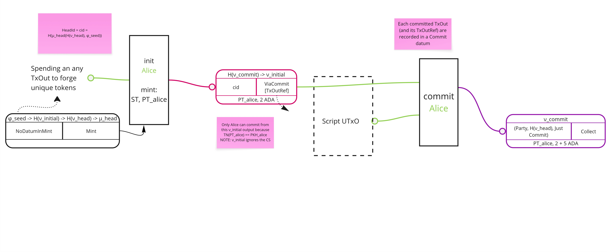

# Commit from a dApp

- Developers building decentralized applications (dApps) on the Hydra protocol
would greatly benefit from clear guidance and examples detailing the validator
check required to ensure that committed funds are accurately directed to the
intended Hydra Head instance.

- This document aims to outline one essential validator check needed for
user-written validators, providing concrete examples implemented using PlutusTx
and briefly explain how the commit transaction looks like.


- To begin, let us examine the diagram illustrating the commit process in detail:


<sub> Here rectangulars represent transactions and you can see the UTxO (with rounded corners) depicting transaction inputs and outputs together with their contents (datums, redeemers and assets)</sub>

The commit transaction utilizes an initial output specifically crafted for each Hydra Head participant. This initial output includes the HeadId in its datum, while the redeemer contains details about the specific TxOutRef values to be committed, which are pre-sorted.

The initial validator is parameterized by the commit validator hash. In the user-defined validator, it is sufficient to verify that:

- There is only one output at commit script address containing the PT (participation) token + the change output.

dApp developers can leverage the script redeemer to convey the necessary information.

Let us now proceed with constructing the validator from the user’s perspective!


### Building a secure commit validator

To develop decentralized applications (dApps) on the Hydra protocol, users must commit their scripts to a Hydra Head.

This enables custom programmability within the Head protocol, unlocking the potential for a wide range of dApp implementations.

As an initial step, we will focus on constructing a validator along with its essential checks.

To begin, we will examine a basic exampleValidator that currently performs no operations:

```Haskell
exampleValidator ::
  () ->
  () ->
  ScriptContext ->
  Bool
exampleValidator _ _ _ = True

exampleSecureValidatorScript :: PlutusScript
exampleSecureValidatorScript =
  PlutusScriptSerialised $
    serialiseCompiledCode
      $$( PlutusTx.compile
            [||wrap exampleValidator||]
        )
 where
  wrap = wrapValidator @() @()
```
:::warning
Code examples here are just explanatory and are not suitable for production use!
They serve the purpose of giving dApp developers a general idea on how to check that commit goes to the right Head instance.
:::

We mentioned we will use redeemer in our validator to carry information we
need to do the actual checks. Let's define the redeemer first:

```Haskell
newtype R = R
  { expectedHeadId :: CurrencySymbol
  }
  deriving stock (Show, Generic)

unstableMakeIsData ''R

```
:::info
If you need to get the information on Hydra scripts hashes you can use hydra-node:

```
nix run .#hydra-node -- --hydra-script-catalogue
{
 "commitScriptHash": "61458bc2f297fff3cc5df6ac7ab57cefd87763b0b7bd722146a1035c",
 "commitScriptSize": 685,
 "depositScriptHash": "ae01dade3a9c346d5c93ae3ce339412b90a0b8f83f94ec6baa24e30c",
 "depositScriptSize": 1102,
 "headScriptHash": "a1442faf26d4ec409e2f62a685c1d4893f8d6bcbaf7bcb59d6fa1340",
 "headScriptSize": 14599,
 "initialScriptHash": "c8a101a5c8ac4816b0dceb59ce31fc2258e387de828f02961d2f2045",
 "initialScriptSize": 2652,
 "mintingScriptHash": "fd173b993e12103cd734ca6710d364e17120a5eb37a224c64ab2b188",
 "mintingScriptSize": 5284
}
```
:::

To get the information on `HeadId` easiest is to look at the persistence
folder of your hydra-node and in the `state` file you should be able to find
the headId. (NOTE: You need to initialize the Head first)

Now we are able to start working on our single validator check.

Let's make sure there is a output containing the single PT token with correct policy:

```Haskell
  checkCorrectHeadId =
    let outputValue = foldMap txOutValue (txInfoOutputs (scriptContextTxInfo ctx))
        pts = findParticipationToken expectedHeadId outputValue
     in L.length pts == 1

  findParticipationToken :: CurrencySymbol -> Value -> [TokenName]
  findParticipationToken headCurrency (Value val) =
    case AssocMap.toList <$> AssocMap.lookup headCurrency val of
      Just tokens ->
        mapMaybe (\(tokenName, n) -> if n == 1 then Just tokenName else Nothing) tokens
      _ ->
        []
  {-# INLINEABLE findParticipationTokens #-}

  R{expectedHeadId} = redeemer

```
This check is all we need in order to add some security to our validators and make sure our commit will end up in the correct Head instance.

Following step is to build a _blueprint_ transaction as a recipe for committing your script UTxO into a Head (while the Head is initializing). We already have a guide
on that [here](./commit-script-utxo#step-5-prepare-the-blueprint) but you would need to make some changes since now we use different script,
there is no datum and our redeemer is `R`.

The hash or our validator script is `b75360ccdf61d8dea63a072e402d9e883c34a68f9e35fb7056c9a610`. This information is important to be able to build
the _blueprint_ transaction from the guide and we leave the rest as an exercise to the user. It should not be hard to build this transaction since you
only need to worry about the transaction inputs. Even if outputs are defined in the transaction they would be ignored since all inputs end up
on the L2 ledger owned by our script.

<details>
  <summary>Complete validator example </summary>

```haskell
{-# LANGUAGE TemplateHaskell #-}
{-# OPTIONS_GHC -fplugin PlutusTx.Plugin #-}
{-# OPTIONS_GHC -fplugin-opt PlutusTx.Plugin:defer-errors #-}
{-# OPTIONS_GHC -fplugin-opt PlutusTx.Plugin:target-version=1.1.0 #-}

module Example where

import Hydra.Cardano.Api (PlutusScript, pattern PlutusScriptSerialised)
import Hydra.Plutus.Extras (wrapValidator)
import PlutusLedgerApi.V3 (
  CurrencySymbol,
  ScriptContext (..),
  ScriptInfo (..),
  TokenName,
  Value (..),
  serialiseCompiledCode,
  txInfoOutputs,
  txOutValue,
  unsafeFromBuiltinData,
 )
import PlutusTx (compile, unstableMakeIsData)
import PlutusTx.AssocMap qualified as AssocMap
import PlutusTx.Eq ((==))
import PlutusTx.Foldable (foldMap)
import PlutusTx.Functor ((<$>))
import PlutusTx.List qualified as L
import PlutusTx.Prelude (check)

newtype R = R
  { expectedHeadId :: CurrencySymbol
  }
  deriving stock (Show, Generic)

unstableMakeIsData ''R

exampleValidator ::
  () ->
  R ->
  ScriptContext ->
  Bool
exampleValidator _ redeemer ctx =
  checkCorrectHeadId
 where
  checkCorrectHeadId =
    let outputValue = foldMap txOutValue (txInfoOutputs (scriptContextTxInfo ctx))
        pts = findParticipationToken expectedHeadId outputValue
     in L.length pts == 1

  findParticipationToken :: CurrencySymbol -> Value -> [(TokenName, Integer)]
  findParticipationToken headCurrency (Value val) =
    case AssocMap.toList <$> AssocMap.lookup headCurrency val of
      Just tokens ->
        L.filter (\(_, n) -> n == 1) tokens
      _ ->
        []
  {-# INLINEABLE findParticipationToken #-}

  R{expectedHeadId} = redeemer

exampleSecureValidatorScript :: PlutusScript
exampleSecureValidatorScript =
  PlutusScriptSerialised $
    serialiseCompiledCode
      $$( PlutusTx.compile
            [||wrap exampleValidator||]
        )
 where
  wrap = wrapValidator @() @R
```

</details>
