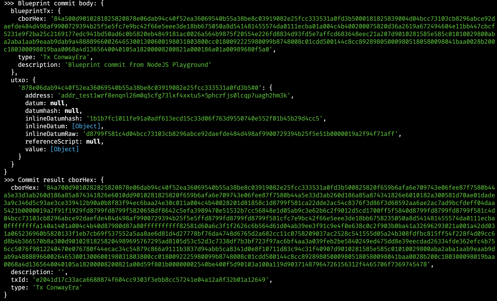

# Deposit tutorial with JavaScript SDK

This guide provides a walkthrough on how to deposit (incrementally commit) UTxOs into an already open Hydra Head using JavaScript SDK.

A **Deposit** (also called incremental commit) allows you to add UTxOs from Cardano Layer 1 into an open Hydra Head. This is useful when you want to add more funds to an active head without closing it.

The deposit process involves building a blueprint transaction that describes what should be deposited, sending it to the `hydra-node`, and then signing and submitting the returned transaction to the Cardano network

## Prerequisites

You will need:

- Node.js 18+
- A running Hydra node in `Open` state
- Hydra node API at `http://localhost:4001`
- Hydra SDK >= 1.1.0 ([https://hydrasdk.com](https://hydrasdk.com))
- Blockfrost API key for preprod: [Register here](https://blockfrost.io/)
- Testnet ADA from [Cardano Faucet](https://docs.cardano.org/cardano-testnets/tools/faucet)

### Project structure

This tutorial uses the following directory structure:

```plaintext
deposit-demo/
├── config.ts              # Configuration and API client
├── simple-deposit.ts      # Deposit entire UTxO
├── partial-deposit.ts     # Deposit with change handling
├── lock-to-contract.ts    # Lock funds to a Plutus script
├── script-deposit.ts      # Deposit script UTxO (advanced)
├── .env                   # Environment variables
├── package.json
└── tsconfig.json
```

You can create this structure with:

```bash
mkdir deposit-demo
cd deposit-demo
npm init -y
```

Create a `.env` file with your configuration:

```plaintext
BLOCKFROST_API_KEY=your_blockfrost_preprod_api_key
```

## Step 1: Install dependencies

```bash
npm install @hydra-sdk/cardano-wasm @hydra-sdk/core @hydra-sdk/transaction axios dotenv
```

## Step 2: Create configuration file

Create `config.ts` with your wallet and Hydra node settings:

```typescript
import { AppWallet, NETWORK_ID, ProviderUtils, UTxOObject } from '@hydra-sdk/core'
import axios from 'axios'

const blockfrostProvider = new ProviderUtils.BlockfrostProvider({
  apiKey: process.env.BLOCKFROST_API_KEY || '',
  network: 'preprod',
})

export const wallet = new AppWallet({
  key: {
    type: 'mnemonic',
    words: 'your mnemonic words here'.split(' '),
  },
  networkId: NETWORK_ID.PREPROD,
  fetcher: blockfrostProvider.fetcher,
  submitter: blockfrostProvider.submitter,
})

export const walletAddress = wallet.getAccount().baseAddressBech32

export class HydraApi {
  private static client = axios.create({
    baseURL: 'http://localhost:4001',
    headers: { 'Content-Type': 'application/json' },
  })

  static async commit(utxo: UTxOObject) {
    try {
      const response = await this.client.post('/commit', { ...utxo })
      return response.data as {
        cborHex: string
        description: string
        txId: string
        type: 'Tx ConwayEra'
      }
    } catch (error: any) {
      console.error('Error during commit:', error)
      throw error
    }
  }

  static async partialDeposit(blueprintTxCbor: string, utxo: UTxOObject, changeAddress: string) {
    try {
      const response = await this.client.post('/commit', {
        blueprintTx: {
          cborHex: blueprintTxCbor,
          type: 'Tx ConwayEra',
          description: 'Partial deposit'
        },
        utxo,
        changeAddress
      })
      return response.data as {
        cborHex: string
        description: string
        txId: string
        type: 'Tx ConwayEra'
      }
    } catch (error: any) {
      console.error('Error during partial deposit:', error.message)
      throw error
    }
  }

  static async blueprintCommit(blueprintTxCbor: string, utxo: UTxOObject) {
    try {
      console.log('Blueprint commit body:', {
        blueprintTx: {
          cborHex: blueprintTxCbor,
          type: 'Tx ConwayEra',
          description: 'Blueprint commit'
        },
        utxo
      })
      const response = await this.client.post('/commit', {
        blueprintTx: {
          cborHex: blueprintTxCbor,
          type: 'Tx ConwayEra',
          description: 'Blueprint commit'
        },
        utxo
      })
      return response.data as {
        cborHex: string
        description: string
        txId: string
        type: 'Tx ConwayEra'
      }
    } catch (error: any) {
      console.error('Error during blueprint commit:', error.message)
      throw error
    }
  }

  static async submitL1(tx: { cborHex: string; description: string; type: string }) {
    const { data } = await this.client.post('/cardano-transaction', tx)
    return data
  }
}
```

## Step 3: Simple deposit (entire UTxO)

This is the simplest case - deposit an entire UTxO without change.

Create `simple-deposit.ts`:

```typescript
import { Converter } from '@hydra-sdk/core'
import { HydraApi, wallet, walletAddress } from './config'

async function main() {
  // 1. Query UTxOs
  const utxos = await wallet.queryUTxOs(walletAddress)
  console.log('Found UTxOs:', utxos.length)

  // 2. Select first UTxO to deposit
  const utxoToDeposit = Converter.convertUTxOToUTxOObject([utxos[0]])

  // 3. Request deposit from Hydra node
  const depositTx = await HydraApi.commit(utxoToDeposit)
  console.log('Deposit TX ID:', depositTx.txId)

  // 4. Sign the transaction (Partial sign)
  const signedTx = await wallet.signTx(depositTx.cborHex, true)

  // 5. Submit to Cardano
  await HydraApi.submitL1({
    cborHex: signedTx,
    description: 'Simple deposit',
    type: 'Witnesses Tx ConwayEra',
  })

  console.log('✅ Deposit submitted!')
}

main().catch(console.error)
```

Run it:

```bash
npx tsx simple-deposit.ts
```

## Step 4: Partial deposit with change

Deposit only part of your UTxO's value and receive change back. This uses a blueprint transaction.

Create `partial-deposit.ts`:

```typescript
import { Converter, Deserializer, UTxO } from '@hydra-sdk/core'
import { TxBuilder } from '@hydra-sdk/transaction'
import { HydraApi, wallet, walletAddress } from './config'

async function main() {
  // 1. Query UTxOs
  const l1UTxOs = await wallet.queryUTxOs(walletAddress)

  // 2. Define deposit amount
  const depositLovelace = 50_000_000 // 50 ADA

  // 3. Build blueprint transaction
  const txBuilder = new TxBuilder({
    isHydra: true,
    params: { minFeeA: 0, minFeeB: 0 },
  })

  const blueprintTx = await txBuilder
    .setInputs(l1UTxOs)
    .addOutput({
      address: walletAddress,
      amount: [{ unit: 'lovelace', quantity: String(depositLovelace) }],
    })
    .setFee('0')
    .complete()

  // 4. Extract UTxOs used in blueprint
  const txInputs = Deserializer.deserializeTx(blueprintTx.to_hex()).body().inputs()
  const utxosToUse: UTxO[] = []

  for (let i = 0; i < txInputs.len(); i++) {
    const input = txInputs.get(i)
    const utxo = l1UTxOs.find(
      (u) =>
        u.input.txHash === input.transaction_id().to_hex() &&
        u.input.outputIndex === input.index()
    )
    if (utxo) utxosToUse.push(utxo)
  }

  // 5. Request deposit with blueprint and change address
  const depositTx = await HydraApi.partialDeposit(
    blueprintTx.to_hex(),
    Converter.convertUTxOToUTxOObject(utxosToUse),
    walletAddress // Change returned here
  )

  console.log('Deposit TX ID:', depositTx.txId)

  // 6. Sign and submit
  const signedTx = await wallet.signTx(depositTx.cborHex, true)
  await HydraApi.submitL1({
    cborHex: signedTx,
    description: 'Partial deposit',
    type: 'Witnesses Tx ConwayEra',
  })

  console.log('✅ Deposit complete!')
}

main().catch(console.error)
```

Run it:

```bash
npx tsx partial-deposit.ts
```

## Step 5: Deposit script UTxO (Advanced)

For depositing a UTxO locked by a Plutus script, you need to provide the script, redeemer, and datum in the blueprint transaction.

### Step 5.1: Lock funds to a script (preparation)

First, create a UTxO locked by a Plutus script. Create `lock-to-contract.ts`:

```typescript
import { TxBuilder } from '@hydra-sdk/transaction'
import { wallet, walletAddress } from './config'
import { DatumUtils, Deserializer } from '@hydra-sdk/core'

async function lock() {
  try {
    // Always-true contract (for demo purposes)
    const contract = {
      cborHex:
        '585e585c01010029800aba2aba1aab9eaab9dab9a4888896600264653001300600198031803800cc0180092225980099b8748008c01cdd500144c8cc892898050009805180580098041baa0028b200c180300098019baa0068a4d13656400401',
      address: 'addr_test1wrf8enqnl26m0q5cfg73lxf4xxtu5x5phcrfjs0lcqp7uagh2hm3k'
    }

    const addressUTxO = await wallet.queryUTxOs(walletAddress)
    console.log(`Found ${addressUTxO.length} UTxOs`)

    // Build datum (example for time lock)
    const { paymentCredentialHash: pubKeyHash } = Deserializer.deserializeAddress(walletAddress)
    const system_unlocked_at = String(Date.now() + 10 * 60 * 1000) // now + 10 minutes

    const datum = DatumUtils.mkConstr(0, [
      DatumUtils.mkBytes(pubKeyHash!),
      DatumUtils.mkInt(BigInt(system_unlocked_at))
    ])

    // Build transaction to lock funds
    const txBuilder = new TxBuilder()
    const txLock = await txBuilder
      .setInputs(addressUTxO)
      .addOutput({
        address: contract.address,
        amount: [{ unit: 'lovelace', quantity: String(5_000_000) }]
      })
      .txOutInlineDatumValue(datum)
      .changeAddress(walletAddress)
      .complete()

    console.log('Lock TX:', txLock.to_hex())

    // Sign and submit
    const signedCbor = await wallet.signTx(txLock.to_hex())
    console.log('Signed TX:', signedCbor)

    const txHash = await wallet.submitTx(signedCbor)
    console.log('✅ Locked funds to contract:', txHash)
    console.log('Script address:', contract.address)
  } catch (error) {
    console.error('Error creating lock transaction:', error)
  }
}

lock()
```

Run it to create a script UTxO:

```bash
npx tsx lock-to-contract.ts
```
Example output:


**Note**: Wait for the transaction to be confirmed on-chain before proceeding to the next step.

### Step 5.2: Deposit the script UTxO

Now deposit the script UTxO into the Hydra Head. Create `script-deposit.ts`:

```typescript
import { emptyRedeemer, TxBuilder } from '@hydra-sdk/transaction'
import { HydraApi, wallet, walletAddress } from './config'
import { Converter, Deserializer } from '@hydra-sdk/core'

async function main() {
  // 1. Define script details (from lock-to-contract.ts)
  const contract = {
    cborHex:
      '585e585c01010029800aba2aba1aab9eaab9dab9a4888896600264653001300600198031803800cc0180092225980099b8748008c01cdd500144c8cc892898050009805180580098041baa0028b200c180300098019baa0068a4d13656400401',
    address: 'addr_test1wrf8enqnl26m0q5cfg73lxf4xxtu5x5phcrfjs0lcqp7uagh2hm3k'
  }

  // 2. Query script UTxOs
  const l1UTxOs = await wallet.queryUTxOs(contract.address)
  console.log('Found contract UTxOs:', l1UTxOs.length)

  // 3. Query wallet UTxOs (needed for fees)
  const walletUtxos = await wallet.queryUTxOs(walletAddress)
  console.log('Found wallet UTxOs:', walletUtxos.length)

  // 4. Find the specific UTxO to deposit (change to your locked tx hash)
  const depositTxId = '878e06dab94c40f52ea36069540b55a38be8c03919082e25fcc333531a0fd3b5'
  const depositUTxO = l1UTxOs.find(utxo => utxo.input.txHash === depositTxId)

  if (!depositUTxO) {
    throw new Error('Deposit UTxO not found. Run lock-to-contract.ts first!')
  }

  console.log('Found deposit UTxO:', depositUTxO.input.txHash)

  // 5. Build blueprint transaction with script input
  const txBuilder = new TxBuilder({
    isHydra: true,
    params: { minFeeA: 0, minFeeB: 0 }
  })

  const redeemer = emptyRedeemer()
  const blueprintTx = await txBuilder
    .setInputs(walletUtxos)
    .txIn(
      depositUTxO.input.txHash,
      depositUTxO.input.outputIndex,
      depositUTxO.output.amount,
      depositUTxO.output.address
    )
    .txInScript(contract.cborHex, 'V3')
    .txInRedeemerValue(redeemer)
    .addOutput({
      address: walletAddress,
      amount: depositUTxO.output.amount
    })
    .setFee('0')
    .changeAddress(walletAddress)
    .complete()

  console.log('Blueprint TX:', blueprintTx.to_hex())
  console.log('Blueprint TX ID:', Deserializer.deserializeTx(blueprintTx.to_hex()).transaction_hash().to_hex())

  // 6. Request deposit from Hydra node
  try {
    const depositTx = await HydraApi.partialDeposit(
      blueprintTx.to_hex(),
      Converter.convertUTxOToUTxOObject([depositUTxO]),
      walletAddress
    )

    console.log('Script deposit TX ID:', depositTx.txId)

    // 7. Sign and submit
    const signedTx = await wallet.signTx(depositTx.cborHex, true)
    await HydraApi.submitL1({
      cborHex: signedTx,
      description: 'Script deposit',
      type: 'Witnesses Tx ConwayEra',
    })

    console.log('✅ Script UTxO deposited!')
  } catch (error: any) {
    console.error('Error during script deposit:', error.message)
    throw error
  }
}

main().catch(console.error)
```

Run it:

```bash
npx tsx script-deposit.ts
```
Example output:



**Important notes**:
- Update `depositTxId` with your actual transaction hash from `lock-to-contract.ts`
- The script UTxO must exist on-chain before you can deposit it
- Wait for the lock transaction to be confirmed before running the deposit
- This example uses `emptyRedeemer()` for always-true contracts
- Use `txInScript()` and `txInRedeemerValue()` for proper script input handling
- For production, use proper Plutus scripts with real validation logic

## Deposit variants

The `HydraApi` class provides three methods for deposits:

```typescript
// 1. Simple commit: Entire UTxO deposited (no blueprint, no change)
HydraApi.commit(utxo)

// 2. Partial deposit: With blueprint and change address (recommended for partial deposits)
//    - blueprintTxCbor: Blueprint transaction describing outputs to deposit
//    - utxo: UTxO(s) to use as input
//    - changeAddress: Address to receive change
HydraApi.partialDeposit(blueprintTxCbor, utxo, changeAddress)

// 3. Blueprint commit: With blueprint, no change address (for script UTxOs)
//    - blueprintTxCbor: Blueprint transaction with script inputs
//    - utxo: Script UTxO(s) to deposit
HydraApi.blueprintCommit(blueprintTxCbor, utxo)
```

## Monitoring deposits

You can monitor deposit status via WebSocket:

```typescript
import WebSocket from 'ws'

const ws = new WebSocket('ws://localhost:4001')

ws.on('message', (data) => {
  const msg = JSON.parse(data.toString())
  
  if (msg.tag === 'Committed') {
    console.log('✅ Deposit committed')
  } else if (msg.tag === 'DepositActivated') {
    console.log('👀 Deposit activated on hydra')
  } else if (msg.tag === 'DepositFinalized') {
    console.log('👀 Deposit finalized on hydra')
  }
})
```

## Troubleshooting

**Head not open**: Ensure your Hydra Head is in `Open` state before depositing.

**Insufficient funds**: Keep at least 5-10 ADA in your wallet for transaction fees.

**Blueprint errors**: Verify that outputs meet minimum UTxO requirements and addresses are valid.

**Script validation failed**: Check that your redeemer, execution units, and script CBOR are correct.

## References

- [Hydra Incremental Commit](https://hydra.family/head-protocol/docs/how-to/incremental-commit)
- [Commit Blueprint](https://hydra.family/head-protocol/docs/how-to/commit-blueprint)
- [Commit Script UTxO](./commit-script-utxo)
- [Hydra SDK Documentation](https://hydrawallet-sdk.vercel.app/)
