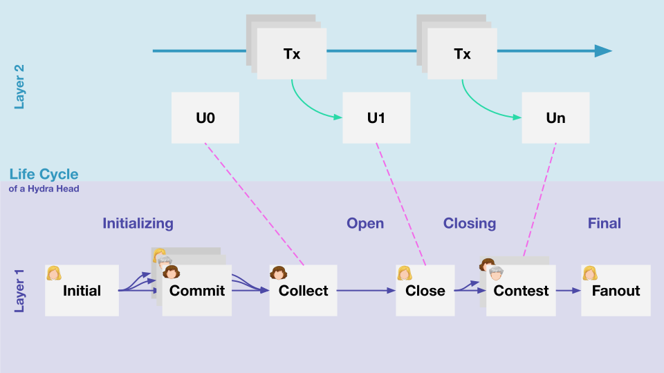

# Protocol overview

Hydra is the layer 2 scalability solution for Cardano, designed to increase transaction speed through low latency and high throughput while minimizing transaction costs. [Hydra Head](https://eprint.iacr.org/2020/299.pdf) is the first protocol of the Hydra family that lays the foundation for more advanced deployment scenarios using isomorphic, multi-party state channels. For an introduction to the protocol, refer to these two blog posts: 

* [Hydra – Cardano’s solution for ultimate layer 2 scalability](https://iohk.io/en/blog/posts/2021/09/17/hydra-cardano-s-solution-for-ultimate-scalability/)
* [Implementing Hydra heads: the first step towards the full Hydra vision](https://iohk.io/en/blog/posts/2022/02/03/implementing-hydra-heads-the-first-step-towards-the-full-hydra-vision/).

Hydra simplifies off-chain protocol and smart contract development by directly adopting the layer 1 smart contract system, allowing the same code to be used both on- and off-chain. Leveraging the Extended Unspent Transaction Output (EUTXO) model, Hydra enables fast off-chain protocol evolution with minimal round complexity and allows asynchronous and concurrent state channel processing. This design enhances transaction confirmation time and throughput while keeping storage requirements low.

In Hydra, a set of parties opens an off-chain state channel called a Hydra head and deposits funds from the Cardano main chain into it. The deposited UTXOs form the head state, which can be evolved by handling smart contracts and transactions among the parties without blockchain interaction, provided all participants behave optimistically. The isomorphic nature of Hydra heads ensures that transaction validation and script execution proceed according to the same rules as on-chain, simplifying engineering and guaranteeing consistency. In case of disputes or termination, the current state of the head is fanned out back to the blockchain, updating the blockchain state to reflect the off-chain protocol evolution. This fanout is efficient, independent of the number of parties or the size of the head state, and deposits and decommits allow UTXOs to be added or removed from a running head without closing it.

## Hydra head lifecycle 

There are different flavors and extensions of the Hydra Head protocol, but first, let's discuss the full lifecycle of a basic Hydra head and how it allows for isomorphic state transfer between layer 1 and layer 2.

A group of online and responsive participants form a Hydra head. Any participant can **init**ialize a head by announcing its parameters on-chain (participants list, contestation period). The `Init` transaction immediately creates the head in the **open** state with an empty UTXO set — there is no separate initialization phase. Participants then **deposit** UTXOs from the Cardano main chain into the open head at any time using the `POST /commit` endpoint.

While open, participants can utilize the Hydra head via a Hydra node to submit transactions in the head network. These transactions maintain the same format and properties as those on the main chain – they are isomorphic. When spending UTXO entries and creating new ones in a Hydra head, all participants must acknowledge and agree on the new state in so-called snapshots (U1...Un). Snapshots are not posted back onto layer 1 but are only retained by the participants.

Participants can continue to **deposit** additional UTXOs into the running head, or **decommit** UTXOs back to layer 1, at any time without closing the head.

Any participant can **close** the head using a snapshot, for example, if they wish to cash out on the mainnet or if another party misbehaves or stalls the head's evolution. There exists a mechanism to **contest** the final state on the main chain. Ultimately, a `FanOut` transaction distributes the final agreed state and makes it available on layer 1, transitioning the state that existed virtually in the head to an on-chain state.

