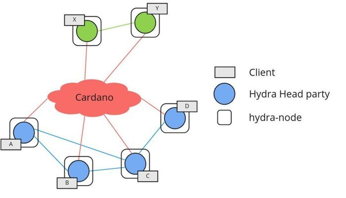

# Tutorial

This tutorial will show you how to use `hydra-node` on the `preprod` Cardano
network to open a layer-two state channel between two actors using the Hydra
Head protocol. We will also use [Mithril](https://mithril.network) to bootstrap
our nodes for a speedy setup.

This setup is also known as the [Basic Hydra Head](/topologies/basic) topology
and we will be creating the "green" Hydra Head between `X` and `Y` as shown
below:



The tutorial will be using the `docker` images of the software components
involved. There are usually other ways to acquire and run the Cardano, Mithril,
and Hydra nodes.

## What you will need

- [ ] Terminal access to a machine that can connect to and can be reached from the internet.
- [ ] Either
  - [ ] someone else following this tutorial as well to connect to (recommended), or
  - [ ] two such machines (or you can run it on one machine).
- [ ] Some tools installed
  - [ ] `curl`
  - [ ] [`websocat`](https://github.com/vi/websocat)
  - [ ] [`docker`](https://docs.docker.com/get-docker)
  - [ ] [`jq`](https://jqlang.github.io/jq/)

## Step 1: Connect to Cardano

The Hydra Head protocol a connection to the Cardano layer one network to verify
and post protocol transactions in a trustless way. Hence, the first step is to
set up a `cardano-node` on a public testnet. Using Mithril, we can skip
synchronizing the whole history and get started quickly.

We will be using the `mithril-client` docker image using the `preprod`
configuration via a shell alias:

```shell
mithril-client () {
  docker run --rm -it --init \
    -e NETWORK=preprod \
    -e GENESIS_VERIFICATION_KEY=$(curl https://raw.githubusercontent.com/input-output-hk/mithril/main/mithril-infra/configuration/release-preprod/genesis.vkey 2> /dev/null) \
    -e AGGREGATOR_ENDPOINT=https://aggregator.release-preprod.api.mithril.network/aggregator \
    -v $(pwd):/app/data \
    -w /app/data \
    -u $(id -u) \
    ghcr.io/input-output-hk/mithril-client:latest $@
}
```

And download the latest blockchain snapshot:

```shell
SNAPSHOT_DIGEST=$(mithril-client snapshot list --json | jq -r '.[0].digest')
mithril-client snapshot download $SNAPSHOT_DIGEST
```

Then we can follow the instructions on-screen or run a `cardano-node` in the
background with:

```shell
docker run -d \
    -e NETWORK=preprod \
    -v $(pwd):/data \
    -v $(pwd):/ipc \
    --name cardano-node \
    inputoutput/cardano-node:8.1.2
```

To interact with the `cardano-node` we prepare ourselves a shell alias for the
`cardano-cli`:

```shell
cardano-cli () {
  docker exec \
    -e CARDANO_NODE_SOCKET_PATH=/ipc/node.socket \
    -e CARDANO_NODE_NETWORK_ID=1 \
    cardano-node cardano-cli $@
}
```

<details>
<summary>Bash auto-completion</summary>

If you are using `bash`, you can get auto-completion of `cardano-cli` using:

```shell
source <(cardano-cli --bash-completion-script cardano-cli)
```

</details>

With `cardano-cli` we can now check the synchronization status:

```shell
cardano-cli query tip
```

This should show something like:

```json
{
  "block": 1275938,
  "epoch": 88,
  "era": "Babbage",
  "hash": "7d22ae918f3ffd35e18c5a7859af27dbcbd29fe08f274b76c284c00042044a2e",
  "slot": 36501000,
  "slotInEpoch": 126600,
  "slotsToEpochEnd": 305400,
  "syncProgress": "100.00"
}
```

Detailed steps on bootstrapping a `cardano-node` using Mithril with more
explanations can be found
[here](https://mithril.network/doc/manual/getting-started/bootstrap-cardano-node)
