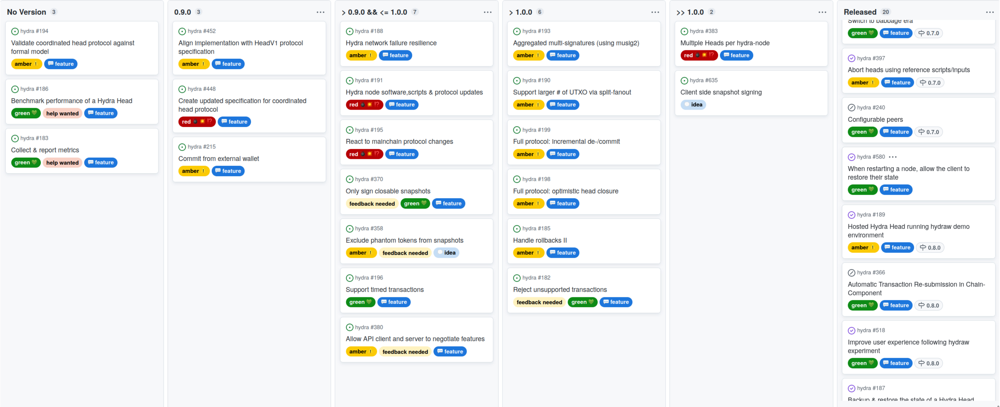
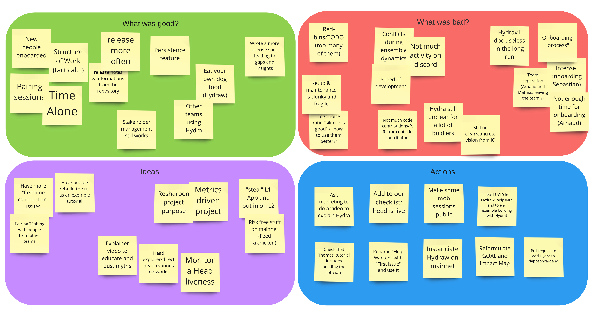
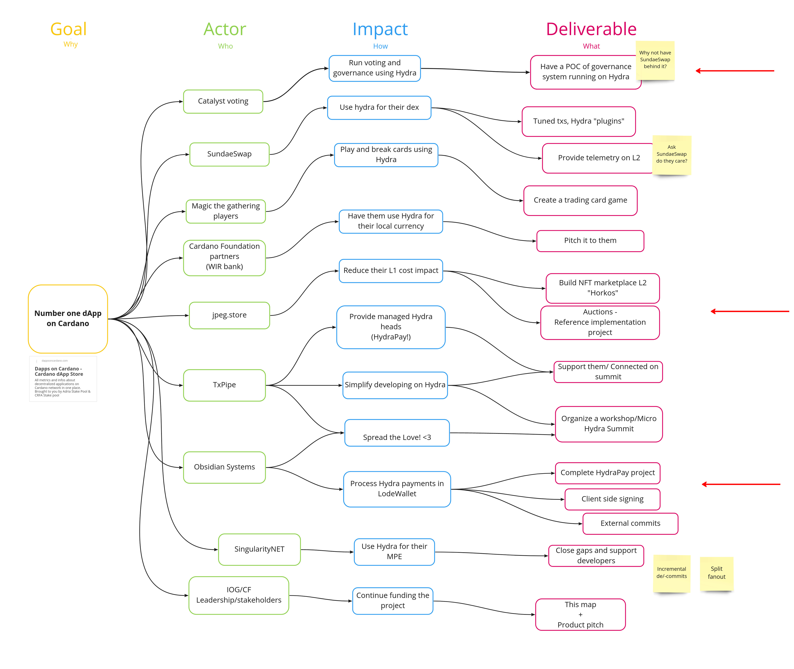

## Introduction

This report summarizes the activities of the Hydra team since October 2022 and also serves as a preparation & write-up of the monthly review meeting, in which we update major stakeholders of the project on recent developments and gather their feedback on our proposed plan forward each month.

## Roadmap update

Looking at our [roadmap](https://github.com/orgs/input-output-hk/projects/21) we can report the following releases and updates:

#### Release `0.8.0`

- Long overdue feature release adding persistence to the hydra-node
- Backup & restore the state of a Hydra Head [#187](https://github.com/input-output-hk/hydra/issues/187)
- Improve user experience following hydraw experiment [#518](https://github.com/input-output-hk/hydra/issues/518) from being only a discussion to a (to-be-groomed & planned) feature
- [Full release notes](https://github.com/input-output-hk/hydra/releases/tag/0.8.0)

#### Release `0.8.1`

- Follow-up release addressing user feedback on persistence from `0.8.0`
- Allow clients to see latest state after restart [#580](https://github.com/input-output-hk/hydra/issues/580)
- Bug fixes of following chain state [#599](https://github.com/input-output-hk/hydra/issues/599)
- [Full release notes](https://github.com/input-output-hk/hydra/releases/tag/0.8.1)

#### Notable changes

- Impact mapping from workshop (see below) and reviewing the starmap above had us discuss whether the scope for `1.0.0` is correct or not
- Need to be conscious of scope creep vs. getting something audited
- Focus on getting the spec done, `0.9.0` tagged and an audit under way now → minor re-ordering in priorities
- Iterative releases afterwards still - even while getting audited, non-contract changes first
- Promoted [https://github.com/input-output-hk/hydra/issues/635](https://github.com/input-output-hk/hydra/issues/635) from being only a discussion to a (to-be-groomed & planned) feature

<small>

Latest roadmap with 0.8.0 and 0.8.1 already released and slight re-ordering on 0.9.0

</small>

## Development

Issues closed since last report: [Issues - input-output-hk/hydra](https://github.com/input-output-hk/hydra/issues?page=1&q=is%3Aclosed+sort%3Aupdated-desc+closed%3A%3E%3D2022-10-19)

Besides the things in the releases above (see roadmap update), we have
been working on:

- **Flaky TUI CI tests:** We have sunk quite some time again in
  investigating cryptic CI failures in our TUI end-to-end tests. They
  have been crashing abruptly without any information and thus
  hard-to-debug. This investigation was unsuccessful and we realized
  at some point that the TUI tests are not that important anyways - we
  have API-level end-to-end tests. So we disabled these tests for now.

- **Published** `hydra-cardano-api` **to CHaP:** With the Cardano
  Haskell Packages (CHaP) becoming available now and wanting to be a
  good citizen, we pushed for getting our flavor of the `cardano-api`
  also published there. This is non-trivial though, as we are at an
  integration point even "further up" than the `cardano-node`
  [#504](https://github.com/input-output-hk/hydra/issues/504)

- **Implemented ADR18:** While the first stints on persistence already
  make it possible to restart `hydra-node` without needing to close a
  Head, we have implemented this in a nicer way now only keeping a
  single state (ground truth) for both L2 and L1 information
  [#541](https://github.com/input-output-hk/hydra/issues/541) of the Head protocol and the specification, we kept
  discovering bigger and bigger issues and hence realized the need for
  a discussion on transaction validity in context of closing /
  contesting Heads. [#615](#615)

## Formal verification & specification

An important part of the project right now is the formalization and
audit preparation:

- **Internal audit** has started with involvement of two persons from IOG IT
  team, each one addressing different part of Hydra:

  - One auditor is working on the project as a whole, targeting
    potential vulnerabilities with the off-chain code, the
    infrastructure, dependencies, etc. This has not lead to any
    significant issue nor action plan so far.
  - Another auditor is specifically targeting the formal
    specification and the on-chain code to identify vulnerabilities
    in the protocol itself.

- Discussions with researchers have led to the development of a joint Coordinated Hydra Head V1 specification defining formally the protocol as it is actually implemented.

  - Work on this document has already allowed us to identify gaps
  - It is the basis on which BCryptic's analyst is working to audit Hydra protocol
  - It allows us to make explicit a lot of implicit assumptions that are in the code but not in the original paper and "Shape" the language used to describe the protocol

- We have drafted an RFP for submission to **external** auditors
  [https://github.com/input-output-hk/hydra/blob/audit/rfp/security/RFP.md](https://github.com/input-output-hk/hydra/blob/audit/rfp/security/RFP.md) defining the scope and targets of the audit

- We are still unsure about whether our **approach** is the right one as having a "formal specification" in a manually checked document spanning a dozen pages seems quite brittle.

  - Some progress has been made on "formalizing" properties to be automatically "QuickChecked" using an executable model of the expected behavior of the system but this approach seems more suited for "team-internal consumption", e.g. building confidence within the core committers and contributors

  - Ideally, we would want a proper formalization of the protocol, using an existing theorem proving/model checking framework, through which properties could be asserted. Quite a lot of work has already been done in blockchain space, including some work on Lightning and TLA+ or some other state-machine/temporal logic based language appear promising:

    - [https://www.youtube.com/watch?v=wecVT_4QDcU](https://www.youtube.com/watch?v=wecVT_4QDcU)
    - [https://github.com/rberenguel/tla_lightning](https://github.com/rberenguel/tla_lightning)
    - [https://www.amazon.com/Practical-TLA-Planning-Driven-Development/dp/1484238281](https://www.amazon.com/Practical-TLA-Planning-Driven-Development/dp/1484238281)

  - This effort should be done in accordance to the DApps certification process

## Product

Most updates on the product side of things have been addressed in the
starmap update above.

- **Hydra for Payments lighthouse project**: Latest demonstration
  shown by Obsidian Systems on how to use payment channels in a "light
  way" from a web frontend. The API evolved and we were able to use
  the `preview` testnet now. The project is progressing very nicely
  and we are optimistic to close it successfully soon with improved
  documentation and usability.

- **NFT auctions lighthouse project:** After doing surveys and
  interviews, MLabs is currently concluding the discovery phase with a
  light / white paper on how NFT auctions could be implemented using
  Hydra (today or in the future with more features).

- **Drafting Voting on Hydra project**: Work has started on building a
  Proof-of-concept for voting on Hydra targeting Catalyst’s use case but with an eye towards building a generic solution suitable for large scale voting systems based on Hydra Head

  This development should be undertaken jointly with the Cardano Foundation and SundaeSwap who are also interested in building such a system and recently demonstrated their capacity of doing voting via the Cardano Summit voting system.

- **TxPipe demonstrated integration with demeter.run:** Without our
  help nor even knowing of this effort, TxPipe has recently shown an
  early prototype of `hydra-node`s instrumented via their
  [demeter.run](https://demeter.run) platform. This has come a bit as a surprise and is exactly why we love open source :heart: → [Video](https://www.loom.com/share/c811360e60084f18ab9e9f16cc941432)

## Team & open source

Some notable developments this month have been:

- **Renamed the repository:** from **hydra-poc** to
  [**hydra**](https://github.com/input-output-hk/hydra)! This was revealed in the summit presentation (see below) and should indicate that the project is not only a Proof of Concept (POC) anymore, but has become more - as also demonstrated by the various early adopters and demos lately. :dragon_face:

- **Inner source (IOG) contribution:** The education team has been working on a Hydra Tutorial and we have been involved in reviewing and trying it out. This is a great effort and will help people get started with Hydra. Thanks folks :green_heart:

## Cardano Summit & workshop

This month there was also the Cardano Summit, this time organized by the
Cardano Foundation and the content was even voted on by the community!
We have been both, invited and nominated as panelist and speakers and
this makes us extremely proud! In general, the reception of Hydra seems
to be very positive in the community from what we could experience first
hand on the summit.

Agenda items we participated in:

- [Best of blockchain, best of open source - Open Source panel ](https://summit.cardano.org/agenda-day-1/best-of-blockchain-best-of-open-source/) with IOG, CF & TxPipe

- [Cardano Ballot Speaker Winner: Dev Team](https://summit.cardano.org/agenda-day-2/cardano-ballot-speaker-winner-presentation-6/) Introduction to Hydra and
  reveal of the repository rename 🎉

After attending the summit, we also used the fact that the whole team is
in one location for a team workshop. We booked a coworking space and
spent 3 days together. Not much coding & hacking this time, but we are
happy to have produced these results:

- **Timeline / year in review:** As we had new team members with us,
  the request was to give a recap of how the Hydra project evolved
  over the last two years. The whole timeline can bee seen below, and
  this also sparked the idea of creating a "Year in review" blog post,
  which is currently in preparation.

- **Retrospective**: In-person workshops are the perfect place for
  doing retrospectives to reflect on what was good, bad and collecting
  ideas & actions in how to improve our work environment and
  processes.

  
  <small>

  Retrospective board from 2022-11-22
  
</small>

- **Impact map:** Conscious about the fact that the project got defined about one year ago in a first project plan, and inspired by timeline and (short-term) ideas, we also set off to reflect on the **Why**, **How** and **What** of this project.

  After reviewing the project vision, we reached for the tool of our choice to ideate on tangible objectives / deliverables - impact maps! Also, we felt the need to use a different goal this time. One that is reflecting more closely (or, in fact, broadly) what our current mission is. So instead of the **% of Cardano transactions are done on L2**, we set a new goal: being the **number one DApp on Cardano** (by all known metrics: TVL, traffic, volume etc..) Fundamentally, both goals illustrate the same idea, but the latter better supports the narrative that Hydra is also just a DApp (not a network upgrade) and needs usage & adoption to reach our vision.

  Below you see the result of our session. We checked back to the old impact map after creating this one, and many things are still relevant / similar on the new sample (it's never complete!) - some of the deliverables we even achieved.

  
  <small>

  Impact map with new goal
  
</small>

# Conclusion

Reflecting on our original plans (about a year ago) and our current roadmap we can say we are behind our anticipated schedule. However, recent developments on the lighthouse projects and community members contributing & using Hydra are convincing us that we are on the right track. The summit paints a similar picture and we feel reinvigorated by the great people we met, discussions we had and relationships we created & solidified on the summit and during our Hydra workshop.
