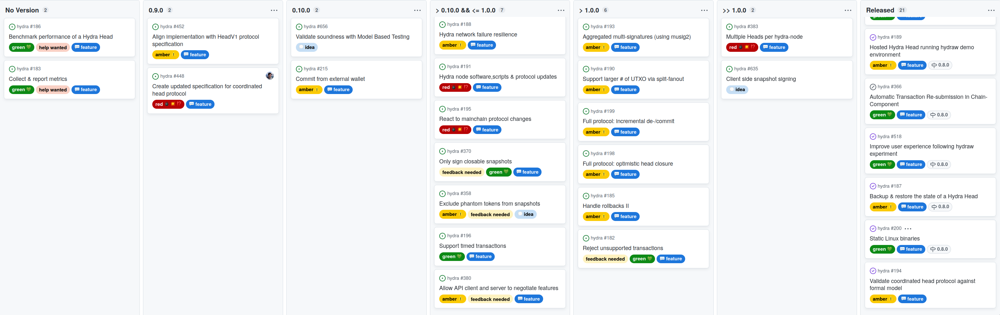
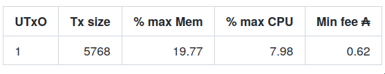
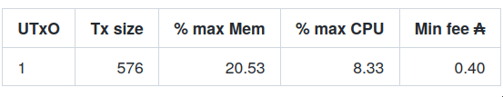
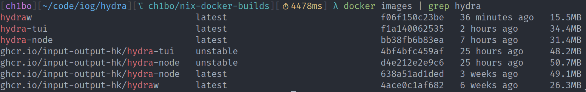
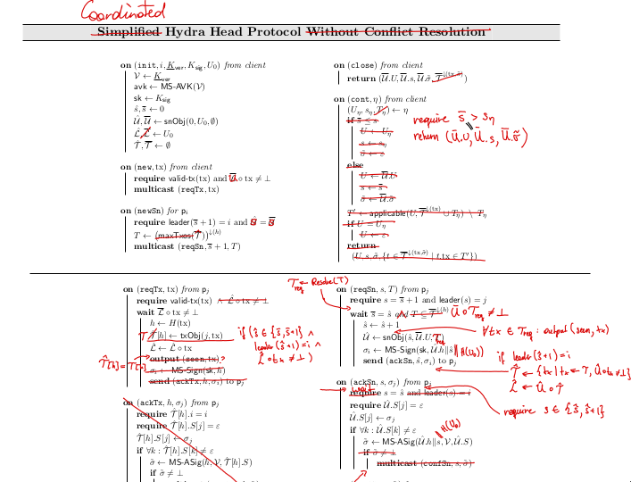
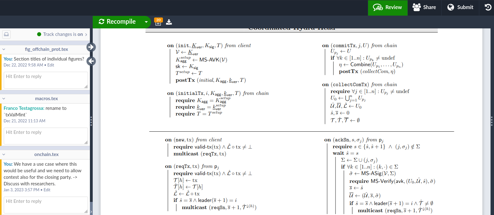

This report summarizes the work on Hydra since November 2022 and also serves as
a preparation & write-up of the monthly review meeting, in which we update major
stakeholders of the project on recent developments and gather their feedback on
our proposed plan forward each month.

## Roadmap

Looking at our [roadmap](https://github.com/orgs/input-output-hk/projects/21) we
can report the following updates:

#### Notable changes

- Completed [Validate coordinated head protocol against formal model #194 ](https://github.com/input-output-hk/hydra/issues/194) 
- Detailed a follow-up [Validate soundness with Model Based Testing #656](https://github.com/input-output-hk/hydra/issues/656)
- Focus on specification and gap-closing to support audit
- Scoped down 0.9.0 to be only about script updates and moved [Commit from external wallet #215](https://github.com/input-output-hk/hydra/issues/215) into next version
- Groomed [React to mainchain protocol changes #195](https://github.com/input-output-hk/hydra/issues/195)
- More users requesting [Support timed transactions #196](https://github.com/input-output-hk/hydra/issues/196)
  

<small>

Latest roadmap with drafted 0.10.0 version.

</small>

## Development

[Issues closed since last report](https://github.com/input-output-hk/hydra/issues?q=is%3Aclosed+sort%3Aupdated-desc+closed%3A2022-11-30..2022-12-31)

This month we have been working on:

- **Fixed `AcquirePointTooOld` errors** by changing the way the internal wallet
  initializes its state
  [#621](https://github.com/input-output-hk/hydra/pull/621). See the PR
  description for details. This did not strictly happen this month, but we have
  not mentioned it last time. 

- **Closed first gap in Head Contract**: We collected gaps between specification
  and current implementation in
  [#452](https://github.com/input-output-hk/hydra/issues/452) and started now
  closing them. This first issue, was to prevent DoS / stalling of heads, by
  bounding the lower and upper transaction validity time of the `close`
  transaction. As always, time handling is hard and this required detailed
  discussion in the form of an ADR. See
  [ADR21](https://hydra.family/head-protocol/adr/21) for more details.

- **Reduced cost of commits** by at least **30%** using reference scripts also
  in the `commit` transaction. We only used reference scripts in `abort` so far.
  This reduces the min ADA cost of `commit` because the transactions are roughly
  5.2KB smaller.

  Before:
  

  After:
  
  
- **Use nix flakes & build docker images using nix**: Triggered by a migration
  to Cicero for a nix-based CI, we started using nix flakes for `nix build` and
  `nix develop` instead of the legacy `nix-shell` in
  [#646](https://github.com/input-output-hk/hydra/pull/646). While we ended up
  sticking with Github Actions as the only CI and a Cachix cache, we extended
  this work to build our docker images more efficiently using `nix` in
  [#654](https://github.com/input-output-hk/hydra/pull/654).

  Image sizes went down between 20-50%:

  
  
  While docker CI builds on `master` went down to 1-10min (from 10-30m+)!

## Hydra V1 Specification

Finally, we bit the bullet and started a write-up of the specification. Over the
last couple of months we had worked with marked up versions (see below) of the
original paper and a GDoc to discuss and review the protocol as it was
implemented.

  
As we also updated the security properties and proofs, we started aggregating a
LaTeX document on overleaf. While it holds a similar background and
preliminaries as the original paper, it only specifies a single version of the
protocol with no variants, less modularization, as well as explicit assumptions
and important notes for implementors.
  

We aim to be publishing the spec as part of the main [hydra repository](https://github.com/input-output-hk/hydra) soon.

## Community

- **Hydra for Payments project** completed the first phase of this work stream
  by tagging version [0.1.0](https://github.com/obsidiansystems/hydra-pay/releases/tag/v0.1.0).
  This open source project conducted by Obsidian Systems and sponsored by IOG
  created a great starting point for developers to build services/APIs of
  payment channels using Hydra Head. This month we reviewed the improved
  documentation and are looking forward to see this work applied to eventually
  build fast & cheap payments for light-wallet users and power payment channel
  use cases from business-to-business (B2B) in the short-term.

- **Hydra for Voting project** kicked off this joint project between IOG
  Research, Catalyst & Hydra Tribes, and the Cardano Foundation. The goal is to
  assess suitability of Hydra Head to support voting use cases by implementing
  parts of Catalyst voting system on Hydra Head and benchmark execution at
  scale. The kick-off meeting took place on December 15.
    
- **Blog post by CF**: To round off the year, Matthias wrote a nice
  [retrospective blog
  post](https://cardanofoundation.org/en/news/hydra-head-protocol-an-open-source-solution-for-scalability/)
  about Hydra at the CF. Besides summarizing our progress made in 2022 it also
  gives an outlook where Hydra is headed for in 2023.

## Conclusion

Although Hydra is in essence an open source project right now, we would love to
make it "even more open source" in the coming months. Our vision of Hydra
requires to have the builders of the Cardano ecosystem to be part of this
journey. For that matter, we want not only to open up these monthly reports, but
the review meeting backing it as well!

This, besides our engagements with the community above, will allow the project
to grow beyond IOG & CF contributions. To become the true Cardano open source
project we believe will be worthy to serve as the scalability component required
by the Cardano network.
