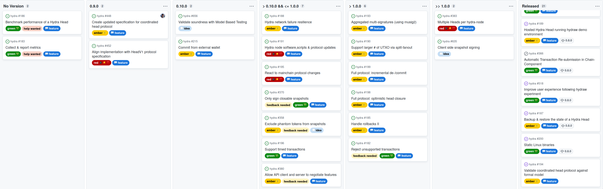
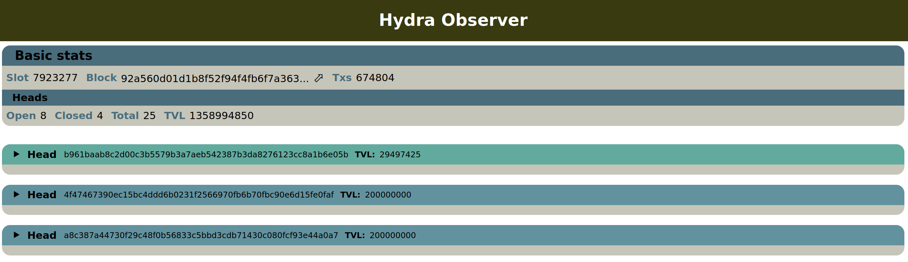

This report summarizes the work on Hydra since December 2022 and serves as
preparation for the monthly review meeting, where the teams update major project
stakeholders on recent developments to gather their feedback on the proposed
plan forward.

## Roadmap

Looking at the [roadmap](https://github.com/orgs/input-output-hk/projects/21),
just a few things to report this month:

- Regroomed [Create updated specification for coordinated head protocol
  #448](https://github.com/input-output-hk/hydra/issues/448) to :yellow_heart:,
  as good progress was made on the specification

- Marked [Align implementation with HeadV1 protocol specification
  #452](https://github.com/input-output-hk/hydra/issues/452) as :red_circle:, as
  the team experienced scope creep and has not progressed as fast as expected.
  + The plan is to break this initiative into smaller tasks to address and
    explain implementation challenges.
  
 <small>
 The latest roadmap with minor
changes, which needs a reflection of the latest objectives. 
</small>

## Development

[Issues closed since last
report](https://github.com/input-output-hk/hydra/issues?q=is%3Aclosed+sort%3Aupdated-desc+closed%3A2022-12-23..2023-01-24)

This month, the team worked on:
  
- **First write-up of Hydra spec online**. As mentioned previously, the team has
  been aggregating the latest definitions of on- and off-chain semantics into a
  new technical specification. The latest version can still be found [on
  Overleaf](https://www.overleaf.com/project/6389ba5edbcf7a51fda1328f), before
  its integration into the core Hydra repository. Should you have feedback,
  please send it our way through one of the [communication
  channels](https://github.com/input-output-hk/hydra/blob/master/SUPPORT.md).

- **Closed more gaps in the Head Contract**. The team addressed two more gaps in
  the on-chain scripts based on discussions on the specification.

  + All validators are authenticated now and ensure contract continuity by
    checking for the state tokens in the output (or getting burned).

  + Abort now fully reimburses all committed UTXOs, even if two parties would
    have committed the exact same output (quite a theoretical attack vector).

  This work is captured in
  [#452](https://github.com/input-output-hk/hydra/issues/452), but this work
  item is taking quite a bit longer than expected. Also, it's a single feature
  item, lacking some rationale on certain requirements, so we intend to break
  this down into smaller pieces over the next days and weeks.

- **Mutation test framework improvements**. While closing gaps in the contracts,
  the team realized that some of the [mutation
  tests](https://hydra.family/head-protocol/haddock/hydra-node/tests/Hydra-Chain-Direct-Contract-Mutation.html)
  were correctly tripping validators and making transactions invalid, but not
  always for the right reason. In fact, some of the mutations were ‘too harsh’
  and made the even transaction not even pass phase-1 validation. The team
  addressed this by introducing a first (naiive) way to assert the right cause
  of the failure by checking strings in the validator log.
  [#679](https://github.com/input-output-hk/hydra/pulls/679)

- **Add `headId` in API and TUI to make it easier for identifying heads**. The
  team added not only the unique `headId` to the appropriate server outputs and
  the TUI [#678](https://github.com/input-output-hk/hydra/pull/678), but also
  added sequence numbers and timestamps to produced outputs
  [#618](https://github.com/input-output-hk/hydra/pull/618). This was asked for
  by users and simplifies the process of integration with the hydra-node.

- **Hydra explorer experiment**. Some of the team used the holiday season to
  conduct some experiments on summarizing Hydra Heads observed on a network.
  This is only a quick hack, but already demonstrates the value of a Hydra
  explorer as a tool to measure adoption by open heads on a given network.
  Naturally, it would reuse code from the hydra-node and challenge the
  architecture used in it for tracking multiple heads. Also, it will drive
  discussion about the versioning of hydra-plutus and the possibility to track
  multiple versions of the Hydra protocol on the chain (hashes/addresses change
  in each version).
  
 <small>
 Hydra explorer first experiment
UI 
</small>

## Community

- **The Hydra for Voting project**, which got kicked off in December is picking
  up steam with deep dives into Catalyst voting and Hydra technology.
  Discussions are currently held in various settings and we’re continuing to
  develop a picture of what is achievable.

- **Hydra for auctions litepaper**. IOG is partnering with MLabs on exploring
  how Hydra can improve auction use cases. At this stage, the teams discussed
  multiple approaches on how to structure the problem space with various Hydra
  topologies and specific trade-offs. The full case study was published [on
  Essential
  Cardano](https://www.essentialcardano.io/article/implementing-auction-projects-using-hydra).
  The teams plan to upstream the findings back into the [use case
  section](https://hydra.family/head-protocol/use-cases/nft-auction/) on the
  Hydra website from which this project originated.
  
## Themes for 2023

After kicking off planning in a
[workshop](http://ncoding.at:3000/head-protocol/monthly/2022-11#cardano-summit--workshop)
and reflecting on [what Hydra achieved in
2023](https://cardanofoundation.org/en/news/hydra-head-protocol-an-open-source-solution-for-scalability/),
the team has progressed in fleshing out relevant themes and objectives for this
year to position Hydra as a sustainable open-source project in the age of
Voltaire:

- **A mainnet mature application**
  + **Why?** The core contributors should be able to use the protocol on
    mainnet, so it should be maintainable and mature enough to lock some ada in
    a Hydra Head using a reference DApp (eg, hydraw). By creating and growing
    this DApp, the team will
    [dogfood](https://en.wikipedia.org/wiki/Eating_your_own_dog_food) features
    and hence improve additional usability.
  + **How to measure?** Number of heads on mainnet > 0 and core contributors
    feel confident to lock at least 100₳ in a Hydra Head on mainnet.
  + **Next steps:**
    - Publish Hydra Head V1 specification
    - Close gaps in implementation and release 0.9.0
    - Create a request for proposals (RFP) to audit the specification and its
      implementation

- **Increase adoption**
  + **Why?** The team wants to showcase what is possible with Hydra through
    benchmarks and lighthouse projects, enabling use cases and reducing friction
    to use Hydra. Also, ensuring interoperability through open standards and
    reference implementations.
  + **How to measure?** Number of third-party created heads on any network > 0
  + **Next steps:**
    - Build a basic Hydra Head explorer to measure adoption
    - Benchmark off-chain performance (of a selected scenario)
    - Demonstrate Hydra for Payments to potential users
    - Support Hydra for Voting project
    - Hydra for Auctions project exploring a delegated voucher auction

- **Sustainable open-source-development**
  + **Why?** The team wants to scale Cardano in the long run. Hence this project
    should not be owned by a single entity, but by the community and the Cardano
    network itself. It is thus essential to make contributions to the project
    possible and ultimately it should be easy to become a contributor.
  + **How to measure?** Number of contributors on GitHub
  + **Next steps:**
    - Open up monthly reviews
    - Add tutorials to the website
    - Publish and maintain a use case centric roadmap and feature map

## Conclusion

This monthly review was the first public one with not only stakeholders from IOG
and the CF, but also partners of the latest projects. This was the first step to
a more open and transparent development process.

The teams showed some classic demos – like the ‘hydraw’ application which has
been running on the same Hydra Head for four weeks now – and some new
developments on the Hydra explorer and minor improvements to hydra-node API and
TUI.

It was very interesting to bring various teams together to exchange ideas and
thoughts on the individual roadmaps for the new year. The teams also shared the
relevant themes and objectives of the Hydra project for 2023 (as also listed
above) and will now make sure to reflect these steps into this concrete
[roadmap](https://github.com/orgs/input-output-hk/projects/21) such that it will
contain [marketable features](https://www.agilealliance.org/glossary/mmf/)
bringing us closer to these goals.
