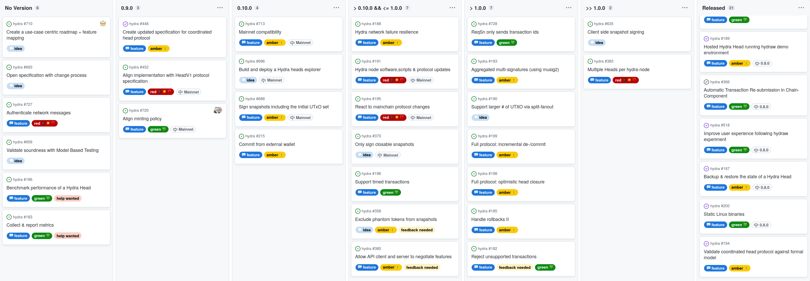
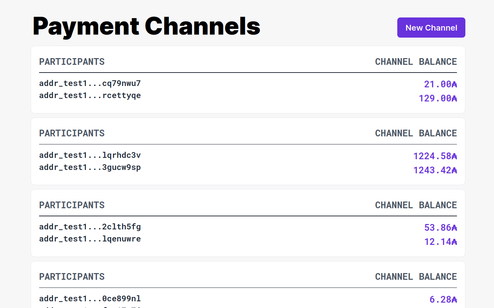

This report summarizes the work on Hydra since January 2023. It serves as
preparation for the monthly review meeting, where the teams update major project
stakeholders on recent developments to gather their feedback on the proposed
plan forward.

## Roadmap

Looking at the [roadmap](https://github.com/orgs/input-output-hk/projects/21),
there are a few things that changed this month:

- In general, there will be quite a lot of items in flux as we align the
  technical roadmap to support our high-level objectives for the year.

  + New items for example: [create a use case centric
  roadmap #710](https://github.com/input-output-hk/hydra/issues/710) and [open
  specification with change process
  #693](https://github.com/input-output-hk/hydra/issues/693).

- Also note, that we have not had a release in a while and we want to have
  smaller faster releasable items again

- [Aligning implementation with HeadV1 specification
  #452](https://github.com/input-output-hk/hydra/issues/452) was more work than
  anticipated. There was quite some forth and back with the writing the
  specification and discussions with researchers leading to scope creep.
  + Most-important: made on-chain behavior consistent with specification
  + Follow-ups for some off-chain protocol logic:
    - [Authenticate network messages #727](https://github.com/input-output-hk/hydra/issues/727)
    - [ReqSn only sends transaction ids #728](https://github.com/input-output-hk/hydra/issues/728)
  
- Version **0.9.0** will be the first release which is developed against a full technical specification. We expect a release in early March.

- Version **0.10.0** will be the first mainnet compatible release. For which we created and groomed the main feature item [Mainnnet compatibility #713](https://github.com/input-output-hk/hydra/issues/713):
  - Not only making it technically compatible, but also add guard rails to limit
    risk (“not shoot yourself in the foot .. with a real gun now”) and document
    known issues.

- For a fully maintained version **1.0.0** we still need to address some things, but we aim for an increased rate of planned releases in the next months as we march toward it.
  
 <small>
 The latest roadmap with multiple new items and starting to reflect Hydra objectives of 2023.
</small>

## Development

[Issues and pull requests closed since last
report](https://github.com/input-output-hk/hydra/issues?q=is%3Aclosed+sort%3Aupdated-desc+closed%3A2023-01-24..2023-02-28)

This month, the team worked on the following:
  
- **Aligning specification and implementation**. This major [feature
  item](https://github.com/input-output-hk/hydra/issues/452) was the topic we
  worked on over the last couple of months. This time we could finish the major,
  must-have parts and can continue now on other features. Notable things from
  this month were:
  
  **Pushing out contestation deadlines:** The original paper was defining that
  all participants need to be contesting within the contestation period (after
  close, before the deadline). In discussions with researchers last year, we
  identified a better semantics: The contestation deadline gets "pushed out" on
  each contest. This has the benefit that the period needs to only accomodate
  for the minimum time required to get a single contest transaction into the
  block chain. Before it was depending on the size of the Hydra Head - each
  participant can contest once.
  
  **Align off-chain protocol logic:** While most concerns addressed were about
  the on-chain scripts of the Hydra protocol, this is about the layer two
  protocol logic. That is, which messages are exchanged between hydra nodes and
  how a node reacts to them. Here we realized that the implementation was
  slightly different than the formalism used in the paper and specification.
  This makes it non-obvious whether the behavior is exactly as specified or
  whether the specification can even be implemented into a working system.
  
  To clarify on this, we put in some effort to align the implementation with the
  specification and the other way around. This allowed us to reason through our
  behavior tests whether the protocol as specified is sound as well. Below you
  see an excerpt of the Haskell code against the LaTeX pseudocode formalism:
  
  

    
    
  

 
- **Profiling Hydra transactions.** We will want to maximize the capability of
  the Hydra Head protocol. This includes writing the on-chain scripts
  efficiently. Besides having [transaction cost
  benchmarks](https://hydra.family/head-protocol/benchmarks/transaction-cost/),
  we worked on a profiling workflow for Hydra protocol transactions and
  published a [tutorial on the Hydra
  website](https://hydra.family/head-protocol/benchmarks/profiling). This allows
  any contributor to [hydra](https://github.com/input-output-hk/hydra) to
  profile the scripts used in these transactions and identify code which uses a
  lot of the memory or cpu budget in flame graphs like this: 
  
  
  [Interactive](../benchmarks/profile-mem.svg)

- Head not closable / limiting script size discussion + acceptance property

## Community

- **Audit guidelines.** Hydra is an open-source project and, as such, should be
  freely used, reviewed and audited. The goal of audits and peer reviews is to
  increase confidence in the security of a system. However, conducting an audit
  is also very expensive and not in scope of our current budget. All the while,
  the worth of an audit is not the same to all users, some will not even trust
  an audit they have not paid for themselves, while others do not care at all
  and would blindly trust the word of the maintainers.
  
  While the Hydra project continues to seek for funding to eventually pay for an
  audit of the protocol specification and the `hydra-node` implementation, it is
  pre-requisite that the necessary artifacts for such an audit exist. As we have
  been creating them in recent months, we also worked on guidelines for
  auditors, now [published on our
  website](https://hydra.family/head-protocol/audit-guidelines/). These
  guidelines should serve as a starting point and scope description of what
  would be most crucial to audit.

- **New tutorial.** This month we received a great contribution by
  [@perturbing](https://github.com/perturbing/), who created an [end-to-end
  tutorial](https://hydra.family/head-protocol/docs/tutorial/) of using a
  `hydra-node` and opening a Hydra Head on the testnet. We gladly adopted this
  tutorial and aim to keep it up-to-date with upcoming versions of the
  `hydra-node`. It will provide a great starting point for new users and makes
  the project more approachable. Thanks! :green_heart:

- **Hydra for Payments demo.** As we are about to kick off the next phase of the
  payments use case with Obsidian Systems, they demonstrated the use of
  [hydra-pay](https://github.com/obsidiansystems/hydra-pay) in a new
  backoffice-like view, listing multiple payment channels and providing a great
  teaser of using payment channels for pay-per-use APIs or cashback use cases
  (micro-transactions).

  

- **Hydra for Voting.** The project with Catalyst and Cardano Foundation on
  voting with Hydra (or rather *tallying* with Hydra) showed some progress. They
  have [contributed Merkle Trees to
  Aiken](https://github.com/aiken-lang/trees/pull/1), which will be useful to
  prove correct tallying of votes in the L2. They started work on a
  [hydra-java-client](https://github.com/cardano-foundation/hydra-java-client)
  and provided valuable feedback on the `hydra-node` API over the last month.

- **Hydra on Demeter.** The folks from [@txpipe](https://github.com/txpipe) have
  been working on integrating Hydra into their platform-as-a-service offerring
  Demeter. This is a great way to get started with running a `hydra-node`
  as-a-service and we plan on integrating one instance into our long-running
  hydraw demo. It's still not fully released, but the teams are working together
  to make this integration great. Thanks for providing this service!
  :green_heart:
  
- **New discord category.** The Hydra project will be using Discord a bit more
  in the coming weeks and months. For that a new category on the [IOG Technical
  Discord server](https://discord.gg/Bwdy2jNdm2) has been created. Look out for
  news and, most importantly, invites for the next month's review meeting in the
  new Hydra #announcements channel!
  
  

    
  

## Conclusion

The monthly review meeting for February was conducted on 2023-02-27 via Google
Meet -
[slides](https://docs.google.com/presentation/d/1FjLvlLS4Qh6dwuULFJxielvemDGi-xiWZ2o6wysJk7U/edit#slide=id.g1f87a7454a5_0_1392)
/
[recording](https://drive.google.com/file/d/15l5F5NJNO1aC4X8HdQUDsg_dKMgVCO-J/view?usp=sharing).

This month's installment was featuring two demos, one about the Hydra Payment
channels, another about the progress on the Hydra for Auctions project. It was
great to showcase not only core development progress on the specification and
protocol implementation in the `hydra-node`, but also to see contributions from
the Community on tutorials and tooling (Demeter integration).

An exciting, but also challenging next step will be to aim for mainnet
compatibility and at the same time deliver quick releases to enable these
light-house projects and the increasing number of use cases explored by the
Builders of Cardano.
