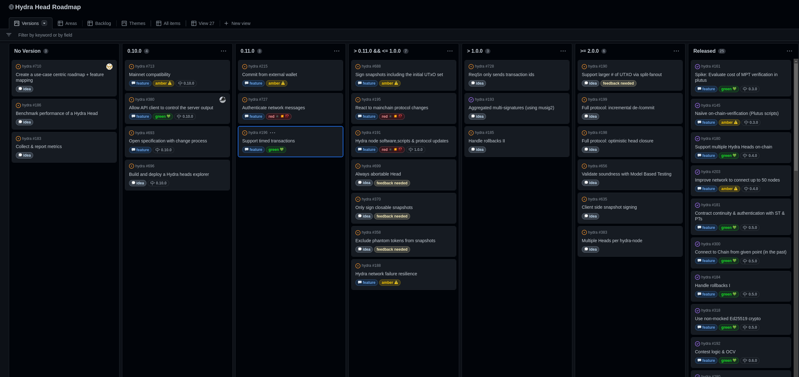
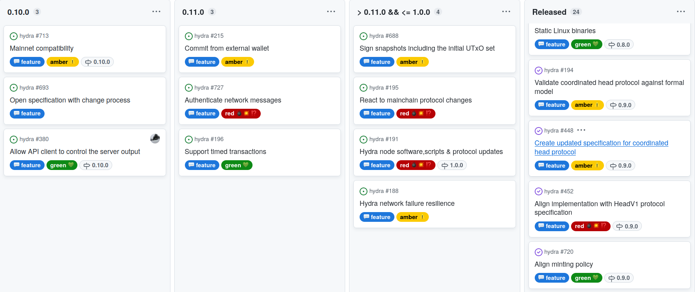

This report summarizes the work on Hydra since February 2023. It serves as
preparation for the monthly review meeting
([slides](https://docs.google.com/presentation/d/1yZ4AqUQ8OBMG9ARMYvj3IOjaIAqglf7kZei4vsLMrbs/edit#slide=id.g1f87a7454a5_0_1392)/[recording](https://www.youtube.com/watch?v=mA9lMV0tKN8))
, where the team updates major project stakeholders on recent developments to
gather their feedback on proposed plans.

## Roadmap

We had one release this month and also updated several items on our
[roadmap](https://github.com/orgs/input-output-hk/projects/21).

#### Released version 0.9.0

- This release brought in on-chain and off-chain changes that are now also fully
  reflected in our specification.

- We managed to decrease costs of our plutus scripts by using new error code
  framework.

- Our mutation test suite is now complete and we made sure it checks our tests
  are failing for the right reason.

- The contestation deadline is now pushed out by each contesting party, so the
  contestation period parameter can be chosen irrespective of number of parties.

- We have added a tutorial contributed by [@perturbing](https://github.com/perturbing/).

- [Full release notes](https://github.com/input-output-hk/hydra/releases/tag/0.9.0) and list of [delivered features](https://github.com/input-output-hk/hydra/milestone/9?closed=1)

 <small>
The latest roadmap many items marked as idea.
</small>

#### Notable roadmap updates

- With 0.9.0 released, we continue focusing on mainnet compatiblity. And the
  next, planned version **0.10.0** will be the first `hydra-node` which is
  mainnet compatible.

- Also prioritized [API configurability
  #380](https://github.com/input-output-hk/hydra/issues/380) higher and planned
  into 0.10.0 as more users were requesting this.

- We aim for several more **0.x.0** versions to incorporate user-wished features
  before reaching a 1.0.0, which would represent a fully maintained release
  where features can be considered stable and won't be removed without
  appropriate deprecation cycles.

- Labelled many features as 💭 _idea_ to re-discuss them. Many have been on the
  roadmap for long time without actual user input, while others are incubating
  as [github idea
  discussion](https://github.com/input-output-hk/hydra/discussions/categories/ideas).
  We are planning to convert these idea issues to actual github discussions as
  these provide better dicussion tools and allow to gauge interest in topics. In
  turn, it will also provide more more room for the most popular ideas to be
  planned onto the roadmap more timely.

- In short, if you want to see some feature added, **show your support** on the
  corresponding [idea
  discussion](https://github.com/input-output-hk/hydra/discussions/categories/ideas).

- The 💬 _feature_ items remaining are the currently identifed "must-haves" or
  too vague to remove 🔴 _red_ items.

 <small>
The roadmap without idea items.
</small>

## Development

[Issues and pull requests closed since last
report](https://github.com/input-output-hk/hydra/issues?q=is%3Aclosed+sort%3Aupdated-desc+closed%3A2023-02-24..2023-03-29)

This month, the team worked on the following:

- **Making Hydra mainnet compatible.** Besides making it technically possible to
  run on mainnet, this is about safe guard our users and prevent them from
  shooting themselves in the foot with a mainnet gun. That is why we
  [limited](https://github.com/input-output-hk/hydra/issues/762) the amount of
  ADA you can commit to a head on mainnet. Our smoke tests should be running on
  mainnet also so we made sure to
  [return](https://github.com/input-output-hk/hydra/pull/770) the leftover funds
  back to our faucet. There was also
  [work](https://github.com/input-output-hk/hydra/pull/775) on our CI that
  actually enables running the tests on mainnet using a dedicated github runner.

- **Improving the Hydra UX.** We noticed a possible pitfall when restarting the
  `hydra-node` using different parameters than in the persisted state. Now, the
  node would [prevent](https://github.com/input-output-hk/hydra/issues/764) this
  kind of misconfiguration.

- **Optimize the on-chain scripts.** Reduced the cost of opening/closing a Head
  by reducing size of scripts via error codes
  [#748](https://github.com/input-output-hk/hydra/pull/748) and also having the
  head script as a reference only
  [#701](https://github.com/input-output-hk/hydra/pull/701)).

  The mutation test also got improved by making all cases expect the
  corresponding error codes
  [#705](https://github.com/input-output-hk/hydra/issues/705) and new [golden
  test suite ](https://github.com/input-output-hk/hydra/pull/772) ensures the
  scripts hashes don't change accidentially.

  Furthermore, we addressed a problem discovered in our property tests
  [#724](https://github.com/input-output-hk/hydra/pull/724) by preventing to
  commit outputs with reference scripts to a Head
  [#766](https://github.com/input-output-hk/hydra/pull/766). This is still a
  documented known issue, but a workaround is available.

## Community

- **Team workshop in Austria.** Meetup of core contributors in Feldkirch,
  Austria for retrospective, grooming and discussions on future plans for
  Hydra. Part of the agenda was also a presentation of Hydra to members of the
  Cardano Foundation and a meeting with builders from the Cardano community.

  The highlight, though was the common effort of going the last mile to open a
  head on mainnet for the monthly review meeting! 🎉

    <blockquote class="twitter-tweet">
JUST IN: We have a Hydra Head live on the <a href="https://twitter.com/hashtag/Cardano?src=hash&amp;ref_src=twsrc%5Etfw">#Cardano</a> Mainnet 🚀 <a href="https://t.co/6kDKq7T7no">pic.twitter.com/6kDKq7T7no</a>
&mdash; Emmanuel 𓂀 🍕 𓅓🇬🇭🦄🟣⚡️ (@thepizzaknight_) <a href="https://twitter.com/thepizzaknight_/status/1638572527789252608?ref_src=twsrc%5Etfw">March 22, 2023</a></blockquote> 

  We demonstrated our good old `hydraw` application on that Hydra head and we
  saw thousands of pixels painted by hundreds of users (no detailed metrics).

- **Next step in Hydra for Payments.** Also announced in the monthly meeting was
  the next phase on the Hydra for Payments project. The scope of this will be to
  extend hydra-pay and build a mobile payment channels app that makes direct use
  of it - working title: HydraNow.

## Conclusion

The monthly review meeting for March was conducted on 2023-03-27 via Google
Meet - [slides](https://docs.google.com/presentation/d/1yZ4AqUQ8OBMG9ARMYvj3IOjaIAqglf7kZei4vsLMrbs/edit#slide=id.g1f87a7454a5_0_1392)/[recording](https://www.youtube.com/watch?v=mA9lMV0tKN8).

This month was very important for the project and culminated in the first
demonstration of a Hydra Head on mainnet! The demo was well received and we
received positive feedback in the meeting, on following twitter announcements
and on the published recording on youtube. Inspired by this, we saw multiple people
reach out how they could help and collaborate on communicating, educating and
ultimately spreading the love. The invitation via the new discord category
worked well - we had about 40 community members in the call - and we will
continue with this workflow. Make sure to follow the Hydra
[#announcements](discord.gg/Bwdy2jNdm2) on the IOG Technical discord server.

While being mainnet compatible is a major milestone for the project, there are
still many known issues, short-comings and requested features. The roadmap
changes of this month should make it clear that we are serious about the
latter - Hydra will only reach 1.0.0 if it is used by an application on mainnet.
Hence, we will focus on adding features required for payments, voting, auctions,
.. and eventually, your use case.

Hydra Head is ready to be used on mainnet .. are you?
