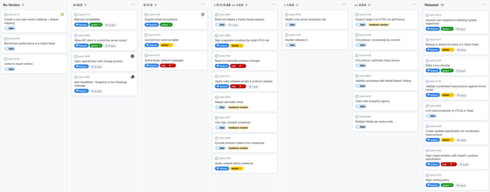
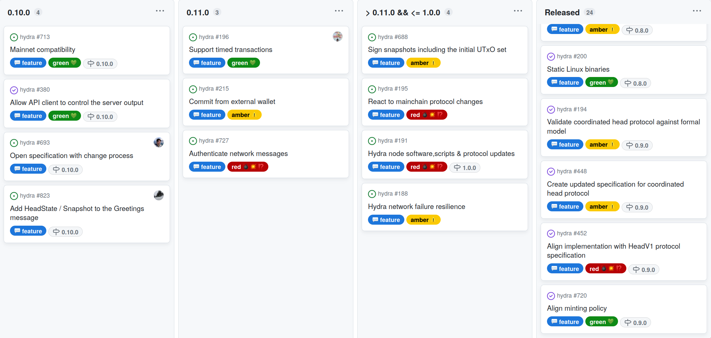
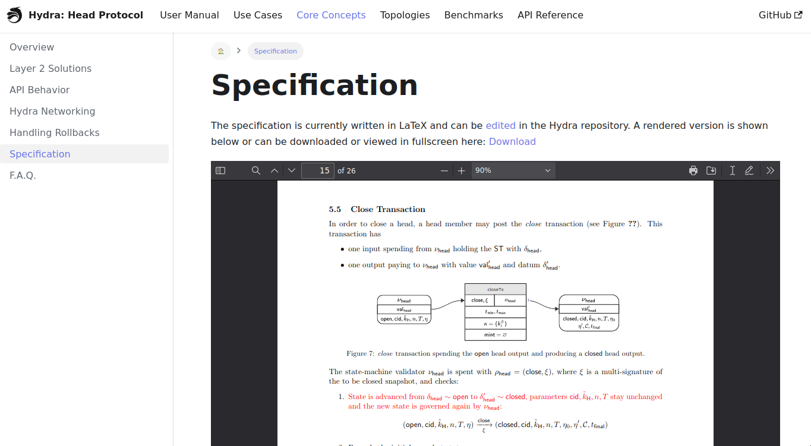
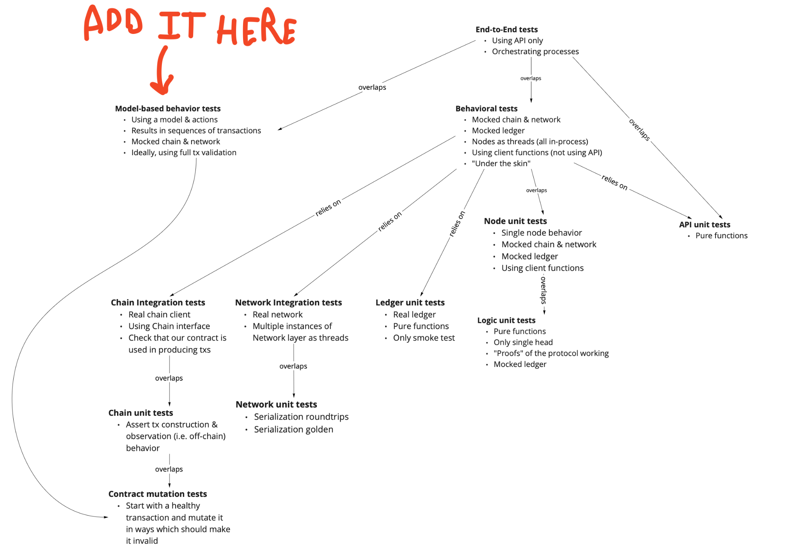
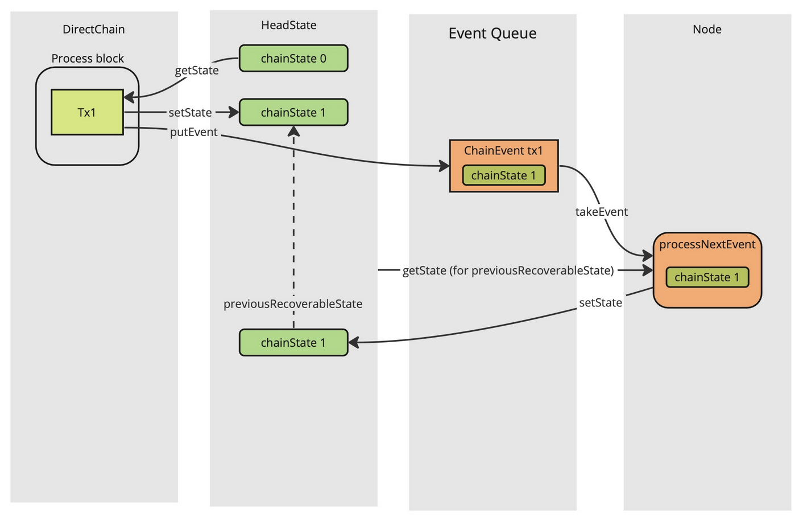
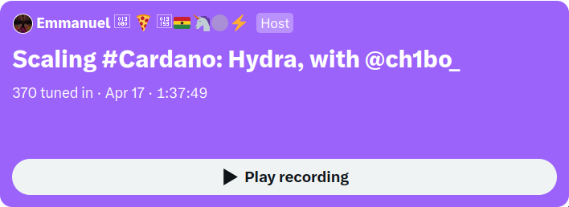

This report summarizes the work on Hydra since March 2023. It serves as
preparation for the monthly review meeting (see
[slides](https://docs.google.com/presentation/d/10wZJy0tyGMbvMihbHnHk0QByA_TAZrtbcRbf5Gd-SHg/)
and the
[recording](https://drive.google.com/file/d/1X4yPerLTatPPMrX3RYS7XH9lfT_LYaaX/view?usp=sharing)),
where the team updates major project stakeholders on recent developments to
gather their feedback on proposed plans.

## Roadmap

The project [roadmap](https://github.com/orgs/input-output-hk/projects/21) was
only slightly updated this month:

 <small>
The latest roadmap with features and ideas
</small>

#### Notable roadmap updates:

- There are still many 💭 **idea** items on the roadmap, however, not on the
  current and next planned release columns. The process involves clarifying and
  refining each idea item into a 💬 **feature** before starting work on it. This
  includes giving equal consideration to new user 💭 **idea**s and requests.

- Temporarily postponed the [Hydra heads explorer
  #696](https://github.com/input-output-hk/hydra/issues/696) item until there is
  more clarity. While there aren't any major blockers,the explorer just requires
  further detailing, especially since we're currently in talks with existing
  Cardano explorer platforms.

- Converted the [aggregated multi-signature
  #193](https://github.com/input-output-hk/hydra/issues/193) from the concrete
  roadmap into an [idea discussion
  #787](https://github.com/input-output-hk/hydra/discussions/787). This is based
  on feedback from the community, and we believe that discussing it there would
  be more beneficial.

- The main focus for the 0.10.0 release is implementing mainnet compatibility.
  This is mostly done and only requires some documentation and disclaimer
  updates. We're about to release 0.10.0, which will be the first
  mainnet-compatible version.

- Meanwhile, work on the [configurable API
  #380](https://github.com/input-output-hk/hydra/issues/380) was completed,
  which gave rise to new ideas and follow-up feature requests from users. One of
  them ([Add HeadState/Snapshot to Greetings
  #823](https://github.com/input-output-hk/hydra/issues/823)) was fairly
  straightforward and necessary to deliver a consistent, usable increment on the
  API with the upcoming release.

- Prioritized [Support timed transactions
  #196](https://github.com/input-output-hk/hydra/issues/196) higher as yet
  another use case would benefit from this.

 <small>
The roadmap without idea items
</small>

## Development

[Issues and pull requests closed since last
report](https://github.com/input-output-hk/hydra/issues?q=is%3Aclosed+sort%3Aupdated-desc+closed%3A2023-03-29..2023-04-26)

This month, the team worked on the following:

- **Configurable API.** The API evolved a bit, driven by the issues our users
  reported [#823](https://github.com/input-output-hk/hydra/issues/823)
  [#813](https://github.com/input-output-hk/hydra/issues/813)
  [#800](https://github.com/input-output-hk/hydra/issues/800)
  [#789](https://github.com/input-output-hk/hydra/issues/789).
  Related changes were added to the API server so now our clients can:

  - Control the historical messages output. History messages can be displayed
    upon re/connection or not depending on client needs.
  - Snapshot UTXOs can optionally be disabled.
  - Transactions can be displayed in CBOR or JSON format.

  Our clients can also have a nice insight into the current Hydra node state and head UTXOs
  that are now displayed as part of a `Greetings` message.

  Next steps on the API level are to further fulfill user needs by grooming and
  implementing needed changes related to filtering, pagination etc.

- **Versioned docs and specification.** Over the [last couple of
  months](./2023-02#development) the Hydra specification became an important
  artifact to use in discussion, review and potential audit of the Hydra Head
  protocol implementation. The document was now moved from overleaf into the
  Hydra repository, where it is properly versioned and built on each CI run.
  Changes can be proposed using our regular pull request worfklow and the final
  PDF is built and [published to the
  website](https://hydra.family/head-protocol/unstable/core-concepts/specification)
  automatically.

  Note that the above link points to the new `/unstable` version of the
  documentation, which holds the bleeding edge user manual, specification and
  API reference (which got a new sidebar) built directly from `master`. The
  normal, non-unstable version of the website is always referring to the [last
  released version](https://github.com/input-output-hk/hydra/releases).

 <small>
Figure 3. Specification on the Hydra website
</small>

- **Fixed scripts, Plutonomy and custom script contexts.** As we made the
  specification use a more direct way to represent transactions (instead of the
  constraint emitting machine formalism), we realized that our scripts are not
  correctly ensuring _script continuity_. We identified these 'gaps' as red
  sections (see above) in the specification and worked on fixing them.

  While the [actual fix #777](https://github.com/input-output-hk/hydra/pull/777)
  was fairly straightforward and could easily be covered by our mutation-based
  contract tests, the script size increased and we could not publish all three
  Hydra scripts in a single publish transaction (which allows for a single
  `--hydra-scripts-tx-id` parameter on the `hydra-node`).

  To mitigate this, we looked into the UPLC optimizer
  [Plutonomy](https://github.com/well-typed/plutonomy/tree/master/src/Plutonomy).
  Applying it was fairly simple, our tests did also pass, script sizes _and
  costs_ also became lower. But, script size does not matter so much as we are
  using reference scripts and using a (not really maintained?) optimizer which
  introduces yet another question mark after compilation from `plutus-tx` to
  `uplc` was not our cup of tea right now at least (and we might pull this out
  of the drawer later).

  There is an alternative: decoding `ScriptContext` involves quite some code,
  but we don't need everything in all validators. So we introduced a
  customscript context that only decodes the fields we need.

  | scripts  | @0.9.0 | fixes | fixes + plutonomy | fixes + custom ScriptContext |
  | -------- | ------ | ----- | ----------------- | ---------------------------- |
  | νInitial | 4621   | 4727  | 3672              | 4300                         |
  | νCommit  | 2422   | 2513  | 1816              | 2068                         |
  | νHead    | 8954   | 9492  | 7579              | 9456 (no custom SC)          |
  | μHead    | 4458   | 4537  | 3468              | 4104                         |

As part of this process, we also updated dependencies #[826](https://github.com/input-output-hk/hydra/pull/826) to the latest
`cardano-node` master. Although it didn't have an impact on script sizes, it's a
crucial step towards preparing for upcoming hard-forks.

- **Rollback bug hunt.**

Opening our first head on mainnet failed. We didn't lose any funds, except for
some fees, but the head just did not open. Exploring the logs, we figured out
that a rollback happened while opening the head and there was a bug.

This is our test pyramid. It already contained some tests about the rollback but
we decided to enrich our model-based tests to simulate rollbacks (before that,
it used to run on a _perfect_ blockchain). You can find more about our
model-based test strategy in [Model-Based Testing with
QuickCheck](https://engineering.iog.io/2022-09-28-introduce-q-d/).

 <small>
Testing pyramide
</small>

The new property
[headOpensIfAllPartiesCommit](https://github.com/input-output-hk/hydra/blob/commit_vs_rollback/hydra-node/test/Hydra/ModelSpec.hs#L185)
helped prove the issue. At the end of the day, the problem came from a
concurrency issue introduced while implementing [ADR 18](./adr/18).

In the figure below, the `DirectChain` processes a new block, updating the
`chainState` stored inside the `headState`. This also leads to an event being
published to some event queue. Later, the `HeadLogic` (called _Node_ in the
picture) will process this event, updating the `headState`.

At the end of the process, we can see that the new `headState` points to a
`previousRecoverableState` which contains the same `chainState`, `chainState 1`
instead of `chainState 0`. If a rollback then happens, the `headState` will be
reverted to this `previousRecoverableState` and the fact that it contains
`chainState 1` instead of `chainState 0` makes some on-chain observations
impossible.

 <small>
Race condition
</small>

This explains the issue we had when opening our head:

1. a commit A is observed on-chain;
2. a rollback happens so that the headState _forgets_ about this commit but not
   the `chainState` (remember, it's the wrong `chainState`);
3. the commit is observed again on the chain but ignored by the `chainState` (because
   it has already seen it, it just ignores it);
4. the `headState` will never hear about this commit again and so will never open
   the head, waiting forever for the missing commit.

We decided to implement the following solution:

- A local chain state is re-introduced in the chain component, not shared with
  the head logic.
- A copy of the chain state is kept in the head state to keep the benefits of
  ADR [18](./adr/18) regarding persistence.
- The rollback event is removed from the API until [#185](https://github.com/input-output-hk/hydra/issues/185).

Figure 5. The proposed solution

Rollback management is quite a tricky business. It might be the case that we've
tried to be a bit too smart. So we're doing a rollback in our way of handling
rollbacks until we focus on this topic again when dealing with this roadmap item:
[Handle rollbacks II](https://github.com/input-output-hk/hydra/issues/185).

## Community

- **Hydra for Voting.** The project is advancing and a basic vote tallying
  scenario in the Catalyst use case was demonstrated in the review meeting. The
  project is driving the API discussions as it is not using any Haskell tooling,
  but an application in Java with Aiken as the validator scripting language.
  Besides the catalyst use case, other scenarios like the ballot voting for the
  summit are also explored now.

- **Hydra for Auctions.** A new demo was recorded in the wake of an upcoming
  Twitter space discussing auctions and NFT marketplaces with the community. The
  feature set currently includes starting the auction on L1, bidding on L1 or
  (and this is the novel thing!) transferring the auction from L1 to L2, such
  that it can be bid on L2.

  

    <iframe src="https://www.loom.com/embed/7ed84e37d65748d994d8a0be147f7ecb"
    frameborder="0" webkitallowfullscreen mozallowfullscreen allowfullscreen
    style={{position: "absolute", top: 0, left: 0, width: "100%", height:
    "100%"}}></iframe>
  

- **Kupo x Hydra.** In a good old pairing session between IOG and CF engineers,
  the integration of Kupo with Hydra was explored. This seems to be promising
  and work started [here
  kupo#117](https://github.com/CardanoSolutions/kupo/pull/117). This will make
  it possible to run `kupo` natively connected to a `hydra-node`, very much it
  would run with `cardano-node` or `ogmios`. Kupo is a lightweight indexer of
  chain data like unspent transaction outputs and allows its clients to query
  information on-demand. 🐹

- **CBIA meetings.** Hydra Team is now a regular participant to
  [Cardano Blockchain Infrastructure Alliance](https://www.cbia.io/)
  meetings which happen more or less on a monthly basis. Hydra was
  featured during the meetup that happened while the team was in
  [workshop in Feldkirch](./2023-03) and through this
  participation we hope to contribute to growth of the Cardano
  eco-system and position Hydra as a key infrastructure for builders.

- **Twitter space on scaling Cardano.** This month we took part in a Twitter
  space about scaling Cardano and how Hydra can contribute to this. Thanks for
  conducting this [@thepizzaknight\_](https://twitter.com/thepizzaknight_) 🙏

  

## Conclusion

The monthly review meeting for April was held on 2023-04-26 via Google Meet with
these
[slides](https://docs.google.com/presentation/d/10wZJy0tyGMbvMihbHnHk0QByA_TAZrtbcRbf5Gd-SHg/)
and here is the
[recording](https://drive.google.com/file/d/1X4yPerLTatPPMrX3RYS7XH9lfT_LYaaX/view?usp=sharing).

Although it has been a busy month we could not cut a release, unfortunately.

We've experienced several setbacks due to the commits vs. rollbacks bug and oversized script sizes, which have slowed down our progress. Additionally, the back and forth on the API, which at times required creative and unconventional solutions, has also been time-intensive. However, we view this feedback as **incredibly** valuable, as it will ultimately make hydra-node more user-friendly and capable, albeit through a step-by-step process.

Associated projects in the greater Hydra community are moving ahead nicely
due to the collaborative approach and tight loops of interaction between the
individual teams.

All things considered, the project can be considered on track. We are very close to cutting our first mainnet-compatible release and the rising number of user
requests and interested developers are good indicators that Hydra adoption
is increasing.
