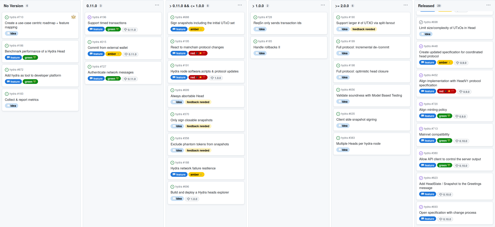
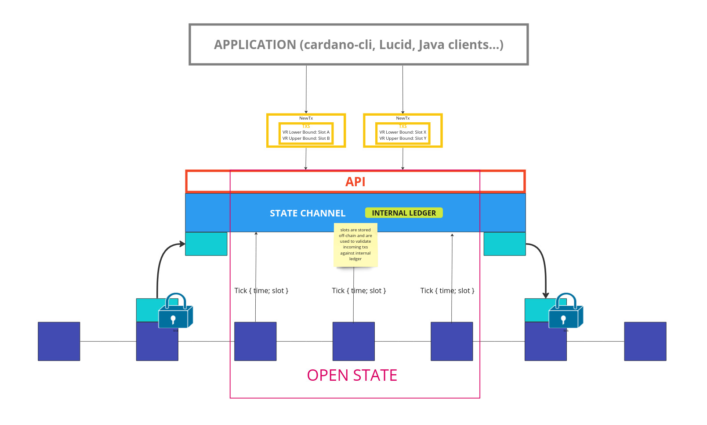
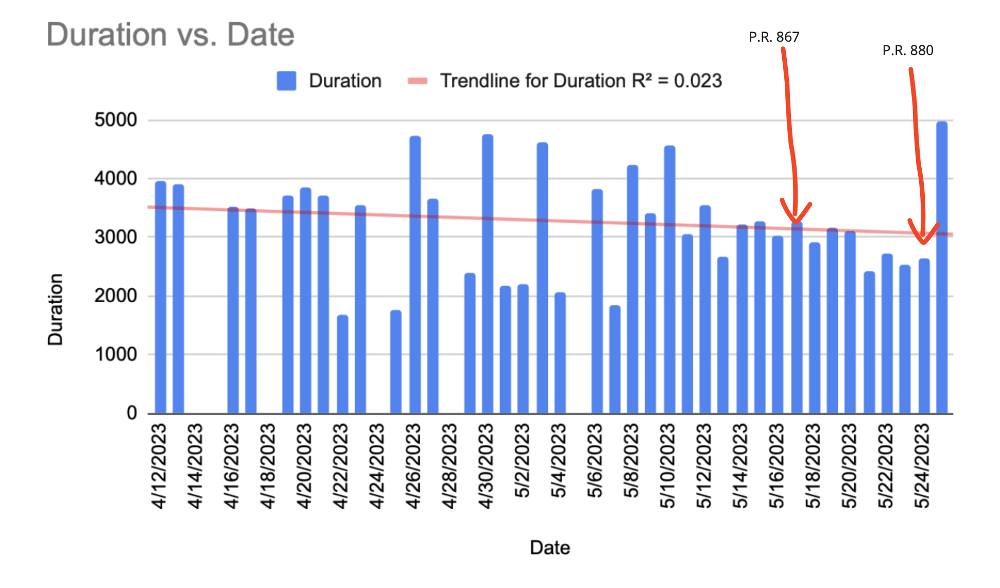
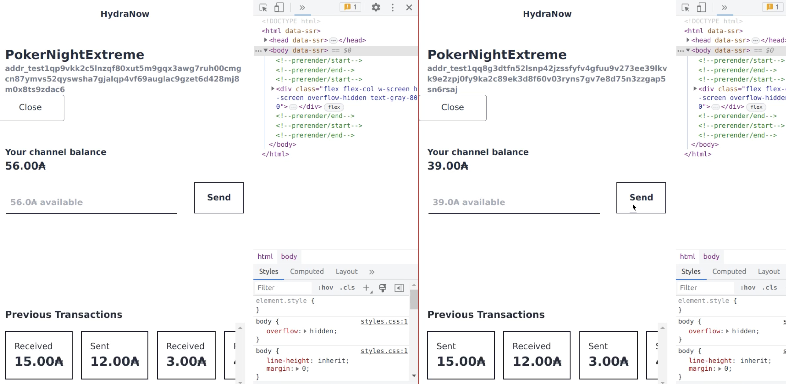

This report summarizes the work on Hydra since April 2023. It serves as
preparation for the monthly review meeting (see [slides][slides] and
[recording][recording]), where the team updates project stakeholders on recent
developments to gather their feedback on proposed plans.

## Roadmap

This month the team released version 0.10.0 which includes many important features.
The project [roadmap](https://github.com/orgs/input-output-hk/projects/21) was
only slightly updated this month and already saw one more feature completed:

<small>
The roadmap without idea items
</small>

#### Release 0.10.0

- First mainnet compatible release of `hydra-node` including technical changes and documentation

- Mainnet exposure currently limited to 100₳ per participant

- Added some missing features to the client API (short-term solutions)

- Some quality of life improvements in running the `hydra-node`

- [Full release notes](https://github.com/input-output-hk/hydra/releases/tag/0.10.0) and a list of [delivered features](https://github.com/input-output-hk/hydra/milestone/8?closed=1)

#### Notable roadmap updates

- Got new input and a concrete scenario for benchmarking (off-chain) performance
  of a Hydra head. As it is a very basic one, we moved the item from an
  idea to a feature and started work on it.

- Added a new feature item to add Hydra as a tool to developer platforms within
  our agenda of [promoting Hydra as an open-source
  platform](https://hydra.family/head-protocol/monthly/2023-01#themes-for-2023)
  for scalability on Cardano.

- Already completed a first feature for 0.11.0 and considering whether to release it as
  early as possible with latest advances.

 <small>
The latest roadmap with features and ideas
</small>

## Development

[Issues and pull requests closed since last
report](https://github.com/input-output-hk/hydra/issues?q=is%3Aclosed+sort%3Aupdated-desc+closed%3A2023-04-26..2023-05-24)

This month, the team worked on the following:

#### Timed transactions [#196](https://github.com/input-output-hk/hydra/issues/196#)

To realize the Hydra Head protocol, a `hydra-node` observes and follows the
chain progress on the layer 1 (L1). Until now, this component was only observing
protocol related transactions. Now, on every block roll forward, a `Tick` event
carrying the notion of time from L1 is observed by the `hydra-node` and is used
to validate transactions in a Hydra head. This means that clients can submit
time bounded transactions to an open head and expect them to be validated using
the same slot that would be used on L1. It is important to mention that time
only advances on L1 when a block is produced.

 <small>
Timed transactions in a Hydra Head state channel
</small>

This feature will make the Hydra L2 ledger now en-par with UTXO features
available on the Cardano L1. A logical next step in this direction could be to
make time in the state channel advance every configured `slotLength` (e.g. every
second) using the system clock in between blocks as a form of [dead reckoning](https://en.wikipedia.org/wiki/Dead_reckoning).

#### Removing --ledger-genesis [#863](https://github.com/input-output-hk/hydra/pull/863)

The hydra-node had two command line options to configure the ledger used for validating layer 2 (L2) transactions: `--ledger-protocol-parameters` and `--ledger-genesis`. The former option, which is self-explanatory, allows configuration of the Cardano protocol parameters to be used. Often, the same parameters as those on L1 are configured, or similar parameters with reduced fees, for example. On the other hand, the second option required the `genesis-shelley.json` file previously used to initialize the Shelley era by the cardano-node.

When we started using the current slot in the L2 ledger (see above), we realized
that only the start time and slot length are effectively used from that
configuration file. Moreover, it would be quite surprising if those were
different and slots would be longer or shorter on L2 (unless explicitly
configured). We opted to remove the option altogether and have the `hydra-node`
fetch the genesis parameters from the Cardano network. This makes the system
easier to configure and more isomorphic to L1.

#### Improving CI runtime

The Hydra project [embraces Test Driven Development](./adr/12) and implements
[Continuous Integration](https://github.com/input-output-hk/hydra/actions/workflows/ci.yaml) (CI),
checking all these tests pass and more.

The CI could sometimes take as long as an hour or
more to run, which has a negative impact on the project's workflow.
For instance, all the project's branches have to be [fast-forward with
master](https://github.com/input-output-hk/hydra/wiki/Coding-Standards#merge-prs-with-merge-commits-and-rebase-branches-on-top-of-master)
before being merged.
So if all the tests on a branch are green and the pull request has been
approved but is lagging a bit behind master, it has to be rebased, so the
CI has to run again, incurring a one hour or so delay in this case before
being able to merge it. The situation becomes worse when several pull requests
are _ready_ to be merged.

Analyzing the run from [May, 10th](https://github.com/input-output-hk/hydra/actions/runs/4933005294)
we can see that:

- Building and testing takes 19 minutes for the longest
- Generating haddock documentation and running the benchmarks takes 28 minutes
  for the longest
- Documentation (which will need artifacts generated in previous steps) will take
  14 minutes
- In total, this run took 1 hour and 16 minutes.

Let's focus on the build and the testing stage first. We're expecting the
plutus-merkle-tree to run fast but [it took 8 minutes and 52
seconds](https://github.com/input-output-hk/hydra/actions/runs/4933005294/jobs/8816564512)
, 7m and 11 seconds being spent setting up the build environment.
In other words, 81% of the build time is downloading binary dependencies from some nix cache.

Compiling the code requires cabal and other nix dependencies that will trigger
massive downloads. Instead, let's, straight on, run the tests with nix and let
nix decide what needs to be compiled. Sometimes, most of the code will not have
changed and the test binary will already be available in some nix cache to be run
without any compilation step.

This has been done in [#867](https://github.com/input-output-hk/hydra/pull/867).
Merging this PR, the [build on master took 45
minutes](https://github.com/input-output-hk/hydra/actions/runs/5003046049) and,
specifically, the same [plutus-merkle-tree
job](https://github.com/input-output-hk/hydra/actions/runs/5003046049/jobs/8963773583)
only took 1 minute and 44 seconds, only 20% of the time observed before.

Then, let's focus on documentation (14 minutes). Most of the time spent by this
process is website optimization. It makes sense for the documentation that will
actually be published on the website (master or release). But what about all
the builds in branches for which the website will never be published?
We need to keep this documentation step in branches because it gives us sanity
checks, preventing broken links, for instance. But we can definitely remove the
optimization step.

This has been done in [#880](https://github.com/input-output-hk/hydra/pull/880)
and it [saves 10 minutes](https://github.com/input-output-hk/hydra/actions/runs/5067084637/jobs/9098252031)
from this step.

Our first goal was to reduce CI execution time when pushing
on branches and this has been improved. We're now having execution time
significantly under 30 minutes where it used to be 45 minutes or even an hour.

We had some issues with compilation output, obfuscated by nix, which have been
solved by [#889](https://github.com/input-output-hk/hydra/pull/889).

Every morning, we rebuild our master branch and we can observe the whole
execution time on the following graph (in seconds):

 <small>
C.I. execution total execution time
</small>

Although we observed performance improvements on branches CI execution time,
master execution time has not been reduced that much. We may save 10 minutes
from the documentation step because optimizing the _unstable_ documentation is
maybe not worthwhile.
But what's more problematic here is the process variability.

This variability can be explained by nix cache misses. That's something we need
to investigate. It's hard to optimize a process with buffers, especially here
where in case of a cache miss, recompilation has to happen and takes time.
So every cache miss introduces several minutes of overhead which explains why we
observe so much variation between two days with this master execution time.

Next steps:

- Inspect why we have an unexpected random cache miss
- Improve haddock generation time (15 minutes)
- Reduce bench time (we probably don't want to run the whole benchmark suite for
  every single commit, or a smaller one)
- Focus on the changed area (do not compile everything to generate the monthly
  report)

## Community

#### Hydrozoa [#850](https://github.com/input-output-hk/hydra/discussions/850)

This month, the project saw a new kind of contribution from the community.
@GeorgeFlerovsky has written a research piece about an adaptation of the
(Coordinated) Hydra Head protocol into a new flavor - Hydrozoa. The article is
currently being examined and [discussed on
GitHub](https://github.com/input-output-hk/hydra/discussions/850). Feedback so
far has been positive. Of course, one does not simply change the Hydra Head
protocol (pun intended), but the ideas contained could drive evolution and
be followed up with concrete protocol extensions. Very much like the ideas
presented in the original paper.

#### Hydra for Payments project update

In this collaborative effort between IOG and ObsidianSystems, we are pushing the
frontiers of using Hydra in payment use cases. It will lower the entry barrier
for developers and ultimately users to leverage Hydra L2 for sending
and receiving ada and Cardano native assets with very low fees and sub-second
finality.

The project is in its second phase where the open-source
[hydra-pay](https://github.com/obsidiansystems/hydra-pay) library is being
expanded with necessary features while the team pushes for building a
dedicated mobile application.

With the recently released hydra-pay version
[0.2.0](https://github.com/obsidiansystems/hydra-pay/releases/tag/v0.2.0), an
end-to-end workflow of the Android App nicknamed "HydraNow" can be realized.
This app will act as a layer 2 wallet quite like a Bitcoin Lightning Wallet and
drives feature development in both `hydra-pay` and `hydra` in the background.

 <small>
Two instances of HydraNow (in browser) connected via a hydra-pay channel
</small>

#### Spanish translation

Last, but not least, we would like to thank @Agustinblockchain for their
contribution of a [Spanish translation #866](<https://github.com/input-output-hk/hydra/pull/866>)
of the [hydra.family website](https://hydra.family/head-protocol/unstable/es/) 🇪🇸 🎉

## Conclusion

The monthly review meeting for May was held on 2023-05-24 via Google Meet with
these [slides][slides] and here is the [recording][recording].

The monthly review meeting was lively and we had stakeholders from IOG as well
as interested community members join. They were well served by two very nice
demos shown by ObsidianSystems and IOG teams.

After having dealt with some issues last month, we are happy to have
the first mainnet-capable version released and have already another feature
completed this month.

It is great to see that more and more contributors from the community are
stepping up to become advocates of the technology. A community is forming and we
realize that the project could need some help from someone dedicated to keep
track of all the great things happening. What a great problem to have!

[slides]: https://docs.google.com/presentation/d/1anUC3Z1idloyR6uwiSHLZtV6-LQvUcByHPMUgCBOVIA
[recording]: https://drive.google.com/file/d/1_N6b4RDe579TgLawiJzbE0NLofD3ljE6/view
