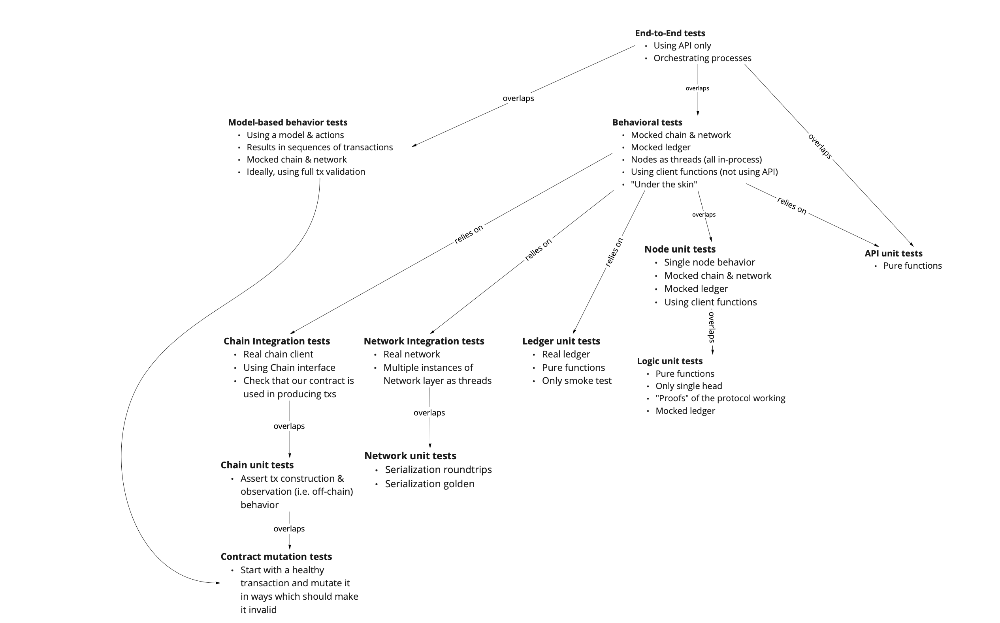

This report summarizes the work on Hydra since April 2023. It serves as
preparation for the monthly review meeting (see [slides][slides] and
[recording][recording]), where the team updates project stakeholders on recent
developments to gather their feedback on proposed plans.

## Roadmap

This month we released version 0.10.0 which includes many important features.
The project [roadmap](https://github.com/orgs/input-output-hk/projects/21) was
only slightly updated this month and already saw one more feature completed:

 <small>
The roadmap without idea items
</small>

#### Release 0.10.0

- First mainnet compatible release of `hydra-node` including technical changes and documentation

- Mainnet exposure currently limited to 100₳ per participant

- Added some missing features to the client API (short-term solutions)

- Some quality of life improvements in running the `hydra-node`

- [Full release notes](https://github.com/input-output-hk/hydra/releases/tag/0.10.0) and list of [delivered features](https://github.com/input-output-hk/hydra/milestone/8?closed=1)

#### Notable roadmap updates

- Got new input and concrete scenario for benchmarking (off-chain) performance
  of a Hydra Head. As it is a very basic one, we conretized the item from an
  idea to a feature and started work on it.

- Added a new feature item to add Hydra as tool to developer platforms within
  our agenda of [promoting Hydra as an open-source
  platform](https://hydra.family/head-protocol/monthly/2023-01#themes-for-2023)
  for scalability on Cardano.

- Already completed a first feature for 0.11.0 and considering to release it as
  early as possible with latest advances.

 <small>
The latest roadmap with features and ideas
</small>

## Development

[Issues and pull requests closed since last
report](https://github.com/input-output-hk/hydra/issues?q=is%3Aclosed+sort%3Aupdated-desc+closed%3A2023-04-26..2023-05-24)

This month, the team worked on the following:

#### Removing --ledger-genesis

Why and how...

#### Timed transactions

As part of the machinary hydra uses to work there is a component which observes and follows the chain progress.
Until now, this component was only observing protocol related transactions.
Now, on every block roll forward, a Tick, carrying the notion of time on L1, is observed by the head and its used to extend its internal ledger capabilities during transaction validations.
The idea is that cliens should be able to submit time bounded transactions to an open head and expect them to be validated using the current slot on L1.

#### External commits?

#### Improving CI runtime

The hydra project [embraces Test Driven Development](./adr/12) and our code is quite covered, at several level.
You may already have seen our test pyramid.

 <small>
Testing pyramide
</small>

Although we expect the tests to be executed locally on developers' machines, we also implement a
[Continuous Integration](https://github.com/input-output-hk/hydra/actions/workflows/ci.yaml),
checking all these tests still pass and more.

This is fine until you realiza that your C.I. can take as long as an hour or more and it has subtle
implications on your workflow. A first, obvious, impact for us is that we want all our branches to be
[fast-forward with master](https://github.com/input-output-hk/hydra/wiki/Coding-Standards#merge-prs-with-merge-commits-and-rebase-branches-on-top-of-master)
before merging them. In practice, imagine your pull request is all green, everybody approves it
and all the tests pass but it's lagging a bit behind master. You'll have to rebase your branch
and wait for C.I. to prove it still works before merging. Know imagine your C.I. takes an hour or more
and you have more than one branch to merge... you can always feel it, don't you?

So let's see what's going on there and let's take a look at this run from
[may the 10th](https://github.com/input-output-hk/hydra/actions/runs/4933005294):
- Building and testing takes 19 minutes for the longest
- Generating haddock documentation and running the benchmarks takes 28 minutes for the longest
- documentation (which will need artifact generated in previous steps) will take 14 minutes
- In total, this run took 1 hour and 16 minutes.

Our first focus has been on the build and test stage. We're expecting the plutus-merkle-tree to
run fast but [it took 8 minutes and 52 seconds](https://github.com/input-output-hk/hydra/actions/runs/4933005294/jobs/8816564512)
and if we look in detail, we can see that 7m and 11 seconds have been spent setting up the build
environment. Stated otherwise, 81% of the build time is downloading binary dependencies from some
nix cache. How can we reduce the size of our dependencies?

If we want to compile our code and run the test, we need cabal and other nix dependencies that
will download _the world_ before doing anything. But what if we decide to, straight on, run the
test with nix and let it decide what it needs to compile because, maybe, most of our code did
not change, the test binary is already available in some cache and we just run it!

This what we did in [#867](https://github.com/input-output-hk/hydra/pull/867). Merging this P.R.
the [build on master took 45 minutes](https://github.com/input-output-hk/hydra/actions/runs/5003046049)
and, specifically, the same
[plutus-merkle-tree job](https://github.com/input-output-hk/hydra/actions/runs/5003046049/jobs/8963773583)
only took 1 minute and 44 seconds, only 20% of the time observed before.

Then we decided that we wanted to spend less time on documentation (14 minutes, remember). It happened
that most of the time spent by this process is web-site optimization. That's fine for master because
we want to publish an optimized web-site. But what about all the builds in branches for which the
web-site will never be published? We need to keep this documentation step in branches because it
also provide us security by checking that we didn't introduce too much mess in the doc, like
broken links, for instance. But we definitely got rid of the optmization step.

That is what we did in [#880](https://github.com/input-output-hk/hydra/pull/880) and it helped up
[save 10 minutes from this step](https://github.com/input-output-hk/hydra/actions/runs/5067084637/jobs/9098252031).

Our first goal was to reduce coninuous integration execution time when pushing on branches and this has
been improved. We're now having execution time significantly under 30 minutes where it used to be
45 minutes or event an hour.

We had some issue with compilation output, swallowed by nix, which have been solved by
[#889](https://github.com/input-output-hk/hydra/pull/889).

Every morning, we rebuild our master branch and we can observe the whole execution time on the
following graph (in seconds):

 <small>
C.I. exceution total execution time
</small>

Although we got performance improvement on branches C.I. execution time, we don't observe so much
benefit when we look at execution time on master. We can save some time on the documentation step
because, after all, we don't care about optimizing the web-site for the unstable version to probably
save 10 minutes. But what's more problematic here is the process variability.

This variability can be explained by nix cache misses. That's something we need to investigate.
It's hard to optimize a process with buffer and we do have quite some buffer in place here and
in case of a cache miss, it means we have to recompile everything and it happens that compiling
takes time for us. So every cache miss introduce several minutes of overhead which explain why
we observe so much variations between two days with this master excution time.

Next steps:
- Why do we have random cache miss that we do not expect?
- Improve haddock generation time (15 minutes)
- reduce bench time (we probably don't want to run the whole benchmark suite for every single commit, or a smaller one)
- focus on changed area (do not compile everything to generate the monthly report)

#### Operational concerns?

Log size, ops instructions page?...

## Community

#### Hydra for Payments

Latest developments and summarize progress?...

#### Hydrozoa?

Quickly mention community research contribution and how we are intend to treat it...

#### Spanish translation?

## Conclusion

The monthly review meeting for May was held on 2023-05-24 via Google Meet with
these [slides][slides] and here is the [recording][recording].

TODO...

[slides]: https://docs.google.com/presentation/d/1anUC3Z1idloyR6uwiSHLZtV6-LQvUcByHPMUgCBOVIA
[recording]: https://hydra.family/TODO
