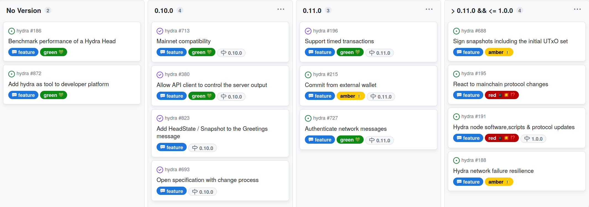

This report summarizes the work on Hydra since April 2023. It serves as
preparation for the monthly review meeting (see [slides][slides] and
[recording][recording]), where the team updates project stakeholders on recent
developments to gather their feedback on proposed plans.

## Roadmap

This month we released version 0.10.0 which includes many important features.
The project [roadmap](https://github.com/orgs/input-output-hk/projects/21) was
only slightly updated this month and already saw one more feature completed:

 <small>
The roadmap without idea items
</small>

#### Release 0.10.0

- First mainnet compatible release of `hydra-node` including technical changes and documentation

- Mainnet exposure currently limited to 100₳ per participant

- Added some missing features to the client API (short-term solutions)

- Some quality of life improvements in running the `hydra-node`

- [Full release notes](https://github.com/input-output-hk/hydra/releases/tag/0.10.0) and list of [delivered features](https://github.com/input-output-hk/hydra/milestone/8?closed=1)

#### Notable roadmap updates

- Got new input and concrete scenario for benchmarking (off-chain) performance
  of a Hydra Head. As it is a very basic one, we conretized the item from an
  idea to a feature and started work on it.

- Added a new feature item to add Hydra as tool to developer platforms within
  our agenda of [promoting Hydra as an open-source
  platform](https://hydra.family/head-protocol/monthly/2023-01#themes-for-2023)
  for scalability on Cardano.

- Already completed a first feature for 0.11.0 and considering to release it as
  early as possible with latest advances.

 <small>
The latest roadmap with features and ideas
</small>

## Development

[Issues and pull requests closed since last
report](https://github.com/input-output-hk/hydra/issues?q=is%3Aclosed+sort%3Aupdated-desc+closed%3A2023-04-26..2023-05-24)

This month, the team worked on the following:

#### Removing --ledger-genesis

Why and how...

#### Timed transactions

As part of the machinary hydra uses to work there is a component which observes and follows the chain progress.
Until now, this component was only observing protocol related transactions.
Now, on every block roll forward, a Tick, carrying the notion of time on L1, is observed by the head and its used to extend its internal ledger capabilities during transaction validations.
The idea is that cliens should be able to submit time bounded transactions to an open head and expect them to be validated using the current slot on L1.

#### External commits?

#### Improving CI runtime?

Compile tests with nix, other findings? include graphs produced...

#### Operational concerns?

Log size, ops instructions page?...

## Community

#### Hydra for Payments

Latest developments and summarize progress?...

#### Hydrozoa?

Quickly mention community research contribution and how we are intend to treat it...

#### Spanish translation?

## Conclusion

The monthly review meeting for May was held on 2023-05-24 via Google Meet with
these [slides][slides] and here is the [recording][recording].

TODO...

[slides]: https://docs.google.com/presentation/d/1anUC3Z1idloyR6uwiSHLZtV6-LQvUcByHPMUgCBOVIA
[recording]: https://hydra.family/TODO
