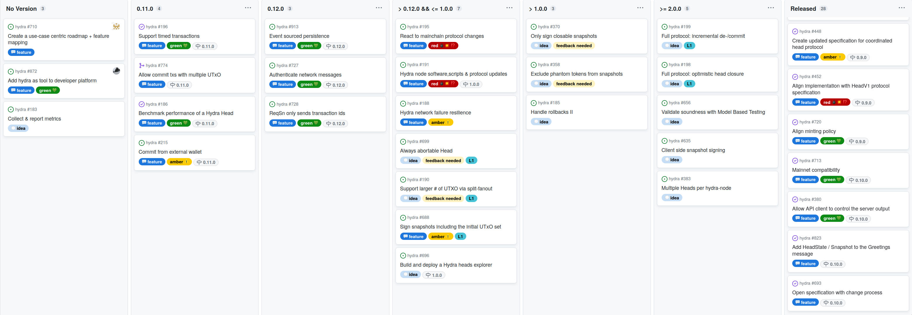

This report summarizes the work on Hydra since May 2023. It serves as
preparation for the monthly review meeting (see [slides][slides] and
[recording][recording]), where the team updates project stakeholders on recent
developments to gather their feedback on proposed plans.

## Roadmap

This month ...

 <small>
The roadmap without idea items
</small>

#### Notable roadmap updates

- ...

 <small>
The latest roadmap with features and ideas
</small>

## Development

[Issues and pull requests closed since last
report](https://github.com/input-output-hk/hydra/issues?q=is%3Aclosed+sort%3Aupdated-desc+closed%3A2023-05-24..2023-06-22)

This month, the team worked on the following:

#### Commits with multiple UTxO [#774](https://github.com/input-output-hk/hydra/issues/774)

...

#### Commits from external wallet [#215](https://github.com/input-output-hk/hydra/issues/215)

- Break this down into it's constituents
- Option A/B?
- Explain what is already done and what not

#### Benchmark performance of Hydra Head [#186](https://github.com/input-output-hk/hydra/issues/215)

- What did we do here? What's the result?
- Including new "Event source persistence" outcome

## Community

#### Hydra for Auctions contributions and closing of project

- Multiple issues and PRs from closing out the project
- What's the delivered final capability / demo?

#### Hydra for Payments project update?

- Again?

## Conclusion

The monthly review meeting for May was held on 2023-06-22 via Google Meet with
these [slides][slides] and here is the [recording][recording].

...

[slides]: https://docs.google.com/presentation/d/1TVzjaFKXBi9DAugSd2L8MSUSZGIU9EjTmwf6yccckPI
[recording]: https://hydra.family
