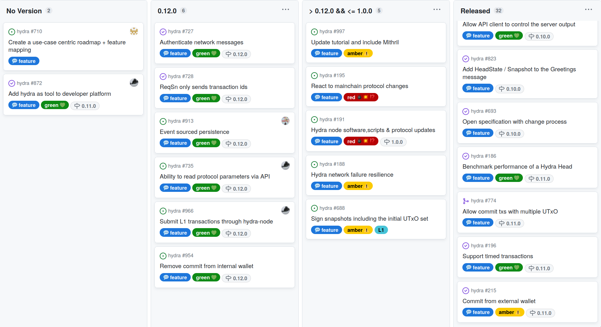
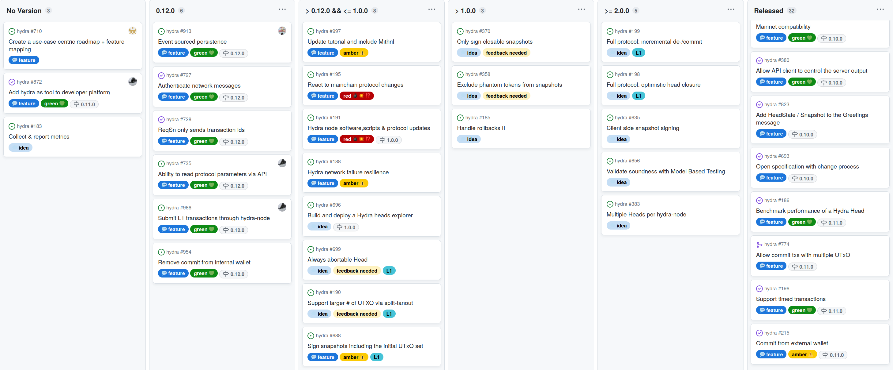

This report summarizes the work on Hydra since June 2023. It serves as
preparation for the monthly review meeting (see [slides][slides] and
[recording][recording]), where the team updates project stakeholders on recent
developments to gather their feedback on proposed plans.

## Roadmap

This month the team released version 0.11.0 which shifts the way Hydra clients
need to interact with the hydra-node when commiting funds. The project
[roadmap](https://github.com/orgs/input-output-hk/projects/21) was also updated
to reflect latest ideas from an even higher level project plan that is updated
quarterly:

 <small>
The roadmap without idea items
</small>

#### Release 0.11.0

- Completes the L2 ledger isomorphism with timed transaction support

- Adds commit from external wallets API, which allows to

  - Commit multiple UTxO
  - Commit from scripts
  - Commit directly from any key

- Deprecated: Internal commits via the websocket API

- [Full release notes](https://github.com/input-output-hk/hydra/releases/tag/0.11.0) and a list of [delivered features](https://github.com/input-output-hk/hydra/milestone/11?closed=1)

#### Notable updates

TODO summarize differences

TODO write about high-level project plan (starmap)?

 <small>
The latest roadmap with featuresand ideas
</small>

## Development

[Issues and pull requests closed since last
report](https://github.com/input-output-hk/hydra/issues?q=is%3Aclosed+sort%3Aupdated-desc+closed%3A2023-06-22..2023-07-28)

This month, the team worked on the following:

#### Authenticate network messages [#727](https://github.com/input-output-hk/hydra/issues/727)

The Hydra Head protocol paper states:

> Each party then establishes pairwise authenticated channels to all other parties.

[Hydra: Fast Isomorphic State Channels, p.14](https://eprint.iacr.org/2020/299.pdf)

Guaranteeing the authenticity and integrity of the messages received from one's
peers is critical to the security of the Head protocol. While this is something
that we initially thought to defer to the transport layer, eg. leaving it to
Hydra node operators to use TLS or other kind of encrypted channels to
communicate with their peers, we realised this introduced an additional unneeded
operational burden on operators.

It appeared simple enough to reuse the existing Hydra keys (using Ed25519
curve), which need to be passed to the node, to:

- _sign_ all messages sent to peers,
- _verify_ all messages received from peers.

The net benefit of this feature is to increase the life expectancy of a Head,
preventing some forms of _Denial of Service_ attacks or wrongly configured nodes
that would lead to a _stalled head_.

#### ReqSn only sends Transaction IDs [#728](https://github.com/input-output-hk/hydra/issues/728)

This is another feature which better aligns the current implementation with the
original paper, by requesting snapshots using only the transaction identifiers
and not the full transaction.

The motivation to implement this feature came from different directions:

- Improve the performance of the protocol by reducing the bandwidth usage,
- Make it possible to have "atomic" transaction sets submitted
  ([#900](https://github.com/input-output-hk/hydra/issues/900)),
- Prevent "front-running" from the current leader which, in the previous
  implementation, could inject arbitrary (but valid) transactions that peers had
  never seen before into a snapshot.

`ReqSn`'s snapshots now contains only the list of transaction ids and each
hydra-node validates the snapshot by resolving those ideas against the set of
transactions they have seen (through `ReqTx`). A consequence is that this
introduces the possibility of space leak in the event a submitted valid
transaction never gets included in a snapshot, but we thought this should not be
a problem in practice.

Note the
[specification](https://hydra.family/head-protocol/core-concepts/specification)
has been updated to reflect this change.

#### Github security advisories

We discovered a bug in the multisignature verification which could compromise
off-chain security of a Hydra Head. Although the fix was quite simple, we
decided to use a new Github feature to create the first [Github Security
Advisory](https://github.com/input-output-hk/hydra/security/advisories/GHSA-c8qp-cv4h-vcc4)
for Hydra.

The process creates a separate github repository where potential security issues
could be discussed in privacy (between the reporter and the maintainers) since
potential attackers should not be aware of any issues until they are fixed. The
team scored this issue using CVSS (The Common Vulnerability Scoring System), the
score was moderate (5.5), and they didn't request a CVE (Common Vulnerabilities
and Exposures) for this (yet).

The process overall works nice but Hydra CI is not checking the builds in these
private, one-off forks so there is a risk of merging code that doesn't compile.

#### Moving to GHC 9.2.7 [#841](https://github.com/input-output-hk/hydra/pull/841)

GHC 9.2 series have been around for more than a year and the whole cardano ecosystem is gradually moving to use this new compiler version. Moreover, GHC 8.10.7 does not work reliably on aarch64 architectures, eg. Mac M1/M2.

Moving to this new version entailed some significant changes in the code and also in the Plutus scripts:

| Name     | After (Bytes) | Before (Bytes) | Δsize |
| -------- | ------------- | -------------- | ----- |
| νInitial | 4289          | 4621           | - 7%  |
| νCommit  | 2124          | 2422           | - 12% |
| νHead    | 9185          | 8954           | + 3%  |
| μHead    | 4149          | 4458           | -7%   |

## Community

TODO Master-class preparation for Rare Evo
TODO Catalyst fund10 proposals and our stance to them?

## Conclusion

The monthly review meeting for May was held on 2023-07-26 via Google Meet with
these [slides][slides] and here is the [recording][recording].

TODO

[slides]: https://docs.google.com/presentation/d/1CQYAFztRcqofN6sbowg37QuXQ-DQU4NcDmoMghS36B8
[recording]: https://drive.google.com/file/d/14ANZ3efuxgXpYK94EBWxZLR9TtN7voru/
