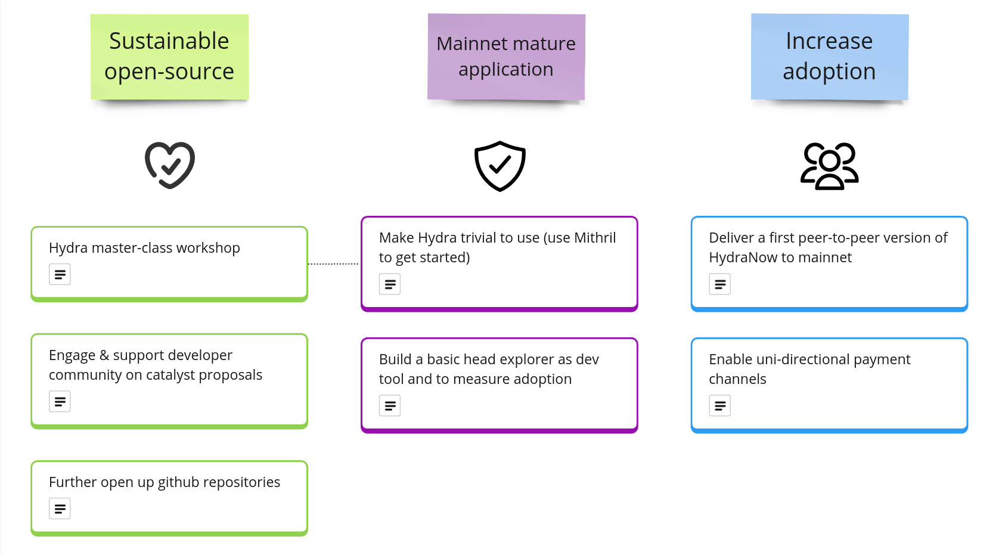

This report summarizes the work on Hydra since June 2023. It serves as
preparation for the monthly review meeting (see [slides][slides] and
[recording][recording]), where the team updates project stakeholders on recent
developments to gather their feedback on proposed plans.

### Starmap update

Every couple months, we reflect on the the themes we identified for 2023 (as
presented in [January](./2023-01.md#themes-for-2023)), and create a very high
level list of possible deliverables which could bring us closer to our goals,
e.g. using [impact maps](./img/2022-11-impact.png). This time we have come up
with the following items:

- Sustainable open-source :green_heart:

  - **Hydra master-class workshop**: A concrete session we aim to conduct in an
    upcoming event or online as a fallback. This will also be a motivation to
    update our already existing tutorials and improve the first start
    experience.

  - **Engage & support developer community on catalyst proposals**: There are
    around 30 proposals mentioning Hydra in the current catalyst funding round
    and we want to review, comment, try to align and maybe even promote some
    proposals. The goal here is to provide a platform to the many new ideas out
    there, while avoiding fragmentation and maximum re-use of work across the
    space.

  - **Further open up github repositories**: we want to provide a welcoming
    experience to non-IOG contributors and provide an easy to navigate space of
    repositories relating to Hydra.

- Mainnet mature application :purple_heart:

  - **Make Hydra trivial to use**: Improving user and developer experience,
    enabling a quick and frictionless setup of Hydra, likely also involving
    Mithril to get started. Goal is to be able to open a distributed hydra head
    with two nodes on a testnet within a few minutes; end-to-end!

  - **Build a basic head explorer**: In the past we experimented with an
    explorer already, but this time we want to set it up persistently. Not only
    to measure adoption of Hydra, but primarily as a tool for app developers and
    eventually a visualization for end users to start answering questions like
    "who is running this head?"

- Drive adoption :blue_heart:

  - **Deliver a first version of HydraNow to mainnet**: Although ambitious, we
    think it's important that the very promising use case of payments using
    Hydra is made available to first users on mainnet. Concretely, this would be
    the mobile application "HydraNow" which uses a `hydra-pay` service to enable
    peer-to-peer payment channels.

  - **Enable uni-directional payment channels**: This will expand the
    capabilities of any payment channel created using Hydra to allow deposits &
    withdrawals while keeping the Head open.

You will find work packages related to these items pop up on our technical
roadmap (especially [this view](https://github.com/orgs/input-output-hk/projects/21/views/26)) and as things we do in the community.

## Roadmap

This month the team released version 0.11.0 which shifts the way Hydra clients
need to interact with the hydra-node when commiting funds. The project
[roadmap](https://github.com/orgs/input-output-hk/projects/21) was also updated
to reflect latest developments and ideas from the starmap:

 <small>
The roadmap without idea items
</small>

#### Release 0.11.0

- Completes the L2 ledger isomorphism with timed transaction support

- Adds commit from external wallets API, which allows to

  - Commit multiple UTxO
  - Commit from scripts
  - Commit directly from any key

- Deprecated: Internal commits via the websocket API

- [Full release notes](https://github.com/input-output-hk/hydra/releases/tag/0.11.0) and a list of [delivered features](https://github.com/input-output-hk/hydra/milestone/11?closed=1)

#### Notable updates

- Two new items \__elevated_ from user ideas and both improving the API capabilities:

  - [Ability to read protocol parameters via API
    #735](https://github.com/input-output-hk/hydra/issues/735)
  - [Submit L1 transactions through hydra-node #966](https://github.com/input-output-hk/hydra/issues/966)

- [Removing commit from internal wallet #954](Submit L1 transactions through
  hydra-node#954) is a consequence of deprecating this functionality in the
  previous 0.11.0 release. This will make the code base and documentation
  cleaner as there will be only one way to commit funds to a head.

- First new item derived from the starmap is to [Update tutorial and include
  Mithril #997](https://github.com/input-output-hk/hydra/issues/997). The
  tutorial is already a bit outdated, we want to slim it down and incorporate
  Mithril to get the fastest (secure) bootstrap possible of a `hydra-node`.

- As we are focusing on the very concrete use case of payments for mainnet
  deployment (and hence 1.0.0 release), multiple items need to (and can!) get
  reprioritized to match the requirements of this use case.

 <small>
The latest roadmap with features and ideas
</small>

## Development

[Issues and pull requests closed since last
report](https://github.com/input-output-hk/hydra/issues?q=is%3Aclosed+sort%3Aupdated-desc+closed%3A2023-06-22..2023-07-28)

This month, the team worked on the following:

#### Authenticate network messages [#727](https://github.com/input-output-hk/hydra/issues/727)

The Hydra Head protocol paper states:

> Each party then establishes pairwise authenticated channels to all other parties.

[Hydra: Fast Isomorphic State Channels, p.14](https://eprint.iacr.org/2020/299.pdf)

Guaranteeing the authenticity and integrity of the messages received from one's
peers is critical to the security of the Head protocol. While this is something
that we initially thought to defer to the transport layer, eg. leaving it to
Hydra node operators to use TLS or other kind of encrypted channels to
communicate with their peers, we realised this introduced an additional unneeded
operational burden on operators.

It appeared simple enough to reuse the existing Hydra keys (using Ed25519
curve), which need to be passed to the node, to:

- _sign_ all messages sent to peers,
- _verify_ all messages received from peers.

The net benefit of this feature is to increase the life expectancy of a Head,
preventing some forms of _Denial of Service_ attacks or wrongly configured nodes
that would lead to a _stalled head_.

#### ReqSn only sends Transaction IDs [#728](https://github.com/input-output-hk/hydra/issues/728)

This is another feature which better aligns the current implementation with the
original paper, by requesting snapshots using only the transaction identifiers
and not the full transaction.

The motivation to implement this feature came from different directions:

- Improve the performance of the protocol by reducing the bandwidth usage,
- Make it possible to have "atomic" transaction sets submitted
  ([#900](https://github.com/input-output-hk/hydra/issues/900)),
- Prevent "front-running" from the current leader which, in the previous
  implementation, could inject arbitrary (but valid) transactions that peers had
  never seen before into a snapshot.

`ReqSn`'s snapshots now contains only the list of transaction ids and each
hydra-node validates the snapshot by resolving those ideas against the set of
transactions they have seen (through `ReqTx`). A consequence is that this
introduces the possibility of space leak in the event a submitted valid
transaction never gets included in a snapshot, but we thought this should not be
a problem in practice.

Note the
[specification](https://hydra.family/head-protocol/core-concepts/specification)
has been updated to reflect this change.

#### Github security advisories

We discovered a bug in the multisignature verification which could compromise
off-chain security of a Hydra Head. Although the fix was quite simple, we
decided to use a new Github feature to create the first [Github Security
Advisory](https://github.com/input-output-hk/hydra/security/advisories/GHSA-c8qp-cv4h-vcc4)
for Hydra.

The process creates a separate github repository where potential security issues
could be discussed in privacy (between the reporter and the maintainers) since
potential attackers should not be aware of any issues until they are fixed. The
team scored this issue using CVSS (The Common Vulnerability Scoring System), the
score was moderate (5.5), and they didn't request a CVE (Common Vulnerabilities
and Exposures) for this (yet).

The process overall works nice but Hydra CI is not checking the builds in these
private, one-off forks so there is a risk of merging code that doesn't compile.

#### Moving to GHC 9.2.7 [#841](https://github.com/input-output-hk/hydra/pull/841)

GHC 9.2 series have been around for more than a year and the whole cardano ecosystem is gradually moving to use this new compiler version. Moreover, GHC 8.10.7 does not work reliably on aarch64 architectures, eg. Mac M1/M2.

Moving to this new version entailed some significant changes in the code and also in the Plutus scripts:

| Name     | After (Bytes) | Before (Bytes) | Δsize |
| -------- | ------------- | -------------- | ----- |
| νInitial | 4289          | 4621           | - 7%  |
| νCommit  | 2124          | 2422           | - 12% |
| νHead    | 9185          | 8954           | + 3%  |
| μHead    | 4149          | 4458           | -7%   |

## Community

### Hydra master-class

As already mentioned above in our starmap update, we aim to be having an educational session at the upcoming Rare Evo event:

> Whether you are building decentralized applications which need to be fast and scale well, or you are creating infrastructure for other builders on Cardano, we will show you how to use Hydra to make your applications and platforms utilize fast off-chain transaction processing via the Hydra Head protocol.
>
> In this session you will learn what Hydra is all about, how to build scalable applications in a live coding session, get to know the hydra-pay and hydra-auction projects, and be guided through exercises to get your hands on these APIs and early SDKs.

We are currently putting together a detailed outline and will send out
communications on how to register to this exclusive session within the next 1-2
weeks. Stay tuned!

## Conclusion

The monthly review meeting for May was held on 2023-07-26 via Google Meet with
these [slides][slides] and here is the [recording][recording].

Although we would have prepared an _awesome_ demo for this months review meeting
in which we hack a Hydra Head without the authenticated messages feature,
but unfortunately we had some live demo problems (never forget: record a
backup!). While we might show it next time still, this just further highlights
that we have reason to improve the developer and user experience still.

Not much questions on our journey to mature the Hydra software stack further to
support various use cases building on it. However, the recently kicked-off
Fund10 of catalyst sparked a nice discussion of how to handle all this great new
ideas while being conscious of not fragmenting the scaling efforts too much.

Open protocols mean that new ideas can be incorporated not only to the various
code bases, but also to the specification and standards which ensure
interoperability. We discussed means to ensure adherence to standards in a
light-weight agile way and challenges of educating potential contributors in
specification-driven development.

Next month we'll be at RareEvo, but might have the monthly just before in a
hybrid session from Colorado. Until then, we'll make Hydra trivial to use and
get started on our new objectives.

[slides]: https://docs.google.com/presentation/d/1CQYAFztRcqofN6sbowg37QuXQ-DQU4NcDmoMghS36B8
[recording]: https://drive.google.com/file/d/14ANZ3efuxgXpYK94EBWxZLR9TtN7voru/
