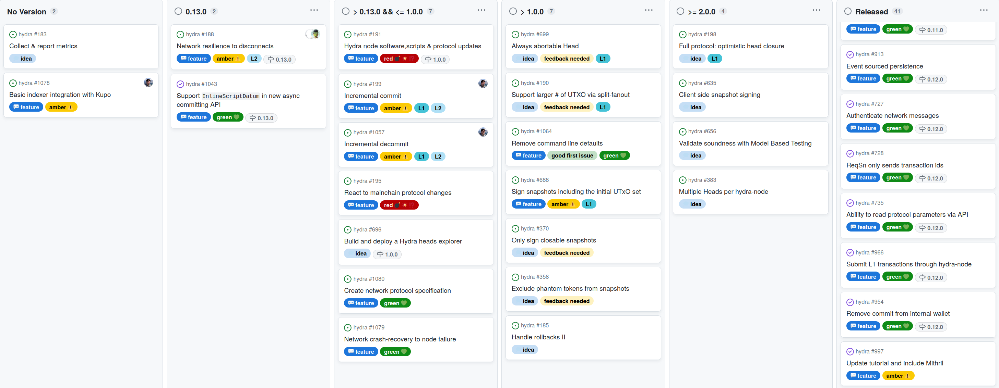

This report summarizes the work on Hydra since August 2023. It serves as
preparation for the monthly review meeting (see [slides][slides] and
[recording][recording]), where the team updates project stakeholders on recent
developments to gather their feedback on proposed plans.

## Roadmap

This month, the
[roadmap](https://github.com/orgs/input-output-hk/projects/21/views/7) has not
changed much as the team mostly clarified upcoming features.

 <small>
The latest roadmap with features and ideas
</small>

#### Notable updates

* Added and completed [support for inline datums in commit API #1043](https://github.com/input-output-hk/hydra/issues/1043), which was reported by a user.

* Current work on [network resilience #188](https://github.com/input-output-hk/hydra/issues/188) yielded two new / follow-up items [#1079](https://github.com/input-output-hk/hydra/issues/1079) and [#1080](https://github.com/input-output-hk/hydra/issues/1080). To minimize the 'scope creep' from this topic, the team has narrowed down the direct goal to improve the situation incrementally.

* When detailing the design of incremental de-/commits, the feature was also split in two. Each of the features would have a different impact on the user experience and relates to other ideas:

  * [Incremental commit #199](https://github.com/input-output-hk/hydra/issues/199) is a bit more complicated, but paves the way for directly open heads and could make [Always abortable head #699](https://github.com/input-output-hk/hydra/issues/699) redundant.

  * [Incremental decommit #1057](https://github.com/input-output-hk/hydra/issues/1057) is fairly straightforward and can be evolved into 'partial fanouts', which solves similar problems as the [split-fanout #190](https://github.com/input-output-hk/hydra/issues/190) and [only signing closable snapshots #370](https://github.com/input-output-hk/hydra/issues/370) would address. Also, the [optimistic head closure #198](https://github.com/input-output-hk/hydra/issues/198) feature is closely related to this item.

* Added a new feature to improve user journey of running the `hydra-node` by [removing the command line defaults #1064](https://github.com/input-output-hk/hydra/issues/1064). This came out of prior [idea discussion #454](https://github.com/input-output-hk/hydra/discussions/454) which highlights the life cycle of ideas and features on the Hydra project.

## Cardano Scaling workshop in Nantes, France

From 2023-09-12 to 2023-09-14, most of the _Scaling Tribe_ members, that is the two Hydra and Mithril teams, met for a three-day workshop in the beautiful French city of [Nantes](https://en.wikipedia.org/wiki/Nantes). This workshop was run following the [Open Space](https://openspaceworld.org/wp2/) technique which makes room for every participant to experiment and focus on what's of interest for them at the time while being engaging for the whole team. Here is a selection of topics covered that were most relevant to Hydra.

### Aiken validator experiment

As part of thw workshop, we explored how hard it would be to implement one of
the Hydra validators in `aiken`. After roughly 2 hours of work we had a
`hydra-node` running, tests passing and benchmarks of verifying one step in the
Hydra protocol using aiken.

The `hydra-node` just uses the UPLC binary and its hash to construct
transactions, we could rely on the same interface, with the difference that the
script binary gets produced by `aiken`. Aiken does produce a socalled blueprint
`plutus.json` containing the contract. We staged that file into git and embedded
it into a Haskell interface to be able to reference the compiled script as
`SerialisedScript` from `hydra-node`.

Next, we ported the simplest contract we have, namely the
[Commit](https://github.com/input-output-hk/hydra/blob/ec6c7a2ab651462228475d0b34264e9a182c22bb/hydra-plutus/src/Hydra/Contract/Commit.hs)
validator, [to
Aiken](https://github.com/input-output-hk/hydra/blob/4ec572511fc13a526b85efce3aac556ae5bd007c/hydra-plutus/validators/commit.ak).
This was fairly straight-forward and we test were passing after some fiddling
with internal representations of data strctures (`plutus-tx` is encoding triples
as `Constr` data on-chain).

The results? A significant reduction in script size, cpu and memory usage on
`collect` and `abort` transactions - or in different words, [doubling the
supported](https://github.com/input-output-hk/hydra/pull/1072#issuecomment-1717644108)
number of parties in a Head. 🎉

### Shallow cardano-node experiment

Running a hydra-node requires running a cardano-node, and running a
cardano-node requires synchronisation with the chain and about 150
gigabytes of data to be downloaded and verified, which is a
significant barrier to quickly spin-up hydra-node and Hydra
Heads. Given a Hydra node does not need to look at the history of the
chain, a _Shallow_ cardano-node that can run without the full database
of immutable files would be fine, assuming we can retrieve a recent
state of the chain with the same security guarantees than a fully
synchronised chain. This is exactly what Mithril can provide!

We ran a small experiment, trying to start a cardano-node manually
removing all but the last files from the _immutable DB_ and it worked
as long as one does not query the node for a block too old in the
past. This lead us to envision an improved user experience for
installing and running a hydra-node, by packaging it with a
cardano-node and a mithril-client to retrieve only the minimum needed
state and be able to start a fully functioning hydra-node in minutes.

### Other topics

* We continued working on [Kupo x
  Hydra](https://github.com/input-output-hk/hydra/issues/1078)
  integration, benefiting from the presence of Kupo's creator and
  former Hydra team member, Matthias Benkort
* We brainstormed possible synergies between the Hydra and Mithril
  projects, something that solidified into the desire to explore this
  concept of "Shallow node" and its integration within Hydra
* We discussed and clarified our new [Security Vulnerability
  Disclosure
  Policy](https://github.com/input-output-hk/hydra/pull/1088)
* Discussing the idea of a joint documentation effort, we realised the
  existing documentation of both teams could be improved, for example
  by following a [Standard documentation
  framework](https://documentation.divio.com).

## Hydra development

[Issues and pull requests closed since the last
report](https://github.com/input-output-hk/hydra/issues?q=is%3Aclosed+sort%3Aupdated-desc+closed%3A2023-08-29..2023-09-29)

This month, the team worked on the following:

#### Network resilience to disconnects [#188](https://github.com/input-output-hk/hydra/issues/188)

If a Hydra node crashes, it can recover its state from disk thanks to the
[event-sourced persistency](https://github.com/input-output-hk/hydra/pull/1000)
mechanism in place. But if a peer inside the head sends messages while the node
is down, these messages are lost for this node and this can well lead to the
head being stuck.

For instance, in the following picture, we see that if Bob was down when Alice
acknowledged snapshot 10, then it will wait forever for this acknowledgement and
will refuse to move forward with the head, making it stuck.

 <small>
Head stuck because of lost message
</small>

Hydra is designed to deal with non-cooperative peers in a very safe way:
close the head! And this situation could be generalized as a non cooperative
peer situation. So the safe move is to just close the head.

But practically speaking, closing the head every time a node restarts or a network
connection is interrupted can lead to an operations nightmare. So the question we're
exploring is, can we distinguish between non cooperative peer or just transient
communication issue?

* {ADR 27)[https://github.com/input-output-hk/hydra/blob/master/docs/adr/2023-09-08_027-network-resilience.md]
gives details about our current strategy
* [#1074](https://github.com/input-output-hk/hydra/pull/1074) is a first implementation of this strategy
* [#1080](https://github.com/input-output-hk/hydra/issues/1080) should specify the resulting network protocol so that others could implement compatible hydra nodes

#### Incremental commits and decommits [#199](https://github.com/input-output-hk/hydra/issues/199)

In the beginning of this month, some progress on incremental commits and
decommits was made. An early
[experiment](https://twitter.com/ch1bo_/status/1696067253089743289) about the
off-chain / node logic showed that we can re-use the `/commit` validator and
motivated design work on the feature items.

As mentioned above, the protocol extension was split into two items [Incremental
commits #199](https://github.com/input-output-hk/hydra/issues/199) and
[Incremental decommits

# [1057](<https://github.com/input-output-hk/hydra/issues/1057>). Both items contain

high-level description, interaction outline and a first design of the on-chain
validators which is currently getting discussed by the Hydra contributors and
researchers.

Especially the incremental commit is not trivial as the interaction between
layer 1 and layer 2 is quite intricate. Observing a deposit on the Cardano
mainchain may not be seen by all parties at the same time and this should not
lock up the layer 2 process of transactions, while premature usage of committed
funds is to be avoided. On the other hand, each step in the protocol needs to be
secure in presence of an adversary and unlocking of committed funds must always
be possible.

Once this validator design is clear, we can get started implementing one or both
of the features to enable more flexible usage of the Hydra head protocol.

#### Refactored chain state [#1049](https://github.com/input-output-hk/hydra/pull/1049)

Following up the implementation of ADR#24, this marks the first enhancement in
a series of refinements, and our goal was optimization.

We eliminated the need for recursive types in persisted chain states,
transitioning to a non-empty history model, preserving full backward
compatibility with existing systems.

Importantly, throughout this refactor, we've kept the interface between the
chain and logic layers entirely unchanged. This ensures a smooth transition and
seamless integration with existing components.

One of the notable advantages of this refactor is a reduced persistence
footprint. We now store individual points of the chain state, enhancing storage
efficiency.

## Community

#### Open source contributions

This month some open source contributions were received, and the team was able to
contribute back to one project:

* Hydra: Lightning network-style payments [use case](https://hydra.family/head-protocol/unstable/use-cases/payments/lighting-network-like-payments/) write-up by [@k-solutions](https://github.com/k-solutions)
* Aiken: Started an emacs [aiken-mode](https://github.com/aiken-lang/aiken-mode) by @ch1bo (triggered by our experiments)
* Hydra: Small [fix in the docs](https://github.com/input-output-hk/hydra/pull/1042) by [@caike](http://github.com/caike) (from RareEvo workshop)

#### Current scaling use cases being tracked

##### Hypix

* An update of hydraw with improved usability to stimulate user engagement
* A showcase for Hydra, with an option to productize

##### Book.io

* A Web3 marketplace for tokenized digital eBooks and Audiobooks
* Requires NFT minting and distribution at scale (for each copy/instance of a book)
* Opened a discussion to investigate possible approaches to scaling their operations on Cardano

##### Midnight

* DUST airdrop and side-chain operation

##### SingularityNet

* A Web3 marketplace for AI services offered and consumed through a pay-per-use API
* Discussion ongoing about porting an existing Ethereum solution to Cardano
* A chance to build on previous Hydra Pay efforts and upgrade the design to support unidirectional micropayments channels

##### SundaeLabs

* Sundae proposed a ledger-only mode of Hydra, modelled on Gummiworm (the protocol used by SundaeSwap)
* https://cardano.ideascale.com/c/idea/102138

##### Emurgo

* Initial discussions to evaluate building a payments channel network using Hydra
* Could leverage work done on Hydra Pay by Obsidian

## Conclusion

The monthly review meeting for August 2023 was held on 2023-09-20 via Google
Meet with these [slides][slides] and the [recording][recording].

This concludes yet another fully-packed month, this time not only
focusing on Hydra but also encompassing Mithril and the broader goal of
supporting Cardano's scaling effort to the best of our
ability. Meeting and working together in persons demonstrated once
more, if this were needed, how much a small group of highly motivated
people can achieve. It also fueled our desire and consolidated our
vision of being a small group of engineers with a clear _purpose_,
scratching our "own itch", contributing to the whatever projects and
tools is needed and best for the job at hand, relentlessly prototyping
and experimenting collectively to find the best solutions solving
actual people's problems.

It is also worth mentioning that Catalyst's Fund 10 outcome shoudl
result in more contributions to Hydra (and hopefully Mithril!) in the
near term.

[slides]: https://docs.google.com/presentation/d/1YAWR4pz1gG2dwtGvm5KOAHtrjRcchPLUKhDA16u10ps
[recording]: https://drive.google.com/file/d/1X8QnmG9gddR-t2V6F2oE7bYCYAEs2RPe/view
