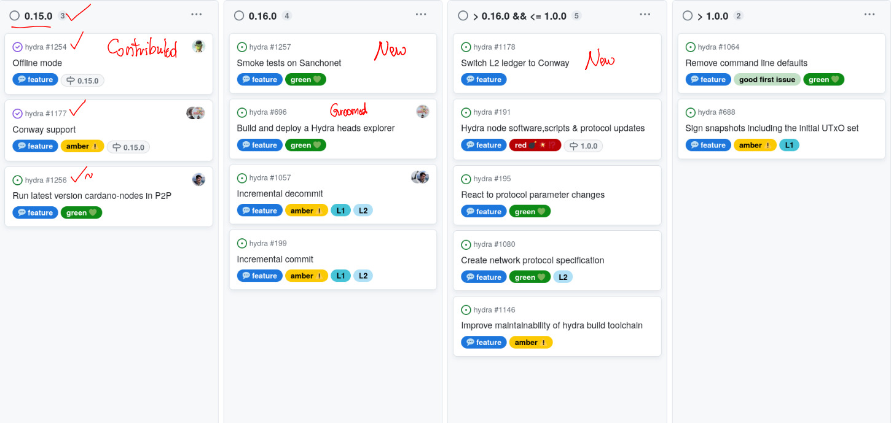

This report summarizes the work on Hydra since November 2023. It serves as
preparation for the monthly review meeting (see [slides][slides] and
[recording][recording]), where the team updates project stakeholders on recent
developments to gather their feedback on proposed plans.

## Roadmap

This month, several items were restructured on the project
[roadmap](https://github.com/orgs/input-output-hk/projects/21/views/7):

 <small>
The latest roadmap with features and ideas
</small>

#### Notable updates

* Released version `0.15.0` which delivers offline mod and conway support.

* [Offline mode #1254](https://github.com/input-output-hk/hydra/issues/1254) is
  a new feature contributed by @SundaeLabs and is related to [this Catalyst
  project](https://milestones.projectcatalyst.io/projects/1000179)
  
* Delivered [Conway support
  #1177](https://github.com/input-output-hk/hydra/issues/1177) which will
  prepare `hydra-node` for the upcoming hard-fork into the Conway era.
  
* New feature to indicate preparation of [running latest version cardano-nodes in P2P
#1256](https://github.com/input-output-hk/hydra/issues/1256).
  This is necessary as the non-P2P relay nodes of IOG are to be shut down in January 2024.

* Similarly, new feature to [run smoke tests in Sanchonet
  #1257](https://github.com/input-output-hk/hydra/issues/1257) which will serve
  as another proof point of being able to open/close heads in the new Conway
  era.

* Groomed and started work on [building and deploying a Hydra heads explorer
  #696](https://github.com/input-output-hk/hydra/issues/696), details below.
  
* Renamed "Drop Babbage support #1178" to [Switch L2 ledger to Conway
  #1178](https://github.com/input-output-hk/hydra/issues/1178) to better capture
  it's content.

## Hydra development

[Issues and pull requests closed since the last
report](https://github.com/input-output-hk/hydra/issues?q=is%3Aclosed+sort%3Aupdated-desc+closed%3A2023-11-30..2024-01-31)

This month, the team worked on the following:

### Hydra Chess
Hydra team wanted to build a game on Hydra since by dogfooding their product they always find more things which are suboptimal or stumble accross a bug that needs fixing. Hydra Chess proved to be no different and they learned in the process of making this dApp.

They also tried to iron out all details and difficulties present when trying to run hydra-node and have dApp that is easy to use by the end users which might not be tech savvy but also provide an example for people trying to build on Hydra. You can find the source code [here](https://github.com/abailly-iohk/hydra-chess).

### Hydra Explorer
To measure the progress and success of Hydra, we require tools that provide insights into its usage. For this purpose, we have initiated work on [#696](https://github.com/input-output-hk/hydra/issues/696) to enable the tracking of the lifecycles of Heads and observe the growth of the Hydra ecosystem.

In this initial phase, we have developed a fundamental backend service [#1235](https://github.com/input-output-hk/hydra/pull/1235) that can track all Babbage heads on-chain within a devnet network. This service establishes a baseline and utilizes the hydra-chain-observer package, exposing a REST API for querying and retrieving information about all observed heads and their current states.

## Community update

* TODO

## Conclusion

The monthly review meeting for January 2024 was held on 2024-01-19 via Google
Meet with these [slides][slides] and the [recording][recording].

TODO

[slides]: https://docs.google.com/presentation/d/113okna4iyhgC7ERDLVHxqQkvhqTUSWJUWjXfkpwIpEY
[recording]: https://drive.google.com/file/d/1XnM4RMKSiJNKLs2GBEg32ZHymg-fGBFt
