# Prior-spike diagrams

Archived from `a6c4966f8`. These are protocol investigations, superseded traces,
and comparisons with frozen implementations. They describe the versions
named by their artifacts, not a second production execution path.

[Current diagrams](../head-logic-diagrams.md) · [Archive guide](README.md)

Generated by `python3 scripts/head-logic-diagrams.py`; `--check` verifies both pages.

## Workflow comparisons

### Leader accepts a transaction

Ledger application succeeds; the leader records local application and requests a snapshot.

[Mermaid source](workflows/req-tx-leader.mmd)

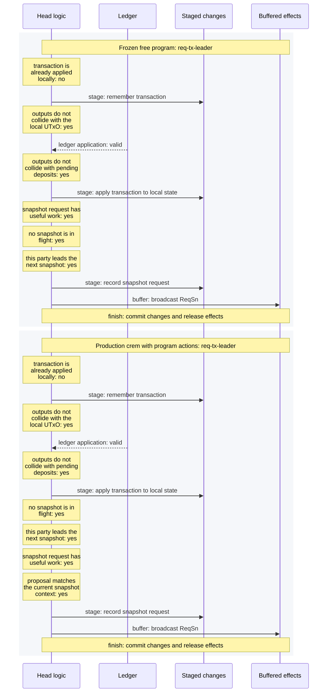
```mermaid
%%{init: {"sequence": {"wrap": true}}}%%
sequenceDiagram
  participant logic as Head logic
  participant ledger as Ledger
  participant changes as Staged changes
  participant effects as Buffered effects
  rect rgb(245, 247, 250)
    Note over logic,effects: Frozen free program: req-tx-leader
    Note over logic: transaction is already applied locally: no
    logic->>changes: stage: remember transaction
    Note over logic: outputs do not collide with the local UTxO: yes
    ledger-->>logic: ledger application: valid
    Note over logic: outputs do not collide with pending deposits: yes
    logic->>changes: stage: apply transaction to local state
    Note over logic: snapshot request has useful work: yes
    Note over logic: no snapshot is in flight: yes
    Note over logic: this party leads the next snapshot: yes
    logic->>changes: stage: record snapshot request
    logic->>effects: buffer: broadcast ReqSn
    Note over logic,effects: finish: commit changes and release effects
  end
  rect rgb(245, 247, 250)
    Note over logic,effects: Production crem with program actions: req-tx-leader
    Note over logic: transaction is already applied locally: no
    logic->>changes: stage: remember transaction
    Note over logic: outputs do not collide with the local UTxO: yes
    ledger-->>logic: ledger application: valid
    Note over logic: outputs do not collide with pending deposits: yes
    logic->>changes: stage: apply transaction to local state
    Note over logic: no snapshot is in flight: yes
    Note over logic: this party leads the next snapshot: yes
    Note over logic: snapshot request has useful work: yes
    Note over logic: proposal matches the current snapshot context: yes
    logic->>changes: stage: record snapshot request
    logic->>effects: buffer: broadcast ReqSn
    Note over logic,effects: finish: commit changes and release effects
  end
```

### Follower accepts a transaction

The follower applies the transaction without requesting the next round.

[Mermaid source](workflows/req-tx-follower.mmd)

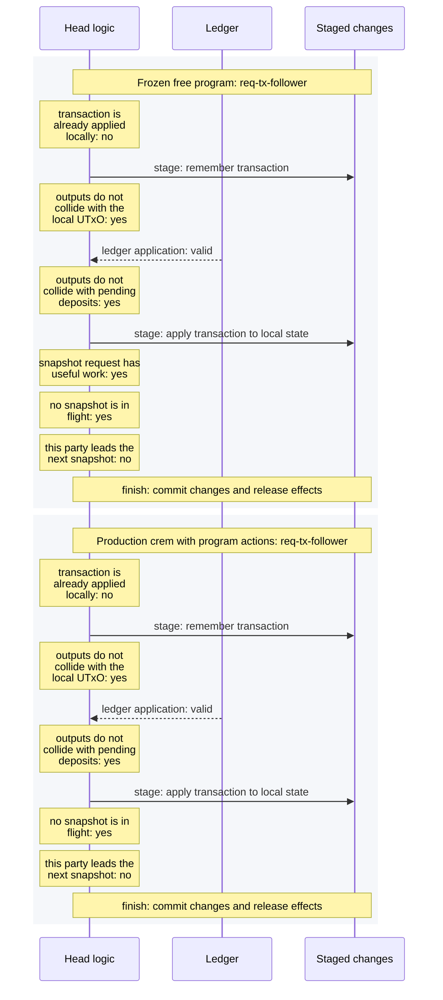
```mermaid
%%{init: {"sequence": {"wrap": true}}}%%
sequenceDiagram
  participant logic as Head logic
  participant ledger as Ledger
  participant changes as Staged changes
  rect rgb(245, 247, 250)
    Note over logic,changes: Frozen free program: req-tx-follower
    Note over logic: transaction is already applied locally: no
    logic->>changes: stage: remember transaction
    Note over logic: outputs do not collide with the local UTxO: yes
    ledger-->>logic: ledger application: valid
    Note over logic: outputs do not collide with pending deposits: yes
    logic->>changes: stage: apply transaction to local state
    Note over logic: snapshot request has useful work: yes
    Note over logic: no snapshot is in flight: yes
    Note over logic: this party leads the next snapshot: no
    Note over logic,changes: finish: commit changes and release effects
  end
  rect rgb(245, 247, 250)
    Note over logic,changes: Production crem with program actions: req-tx-follower
    Note over logic: transaction is already applied locally: no
    logic->>changes: stage: remember transaction
    Note over logic: outputs do not collide with the local UTxO: yes
    ledger-->>logic: ledger application: valid
    Note over logic: outputs do not collide with pending deposits: yes
    logic->>changes: stage: apply transaction to local state
    Note over logic: no snapshot is in flight: yes
    Note over logic: this party leads the next snapshot: no
    Note over logic,changes: finish: commit changes and release effects
  end
```

### Transaction waits for a dependency

Receipt survives the wait; buffered effects do not. A retry runs a fresh program against current state.

[Mermaid source](workflows/req-tx-wait.mmd)

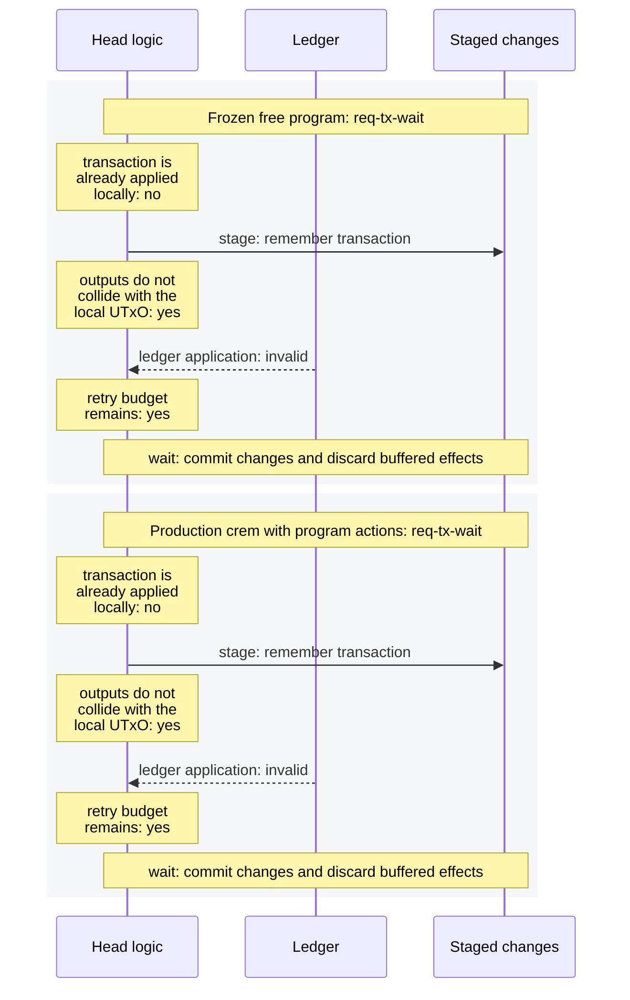
```mermaid
%%{init: {"sequence": {"wrap": true}}}%%
sequenceDiagram
  participant logic as Head logic
  participant ledger as Ledger
  participant changes as Staged changes
  rect rgb(245, 247, 250)
    Note over logic,changes: Frozen free program: req-tx-wait
    Note over logic: transaction is already applied locally: no
    logic->>changes: stage: remember transaction
    Note over logic: outputs do not collide with the local UTxO: yes
    ledger-->>logic: ledger application: invalid
    Note over logic: retry budget remains: yes
    Note over logic,changes: wait: commit changes and discard buffered effects
  end
  rect rgb(245, 247, 250)
    Note over logic,changes: Production crem with program actions: req-tx-wait
    Note over logic: transaction is already applied locally: no
    logic->>changes: stage: remember transaction
    Note over logic: outputs do not collide with the local UTxO: yes
    ledger-->>logic: ledger application: invalid
    Note over logic: retry budget remains: yes
    Note over logic,changes: wait: commit changes and discard buffered effects
  end
```

### Transaction retry expires

An inapplicable transaction with no retry budget is invalidated.

[Mermaid source](workflows/req-tx-timeout.mmd)

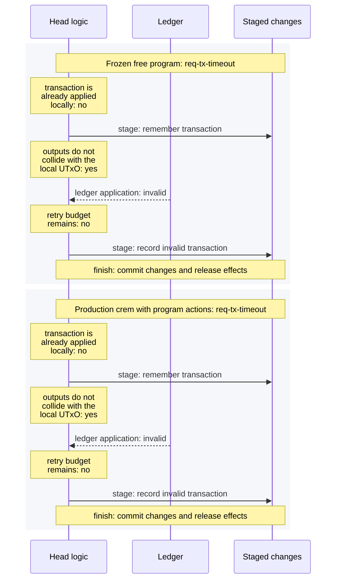
```mermaid
%%{init: {"sequence": {"wrap": true}}}%%
sequenceDiagram
  participant logic as Head logic
  participant ledger as Ledger
  participant changes as Staged changes
  rect rgb(245, 247, 250)
    Note over logic,changes: Frozen free program: req-tx-timeout
    Note over logic: transaction is already applied locally: no
    logic->>changes: stage: remember transaction
    Note over logic: outputs do not collide with the local UTxO: yes
    ledger-->>logic: ledger application: invalid
    Note over logic: retry budget remains: no
    logic->>changes: stage: record invalid transaction
    Note over logic,changes: finish: commit changes and release effects
  end
  rect rgb(245, 247, 250)
    Note over logic,changes: Production crem with program actions: req-tx-timeout
    Note over logic: transaction is already applied locally: no
    logic->>changes: stage: remember transaction
    Note over logic: outputs do not collide with the local UTxO: yes
    ledger-->>logic: ledger application: invalid
    Note over logic: retry budget remains: no
    logic->>changes: stage: record invalid transaction
    Note over logic,changes: finish: commit changes and release effects
  end
```

### Locally applied duplicate

The known transaction ID is ignored before receipt or ledger application.

[Mermaid source](workflows/req-tx-duplicate.mmd)

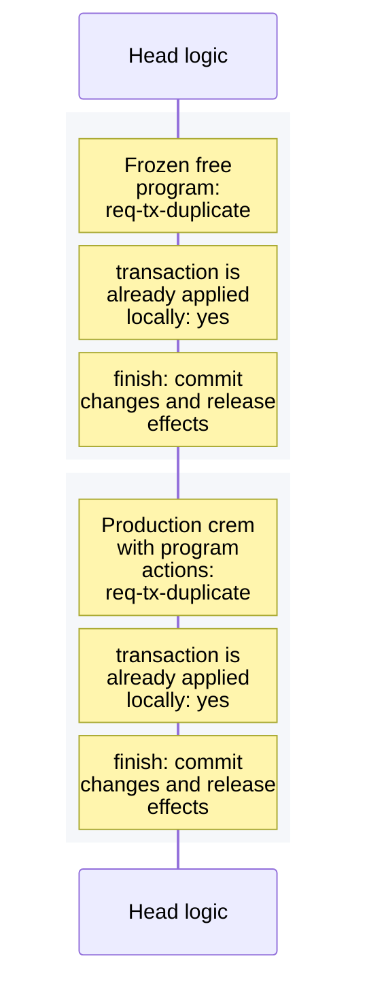
```mermaid
%%{init: {"sequence": {"wrap": true}}}%%
sequenceDiagram
  participant logic as Head logic
  rect rgb(245, 247, 250)
    Note over logic: Frozen free program: req-tx-duplicate
    Note over logic: transaction is already applied locally: yes
    Note over logic: finish: commit changes and release effects
  end
  rect rgb(245, 247, 250)
    Note over logic: Production crem with program actions: req-tx-duplicate
    Note over logic: transaction is already applied locally: yes
    Note over logic: finish: commit changes and release effects
  end
```

### Transaction output collision

The rule rejects conflicting output names; the interpreter does not own this policy.

[Mermaid source](workflows/req-tx-output-collision.mmd)

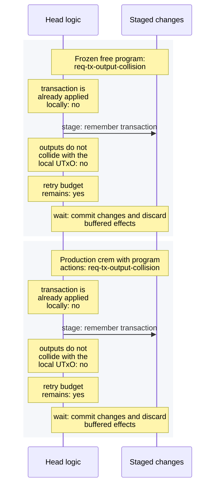
```mermaid
%%{init: {"sequence": {"wrap": true}}}%%
sequenceDiagram
  participant logic as Head logic
  participant changes as Staged changes
  rect rgb(245, 247, 250)
    Note over logic,changes: Frozen free program: req-tx-output-collision
    Note over logic: transaction is already applied locally: no
    logic->>changes: stage: remember transaction
    Note over logic: outputs do not collide with the local UTxO: no
    Note over logic: retry budget remains: yes
    Note over logic,changes: wait: commit changes and discard buffered effects
  end
  rect rgb(245, 247, 250)
    Note over logic,changes: Production crem with program actions: req-tx-output-collision
    Note over logic: transaction is already applied locally: no
    logic->>changes: stage: remember transaction
    Note over logic: outputs do not collide with the local UTxO: no
    Note over logic: retry budget remains: yes
    Note over logic,changes: wait: commit changes and discard buffered effects
  end
```

### Transaction during a snapshot round

Local application succeeds while snapshot request selection waits for the current round.

[Mermaid source](workflows/req-tx-in-flight.mmd)

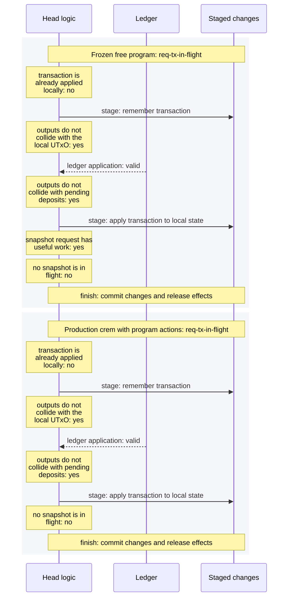
```mermaid
%%{init: {"sequence": {"wrap": true}}}%%
sequenceDiagram
  participant logic as Head logic
  participant ledger as Ledger
  participant changes as Staged changes
  rect rgb(245, 247, 250)
    Note over logic,changes: Frozen free program: req-tx-in-flight
    Note over logic: transaction is already applied locally: no
    logic->>changes: stage: remember transaction
    Note over logic: outputs do not collide with the local UTxO: yes
    ledger-->>logic: ledger application: valid
    Note over logic: outputs do not collide with pending deposits: yes
    logic->>changes: stage: apply transaction to local state
    Note over logic: snapshot request has useful work: yes
    Note over logic: no snapshot is in flight: no
    Note over logic,changes: finish: commit changes and release effects
  end
  rect rgb(245, 247, 250)
    Note over logic,changes: Production crem with program actions: req-tx-in-flight
    Note over logic: transaction is already applied locally: no
    logic->>changes: stage: remember transaction
    Note over logic: outputs do not collide with the local UTxO: yes
    ledger-->>logic: ledger application: valid
    Note over logic: outputs do not collide with pending deposits: yes
    logic->>changes: stage: apply transaction to local state
    Note over logic: no snapshot is in flight: no
    Note over logic,changes: finish: commit changes and release effects
  end
```

### Snapshot request succeeds

The rule resolves transactions, constructs and signs the snapshot, buffers AckSn, then prunes local transactions.

[Mermaid source](workflows/req-sn-sign.mmd)

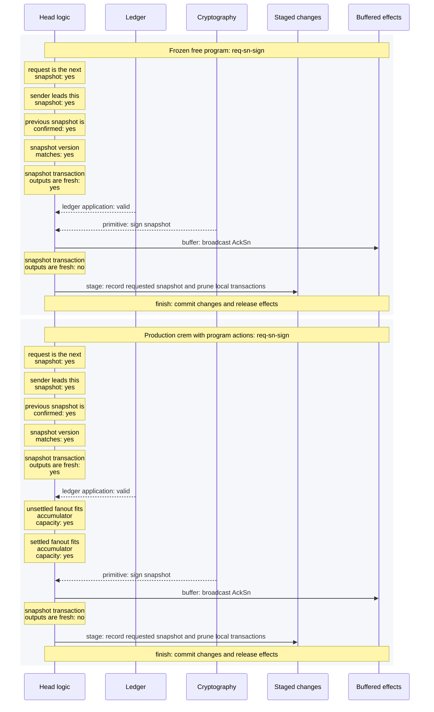
```mermaid
%%{init: {"sequence": {"wrap": true}}}%%
sequenceDiagram
  participant logic as Head logic
  participant ledger as Ledger
  participant crypto as Cryptography
  participant changes as Staged changes
  participant effects as Buffered effects
  rect rgb(245, 247, 250)
    Note over logic,effects: Frozen free program: req-sn-sign
    Note over logic: request is the next snapshot: yes
    Note over logic: sender leads this snapshot: yes
    Note over logic: previous snapshot is confirmed: yes
    Note over logic: snapshot version matches: yes
    Note over logic: snapshot transaction outputs are fresh: yes
    ledger-->>logic: ledger application: valid
    crypto-->>logic: primitive: sign snapshot
    logic->>effects: buffer: broadcast AckSn
    Note over logic: snapshot transaction outputs are fresh: no
    logic->>changes: stage: record requested snapshot and prune local transactions
    Note over logic,effects: finish: commit changes and release effects
  end
  rect rgb(245, 247, 250)
    Note over logic,effects: Production crem with program actions: req-sn-sign
    Note over logic: request is the next snapshot: yes
    Note over logic: sender leads this snapshot: yes
    Note over logic: previous snapshot is confirmed: yes
    Note over logic: snapshot version matches: yes
    Note over logic: snapshot transaction outputs are fresh: yes
    ledger-->>logic: ledger application: valid
    Note over logic: unsettled fanout fits accumulator capacity: yes
    Note over logic: settled fanout fits accumulator capacity: yes
    crypto-->>logic: primitive: sign snapshot
    logic->>effects: buffer: broadcast AckSn
    Note over logic: snapshot transaction outputs are fresh: no
    logic->>changes: stage: record requested snapshot and prune local transactions
    Note over logic,effects: finish: commit changes and release effects
  end
```

### Snapshot version mismatch

A future or otherwise different local version waits at the version guard.

[Mermaid source](workflows/req-sn-version-wait.mmd)

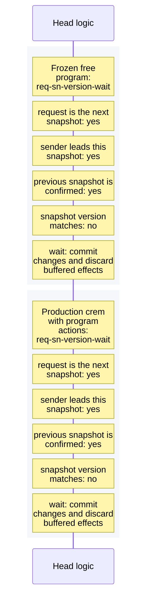
```mermaid
%%{init: {"sequence": {"wrap": true}}}%%
sequenceDiagram
  participant logic as Head logic
  rect rgb(245, 247, 250)
    Note over logic: Frozen free program: req-sn-version-wait
    Note over logic: request is the next snapshot: yes
    Note over logic: sender leads this snapshot: yes
    Note over logic: previous snapshot is confirmed: yes
    Note over logic: snapshot version matches: no
    Note over logic: wait: commit changes and discard buffered effects
  end
  rect rgb(245, 247, 250)
    Note over logic: Production crem with program actions: req-sn-version-wait
    Note over logic: request is the next snapshot: yes
    Note over logic: sender leads this snapshot: yes
    Note over logic: previous snapshot is confirmed: yes
    Note over logic: snapshot version matches: no
    Note over logic: wait: commit changes and discard buffered effects
  end
```

### Snapshot transaction is missing

The request waits until the local registry contains the requested transaction.

[Mermaid source](workflows/req-sn-missing-transaction.mmd)

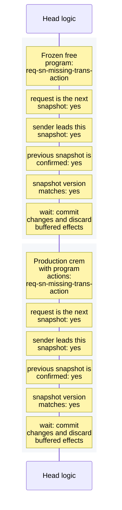
```mermaid
%%{init: {"sequence": {"wrap": true}}}%%
sequenceDiagram
  participant logic as Head logic
  rect rgb(245, 247, 250)
    Note over logic: Frozen free program: req-sn-missing-transaction
    Note over logic: request is the next snapshot: yes
    Note over logic: sender leads this snapshot: yes
    Note over logic: previous snapshot is confirmed: yes
    Note over logic: snapshot version matches: yes
    Note over logic: wait: commit changes and discard buffered effects
  end
  rect rgb(245, 247, 250)
    Note over logic: Production crem with program actions: req-sn-missing-transaction
    Note over logic: request is the next snapshot: yes
    Note over logic: sender leads this snapshot: yes
    Note over logic: previous snapshot is confirmed: yes
    Note over logic: snapshot version matches: yes
    Note over logic: wait: commit changes and discard buffered effects
  end
```

### Snapshot carries a decommit

The decommit is applied before ordinary transactions; this order matters in the dependency bug.

[Mermaid source](workflows/req-sn-decommit.mmd)

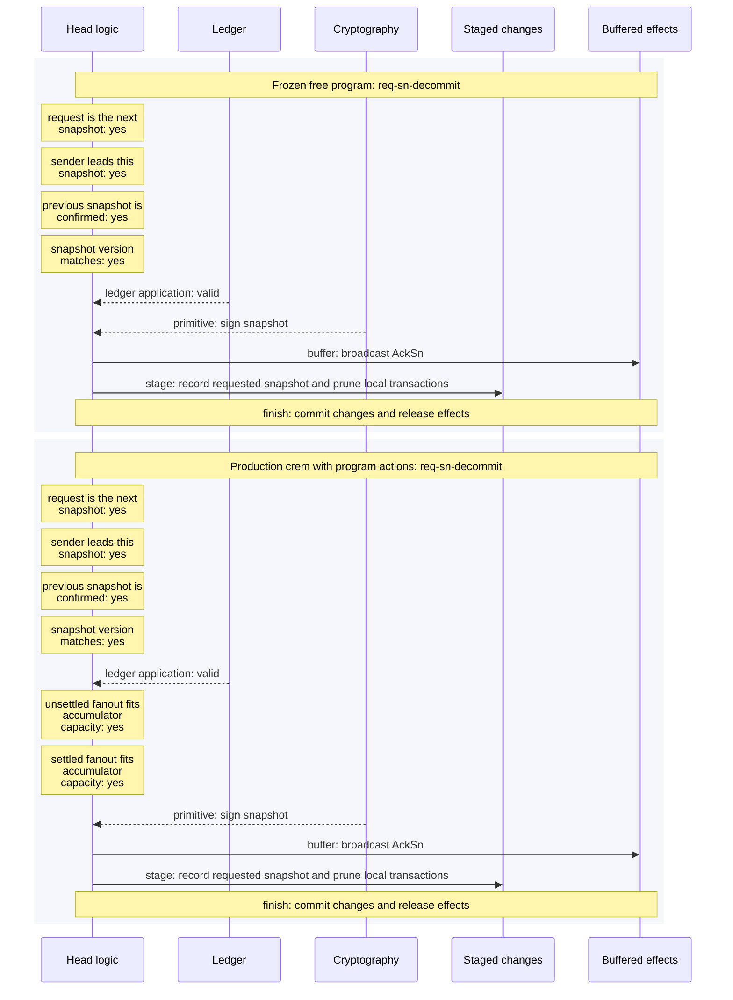
```mermaid
%%{init: {"sequence": {"wrap": true}}}%%
sequenceDiagram
  participant logic as Head logic
  participant ledger as Ledger
  participant crypto as Cryptography
  participant changes as Staged changes
  participant effects as Buffered effects
  rect rgb(245, 247, 250)
    Note over logic,effects: Frozen free program: req-sn-decommit
    Note over logic: request is the next snapshot: yes
    Note over logic: sender leads this snapshot: yes
    Note over logic: previous snapshot is confirmed: yes
    Note over logic: snapshot version matches: yes
    ledger-->>logic: ledger application: valid
    crypto-->>logic: primitive: sign snapshot
    logic->>effects: buffer: broadcast AckSn
    logic->>changes: stage: record requested snapshot and prune local transactions
    Note over logic,effects: finish: commit changes and release effects
  end
  rect rgb(245, 247, 250)
    Note over logic,effects: Production crem with program actions: req-sn-decommit
    Note over logic: request is the next snapshot: yes
    Note over logic: sender leads this snapshot: yes
    Note over logic: previous snapshot is confirmed: yes
    Note over logic: snapshot version matches: yes
    ledger-->>logic: ledger application: valid
    Note over logic: unsettled fanout fits accumulator capacity: yes
    Note over logic: settled fanout fits accumulator capacity: yes
    crypto-->>logic: primitive: sign snapshot
    logic->>effects: buffer: broadcast AckSn
    logic->>changes: stage: record requested snapshot and prune local transactions
    Note over logic,effects: finish: commit changes and release effects
  end
```

### Network decommit is recorded

The network rule reserves the decommit and can broadcast ReqSn; it does not stage SnapshotRequestDecided.

[Mermaid source](workflows/req-dec-record.mmd)

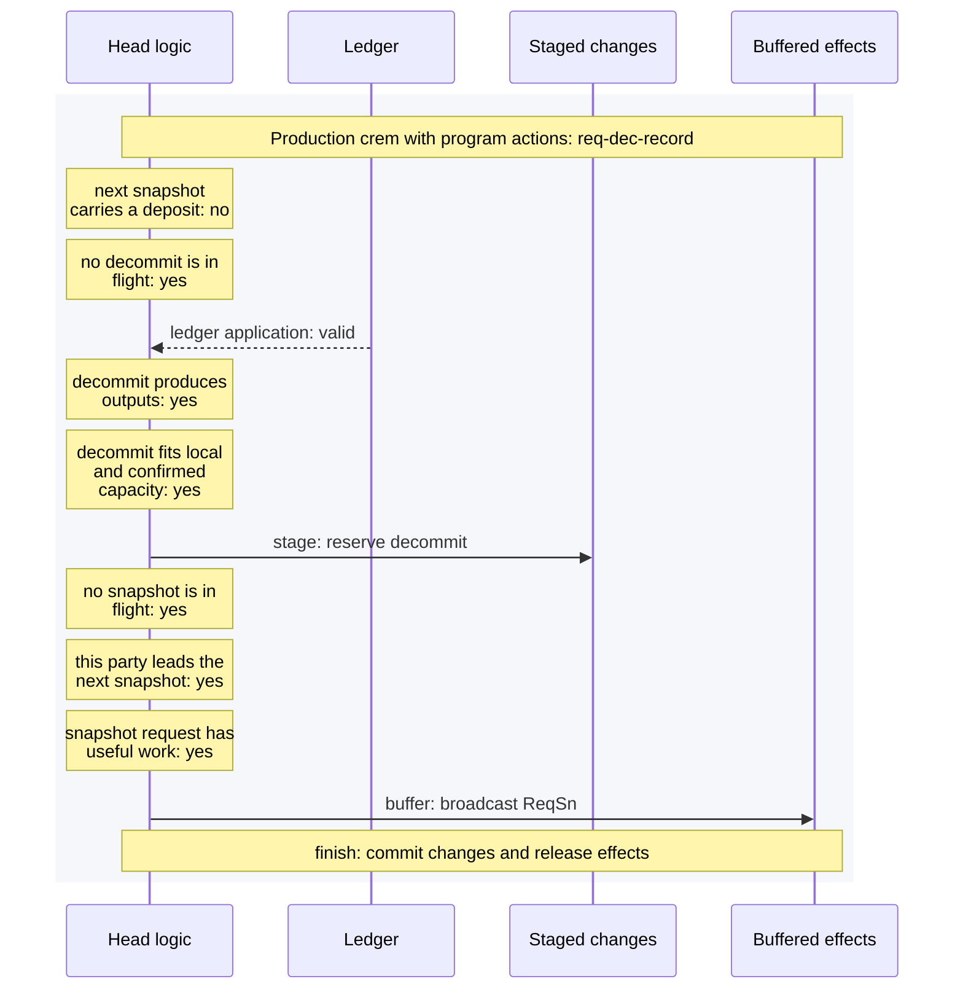
```mermaid
%%{init: {"sequence": {"wrap": true}}}%%
sequenceDiagram
  participant logic as Head logic
  participant ledger as Ledger
  participant changes as Staged changes
  participant effects as Buffered effects
  rect rgb(245, 247, 250)
    Note over logic,effects: Production crem with program actions: req-dec-record
    Note over logic: next snapshot carries a deposit: no
    Note over logic: no decommit is in flight: yes
    ledger-->>logic: ledger application: valid
    Note over logic: decommit produces outputs: yes
    Note over logic: decommit fits local and confirmed capacity: yes
    logic->>changes: stage: reserve decommit
    Note over logic: no snapshot is in flight: yes
    Note over logic: this party leads the next snapshot: yes
    Note over logic: snapshot request has useful work: yes
    logic->>effects: buffer: broadcast ReqSn
    Note over logic,effects: finish: commit changes and release effects
  end
```

### Network decommit waits

An inapplicable decommit waits while retry budget remains.

[Mermaid source](workflows/req-dec-wait.mmd)

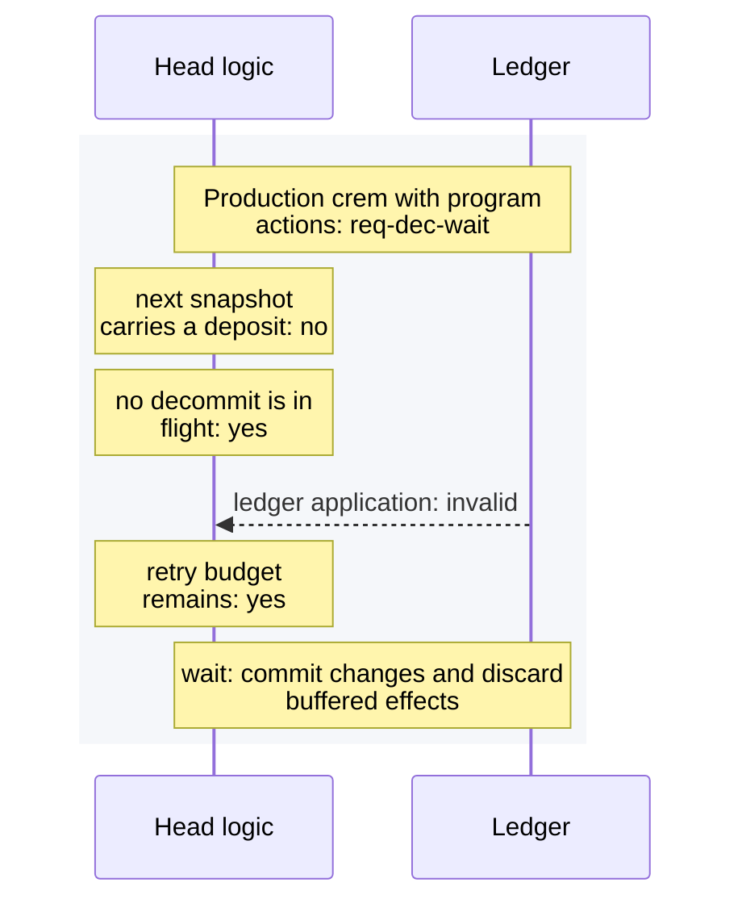
```mermaid
%%{init: {"sequence": {"wrap": true}}}%%
sequenceDiagram
  participant logic as Head logic
  participant ledger as Ledger
  rect rgb(245, 247, 250)
    Note over logic,ledger: Production crem with program actions: req-dec-wait
    Note over logic: next snapshot carries a deposit: no
    Note over logic: no decommit is in flight: yes
    ledger-->>logic: ledger application: invalid
    Note over logic: retry budget remains: yes
    Note over logic,ledger: wait: commit changes and discard buffered effects
  end
```

### Network decommit expires

Without retry budget, the same failure records DecommitInvalid.

[Mermaid source](workflows/req-dec-timeout.mmd)

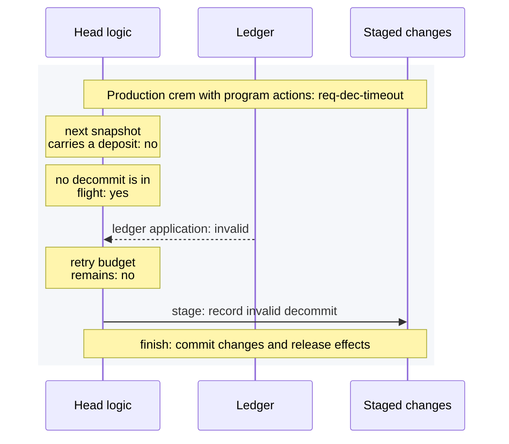
```mermaid
%%{init: {"sequence": {"wrap": true}}}%%
sequenceDiagram
  participant logic as Head logic
  participant ledger as Ledger
  participant changes as Staged changes
  rect rgb(245, 247, 250)
    Note over logic,changes: Production crem with program actions: req-dec-timeout
    Note over logic: next snapshot carries a deposit: no
    Note over logic: no decommit is in flight: yes
    ledger-->>logic: ledger application: invalid
    Note over logic: retry budget remains: no
    logic->>changes: stage: record invalid decommit
    Note over logic,changes: finish: commit changes and release effects
  end
```

### Recover a registered deposit

Registration and retained-finalization checks pass, then the rule posts recovery.

[Mermaid source](workflows/recover-post.mmd)

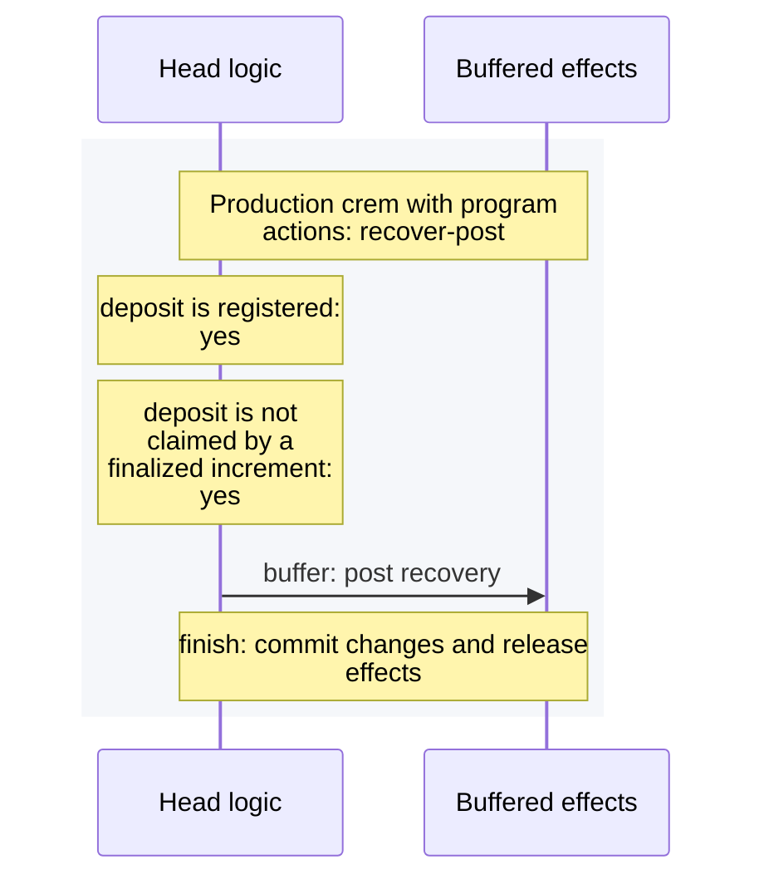
```mermaid
%%{init: {"sequence": {"wrap": true}}}%%
sequenceDiagram
  participant logic as Head logic
  participant effects as Buffered effects
  rect rgb(245, 247, 250)
    Note over logic,effects: Production crem with program actions: recover-post
    Note over logic: deposit is registered: yes
    Note over logic: deposit is not claimed by a finalized increment: yes
    logic->>effects: buffer: post recovery
    Note over logic,effects: finish: commit changes and release effects
  end
```

### Recover an unknown deposit

The missing-deposit guard rejects before any post.

[Mermaid source](workflows/recover-missing.mmd)

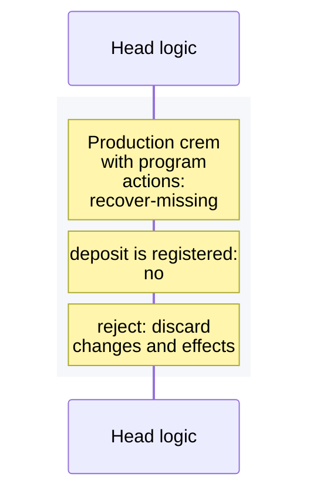
```mermaid
%%{init: {"sequence": {"wrap": true}}}%%
sequenceDiagram
  participant logic as Head logic
  rect rgb(245, 247, 250)
    Note over logic: Production crem with program actions: recover-missing
    Note over logic: deposit is registered: no
    Note over logic: reject: discard changes and effects
  end
```

### Recover a finalized deposit

A retained finalized increment blocks recovery of its resurfaced deposit.

[Mermaid source](workflows/recover-blocked.mmd)

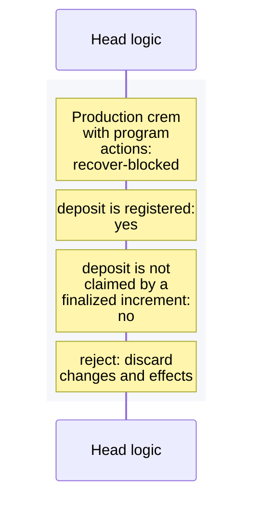
```mermaid
%%{init: {"sequence": {"wrap": true}}}%%
sequenceDiagram
  participant logic as Head logic
  rect rgb(245, 247, 250)
    Note over logic: Production crem with program actions: recover-blocked
    Note over logic: deposit is registered: yes
    Note over logic: deposit is not claimed by a finalized increment: no
    Note over logic: reject: discard changes and effects
  end
```

### Acknowledgement arrives early

The acknowledgement waits for the snapshot it signs.

[Mermaid source](workflows/ack-early.mmd)

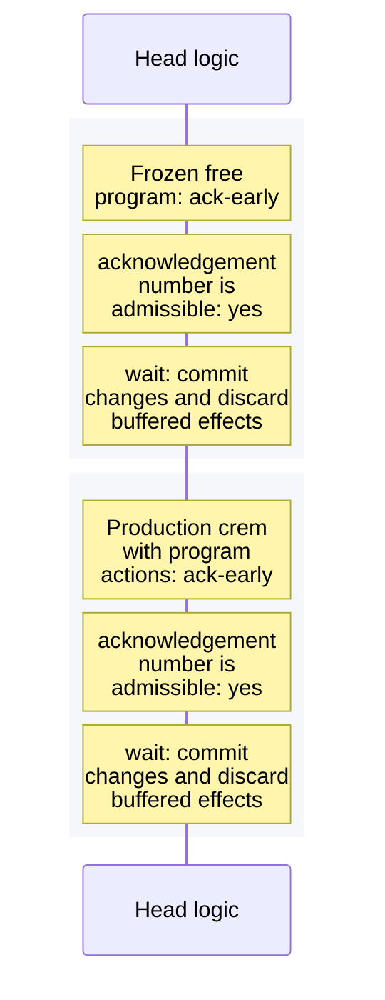
```mermaid
%%{init: {"sequence": {"wrap": true}}}%%
sequenceDiagram
  participant logic as Head logic
  rect rgb(245, 247, 250)
    Note over logic: Frozen free program: ack-early
    Note over logic: acknowledgement number is admissible: yes
    Note over logic: wait: commit changes and discard buffered effects
  end
  rect rgb(245, 247, 250)
    Note over logic: Production crem with program actions: ack-early
    Note over logic: acknowledgement number is admissible: yes
    Note over logic: wait: commit changes and discard buffered effects
  end
```

### Partial acknowledgement

The partial path records the signature twice. The migration preserves this observable event order.

[Mermaid source](workflows/ack-partial.mmd)

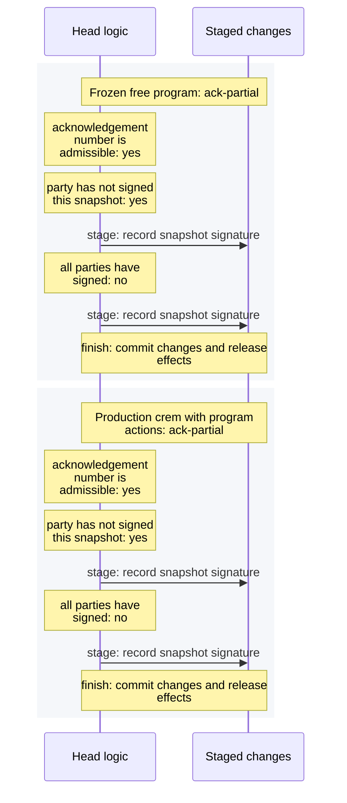
```mermaid
%%{init: {"sequence": {"wrap": true}}}%%
sequenceDiagram
  participant logic as Head logic
  participant changes as Staged changes
  rect rgb(245, 247, 250)
    Note over logic,changes: Frozen free program: ack-partial
    Note over logic: acknowledgement number is admissible: yes
    Note over logic: party has not signed this snapshot: yes
    logic->>changes: stage: record snapshot signature
    Note over logic: all parties have signed: no
    logic->>changes: stage: record snapshot signature
    Note over logic,changes: finish: commit changes and release effects
  end
  rect rgb(245, 247, 250)
    Note over logic,changes: Production crem with program actions: ack-partial
    Note over logic: acknowledgement number is admissible: yes
    Note over logic: party has not signed this snapshot: yes
    logic->>changes: stage: record snapshot signature
    Note over logic: all parties have signed: no
    logic->>changes: stage: record snapshot signature
    Note over logic,changes: finish: commit changes and release effects
  end
```

### Duplicate acknowledgement

An already recorded signer is rejected according to the existing acknowledgement policy.

[Mermaid source](workflows/ack-duplicate.mmd)

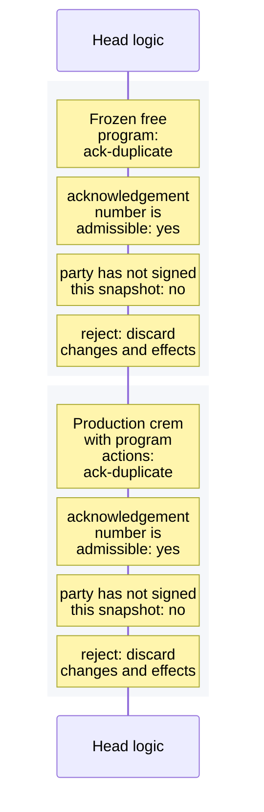
```mermaid
%%{init: {"sequence": {"wrap": true}}}%%
sequenceDiagram
  participant logic as Head logic
  rect rgb(245, 247, 250)
    Note over logic: Frozen free program: ack-duplicate
    Note over logic: acknowledgement number is admissible: yes
    Note over logic: party has not signed this snapshot: no
    Note over logic: reject: discard changes and effects
  end
  rect rgb(245, 247, 250)
    Note over logic: Production crem with program actions: ack-duplicate
    Note over logic: acknowledgement number is admissible: yes
    Note over logic: party has not signed this snapshot: no
    Note over logic: reject: discard changes and effects
  end
```

### Final acknowledgement confirms

A complete valid multisignature confirms the round and selects subsequent work.

[Mermaid source](workflows/ack-confirm.mmd)

```mermaid
%%{init: {"sequence": {"wrap": true}}}%%
sequenceDiagram
  participant logic as Head logic
  participant crypto as Cryptography
  participant changes as Staged changes
  rect rgb(245, 247, 250)
    Note over logic,changes: Frozen free program: ack-confirm
    Note over logic: acknowledgement number is admissible: yes
    Note over logic: party has not signed this snapshot: yes
    logic->>changes: stage: record snapshot signature
    Note over logic: all parties have signed: yes
    crypto-->>logic: primitive: verify multisignature
    logic->>changes: stage: confirm snapshot
    Note over logic,changes: finish: commit changes and release effects
  end
  rect rgb(245, 247, 250)
    Note over logic,changes: Production crem with program actions: ack-confirm
    Note over logic: acknowledgement number is admissible: yes
    Note over logic: party has not signed this snapshot: yes
    logic->>changes: stage: record snapshot signature
    Note over logic: all parties have signed: yes
    crypto-->>logic: primitive: verify multisignature
    logic->>changes: stage: confirm snapshot
    Note over logic,changes: finish: commit changes and release effects
  end
```

### Invalid final acknowledgement

The signature is staged before aggregate verification. Verification fails, so rejection discards that staged signature and every buffered effect.

[Mermaid source](workflows/ack-invalid.mmd)

```mermaid
%%{init: {"sequence": {"wrap": true}}}%%
sequenceDiagram
  participant logic as Head logic
  participant crypto as Cryptography
  participant changes as Staged changes
  rect rgb(245, 247, 250)
    Note over logic,changes: Frozen free program: ack-invalid
    Note over logic: acknowledgement number is admissible: yes
    Note over logic: party has not signed this snapshot: yes
    logic->>changes: stage: record snapshot signature
    Note over logic: all parties have signed: yes
    crypto-->>logic: primitive: verify multisignature
    Note over logic,changes: reject: discard changes and effects
  end
  rect rgb(245, 247, 250)
    Note over logic,changes: Production crem with program actions: ack-invalid
    Note over logic: acknowledgement number is admissible: yes
    Note over logic: party has not signed this snapshot: yes
    logic->>changes: stage: record snapshot signature
    Note over logic: all parties have signed: yes
    crypto-->>logic: primitive: verify multisignature
    Note over logic,changes: reject: discard changes and effects
  end
```

## Protocol investigations and superseded traces

### Historical invalid confirmation (v1)

Historical fault-injected verification witness. The primitive tape format is superseded; use the v2 counterexample to replay.

[Mermaid source](traces/counterexample-v1.json.mmd)

```mermaid
flowchart TD
  n0["primitive: Deliver (Delivery {senderIndex = 0, recipientIndex = 0, remainingTTL = 2, message = ReqTx {transaction = SimpleTx {txSimpleId = 1, txInputs = fromList [1], txOutputs = fromList [2]}}})"]
  n1["primitive: stage: remember transaction"]
  n2["primitive: outputs do not collide with the local UTxO: True"]
  n3["primitive: primitive: apply transaction"]
  n4["primitive: outputs do not collide with pending deposits: True"]
  n5["primitive: stage: validated transaction"]
  n6["primitive: snapshot request has useful work: True"]
  n7["primitive: no snapshot is in flight: True"]
  n8["primitive: this party leads the next snapshot: True"]
  n9["primitive: stage: record snapshot request"]
  n10["primitive: buffer: broadcast ReqSn"]
  n11["primitive: finish"]
  n12["primitive: Deliver (Delivery {senderIndex = 0, recipientIndex = 1, remainingTTL = 2, message = ReqTx {transaction = SimpleTx {txSimpleId = 1, txInputs = fromList [1], txOutputs = fromList [2]}}})"]
  n13["primitive: stage: remember transaction"]
  n14["primitive: outputs do not collide with the local UTxO: True"]
  n15["primitive: primitive: apply transaction"]
  n16["primitive: outputs do not collide with pending deposits: True"]
  n17["primitive: stage: validated transaction"]
  n18["primitive: snapshot request has useful work: True"]
  n19["primitive: no snapshot is in flight: True"]
  n20["primitive: this party leads the next snapshot: False"]
  n21["primitive: finish"]
  n22["primitive: Deliver (Delivery {senderIndex = 0, recipientIndex = 2, remainingTTL = 2, message = ReqTx {transaction = SimpleTx {txSimpleId = 1, txInputs = fromList [1], txOutputs = fromList [2]}}})"]
  n23["primitive: stage: remember transaction"]
  n24["primitive: outputs do not collide with the local UTxO: True"]
  n25["primitive: primitive: apply transaction"]
  n26["primitive: outputs do not collide with pending deposits: True"]
  n27["primitive: stage: validated transaction"]
  n28["primitive: snapshot request has useful work: True"]
  n29["primitive: no snapshot is in flight: True"]
  n30["primitive: this party leads the next snapshot: False"]
  n31["primitive: finish"]
  n32["primitive: Deliver (Delivery {senderIndex = 0, recipientIndex = 0, remainingTTL = 2, message = ReqSn {snapshotVersion = 0, snapshotNumber = 1, transactionIds = [1], decommitTx = Nothing, depositTxId = Nothing}})"]
  n33["primitive: request is the next snapshot: True"]
  n34["primitive: sender leads this snapshot: True"]
  n35["primitive: previous snapshot is confirmed: True"]
  n36["primitive: snapshot version matches: True"]
  n37["primitive: snapshot transaction outputs are fresh: True"]
  n38["primitive: primitive: apply transaction"]
  n39["primitive: primitive: sign snapshot"]
  n40["primitive: buffer: broadcast AckSn"]
  n41["primitive: snapshot transaction outputs are fresh: False"]
  n42["primitive: stage: record requested snapshot and prune local transactions"]
  n43["primitive: finish"]
  n44["primitive: Corrupt (Delivery {senderIndex = 0, recipientIndex = 0, remainingTTL = 2, message = AckSn {signed = HydraSignature &quot;c1ff38cce7f760bd248077d540b1147eda9f7246cd8b000d8cadf97d3c69a0cbcbe7631d873e36c2bebfb717b29fdcadd3d8d1a3804496a437629c047176f20d&quot;, snapshotNumber = 1}})"]
  n45["primitive: Deliver (Delivery {senderIndex = 0, recipientIndex = 1, remainingTTL = 2, message = ReqSn {snapshotVersion = 0, snapshotNumber = 1, transactionIds = [1], decommitTx = Nothing, depositTxId = Nothing}})"]
  n46["primitive: request is the next snapshot: True"]
  n47["primitive: sender leads this snapshot: True"]
  n48["primitive: previous snapshot is confirmed: True"]
  n49["primitive: snapshot version matches: True"]
  n50["primitive: snapshot transaction outputs are fresh: True"]
  n51["primitive: primitive: apply transaction"]
  n52["primitive: primitive: sign snapshot"]
  n53["primitive: buffer: broadcast AckSn"]
  n54["primitive: snapshot transaction outputs are fresh: False"]
  n55["primitive: stage: record requested snapshot and prune local transactions"]
  n56["primitive: finish"]
  n57["primitive: Deliver (Delivery {senderIndex = 0, recipientIndex = 2, remainingTTL = 2, message = ReqSn {snapshotVersion = 0, snapshotNumber = 1, transactionIds = [1], decommitTx = Nothing, depositTxId = Nothing}})"]
  n58["primitive: request is the next snapshot: True"]
  n59["primitive: sender leads this snapshot: True"]
  n60["primitive: previous snapshot is confirmed: True"]
  n61["primitive: snapshot version matches: True"]
  n62["primitive: snapshot transaction outputs are fresh: True"]
  n63["primitive: primitive: apply transaction"]
  n64["primitive: primitive: sign snapshot"]
  n65["primitive: buffer: broadcast AckSn"]
  n66["primitive: snapshot transaction outputs are fresh: False"]
  n67["primitive: stage: record requested snapshot and prune local transactions"]
  n68["primitive: finish"]
  n69["primitive: Deliver (Delivery {senderIndex = 0, recipientIndex = 0, remainingTTL = 2, message = AckSn {signed = HydraSignature &quot;214ff7fc7ad34c3e650c012a8e9d259e3e85a8ab517d2817d0169c9a71b7c609fa2c776ccd87d220bc32faa64928e29cbc90b4ed8053cf40478746f8db5cee06&quot;, snapshotNumber = 1}})"]
  n70["primitive: acknowledgement number is admissible: True"]
  n71["primitive: party has not signed this snapshot: True"]
  n72["primitive: stage: record snapshot signature"]
  n73["primitive: all parties have signed: False"]
  n74["primitive: stage: record snapshot signature"]
  n75["primitive: finish"]
  n76["primitive: Deliver (Delivery {senderIndex = 1, recipientIndex = 0, remainingTTL = 2, message = AckSn {signed = HydraSignature &quot;70faf5bb51813d1ccb337b601ecae1ed692f21db974a8032eae0e5091da8d604e5221a32e23cf8150c3c89338b392617524e4529e5a1387bc820ced0136aa90b&quot;, snapshotNumber = 1}})"]
  n77["primitive: acknowledgement number is admissible: True"]
  n78["primitive: party has not signed this snapshot: True"]
  n79["primitive: stage: record snapshot signature"]
  n80["primitive: all parties have signed: False"]
  n81["primitive: stage: record snapshot signature"]
  n82["primitive: finish"]
  n83["primitive: Deliver (Delivery {senderIndex = 2, recipientIndex = 0, remainingTTL = 2, message = AckSn {signed = HydraSignature &quot;be2b7d9941ddf81d1435c40248b8381adbe87c95e51a2c57a46cc0b64ade552eaf573b4acef2519d0b71f2f79f15d0404504414e7022ada19067cd102db8e402&quot;, snapshotNumber = 1}})"]
  n84["primitive: acknowledgement number is admissible: True"]
  n85["primitive: party has not signed this snapshot: True"]
  n86["primitive: stage: record snapshot signature"]
  n87["primitive: all parties have signed: True"]
  n88["primitive: TEST ONLY: bypass multisignature verification: True"]
  n89["primitive: stage: confirm snapshot"]
  n90["primitive: finish"]
  n0 --> n1
  n1 --> n2
  n2 --> n3
  n3 --> n4
  n4 --> n5
  n5 --> n6
  n6 --> n7
  n7 --> n8
  n8 --> n9
  n9 --> n10
  n10 --> n11
  n11 --> n12
  n12 --> n13
  n13 --> n14
  n14 --> n15
  n15 --> n16
  n16 --> n17
  n17 --> n18
  n18 --> n19
  n19 --> n20
  n20 --> n21
  n21 --> n22
  n22 --> n23
  n23 --> n24
  n24 --> n25
  n25 --> n26
  n26 --> n27
  n27 --> n28
  n28 --> n29
  n29 --> n30
  n30 --> n31
  n31 --> n32
  n32 --> n33
  n33 --> n34
  n34 --> n35
  n35 --> n36
  n36 --> n37
  n37 --> n38
  n38 --> n39
  n39 --> n40
  n40 --> n41
  n41 --> n42
  n42 --> n43
  n43 --> n44
  n44 --> n45
  n45 --> n46
  n46 --> n47
  n47 --> n48
  n48 --> n49
  n49 --> n50
  n50 --> n51
  n51 --> n52
  n52 --> n53
  n53 --> n54
  n54 --> n55
  n55 --> n56
  n56 --> n57
  n57 --> n58
  n58 --> n59
  n59 --> n60
  n60 --> n61
  n61 --> n62
  n62 --> n63
  n63 --> n64
  n64 --> n65
  n65 --> n66
  n66 --> n67
  n67 --> n68
  n68 --> n69
  n69 --> n70
  n70 --> n71
  n71 --> n72
  n72 --> n73
  n73 --> n74
  n74 --> n75
  n75 --> n76
  n76 --> n77
  n77 --> n78
  n78 --> n79
  n79 --> n80
  n80 --> n81
  n81 --> n82
  n82 --> n83
  n83 --> n84
  n84 --> n85
  n85 --> n86
  n86 --> n87
  n87 --> n88
  n88 --> n89
  n89 --> n90
```

### Decommit dependency failure

Historical v1 trace of the decommit stall: snapshot 1 pruning restores the reserved input; snapshot 2 applies the decommit before tx2 and all parties reject. Use the v2 historical and corrected commands for current reproduction.

[Mermaid source](traces/decommit-dependency-v1.json.mmd)

```mermaid
%%{init: {"sequence": {"wrap": true}}}%%
sequenceDiagram
  participant logic as Head logic
  participant ledger as Ledger
  participant crypto as Cryptography
  participant changes as Staged changes
  participant effects as Buffered effects
  rect rgb(245, 247, 250)
    Note over logic,effects: Party 0: ReqTx 1
    Note over logic: transaction is already applied locally: no
    logic->>changes: stage: remember transaction
    Note over logic: outputs do not collide with the local UTxO: yes
    ledger-->>logic: ledger application: valid
    Note over logic: outputs do not collide with pending deposits: yes
    logic->>changes: stage: apply transaction to local state
    Note over logic: snapshot request has useful work: yes
    Note over logic: no snapshot is in flight: yes
    Note over logic: this party leads the next snapshot: yes
    logic->>changes: stage: record snapshot request
    logic->>effects: buffer: broadcast ReqSn
    Note over logic,effects: finish: commit changes and release effects
  end
  rect rgb(245, 247, 250)
    Note over logic,effects: Party 1: ReqTx 1
    Note over logic: transaction is already applied locally: no
    logic->>changes: stage: remember transaction
    Note over logic: outputs do not collide with the local UTxO: yes
    ledger-->>logic: ledger application: valid
    Note over logic: outputs do not collide with pending deposits: yes
    logic->>changes: stage: apply transaction to local state
    Note over logic: snapshot request has useful work: yes
    Note over logic: no snapshot is in flight: yes
    Note over logic: this party leads the next snapshot: no
    Note over logic,effects: finish: commit changes and release effects
  end
  rect rgb(245, 247, 250)
    Note over logic,effects: Party 2: ReqTx 1
    Note over logic: transaction is already applied locally: no
    logic->>changes: stage: remember transaction
    Note over logic: outputs do not collide with the local UTxO: yes
    ledger-->>logic: ledger application: valid
    Note over logic: outputs do not collide with pending deposits: yes
    logic->>changes: stage: apply transaction to local state
    Note over logic: snapshot request has useful work: yes
    Note over logic: no snapshot is in flight: yes
    Note over logic: this party leads the next snapshot: no
    Note over logic,effects: finish: commit changes and release effects
  end
  rect rgb(245, 247, 250)
    Note over logic,effects: Party 0: ReqTx 2
    Note over logic: transaction is already applied locally: no
    logic->>changes: stage: remember transaction
    Note over logic: outputs do not collide with the local UTxO: yes
    ledger-->>logic: ledger application: valid
    Note over logic: outputs do not collide with pending deposits: yes
    logic->>changes: stage: apply transaction to local state
    Note over logic: snapshot request has useful work: yes
    Note over logic: no snapshot is in flight: no
    Note over logic,effects: finish: commit changes and release effects
  end
  rect rgb(245, 247, 250)
    Note over logic,effects: Party 1: ReqTx 2
    Note over logic: transaction is already applied locally: no
    logic->>changes: stage: remember transaction
    Note over logic: outputs do not collide with the local UTxO: yes
    ledger-->>logic: ledger application: valid
    Note over logic: outputs do not collide with pending deposits: yes
    logic->>changes: stage: apply transaction to local state
    Note over logic: snapshot request has useful work: yes
    Note over logic: no snapshot is in flight: yes
    Note over logic: this party leads the next snapshot: no
    Note over logic,effects: finish: commit changes and release effects
  end
  rect rgb(245, 247, 250)
    Note over logic,effects: Party 2: ReqTx 2
    Note over logic: transaction is already applied locally: no
    logic->>changes: stage: remember transaction
    Note over logic: outputs do not collide with the local UTxO: yes
    ledger-->>logic: ledger application: valid
    Note over logic: outputs do not collide with pending deposits: yes
    logic->>changes: stage: apply transaction to local state
    Note over logic: snapshot request has useful work: yes
    Note over logic: no snapshot is in flight: yes
    Note over logic: this party leads the next snapshot: no
    Note over logic,effects: finish: commit changes and release effects
  end
  rect rgb(245, 247, 250)
    Note over logic,effects: Party 0: ReqDec 3 (spends output of tx2)
    Note over logic: next snapshot carries a deposit: no
    Note over logic: no decommit is in flight: yes
    ledger-->>logic: ledger application: valid
    Note over logic: decommit produces outputs: yes
    logic->>changes: stage: reserve decommit
    Note over logic: no snapshot is in flight: no
    Note over logic,effects: finish: commit changes and release effects
  end
  rect rgb(245, 247, 250)
    Note over logic,effects: Party 1: ReqDec 3 (spends output of tx2)
    Note over logic: next snapshot carries a deposit: no
    Note over logic: no decommit is in flight: yes
    ledger-->>logic: ledger application: valid
    Note over logic: decommit produces outputs: yes
    logic->>changes: stage: reserve decommit
    Note over logic: no snapshot is in flight: yes
    Note over logic: this party leads the next snapshot: no
    Note over logic,effects: finish: commit changes and release effects
  end
  rect rgb(245, 247, 250)
    Note over logic,effects: Party 2: ReqDec 3 (spends output of tx2)
    Note over logic: next snapshot carries a deposit: no
    Note over logic: no decommit is in flight: yes
    ledger-->>logic: ledger application: valid
    Note over logic: decommit produces outputs: yes
    logic->>changes: stage: reserve decommit
    Note over logic: no snapshot is in flight: yes
    Note over logic: this party leads the next snapshot: no
    Note over logic,effects: finish: commit changes and release effects
  end
  rect rgb(245, 247, 250)
    Note over logic,effects: Party 0: ReqSn 1
    Note over logic: request is the next snapshot: yes
    Note over logic: sender leads this snapshot: yes
    Note over logic: previous snapshot is confirmed: yes
    Note over logic: snapshot version matches: yes
    Note over logic: snapshot transaction outputs are fresh: yes
    ledger-->>logic: ledger application: valid
    crypto-->>logic: primitive: sign snapshot
    logic->>effects: buffer: broadcast AckSn
    Note over logic: snapshot transaction outputs are fresh: no
    Note over logic: snapshot transaction outputs are fresh: yes
    ledger-->>logic: ledger application: valid
    logic->>changes: stage: record requested snapshot and prune local transactions
    Note over logic,effects: finish: commit changes and release effects
  end
  rect rgb(245, 247, 250)
    Note over logic,effects: Party 1: ReqSn 1
    Note over logic: request is the next snapshot: yes
    Note over logic: sender leads this snapshot: yes
    Note over logic: previous snapshot is confirmed: yes
    Note over logic: snapshot version matches: yes
    Note over logic: snapshot transaction outputs are fresh: yes
    ledger-->>logic: ledger application: valid
    crypto-->>logic: primitive: sign snapshot
    logic->>effects: buffer: broadcast AckSn
    Note over logic: snapshot transaction outputs are fresh: no
    Note over logic: snapshot transaction outputs are fresh: yes
    ledger-->>logic: ledger application: valid
    logic->>changes: stage: record requested snapshot and prune local transactions
    Note over logic,effects: finish: commit changes and release effects
  end
  rect rgb(245, 247, 250)
    Note over logic,effects: Party 2: ReqSn 1
    Note over logic: request is the next snapshot: yes
    Note over logic: sender leads this snapshot: yes
    Note over logic: previous snapshot is confirmed: yes
    Note over logic: snapshot version matches: yes
    Note over logic: snapshot transaction outputs are fresh: yes
    ledger-->>logic: ledger application: valid
    crypto-->>logic: primitive: sign snapshot
    logic->>effects: buffer: broadcast AckSn
    Note over logic: snapshot transaction outputs are fresh: no
    Note over logic: snapshot transaction outputs are fresh: yes
    ledger-->>logic: ledger application: valid
    logic->>changes: stage: record requested snapshot and prune local transactions
    Note over logic,effects: finish: commit changes and release effects
  end
  rect rgb(245, 247, 250)
    Note over logic,effects: Party 0: AckSn 1
    Note over logic: acknowledgement number is admissible: yes
    Note over logic: party has not signed this snapshot: yes
    logic->>changes: stage: record snapshot signature
    Note over logic: all parties have signed: no
    logic->>changes: stage: record snapshot signature
    Note over logic,effects: finish: commit changes and release effects
  end
  rect rgb(245, 247, 250)
    Note over logic,effects: Party 1: AckSn 1
    Note over logic: acknowledgement number is admissible: yes
    Note over logic: party has not signed this snapshot: yes
    logic->>changes: stage: record snapshot signature
    Note over logic: all parties have signed: no
    logic->>changes: stage: record snapshot signature
    Note over logic,effects: finish: commit changes and release effects
  end
  rect rgb(245, 247, 250)
    Note over logic,effects: Party 2: AckSn 1
    Note over logic: acknowledgement number is admissible: yes
    Note over logic: party has not signed this snapshot: yes
    logic->>changes: stage: record snapshot signature
    Note over logic: all parties have signed: no
    logic->>changes: stage: record snapshot signature
    Note over logic,effects: finish: commit changes and release effects
  end
  rect rgb(245, 247, 250)
    Note over logic,effects: Party 0: AckSn 1
    Note over logic: acknowledgement number is admissible: yes
    Note over logic: party has not signed this snapshot: yes
    logic->>changes: stage: record snapshot signature
    Note over logic: all parties have signed: no
    logic->>changes: stage: record snapshot signature
    Note over logic,effects: finish: commit changes and release effects
  end
  rect rgb(245, 247, 250)
    Note over logic,effects: Party 1: AckSn 1
    Note over logic: acknowledgement number is admissible: yes
    Note over logic: party has not signed this snapshot: yes
    logic->>changes: stage: record snapshot signature
    Note over logic: all parties have signed: no
    logic->>changes: stage: record snapshot signature
    Note over logic,effects: finish: commit changes and release effects
  end
  rect rgb(245, 247, 250)
    Note over logic,effects: Party 2: AckSn 1
    Note over logic: acknowledgement number is admissible: yes
    Note over logic: party has not signed this snapshot: yes
    logic->>changes: stage: record snapshot signature
    Note over logic: all parties have signed: no
    logic->>changes: stage: record snapshot signature
    Note over logic,effects: finish: commit changes and release effects
  end
  rect rgb(245, 247, 250)
    Note over logic,effects: Party 0: AckSn 1
    Note over logic: acknowledgement number is admissible: yes
    Note over logic: party has not signed this snapshot: yes
    logic->>changes: stage: record snapshot signature
    Note over logic: all parties have signed: yes
    crypto-->>logic: primitive: verify multisignature
    logic->>changes: stage: confirm snapshot
    Note over logic,effects: finish: commit changes and release effects
  end
  rect rgb(245, 247, 250)
    Note over logic,effects: Party 1: AckSn 1
    Note over logic: acknowledgement number is admissible: yes
    Note over logic: party has not signed this snapshot: yes
    logic->>changes: stage: record snapshot signature
    Note over logic: all parties have signed: yes
    crypto-->>logic: primitive: verify multisignature
    logic->>changes: stage: confirm snapshot
    logic->>changes: stage: record snapshot request
    logic->>effects: buffer: broadcast ReqSn
    Note over logic,effects: finish: commit changes and release effects
  end
  rect rgb(245, 247, 250)
    Note over logic,effects: Party 2: AckSn 1
    Note over logic: acknowledgement number is admissible: yes
    Note over logic: party has not signed this snapshot: yes
    logic->>changes: stage: record snapshot signature
    Note over logic: all parties have signed: yes
    crypto-->>logic: primitive: verify multisignature
    logic->>changes: stage: confirm snapshot
    Note over logic,effects: finish: commit changes and release effects
  end
  rect rgb(245, 247, 250)
    Note over logic,effects: Party 0: ReqSn 2
    Note over logic: request is the next snapshot: yes
    Note over logic: sender leads this snapshot: yes
    Note over logic: previous snapshot is confirmed: yes
    Note over logic: snapshot version matches: yes
    ledger-->>logic: ledger application: invalid
    Note over logic,effects: reject: discard changes and effects
  end
  rect rgb(245, 247, 250)
    Note over logic,effects: Party 1: ReqSn 2
    Note over logic: request is the next snapshot: yes
    Note over logic: sender leads this snapshot: yes
    Note over logic: previous snapshot is confirmed: yes
    Note over logic: snapshot version matches: yes
    ledger-->>logic: ledger application: invalid
    Note over logic,effects: reject: discard changes and effects
  end
  rect rgb(245, 247, 250)
    Note over logic,effects: Party 2: ReqSn 2
    Note over logic: request is the next snapshot: yes
    Note over logic: sender leads this snapshot: yes
    Note over logic: previous snapshot is confirmed: yes
    Note over logic: snapshot version matches: yes
    ledger-->>logic: ledger application: invalid
    Note over logic,effects: reject: discard changes and effects
  end
```

### Cardano witness replacement

A transaction with stripped witnesses shares a valid transaction body and ID. The frozen rule corrupts the registry; the duplicate guard preserves the validated payload.

[Mermaid source](traces/registry-demo-v1.json.mmd)

```mermaid
%%{init: {"sequence": {"wrap": true}}}%%
sequenceDiagram
  participant logic as Head logic
  participant ledger as Ledger
  participant crypto as Cryptography
  participant changes as Staged changes
  participant effects as Buffered effects
  rect rgb(245, 247, 250)
    Note over logic,effects: Shared starting state: valid Cardano transaction applied#59; snapshot request succeeds
  end
  rect rgb(245, 247, 250)
    Note over logic,effects: Frozen ReqTx outcome (summary): Wait retains witness-stripped payload
  end
  rect rgb(245, 247, 250)
    Note over logic,effects: ReqSn after the frozen ReqTx: corrupted registry
    Note over logic: request is the next snapshot: yes
    Note over logic: sender leads this snapshot: yes
    Note over logic: previous snapshot is confirmed: yes
    Note over logic: snapshot version matches: yes
    Note over logic: snapshot transaction outputs are fresh: yes
    ledger-->>logic: ledger application: invalid
    Note over logic,effects: reject: discard changes and effects
  end
  rect rgb(245, 247, 250)
    Note over logic,effects: Restart from the shared starting state: fixed ReqTx
    Note over logic: transaction is already applied locally: yes
    Note over logic,effects: finish: commit changes and release effects
  end
  rect rgb(245, 247, 250)
    Note over logic,effects: ReqSn after the fixed ReqTx: valid payload preserved
    Note over logic: request is the next snapshot: yes
    Note over logic: sender leads this snapshot: yes
    Note over logic: previous snapshot is confirmed: yes
    Note over logic: snapshot version matches: yes
    Note over logic: snapshot transaction outputs are fresh: yes
    ledger-->>logic: ledger application: valid
    crypto-->>logic: primitive: sign snapshot
    logic->>effects: buffer: broadcast AckSn
    Note over logic: snapshot transaction outputs are fresh: no
    logic->>changes: stage: record requested snapshot and prune local transactions
    Note over logic,effects: finish: commit changes and release effects
  end
```

### Historical snapshot round (v1)

The original three-party round artifact. Its v1 primitive tape is historical; use v2 for replay.

[Mermaid source](traces/snapshot-round-v1.json.mmd)

```mermaid
flowchart TD
  n0["primitive: Deliver (Delivery {senderIndex = 0, recipientIndex = 0, remainingTTL = 2, message = ReqTx {transaction = SimpleTx {txSimpleId = 1, txInputs = fromList [1], txOutputs = fromList [2]}}})"]
  n1["primitive: stage: remember transaction"]
  n2["primitive: outputs do not collide with the local UTxO: True"]
  n3["primitive: primitive: apply transaction"]
  n4["primitive: outputs do not collide with pending deposits: True"]
  n5["primitive: stage: validated transaction"]
  n6["primitive: snapshot request has useful work: True"]
  n7["primitive: no snapshot is in flight: True"]
  n8["primitive: this party leads the next snapshot: True"]
  n9["primitive: stage: record snapshot request"]
  n10["primitive: buffer: broadcast ReqSn"]
  n11["primitive: finish"]
  n12["primitive: Deliver (Delivery {senderIndex = 0, recipientIndex = 1, remainingTTL = 2, message = ReqTx {transaction = SimpleTx {txSimpleId = 1, txInputs = fromList [1], txOutputs = fromList [2]}}})"]
  n13["primitive: stage: remember transaction"]
  n14["primitive: outputs do not collide with the local UTxO: True"]
  n15["primitive: primitive: apply transaction"]
  n16["primitive: outputs do not collide with pending deposits: True"]
  n17["primitive: stage: validated transaction"]
  n18["primitive: snapshot request has useful work: True"]
  n19["primitive: no snapshot is in flight: True"]
  n20["primitive: this party leads the next snapshot: False"]
  n21["primitive: finish"]
  n22["primitive: Deliver (Delivery {senderIndex = 0, recipientIndex = 2, remainingTTL = 2, message = ReqTx {transaction = SimpleTx {txSimpleId = 1, txInputs = fromList [1], txOutputs = fromList [2]}}})"]
  n23["primitive: stage: remember transaction"]
  n24["primitive: outputs do not collide with the local UTxO: True"]
  n25["primitive: primitive: apply transaction"]
  n26["primitive: outputs do not collide with pending deposits: True"]
  n27["primitive: stage: validated transaction"]
  n28["primitive: snapshot request has useful work: True"]
  n29["primitive: no snapshot is in flight: True"]
  n30["primitive: this party leads the next snapshot: False"]
  n31["primitive: finish"]
  n32["primitive: Deliver (Delivery {senderIndex = 0, recipientIndex = 0, remainingTTL = 2, message = ReqTx {transaction = SimpleTx {txSimpleId = 2, txInputs = fromList [2], txOutputs = fromList [3]}}})"]
  n33["primitive: stage: remember transaction"]
  n34["primitive: outputs do not collide with the local UTxO: True"]
  n35["primitive: primitive: apply transaction"]
  n36["primitive: outputs do not collide with pending deposits: True"]
  n37["primitive: stage: validated transaction"]
  n38["primitive: snapshot request has useful work: True"]
  n39["primitive: no snapshot is in flight: False"]
  n40["primitive: finish"]
  n41["primitive: Deliver (Delivery {senderIndex = 0, recipientIndex = 1, remainingTTL = 2, message = ReqTx {transaction = SimpleTx {txSimpleId = 2, txInputs = fromList [2], txOutputs = fromList [3]}}})"]
  n42["primitive: stage: remember transaction"]
  n43["primitive: outputs do not collide with the local UTxO: True"]
  n44["primitive: primitive: apply transaction"]
  n45["primitive: outputs do not collide with pending deposits: True"]
  n46["primitive: stage: validated transaction"]
  n47["primitive: snapshot request has useful work: True"]
  n48["primitive: no snapshot is in flight: True"]
  n49["primitive: this party leads the next snapshot: False"]
  n50["primitive: finish"]
  n51["primitive: Deliver (Delivery {senderIndex = 0, recipientIndex = 2, remainingTTL = 2, message = ReqTx {transaction = SimpleTx {txSimpleId = 2, txInputs = fromList [2], txOutputs = fromList [3]}}})"]
  n52["primitive: stage: remember transaction"]
  n53["primitive: outputs do not collide with the local UTxO: True"]
  n54["primitive: primitive: apply transaction"]
  n55["primitive: outputs do not collide with pending deposits: True"]
  n56["primitive: stage: validated transaction"]
  n57["primitive: snapshot request has useful work: True"]
  n58["primitive: no snapshot is in flight: True"]
  n59["primitive: this party leads the next snapshot: False"]
  n60["primitive: finish"]
  n61["primitive: Deliver (Delivery {senderIndex = 0, recipientIndex = 0, remainingTTL = 2, message = ReqSn {snapshotVersion = 0, snapshotNumber = 1, transactionIds = [1], decommitTx = Nothing, depositTxId = Nothing}})"]
  n62["primitive: request is the next snapshot: True"]
  n63["primitive: sender leads this snapshot: True"]
  n64["primitive: previous snapshot is confirmed: True"]
  n65["primitive: snapshot version matches: True"]
  n66["primitive: snapshot transaction outputs are fresh: True"]
  n67["primitive: primitive: apply transaction"]
  n68["primitive: primitive: sign snapshot"]
  n69["primitive: buffer: broadcast AckSn"]
  n70["primitive: snapshot transaction outputs are fresh: False"]
  n71["primitive: snapshot transaction outputs are fresh: True"]
  n72["primitive: primitive: apply transaction"]
  n73["primitive: stage: record requested snapshot and prune local transactions"]
  n74["primitive: finish"]
  n75["primitive: Deliver (Delivery {senderIndex = 0, recipientIndex = 1, remainingTTL = 2, message = ReqSn {snapshotVersion = 0, snapshotNumber = 1, transactionIds = [1], decommitTx = Nothing, depositTxId = Nothing}})"]
  n76["primitive: request is the next snapshot: True"]
  n77["primitive: sender leads this snapshot: True"]
  n78["primitive: previous snapshot is confirmed: True"]
  n79["primitive: snapshot version matches: True"]
  n80["primitive: snapshot transaction outputs are fresh: True"]
  n81["primitive: primitive: apply transaction"]
  n82["primitive: primitive: sign snapshot"]
  n83["primitive: buffer: broadcast AckSn"]
  n84["primitive: snapshot transaction outputs are fresh: False"]
  n85["primitive: snapshot transaction outputs are fresh: True"]
  n86["primitive: primitive: apply transaction"]
  n87["primitive: stage: record requested snapshot and prune local transactions"]
  n88["primitive: finish"]
  n89["primitive: Deliver (Delivery {senderIndex = 0, recipientIndex = 2, remainingTTL = 2, message = ReqSn {snapshotVersion = 0, snapshotNumber = 1, transactionIds = [1], decommitTx = Nothing, depositTxId = Nothing}})"]
  n90["primitive: request is the next snapshot: True"]
  n91["primitive: sender leads this snapshot: True"]
  n92["primitive: previous snapshot is confirmed: True"]
  n93["primitive: snapshot version matches: True"]
  n94["primitive: snapshot transaction outputs are fresh: True"]
  n95["primitive: primitive: apply transaction"]
  n96["primitive: primitive: sign snapshot"]
  n97["primitive: buffer: broadcast AckSn"]
  n98["primitive: snapshot transaction outputs are fresh: False"]
  n99["primitive: snapshot transaction outputs are fresh: True"]
  n100["primitive: primitive: apply transaction"]
  n101["primitive: stage: record requested snapshot and prune local transactions"]
  n102["primitive: finish"]
  n103["primitive: Deliver (Delivery {senderIndex = 0, recipientIndex = 0, remainingTTL = 2, message = AckSn {signed = HydraSignature &quot;c1ff38cce7f760bd248077d540b1147eda9f7246cd8b000d8cadf97d3c69a0cbcbe7631d873e36c2bebfb717b29fdcadd3d8d1a3804496a437629c047176f20d&quot;, snapshotNumber = 1}})"]
  n104["primitive: acknowledgement number is admissible: True"]
  n105["primitive: party has not signed this snapshot: True"]
  n106["primitive: stage: record snapshot signature"]
  n107["primitive: all parties have signed: False"]
  n108["primitive: stage: record snapshot signature"]
  n109["primitive: finish"]
  n110["primitive: Deliver (Delivery {senderIndex = 0, recipientIndex = 1, remainingTTL = 2, message = AckSn {signed = HydraSignature &quot;c1ff38cce7f760bd248077d540b1147eda9f7246cd8b000d8cadf97d3c69a0cbcbe7631d873e36c2bebfb717b29fdcadd3d8d1a3804496a437629c047176f20d&quot;, snapshotNumber = 1}})"]
  n111["primitive: acknowledgement number is admissible: True"]
  n112["primitive: party has not signed this snapshot: True"]
  n113["primitive: stage: record snapshot signature"]
  n114["primitive: all parties have signed: False"]
  n115["primitive: stage: record snapshot signature"]
  n116["primitive: finish"]
  n117["primitive: Deliver (Delivery {senderIndex = 0, recipientIndex = 2, remainingTTL = 2, message = AckSn {signed = HydraSignature &quot;c1ff38cce7f760bd248077d540b1147eda9f7246cd8b000d8cadf97d3c69a0cbcbe7631d873e36c2bebfb717b29fdcadd3d8d1a3804496a437629c047176f20d&quot;, snapshotNumber = 1}})"]
  n118["primitive: acknowledgement number is admissible: True"]
  n119["primitive: party has not signed this snapshot: True"]
  n120["primitive: stage: record snapshot signature"]
  n121["primitive: all parties have signed: False"]
  n122["primitive: stage: record snapshot signature"]
  n123["primitive: finish"]
  n124["primitive: Deliver (Delivery {senderIndex = 1, recipientIndex = 0, remainingTTL = 2, message = AckSn {signed = HydraSignature &quot;70faf5bb51813d1ccb337b601ecae1ed692f21db974a8032eae0e5091da8d604e5221a32e23cf8150c3c89338b392617524e4529e5a1387bc820ced0136aa90b&quot;, snapshotNumber = 1}})"]
  n125["primitive: acknowledgement number is admissible: True"]
  n126["primitive: party has not signed this snapshot: True"]
  n127["primitive: stage: record snapshot signature"]
  n128["primitive: all parties have signed: False"]
  n129["primitive: stage: record snapshot signature"]
  n130["primitive: finish"]
  n131["primitive: Deliver (Delivery {senderIndex = 1, recipientIndex = 1, remainingTTL = 2, message = AckSn {signed = HydraSignature &quot;70faf5bb51813d1ccb337b601ecae1ed692f21db974a8032eae0e5091da8d604e5221a32e23cf8150c3c89338b392617524e4529e5a1387bc820ced0136aa90b&quot;, snapshotNumber = 1}})"]
  n132["primitive: acknowledgement number is admissible: True"]
  n133["primitive: party has not signed this snapshot: True"]
  n134["primitive: stage: record snapshot signature"]
  n135["primitive: all parties have signed: False"]
  n136["primitive: stage: record snapshot signature"]
  n137["primitive: finish"]
  n138["primitive: Deliver (Delivery {senderIndex = 1, recipientIndex = 2, remainingTTL = 2, message = AckSn {signed = HydraSignature &quot;70faf5bb51813d1ccb337b601ecae1ed692f21db974a8032eae0e5091da8d604e5221a32e23cf8150c3c89338b392617524e4529e5a1387bc820ced0136aa90b&quot;, snapshotNumber = 1}})"]
  n139["primitive: acknowledgement number is admissible: True"]
  n140["primitive: party has not signed this snapshot: True"]
  n141["primitive: stage: record snapshot signature"]
  n142["primitive: all parties have signed: False"]
  n143["primitive: stage: record snapshot signature"]
  n144["primitive: finish"]
  n145["primitive: Deliver (Delivery {senderIndex = 2, recipientIndex = 0, remainingTTL = 2, message = AckSn {signed = HydraSignature &quot;be2b7d9941ddf81d1435c40248b8381adbe87c95e51a2c57a46cc0b64ade552eaf573b4acef2519d0b71f2f79f15d0404504414e7022ada19067cd102db8e402&quot;, snapshotNumber = 1}})"]
  n146["primitive: acknowledgement number is admissible: True"]
  n147["primitive: party has not signed this snapshot: True"]
  n148["primitive: stage: record snapshot signature"]
  n149["primitive: all parties have signed: True"]
  n150["primitive: primitive: verify multisignature"]
  n151["primitive: stage: confirm snapshot"]
  n152["primitive: finish"]
  n153["primitive: Deliver (Delivery {senderIndex = 2, recipientIndex = 1, remainingTTL = 2, message = AckSn {signed = HydraSignature &quot;be2b7d9941ddf81d1435c40248b8381adbe87c95e51a2c57a46cc0b64ade552eaf573b4acef2519d0b71f2f79f15d0404504414e7022ada19067cd102db8e402&quot;, snapshotNumber = 1}})"]
  n154["primitive: acknowledgement number is admissible: True"]
  n155["primitive: party has not signed this snapshot: True"]
  n156["primitive: stage: record snapshot signature"]
  n157["primitive: all parties have signed: True"]
  n158["primitive: primitive: verify multisignature"]
  n159["primitive: stage: confirm snapshot"]
  n160["primitive: stage: record snapshot request"]
  n161["primitive: buffer: broadcast ReqSn"]
  n162["primitive: finish"]
  n163["primitive: Deliver (Delivery {senderIndex = 2, recipientIndex = 2, remainingTTL = 2, message = AckSn {signed = HydraSignature &quot;be2b7d9941ddf81d1435c40248b8381adbe87c95e51a2c57a46cc0b64ade552eaf573b4acef2519d0b71f2f79f15d0404504414e7022ada19067cd102db8e402&quot;, snapshotNumber = 1}})"]
  n164["primitive: acknowledgement number is admissible: True"]
  n165["primitive: party has not signed this snapshot: True"]
  n166["primitive: stage: record snapshot signature"]
  n167["primitive: all parties have signed: True"]
  n168["primitive: primitive: verify multisignature"]
  n169["primitive: stage: confirm snapshot"]
  n170["primitive: finish"]
  n171["primitive: Deliver (Delivery {senderIndex = 1, recipientIndex = 0, remainingTTL = 2, message = ReqSn {snapshotVersion = 0, snapshotNumber = 2, transactionIds = [2], decommitTx = Nothing, depositTxId = Nothing}})"]
  n172["primitive: request is the next snapshot: True"]
  n173["primitive: sender leads this snapshot: True"]
  n174["primitive: previous snapshot is confirmed: True"]
  n175["primitive: snapshot version matches: True"]
  n176["primitive: snapshot transaction outputs are fresh: True"]
  n177["primitive: primitive: apply transaction"]
  n178["primitive: primitive: sign snapshot"]
  n179["primitive: buffer: broadcast AckSn"]
  n180["primitive: snapshot transaction outputs are fresh: False"]
  n181["primitive: stage: record requested snapshot and prune local transactions"]
  n182["primitive: finish"]
  n183["primitive: Deliver (Delivery {senderIndex = 1, recipientIndex = 1, remainingTTL = 2, message = ReqSn {snapshotVersion = 0, snapshotNumber = 2, transactionIds = [2], decommitTx = Nothing, depositTxId = Nothing}})"]
  n184["primitive: request is the next snapshot: True"]
  n185["primitive: sender leads this snapshot: True"]
  n186["primitive: previous snapshot is confirmed: True"]
  n187["primitive: snapshot version matches: True"]
  n188["primitive: snapshot transaction outputs are fresh: True"]
  n189["primitive: primitive: apply transaction"]
  n190["primitive: primitive: sign snapshot"]
  n191["primitive: buffer: broadcast AckSn"]
  n192["primitive: snapshot transaction outputs are fresh: False"]
  n193["primitive: stage: record requested snapshot and prune local transactions"]
  n194["primitive: finish"]
  n195["primitive: Deliver (Delivery {senderIndex = 1, recipientIndex = 2, remainingTTL = 2, message = ReqSn {snapshotVersion = 0, snapshotNumber = 2, transactionIds = [2], decommitTx = Nothing, depositTxId = Nothing}})"]
  n196["primitive: request is the next snapshot: True"]
  n197["primitive: sender leads this snapshot: True"]
  n198["primitive: previous snapshot is confirmed: True"]
  n199["primitive: snapshot version matches: True"]
  n200["primitive: snapshot transaction outputs are fresh: True"]
  n201["primitive: primitive: apply transaction"]
  n202["primitive: primitive: sign snapshot"]
  n203["primitive: buffer: broadcast AckSn"]
  n204["primitive: snapshot transaction outputs are fresh: False"]
  n205["primitive: stage: record requested snapshot and prune local transactions"]
  n206["primitive: finish"]
  n207["primitive: Deliver (Delivery {senderIndex = 0, recipientIndex = 0, remainingTTL = 2, message = AckSn {signed = HydraSignature &quot;c08943718b50b517fad33ac5241a8ebec44bde602243596213408ee4f53da59c11c9d1cdbb10fbfadfd1bbd7d6311aa01a780712360b368e5215c47cf0bb1a0d&quot;, snapshotNumber = 2}})"]
  n208["primitive: acknowledgement number is admissible: True"]
  n209["primitive: party has not signed this snapshot: True"]
  n210["primitive: stage: record snapshot signature"]
  n211["primitive: all parties have signed: False"]
  n212["primitive: stage: record snapshot signature"]
  n213["primitive: finish"]
  n214["primitive: Deliver (Delivery {senderIndex = 0, recipientIndex = 1, remainingTTL = 2, message = AckSn {signed = HydraSignature &quot;c08943718b50b517fad33ac5241a8ebec44bde602243596213408ee4f53da59c11c9d1cdbb10fbfadfd1bbd7d6311aa01a780712360b368e5215c47cf0bb1a0d&quot;, snapshotNumber = 2}})"]
  n215["primitive: acknowledgement number is admissible: True"]
  n216["primitive: party has not signed this snapshot: True"]
  n217["primitive: stage: record snapshot signature"]
  n218["primitive: all parties have signed: False"]
  n219["primitive: stage: record snapshot signature"]
  n220["primitive: finish"]
  n221["primitive: Deliver (Delivery {senderIndex = 0, recipientIndex = 2, remainingTTL = 2, message = AckSn {signed = HydraSignature &quot;c08943718b50b517fad33ac5241a8ebec44bde602243596213408ee4f53da59c11c9d1cdbb10fbfadfd1bbd7d6311aa01a780712360b368e5215c47cf0bb1a0d&quot;, snapshotNumber = 2}})"]
  n222["primitive: acknowledgement number is admissible: True"]
  n223["primitive: party has not signed this snapshot: True"]
  n224["primitive: stage: record snapshot signature"]
  n225["primitive: all parties have signed: False"]
  n226["primitive: stage: record snapshot signature"]
  n227["primitive: finish"]
  n228["primitive: Deliver (Delivery {senderIndex = 1, recipientIndex = 0, remainingTTL = 2, message = AckSn {signed = HydraSignature &quot;25c0f171f1eaf23b9a180971501b271778d7c7867aaf14752ea84f5fd2da39b80f2b93280151e48459622df15b6dd3841f3633b04f9c411031a26636becc8302&quot;, snapshotNumber = 2}})"]
  n229["primitive: acknowledgement number is admissible: True"]
  n230["primitive: party has not signed this snapshot: True"]
  n231["primitive: stage: record snapshot signature"]
  n232["primitive: all parties have signed: False"]
  n233["primitive: stage: record snapshot signature"]
  n234["primitive: finish"]
  n235["primitive: Deliver (Delivery {senderIndex = 1, recipientIndex = 1, remainingTTL = 2, message = AckSn {signed = HydraSignature &quot;25c0f171f1eaf23b9a180971501b271778d7c7867aaf14752ea84f5fd2da39b80f2b93280151e48459622df15b6dd3841f3633b04f9c411031a26636becc8302&quot;, snapshotNumber = 2}})"]
  n236["primitive: acknowledgement number is admissible: True"]
  n237["primitive: party has not signed this snapshot: True"]
  n238["primitive: stage: record snapshot signature"]
  n239["primitive: all parties have signed: False"]
  n240["primitive: stage: record snapshot signature"]
  n241["primitive: finish"]
  n242["primitive: Deliver (Delivery {senderIndex = 1, recipientIndex = 2, remainingTTL = 2, message = AckSn {signed = HydraSignature &quot;25c0f171f1eaf23b9a180971501b271778d7c7867aaf14752ea84f5fd2da39b80f2b93280151e48459622df15b6dd3841f3633b04f9c411031a26636becc8302&quot;, snapshotNumber = 2}})"]
  n243["primitive: acknowledgement number is admissible: True"]
  n244["primitive: party has not signed this snapshot: True"]
  n245["primitive: stage: record snapshot signature"]
  n246["primitive: all parties have signed: False"]
  n247["primitive: stage: record snapshot signature"]
  n248["primitive: finish"]
  n249["primitive: Deliver (Delivery {senderIndex = 2, recipientIndex = 0, remainingTTL = 2, message = AckSn {signed = HydraSignature &quot;929a58b2ef042288ff33e97ac27091c9481c85ed00223d814511bd19abf60f3f93b0f48feaf6d3cfea5063a069ec65ce1ea04b1ef7a2a1c32820ded26cdc0d0d&quot;, snapshotNumber = 2}})"]
  n250["primitive: acknowledgement number is admissible: True"]
  n251["primitive: party has not signed this snapshot: True"]
  n252["primitive: stage: record snapshot signature"]
  n253["primitive: all parties have signed: True"]
  n254["primitive: primitive: verify multisignature"]
  n255["primitive: stage: confirm snapshot"]
  n256["primitive: finish"]
  n257["primitive: Deliver (Delivery {senderIndex = 2, recipientIndex = 1, remainingTTL = 2, message = AckSn {signed = HydraSignature &quot;929a58b2ef042288ff33e97ac27091c9481c85ed00223d814511bd19abf60f3f93b0f48feaf6d3cfea5063a069ec65ce1ea04b1ef7a2a1c32820ded26cdc0d0d&quot;, snapshotNumber = 2}})"]
  n258["primitive: acknowledgement number is admissible: True"]
  n259["primitive: party has not signed this snapshot: True"]
  n260["primitive: stage: record snapshot signature"]
  n261["primitive: all parties have signed: True"]
  n262["primitive: primitive: verify multisignature"]
  n263["primitive: stage: confirm snapshot"]
  n264["primitive: finish"]
  n265["primitive: Deliver (Delivery {senderIndex = 2, recipientIndex = 2, remainingTTL = 2, message = AckSn {signed = HydraSignature &quot;929a58b2ef042288ff33e97ac27091c9481c85ed00223d814511bd19abf60f3f93b0f48feaf6d3cfea5063a069ec65ce1ea04b1ef7a2a1c32820ded26cdc0d0d&quot;, snapshotNumber = 2}})"]
  n266["primitive: acknowledgement number is admissible: True"]
  n267["primitive: party has not signed this snapshot: True"]
  n268["primitive: stage: record snapshot signature"]
  n269["primitive: all parties have signed: True"]
  n270["primitive: primitive: verify multisignature"]
  n271["primitive: stage: confirm snapshot"]
  n272["primitive: finish"]
  n0 --> n1
  n1 --> n2
  n2 --> n3
  n3 --> n4
  n4 --> n5
  n5 --> n6
  n6 --> n7
  n7 --> n8
  n8 --> n9
  n9 --> n10
  n10 --> n11
  n11 --> n12
  n12 --> n13
  n13 --> n14
  n14 --> n15
  n15 --> n16
  n16 --> n17
  n17 --> n18
  n18 --> n19
  n19 --> n20
  n20 --> n21
  n21 --> n22
  n22 --> n23
  n23 --> n24
  n24 --> n25
  n25 --> n26
  n26 --> n27
  n27 --> n28
  n28 --> n29
  n29 --> n30
  n30 --> n31
  n31 --> n32
  n32 --> n33
  n33 --> n34
  n34 --> n35
  n35 --> n36
  n36 --> n37
  n37 --> n38
  n38 --> n39
  n39 --> n40
  n40 --> n41
  n41 --> n42
  n42 --> n43
  n43 --> n44
  n44 --> n45
  n45 --> n46
  n46 --> n47
  n47 --> n48
  n48 --> n49
  n49 --> n50
  n50 --> n51
  n51 --> n52
  n52 --> n53
  n53 --> n54
  n54 --> n55
  n55 --> n56
  n56 --> n57
  n57 --> n58
  n58 --> n59
  n59 --> n60
  n60 --> n61
  n61 --> n62
  n62 --> n63
  n63 --> n64
  n64 --> n65
  n65 --> n66
  n66 --> n67
  n67 --> n68
  n68 --> n69
  n69 --> n70
  n70 --> n71
  n71 --> n72
  n72 --> n73
  n73 --> n74
  n74 --> n75
  n75 --> n76
  n76 --> n77
  n77 --> n78
  n78 --> n79
  n79 --> n80
  n80 --> n81
  n81 --> n82
  n82 --> n83
  n83 --> n84
  n84 --> n85
  n85 --> n86
  n86 --> n87
  n87 --> n88
  n88 --> n89
  n89 --> n90
  n90 --> n91
  n91 --> n92
  n92 --> n93
  n93 --> n94
  n94 --> n95
  n95 --> n96
  n96 --> n97
  n97 --> n98
  n98 --> n99
  n99 --> n100
  n100 --> n101
  n101 --> n102
  n102 --> n103
  n103 --> n104
  n104 --> n105
  n105 --> n106
  n106 --> n107
  n107 --> n108
  n108 --> n109
  n109 --> n110
  n110 --> n111
  n111 --> n112
  n112 --> n113
  n113 --> n114
  n114 --> n115
  n115 --> n116
  n116 --> n117
  n117 --> n118
  n118 --> n119
  n119 --> n120
  n120 --> n121
  n121 --> n122
  n122 --> n123
  n123 --> n124
  n124 --> n125
  n125 --> n126
  n126 --> n127
  n127 --> n128
  n128 --> n129
  n129 --> n130
  n130 --> n131
  n131 --> n132
  n132 --> n133
  n133 --> n134
  n134 --> n135
  n135 --> n136
  n136 --> n137
  n137 --> n138
  n138 --> n139
  n139 --> n140
  n140 --> n141
  n141 --> n142
  n142 --> n143
  n143 --> n144
  n144 --> n145
  n145 --> n146
  n146 --> n147
  n147 --> n148
  n148 --> n149
  n149 --> n150
  n150 --> n151
  n151 --> n152
  n152 --> n153
  n153 --> n154
  n154 --> n155
  n155 --> n156
  n156 --> n157
  n157 --> n158
  n158 --> n159
  n159 --> n160
  n160 --> n161
  n161 --> n162
  n162 --> n163
  n163 --> n164
  n164 --> n165
  n165 --> n166
  n166 --> n167
  n167 --> n168
  n168 --> n169
  n169 --> n170
  n170 --> n171
  n171 --> n172
  n172 --> n173
  n173 --> n174
  n174 --> n175
  n175 --> n176
  n176 --> n177
  n177 --> n178
  n178 --> n179
  n179 --> n180
  n180 --> n181
  n181 --> n182
  n182 --> n183
  n183 --> n184
  n184 --> n185
  n185 --> n186
  n186 --> n187
  n187 --> n188
  n188 --> n189
  n189 --> n190
  n190 --> n191
  n191 --> n192
  n192 --> n193
  n193 --> n194
  n194 --> n195
  n195 --> n196
  n196 --> n197
  n197 --> n198
  n198 --> n199
  n199 --> n200
  n200 --> n201
  n201 --> n202
  n202 --> n203
  n203 --> n204
  n204 --> n205
  n205 --> n206
  n206 --> n207
  n207 --> n208
  n208 --> n209
  n209 --> n210
  n210 --> n211
  n211 --> n212
  n212 --> n213
  n213 --> n214
  n214 --> n215
  n215 --> n216
  n216 --> n217
  n217 --> n218
  n218 --> n219
  n219 --> n220
  n220 --> n221
  n221 --> n222
  n222 --> n223
  n223 --> n224
  n224 --> n225
  n225 --> n226
  n226 --> n227
  n227 --> n228
  n228 --> n229
  n229 --> n230
  n230 --> n231
  n231 --> n232
  n232 --> n233
  n233 --> n234
  n234 --> n235
  n235 --> n236
  n236 --> n237
  n237 --> n238
  n238 --> n239
  n239 --> n240
  n240 --> n241
  n241 --> n242
  n242 --> n243
  n243 --> n244
  n244 --> n245
  n245 --> n246
  n246 --> n247
  n247 --> n248
  n248 --> n249
  n249 --> n250
  n250 --> n251
  n251 --> n252
  n252 --> n253
  n253 --> n254
  n254 --> n255
  n255 --> n256
  n256 --> n257
  n257 --> n258
  n258 --> n259
  n259 --> n260
  n260 --> n261
  n261 --> n262
  n262 --> n263
  n263 --> n264
  n264 --> n265
  n265 --> n266
  n266 --> n267
  n267 --> n268
  n268 --> n269
  n269 --> n270
  n270 --> n271
  n271 --> n272
```

### Maintenance exercise

A deliberately changed rule guard alters execution and the generated trace without changing the interpreter.

[Mermaid source](traces/maintenance-rejected.mmd)

```mermaid
flowchart TD
  n0["primitive: Deliver (Delivery {senderIndex = 0, recipientIndex = 0, remainingTTL = 2, message = ReqTx {transaction = SimpleTx {txSimpleId = 1, txInputs = fromList [1], txOutputs = fromList [2]}}})"]
  n1["primitive: stage: remember transaction"]
  n2["primitive: outputs do not collide with the local UTxO: True"]
  n3["primitive: primitive: apply transaction"]
  n4["primitive: outputs do not collide with pending deposits: True"]
  n5["primitive: stage: validated transaction"]
  n6["primitive: snapshot request has useful work: True"]
  n7["primitive: no snapshot is in flight: True"]
  n8["primitive: this party leads the next snapshot: True"]
  n9["primitive: stage: record snapshot request"]
  n10["primitive: buffer: broadcast ReqSn"]
  n11["primitive: finish"]
  n12["primitive: Deliver (Delivery {senderIndex = 0, recipientIndex = 1, remainingTTL = 2, message = ReqTx {transaction = SimpleTx {txSimpleId = 1, txInputs = fromList [1], txOutputs = fromList [2]}}})"]
  n13["primitive: stage: remember transaction"]
  n14["primitive: outputs do not collide with the local UTxO: True"]
  n15["primitive: primitive: apply transaction"]
  n16["primitive: outputs do not collide with pending deposits: True"]
  n17["primitive: stage: validated transaction"]
  n18["primitive: snapshot request has useful work: True"]
  n19["primitive: no snapshot is in flight: True"]
  n20["primitive: this party leads the next snapshot: False"]
  n21["primitive: finish"]
  n22["primitive: Deliver (Delivery {senderIndex = 0, recipientIndex = 2, remainingTTL = 2, message = ReqTx {transaction = SimpleTx {txSimpleId = 1, txInputs = fromList [1], txOutputs = fromList [2]}}})"]
  n23["primitive: stage: remember transaction"]
  n24["primitive: outputs do not collide with the local UTxO: True"]
  n25["primitive: primitive: apply transaction"]
  n26["primitive: outputs do not collide with pending deposits: True"]
  n27["primitive: stage: validated transaction"]
  n28["primitive: snapshot request has useful work: True"]
  n29["primitive: no snapshot is in flight: True"]
  n30["primitive: this party leads the next snapshot: False"]
  n31["primitive: finish"]
  n32["primitive: Deliver (Delivery {senderIndex = 0, recipientIndex = 0, remainingTTL = 2, message = ReqTx {transaction = SimpleTx {txSimpleId = 2, txInputs = fromList [2], txOutputs = fromList [3]}}})"]
  n33["primitive: stage: remember transaction"]
  n34["primitive: outputs do not collide with the local UTxO: True"]
  n35["primitive: primitive: apply transaction"]
  n36["primitive: outputs do not collide with pending deposits: True"]
  n37["primitive: stage: validated transaction"]
  n38["primitive: snapshot request has useful work: True"]
  n39["primitive: no snapshot is in flight: False"]
  n40["primitive: finish"]
  n41["primitive: Deliver (Delivery {senderIndex = 0, recipientIndex = 1, remainingTTL = 2, message = ReqTx {transaction = SimpleTx {txSimpleId = 2, txInputs = fromList [2], txOutputs = fromList [3]}}})"]
  n42["primitive: stage: remember transaction"]
  n43["primitive: outputs do not collide with the local UTxO: True"]
  n44["primitive: primitive: apply transaction"]
  n45["primitive: outputs do not collide with pending deposits: True"]
  n46["primitive: stage: validated transaction"]
  n47["primitive: snapshot request has useful work: True"]
  n48["primitive: no snapshot is in flight: True"]
  n49["primitive: this party leads the next snapshot: False"]
  n50["primitive: finish"]
  n51["primitive: Deliver (Delivery {senderIndex = 0, recipientIndex = 2, remainingTTL = 2, message = ReqTx {transaction = SimpleTx {txSimpleId = 2, txInputs = fromList [2], txOutputs = fromList [3]}}})"]
  n52["primitive: stage: remember transaction"]
  n53["primitive: outputs do not collide with the local UTxO: True"]
  n54["primitive: primitive: apply transaction"]
  n55["primitive: outputs do not collide with pending deposits: True"]
  n56["primitive: stage: validated transaction"]
  n57["primitive: snapshot request has useful work: True"]
  n58["primitive: no snapshot is in flight: True"]
  n59["primitive: this party leads the next snapshot: False"]
  n60["primitive: finish"]
  n61["primitive: Deliver (Delivery {senderIndex = 0, recipientIndex = 0, remainingTTL = 2, message = ReqSn {snapshotVersion = 0, snapshotNumber = 1, transactionIds = [1], decommitTx = Nothing, depositTxId = Nothing}})"]
  n62["primitive: request is the next snapshot: False"]
  n63["primitive: reject: discard staged changes and effects"]
  n64["primitive: Deliver (Delivery {senderIndex = 0, recipientIndex = 1, remainingTTL = 2, message = ReqSn {snapshotVersion = 0, snapshotNumber = 1, transactionIds = [1], decommitTx = Nothing, depositTxId = Nothing}})"]
  n65["primitive: request is the next snapshot: False"]
  n66["primitive: reject: discard staged changes and effects"]
  n67["primitive: Deliver (Delivery {senderIndex = 0, recipientIndex = 2, remainingTTL = 2, message = ReqSn {snapshotVersion = 0, snapshotNumber = 1, transactionIds = [1], decommitTx = Nothing, depositTxId = Nothing}})"]
  n68["primitive: request is the next snapshot: False"]
  n69["primitive: reject: discard staged changes and effects"]
  n0 --> n1
  n1 --> n2
  n2 --> n3
  n3 --> n4
  n4 --> n5
  n5 --> n6
  n6 --> n7
  n7 --> n8
  n8 --> n9
  n9 --> n10
  n10 --> n11
  n11 --> n12
  n12 --> n13
  n13 --> n14
  n14 --> n15
  n15 --> n16
  n16 --> n17
  n17 --> n18
  n18 --> n19
  n19 --> n20
  n20 --> n21
  n21 --> n22
  n22 --> n23
  n23 --> n24
  n24 --> n25
  n25 --> n26
  n26 --> n27
  n27 --> n28
  n28 --> n29
  n29 --> n30
  n30 --> n31
  n31 --> n32
  n32 --> n33
  n33 --> n34
  n34 --> n35
  n35 --> n36
  n36 --> n37
  n37 --> n38
  n38 --> n39
  n39 --> n40
  n40 --> n41
  n41 --> n42
  n42 --> n43
  n43 --> n44
  n44 --> n45
  n45 --> n46
  n46 --> n47
  n47 --> n48
  n48 --> n49
  n49 --> n50
  n50 --> n51
  n51 --> n52
  n52 --> n53
  n53 --> n54
  n54 --> n55
  n55 --> n56
  n56 --> n57
  n57 --> n58
  n58 --> n59
  n59 --> n60
  n60 --> n61
  n61 --> n62
  n62 --> n63
  n63 --> n64
  n64 --> n65
  n65 --> n66
  n66 --> n67
  n67 --> n68
  n68 --> n69
```

### Decommit failure at the owner boundary

Historical explanation of reservation loss and a premature decommit request, grouped by rules, state owners, and independent checks.

[Mermaid source](machines/decommit-ownership.mmd)

```mermaid
sequenceDiagram
  autonumber
  participant Rules as ReqDec / ReqSn / AckSn
  participant Snapshots as Snapshot owner
  participant Transactions as Transaction owner
  participant Audit as Independent checks
  Note over Rules,Transactions: All three parties accepted tx1 (1 → 2), tx2 (2 → 3), then decommit (3 → 4)
  Rules->>Snapshots: ReserveDecommit (3 → 4)
  Snapshots->>Transactions: Transaction (ReserveDecommit)
  Transactions-->>Rules: DecommitRecorded, local UTxO = empty
  Transactions-->>Audit: Pending inputs absent: true
  Note over Rules,Snapshots: Delayed ReqSn 1 contains tx1 only, normal validation and signing succeed
  Rules->>Snapshots: AcceptSnapshot 1, retained txs = [tx2]
  Snapshots->>Transactions: Rebase snapshot 1 with tx2
  Transactions-->>Rules: SnapshotRequested, local UTxO = {3}, decommit retained
  Transactions-->>Audit: Pending inputs absent: false
  Note over Transactions,Audit: First defect: rebase restores the reserved input
  Rules->>Snapshots: RecordSignature, verify, ConfirmSnapshot
  Snapshots-->>Rules: SnapshotConfirmed 1, confirmed UTxO = {2}
  Rules-->>Audit: Proposed ReqSn 2: [tx2] + decommit (3 → 4)
  Audit-->>Rules: Decommit inputs present in confirmed base: false
  Note over Rules,Audit: Second defect: ReqSn applies the decommit before tx2, so every party rejects
```

### Historical decommit dependency failure

The frozen implementation loses the reservation and rejects snapshot 2 after 24 deliveries. This v2 report checks complete outcomes and serialized state at every prefix.

[Mermaid source](traces/decommit-dependency-historical-v2.json.mmd)

```mermaid
%%{init: {"sequence": {"wrap": true}}}%%
sequenceDiagram
  participant logic as Head logic
  participant ledger as Ledger
  participant crypto as Cryptography
  participant changes as Staged changes
  participant effects as Buffered effects
  rect rgb(245, 247, 250)
    Note over logic,effects: Party 0: ReqTx 1
    Note over logic: transaction is already applied locally: no
    logic->>changes: stage: remember transaction
    Note over logic: outputs do not collide with the local UTxO: yes
    ledger-->>logic: ledger application: valid
    Note over logic: outputs do not collide with pending deposits: yes
    logic->>changes: stage: apply transaction to local state
    Note over logic: snapshot request has useful work: yes
    Note over logic: no snapshot is in flight: yes
    Note over logic: this party leads the next snapshot: yes
    logic->>changes: stage: record snapshot request
    logic->>effects: buffer: broadcast ReqSn
    Note over logic,effects: finish: commit changes and release effects
  end
  rect rgb(245, 247, 250)
    Note over logic,effects: Party 1: ReqTx 1
    Note over logic: transaction is already applied locally: no
    logic->>changes: stage: remember transaction
    Note over logic: outputs do not collide with the local UTxO: yes
    ledger-->>logic: ledger application: valid
    Note over logic: outputs do not collide with pending deposits: yes
    logic->>changes: stage: apply transaction to local state
    Note over logic: snapshot request has useful work: yes
    Note over logic: no snapshot is in flight: yes
    Note over logic: this party leads the next snapshot: no
    Note over logic,effects: finish: commit changes and release effects
  end
  rect rgb(245, 247, 250)
    Note over logic,effects: Party 2: ReqTx 1
    Note over logic: transaction is already applied locally: no
    logic->>changes: stage: remember transaction
    Note over logic: outputs do not collide with the local UTxO: yes
    ledger-->>logic: ledger application: valid
    Note over logic: outputs do not collide with pending deposits: yes
    logic->>changes: stage: apply transaction to local state
    Note over logic: snapshot request has useful work: yes
    Note over logic: no snapshot is in flight: yes
    Note over logic: this party leads the next snapshot: no
    Note over logic,effects: finish: commit changes and release effects
  end
  rect rgb(245, 247, 250)
    Note over logic,effects: Party 0: ReqTx 2
    Note over logic: transaction is already applied locally: no
    logic->>changes: stage: remember transaction
    Note over logic: outputs do not collide with the local UTxO: yes
    ledger-->>logic: ledger application: valid
    Note over logic: outputs do not collide with pending deposits: yes
    logic->>changes: stage: apply transaction to local state
    Note over logic: snapshot request has useful work: yes
    Note over logic: no snapshot is in flight: no
    Note over logic,effects: finish: commit changes and release effects
  end
  rect rgb(245, 247, 250)
    Note over logic,effects: Party 1: ReqTx 2
    Note over logic: transaction is already applied locally: no
    logic->>changes: stage: remember transaction
    Note over logic: outputs do not collide with the local UTxO: yes
    ledger-->>logic: ledger application: valid
    Note over logic: outputs do not collide with pending deposits: yes
    logic->>changes: stage: apply transaction to local state
    Note over logic: snapshot request has useful work: yes
    Note over logic: no snapshot is in flight: yes
    Note over logic: this party leads the next snapshot: no
    Note over logic,effects: finish: commit changes and release effects
  end
  rect rgb(245, 247, 250)
    Note over logic,effects: Party 2: ReqTx 2
    Note over logic: transaction is already applied locally: no
    logic->>changes: stage: remember transaction
    Note over logic: outputs do not collide with the local UTxO: yes
    ledger-->>logic: ledger application: valid
    Note over logic: outputs do not collide with pending deposits: yes
    logic->>changes: stage: apply transaction to local state
    Note over logic: snapshot request has useful work: yes
    Note over logic: no snapshot is in flight: yes
    Note over logic: this party leads the next snapshot: no
    Note over logic,effects: finish: commit changes and release effects
  end
  rect rgb(245, 247, 250)
    Note over logic,effects: Party 0: ReqDec 3 (spends output of tx2)
    Note over logic: next snapshot carries a deposit: no
    Note over logic: no decommit is in flight: yes
    ledger-->>logic: ledger application: valid
    Note over logic: decommit produces outputs: yes
    logic->>changes: stage: reserve decommit
    Note over logic: no snapshot is in flight: no
    Note over logic,effects: finish: commit changes and release effects
  end
  rect rgb(245, 247, 250)
    Note over logic,effects: Party 1: ReqDec 3 (spends output of tx2)
    Note over logic: next snapshot carries a deposit: no
    Note over logic: no decommit is in flight: yes
    ledger-->>logic: ledger application: valid
    Note over logic: decommit produces outputs: yes
    logic->>changes: stage: reserve decommit
    Note over logic: no snapshot is in flight: yes
    Note over logic: this party leads the next snapshot: no
    Note over logic,effects: finish: commit changes and release effects
  end
  rect rgb(245, 247, 250)
    Note over logic,effects: Party 2: ReqDec 3 (spends output of tx2)
    Note over logic: next snapshot carries a deposit: no
    Note over logic: no decommit is in flight: yes
    ledger-->>logic: ledger application: valid
    Note over logic: decommit produces outputs: yes
    logic->>changes: stage: reserve decommit
    Note over logic: no snapshot is in flight: yes
    Note over logic: this party leads the next snapshot: no
    Note over logic,effects: finish: commit changes and release effects
  end
  rect rgb(245, 247, 250)
    Note over logic,effects: Party 0: ReqSn 1
    Note over logic: request is the next snapshot: yes
    Note over logic: sender leads this snapshot: yes
    Note over logic: previous snapshot is confirmed: yes
    Note over logic: snapshot version matches: yes
    Note over logic: snapshot transaction outputs are fresh: yes
    ledger-->>logic: ledger application: valid
    crypto-->>logic: primitive: sign snapshot
    logic->>effects: buffer: broadcast AckSn
    Note over logic: snapshot transaction outputs are fresh: no
    Note over logic: snapshot transaction outputs are fresh: yes
    ledger-->>logic: ledger application: valid
    logic->>changes: stage: record requested snapshot and prune local transactions
    Note over logic,effects: finish: commit changes and release effects
  end
  rect rgb(245, 247, 250)
    Note over logic,effects: Party 1: ReqSn 1
    Note over logic: request is the next snapshot: yes
    Note over logic: sender leads this snapshot: yes
    Note over logic: previous snapshot is confirmed: yes
    Note over logic: snapshot version matches: yes
    Note over logic: snapshot transaction outputs are fresh: yes
    ledger-->>logic: ledger application: valid
    crypto-->>logic: primitive: sign snapshot
    logic->>effects: buffer: broadcast AckSn
    Note over logic: snapshot transaction outputs are fresh: no
    Note over logic: snapshot transaction outputs are fresh: yes
    ledger-->>logic: ledger application: valid
    logic->>changes: stage: record requested snapshot and prune local transactions
    Note over logic,effects: finish: commit changes and release effects
  end
  rect rgb(245, 247, 250)
    Note over logic,effects: Party 2: ReqSn 1
    Note over logic: request is the next snapshot: yes
    Note over logic: sender leads this snapshot: yes
    Note over logic: previous snapshot is confirmed: yes
    Note over logic: snapshot version matches: yes
    Note over logic: snapshot transaction outputs are fresh: yes
    ledger-->>logic: ledger application: valid
    crypto-->>logic: primitive: sign snapshot
    logic->>effects: buffer: broadcast AckSn
    Note over logic: snapshot transaction outputs are fresh: no
    Note over logic: snapshot transaction outputs are fresh: yes
    ledger-->>logic: ledger application: valid
    logic->>changes: stage: record requested snapshot and prune local transactions
    Note over logic,effects: finish: commit changes and release effects
  end
  rect rgb(245, 247, 250)
    Note over logic,effects: Party 0: AckSn 1
    Note over logic: acknowledgement number is admissible: yes
    Note over logic: party has not signed this snapshot: yes
    logic->>changes: stage: record snapshot signature
    Note over logic: all parties have signed: no
    logic->>changes: stage: record snapshot signature
    Note over logic,effects: finish: commit changes and release effects
  end
  rect rgb(245, 247, 250)
    Note over logic,effects: Party 1: AckSn 1
    Note over logic: acknowledgement number is admissible: yes
    Note over logic: party has not signed this snapshot: yes
    logic->>changes: stage: record snapshot signature
    Note over logic: all parties have signed: no
    logic->>changes: stage: record snapshot signature
    Note over logic,effects: finish: commit changes and release effects
  end
  rect rgb(245, 247, 250)
    Note over logic,effects: Party 2: AckSn 1
    Note over logic: acknowledgement number is admissible: yes
    Note over logic: party has not signed this snapshot: yes
    logic->>changes: stage: record snapshot signature
    Note over logic: all parties have signed: no
    logic->>changes: stage: record snapshot signature
    Note over logic,effects: finish: commit changes and release effects
  end
  rect rgb(245, 247, 250)
    Note over logic,effects: Party 0: AckSn 1
    Note over logic: acknowledgement number is admissible: yes
    Note over logic: party has not signed this snapshot: yes
    logic->>changes: stage: record snapshot signature
    Note over logic: all parties have signed: no
    logic->>changes: stage: record snapshot signature
    Note over logic,effects: finish: commit changes and release effects
  end
  rect rgb(245, 247, 250)
    Note over logic,effects: Party 1: AckSn 1
    Note over logic: acknowledgement number is admissible: yes
    Note over logic: party has not signed this snapshot: yes
    logic->>changes: stage: record snapshot signature
    Note over logic: all parties have signed: no
    logic->>changes: stage: record snapshot signature
    Note over logic,effects: finish: commit changes and release effects
  end
  rect rgb(245, 247, 250)
    Note over logic,effects: Party 2: AckSn 1
    Note over logic: acknowledgement number is admissible: yes
    Note over logic: party has not signed this snapshot: yes
    logic->>changes: stage: record snapshot signature
    Note over logic: all parties have signed: no
    logic->>changes: stage: record snapshot signature
    Note over logic,effects: finish: commit changes and release effects
  end
  rect rgb(245, 247, 250)
    Note over logic,effects: Party 0: AckSn 1
    Note over logic: acknowledgement number is admissible: yes
    Note over logic: party has not signed this snapshot: yes
    logic->>changes: stage: record snapshot signature
    Note over logic: all parties have signed: yes
    crypto-->>logic: primitive: verify multisignature
    logic->>changes: stage: confirm snapshot
    Note over logic,effects: finish: commit changes and release effects
  end
  rect rgb(245, 247, 250)
    Note over logic,effects: Party 1: AckSn 1
    Note over logic: acknowledgement number is admissible: yes
    Note over logic: party has not signed this snapshot: yes
    logic->>changes: stage: record snapshot signature
    Note over logic: all parties have signed: yes
    crypto-->>logic: primitive: verify multisignature
    logic->>changes: stage: confirm snapshot
    logic->>changes: stage: record snapshot request
    logic->>effects: buffer: broadcast ReqSn
    Note over logic,effects: finish: commit changes and release effects
  end
  rect rgb(245, 247, 250)
    Note over logic,effects: Party 2: AckSn 1
    Note over logic: acknowledgement number is admissible: yes
    Note over logic: party has not signed this snapshot: yes
    logic->>changes: stage: record snapshot signature
    Note over logic: all parties have signed: yes
    crypto-->>logic: primitive: verify multisignature
    logic->>changes: stage: confirm snapshot
    Note over logic,effects: finish: commit changes and release effects
  end
  rect rgb(245, 247, 250)
    Note over logic,effects: Party 0: ReqSn 2
    Note over logic: request is the next snapshot: yes
    Note over logic: sender leads this snapshot: yes
    Note over logic: previous snapshot is confirmed: yes
    Note over logic: snapshot version matches: yes
    ledger-->>logic: ledger application: invalid
    Note over logic,effects: reject: discard changes and effects
  end
  rect rgb(245, 247, 250)
    Note over logic,effects: Party 1: ReqSn 2
    Note over logic: request is the next snapshot: yes
    Note over logic: sender leads this snapshot: yes
    Note over logic: previous snapshot is confirmed: yes
    Note over logic: snapshot version matches: yes
    ledger-->>logic: ledger application: invalid
    Note over logic,effects: reject: discard changes and effects
  end
  rect rgb(245, 247, 250)
    Note over logic,effects: Party 2: ReqSn 2
    Note over logic: request is the next snapshot: yes
    Note over logic: sender leads this snapshot: yes
    Note over logic: previous snapshot is confirmed: yes
    Note over logic: snapshot version matches: yes
    ledger-->>logic: ledger application: invalid
    Note over logic,effects: reject: discard changes and effects
  end
```

### Oversized snapshot request before rebase

Historical production trace at 386e95947: the split records a request, ReqSn rejects for capacity, and the later merge cannot request another round. The rejection cannot undo the preceding completed input. The capacity lab now reproduces the defect with frozen programs.

[Mermaid source](traces/capacity-before-rebase.mmd)

```mermaid
%%{init: {"sequence": {"wrap": true}}}%%
sequenceDiagram
  participant logic as Head logic
  participant ledger as Ledger
  participant changes as Staged changes
  participant effects as Buffered effects
  rect rgb(245, 247, 250)
    Note over logic,effects: Leader receives the split
    Note over logic: input is admitted while at this sync status: yes
    Note over logic: transaction is already applied locally: no
    logic->>changes: stage: remember transaction
    Note over logic: outputs do not collide with the local UTxO: yes
    ledger-->>logic: ledger application: valid
    Note over logic: outputs do not collide with pending deposits: yes
    logic->>changes: stage: apply transaction to local state
    Note over logic: snapshot request has useful work: yes
    Note over logic: no snapshot is in flight: yes
    Note over logic: this party leads the next snapshot: yes
    logic->>changes: stage: record snapshot request
    logic->>effects: buffer: broadcast ReqSn
    Note over logic,effects: finish: commit changes and release effects
  end
  rect rgb(245, 247, 250)
    Note over logic,effects: Leader receives its oversized request (ReqSnUTxOSetTooLarge)
    Note over logic: input is admitted while at this sync status: yes
    Note over logic: request is the next snapshot: yes
    Note over logic: sender leads this snapshot: yes
    Note over logic: previous snapshot is confirmed: yes
    Note over logic: snapshot version matches: yes
    Note over logic: snapshot transaction outputs are fresh: yes
    ledger-->>logic: ledger application: valid
    Note over logic,effects: reject: discard changes and effects
  end
  rect rgb(245, 247, 250)
    Note over logic,effects: Leader receives an independent merge
    Note over logic: input is admitted while at this sync status: yes
    Note over logic: transaction is already applied locally: no
    logic->>changes: stage: remember transaction
    Note over logic: outputs do not collide with the local UTxO: yes
    ledger-->>logic: ledger application: valid
    Note over logic: outputs do not collide with pending deposits: yes
    logic->>changes: stage: apply transaction to local state
    Note over logic: snapshot request has useful work: yes
    Note over logic: no snapshot is in flight: no
    Note over logic,effects: finish: commit changes and release effects
  end
```

### Historical capacity stall

Frozen programs accept the split and independent merge locally, but the oversized snapshot 4 request is rejected everywhere. Nine FIFO deliveries leave snapshot 3 confirmed and the leader stuck.

[Mermaid source](traces/capacity-historical-v1.json.mmd)

```mermaid
%%{init: {"sequence": {"wrap": true}}}%%
sequenceDiagram
  participant logic as Head logic
  participant ledger as Ledger
  participant changes as Staged changes
  participant effects as Buffered effects
  rect rgb(245, 247, 250)
    Note over logic,effects: deliver ReqTx 1 from party 0 to 0 (TTL 2) — continue
    Note over logic: transaction is already applied locally: no
    logic->>changes: stage: remember transaction
    Note over logic: outputs do not collide with the local UTxO: yes
    ledger-->>logic: ledger application: valid
    Note over logic: outputs do not collide with pending deposits: yes
    logic->>changes: stage: apply transaction to local state
    Note over logic: snapshot request has useful work: yes
    Note over logic: no snapshot is in flight: yes
    Note over logic: this party leads the next snapshot: yes
    logic->>changes: stage: record snapshot request
    logic->>effects: buffer: broadcast ReqSn
    Note over logic,effects: finish: commit changes and release effects
  end
  rect rgb(245, 247, 250)
    Note over logic,effects: deliver ReqTx 1 from party 0 to 1 (TTL 2) — continue
    Note over logic: transaction is already applied locally: no
    logic->>changes: stage: remember transaction
    Note over logic: outputs do not collide with the local UTxO: yes
    ledger-->>logic: ledger application: valid
    Note over logic: outputs do not collide with pending deposits: yes
    logic->>changes: stage: apply transaction to local state
    Note over logic: snapshot request has useful work: yes
    Note over logic: no snapshot is in flight: yes
    Note over logic: this party leads the next snapshot: no
    Note over logic,effects: finish: commit changes and release effects
  end
  rect rgb(245, 247, 250)
    Note over logic,effects: deliver ReqTx 1 from party 0 to 2 (TTL 2) — continue
    Note over logic: transaction is already applied locally: no
    logic->>changes: stage: remember transaction
    Note over logic: outputs do not collide with the local UTxO: yes
    ledger-->>logic: ledger application: valid
    Note over logic: outputs do not collide with pending deposits: yes
    logic->>changes: stage: apply transaction to local state
    Note over logic: snapshot request has useful work: yes
    Note over logic: no snapshot is in flight: yes
    Note over logic: this party leads the next snapshot: no
    Note over logic,effects: finish: commit changes and release effects
  end
  rect rgb(245, 247, 250)
    Note over logic,effects: deliver ReqTx 2 from party 0 to 0 (TTL 2) — continue
    Note over logic: transaction is already applied locally: no
    logic->>changes: stage: remember transaction
    Note over logic: outputs do not collide with the local UTxO: yes
    ledger-->>logic: ledger application: valid
    Note over logic: outputs do not collide with pending deposits: yes
    logic->>changes: stage: apply transaction to local state
    Note over logic: snapshot request has useful work: yes
    Note over logic: no snapshot is in flight: no
    Note over logic,effects: finish: commit changes and release effects
  end
  rect rgb(245, 247, 250)
    Note over logic,effects: deliver ReqTx 2 from party 0 to 1 (TTL 2) — continue
    Note over logic: transaction is already applied locally: no
    logic->>changes: stage: remember transaction
    Note over logic: outputs do not collide with the local UTxO: yes
    ledger-->>logic: ledger application: valid
    Note over logic: outputs do not collide with pending deposits: yes
    logic->>changes: stage: apply transaction to local state
    Note over logic: snapshot request has useful work: yes
    Note over logic: no snapshot is in flight: yes
    Note over logic: this party leads the next snapshot: no
    Note over logic,effects: finish: commit changes and release effects
  end
  rect rgb(245, 247, 250)
    Note over logic,effects: deliver ReqTx 2 from party 0 to 2 (TTL 2) — continue
    Note over logic: transaction is already applied locally: no
    logic->>changes: stage: remember transaction
    Note over logic: outputs do not collide with the local UTxO: yes
    ledger-->>logic: ledger application: valid
    Note over logic: outputs do not collide with pending deposits: yes
    logic->>changes: stage: apply transaction to local state
    Note over logic: snapshot request has useful work: yes
    Note over logic: no snapshot is in flight: yes
    Note over logic: this party leads the next snapshot: no
    Note over logic,effects: finish: commit changes and release effects
  end
  rect rgb(245, 247, 250)
    Note over logic,effects: deliver ReqSn 1/4 txs [1] from party 0 to 0 (TTL 2) — RequireFailed {requirementFailure = ReqSnUTxOSetTooLarge {utxoCount = 32768, maxAllowed = 32767}}
    Note over logic: request is the next snapshot: yes
    Note over logic: sender leads this snapshot: yes
    Note over logic: previous snapshot is confirmed: yes
    Note over logic: snapshot version matches: yes
    Note over logic: snapshot transaction outputs are fresh: yes
    ledger-->>logic: ledger application: valid
    Note over logic,effects: reject: discard changes and effects
  end
  rect rgb(245, 247, 250)
    Note over logic,effects: deliver ReqSn 1/4 txs [1] from party 0 to 1 (TTL 2) — RequireFailed {requirementFailure = ReqSnUTxOSetTooLarge {utxoCount = 32768, maxAllowed = 32767}}
    Note over logic: request is the next snapshot: yes
    Note over logic: sender leads this snapshot: yes
    Note over logic: previous snapshot is confirmed: yes
    Note over logic: snapshot version matches: yes
    Note over logic: snapshot transaction outputs are fresh: yes
    ledger-->>logic: ledger application: valid
    Note over logic,effects: reject: discard changes and effects
  end
  rect rgb(245, 247, 250)
    Note over logic,effects: deliver ReqSn 1/4 txs [1] from party 0 to 2 (TTL 2) — RequireFailed {requirementFailure = ReqSnUTxOSetTooLarge {utxoCount = 32768, maxAllowed = 32767}}
    Note over logic: request is the next snapshot: yes
    Note over logic: sender leads this snapshot: yes
    Note over logic: previous snapshot is confirmed: yes
    Note over logic: snapshot version matches: yes
    Note over logic: snapshot transaction outputs are fresh: yes
    ledger-->>logic: ledger application: valid
    Note over logic,effects: reject: discard changes and effects
  end
```
