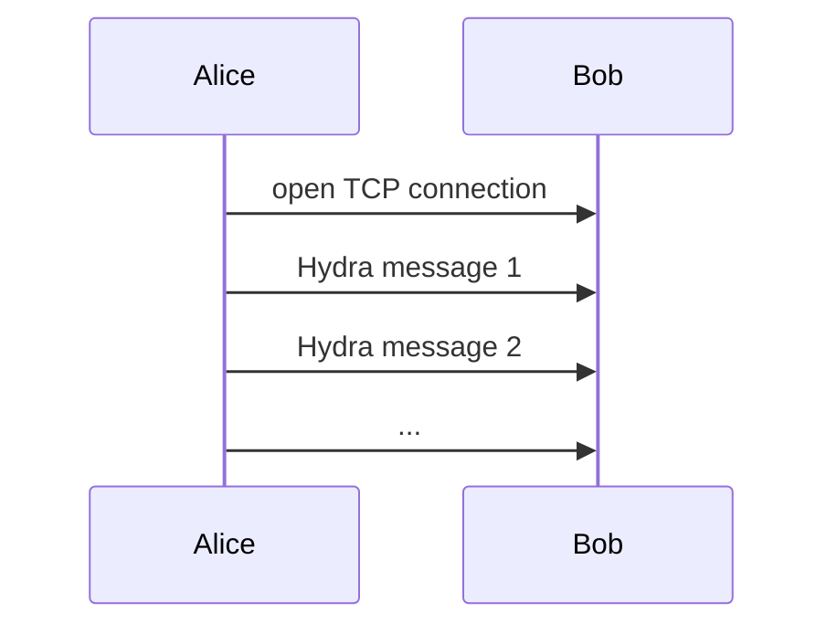
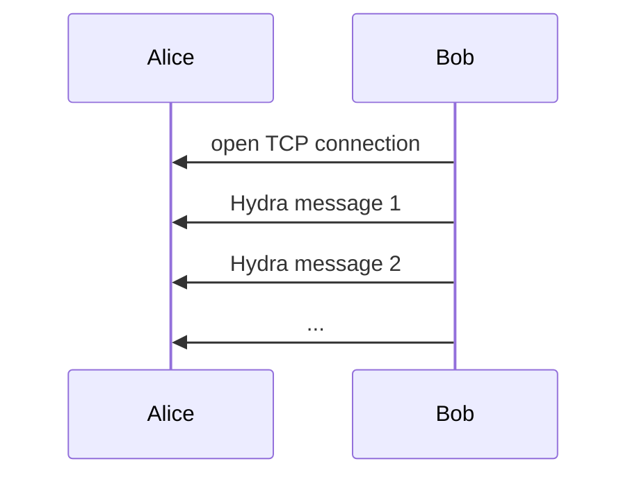
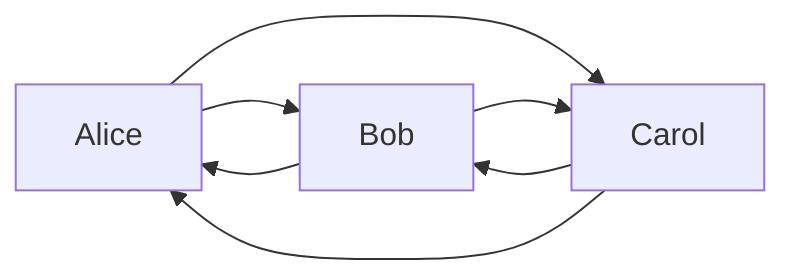
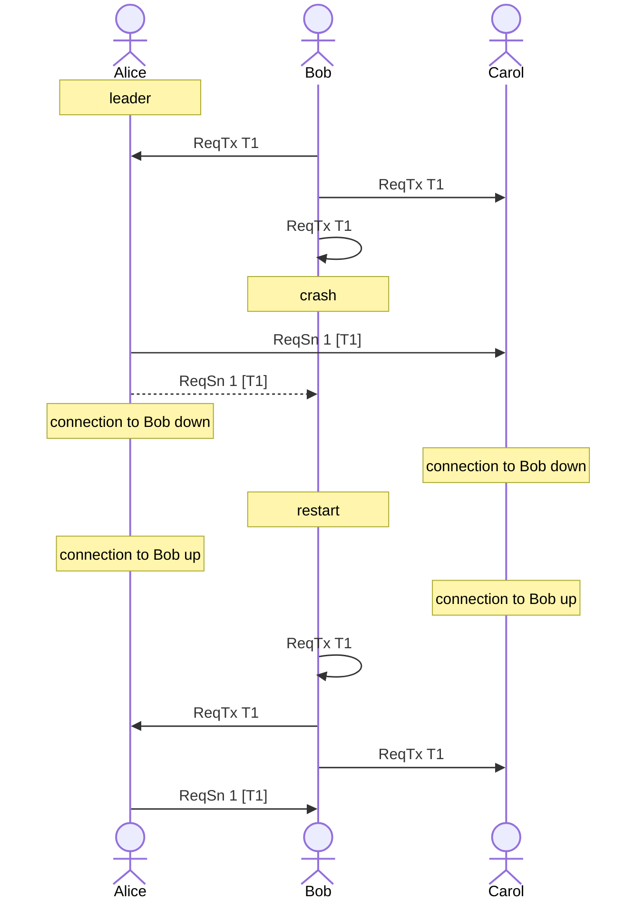
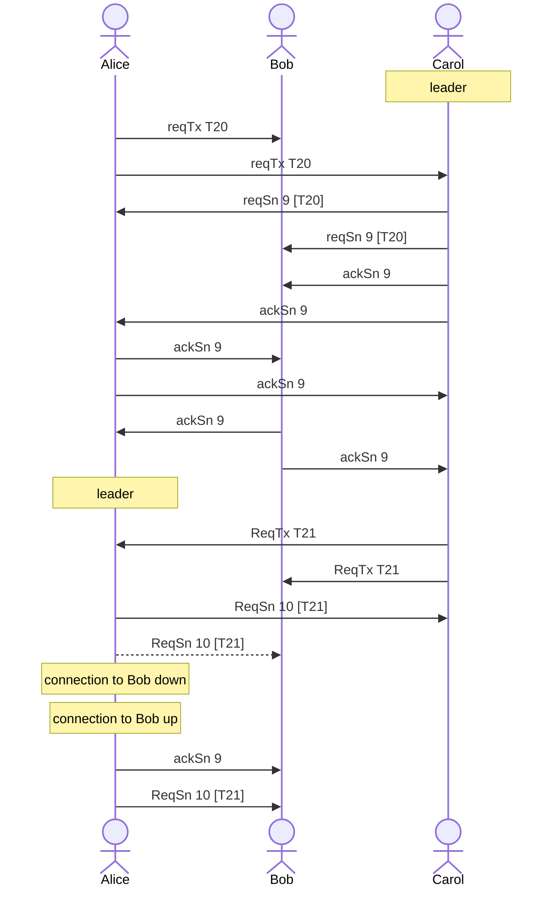
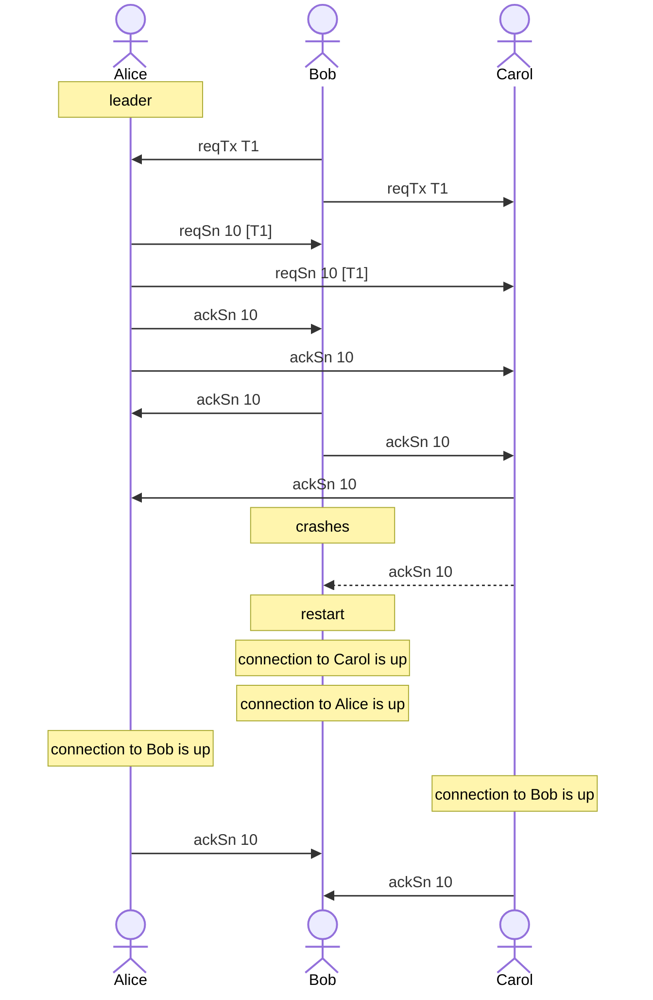
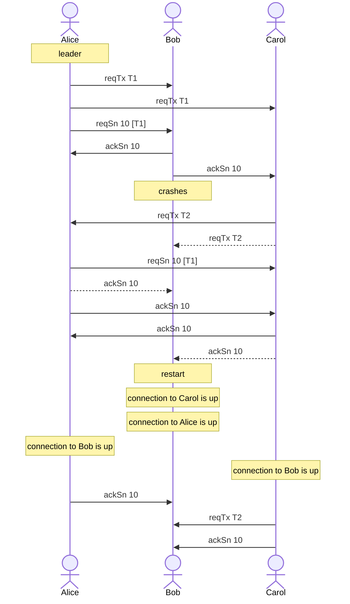

# Hydra network protocol

This document describes the Hydra network protocol, the communication mesh, how to open connection, the messages format and resilience strategy.

This network protocol is tied to the Hydra head protocol and message logic. The Hydra head protocol already takes care of re-ordering messages or acknowledging events to a certain extent.

This document first describes the network topology, then the network messages format and discuss about network resiliency.

## Network topology

In the Hydra network, each pair of peers are connected through two TCP connections. Each TCP connection is initiated by one of the peers to push Hydra messages to the other.

One TCP connection from Alice to Bob for Alice to push messages:



Another TCP connection from Bob to Alice for Bob to push messages:



Network topology for a three node head with TCP connections between all peers.



## Network Messages

Network messages in a Hydra head are twofold:

* heartbeat messages
* hydra messages

### Heartbeat

TODO: describe the heartbeat mechanism, the fact that we relly on seen messages and only heartbeat when needed and the format of the heartbeat messages themselves.

### Hydra Message

These are the messages that carry valuable information to move the Hydra head protocol forward. All messages are authenticated by the other thanks to a signature.

```
signedMessage = {
  payload: hydraMessage,
  signature: signature,
  party: party
}
```

TODO: describe what a signature or a party is.

TODO: decide if we want to use cddl notation or Haskell type like in what follows

```
data HydraMessage tx
  = ReqTx {transaction :: tx}
  | ReqSn {snapshotNumber :: SnapshotNumber, transactionIds :: [TxIdType tx]}
    AckSn {signed :: Signature (Snapshot tx), snapshotNumber :: SnapshotNumber}
```

### Data encoding

TODO: decide on the encoding

Data is encoded using CBOR/JSON. Here is an exemple for a ReqTx message authenticated by Alice:

```
TODO: show the abstract message and the concrete, on the wire, representation
```

## Establishing connections

Each node is accountable for:

* establishing an outgoing tcp connection to all the peers participating in the head
* listening to and accepting incomming connections from each peer participating in the head
* detect failure (using heartbeat and tcp signals) of incoming connections and closing them as soon as possible
* detect failure (using heartbeat and tcp signals) of outgoing connections and re-establishing them as soon as possible

Usually, on startup, a node would start by listening for incoming connections from peers on a given TCP address and port so that the other peers can connect to it.

On the other hand, the node would try to connect to each of the other peers members of the head using the given TCP address and port of these peers.

The node monitors the TCP connections using TCP signals and the heartbeat mechanism described above. In case of failure, the node will close the TCP connection and try to re-open it if it's an outgoing connection.

In case of failure when trying to open an outgoing connection, the node will retry on a regular basis.

## Network failures

When the node detects a connection failure it can't be sure about the state of the remote node and which message sent to this node have been received and processed.

However, the node knows about the last signed snapshot, which is part of the Hydra protocol. Knowing that snapshot _n_ has been signed by everyone is enough to know that all peers have received every messages needed to build this snapshot _n_. Meaning that, in the worst case, the peer did not receive messages concerning the currently in progress snapshot _n+1_ and, maybe, the node's own acknowledgement on snapshot _n_.

If one peer does not receive these messages because of a network failure or of a peer outage then the head will be stuck, even after the failing peer restarts and all connections are restored. For instance, a peer can be waiting for a missed `AckSn` message forever and reject the next snapshot, making the head stuck.

Re-sending `AckSn n` and all the current snapshot _n+1_ informations to any peer ensures that it has all informations from our node to move forward. If all node behave the same, then the head can move forward and the next snapshot _n+1_ be signed by all peers as soon as all connections are restored.

To ensure network resilience, when (re-)establishing an outgoing tcp connection, a node is responsible for:

* sending its own AckSn of the last signed snapshot through this connection
* sending all the relevant messages for the construction of the next snapshot through this connection

This specification does not state how the peer ensures this. Also note that the peer must ensure, in case of crash, that it does not _forget_ about its own messages it has already sent regarding the construction of the next snapshot.

This strategy also implies that a peer must accept re-submission of messages. Note that, at the Hydra protocol layer, messages re-submission is indempotent.

This approach:

* can rely on basic tcp connections by leveraging on the existing protocol information
* only requires a node to keep track of the head state
* no knowledge of the status of a remote peer or the messages it already received is needed
* requires that, on startup, a node can reconstruct the messages to send to its peers for building the next snapshot

Here is an example with Bob crashing and Alice and Carol re-sending it the needed information to build snapshot 1. Note how Bob also re-sends everything as it has no way to know about the state of Alice and Carol. Dotted lines represent messages failed to be sent:



In this case, Bob sent the message `ReqTx T1` so it needs to remember about this message on startup to ensure it handles this transaction nicely. Also, note that we're considering snapshot 1 for which no previous snapshot have been signed. Different cases will be exploreed later.

The next sections explore some network failure scenarios to clarify how resilience is ensured with this strategy.

### Split brain

As an example of a split brain, we consider only the TCP connection from Alice to Bob as being broken but everything else stays the same. In particular, no node is restarted and Carol never knows about this connection issue.

The network failure happens after snapshot 9 has been signed and we can see how Alice will retransmit to Bob its acknowledgement for snapshot 9 and the needed information to build snapshot 10. Dotted lines represent messages failed to be sent:



Bob has all information for the head to move forward with snapshot 10.

### AckSn not received

A specific case is when some ackSn message is not received because of network failure. This exemple shows how important resubmission of the previous ackSn is in that situation. Dotted lines represent messages failed to be sent:



For clarity, we ignore messages sent by Bob on reconnection here. But note that, not knowing that snapshot 10 has been signed by everyone, Bob would send the acknowledgement for snapshot 9 and then all the needed messages to build snapshot 10, although Carol and Alice wouldn't 't care about them because they received it before and re-processing them should be idempotent.

### reqTx for the next snapshot

This section hilights the fact that, upon reconnection, a node must send all the messages that matter for the construction of the current snapshot and not just the messages it sent after ackowledging the last snapshot.

Let's consider the case where Carol would send a reqTx just before receiving a reqSn, meaning the transaction would be included in the next snapshot, not this one. Here we ignore messages sent by Bob on restart for clarity. Dotted lines represent messages failed to be sent:



Since Alice knows that snapshot 10 has been signed, she knows that Bob has seen all her messages, at least, up until `AckSn 10`.

But note how Carol has to also send `reqTx T2` to Bob although it's been sent before her AckSn. This is needed because T2 is not included in snapshot 10 but should be in a later one so Carol has no way of knowing that Bob received this message or not (and, indeed, in this case it did not).

The order in which Carol sends the messages to Bob on reconnection does not matter as the Hydra protocol already tolerates message reordering so Carol could send the ackSn first and then the reqTx or the inverse without consequences.
