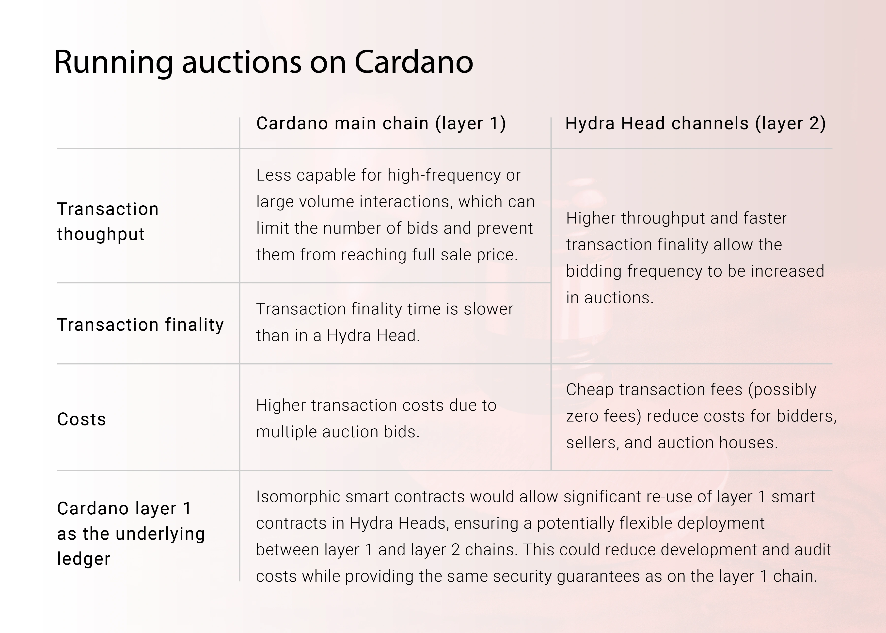

# Delegated voucher auctions (invitational)

This is the first complete prototype of an auction that can host its bidding process using the Hydra head protocol (layer 2).

:::tip This use case is under development

This project is an ongoing effort in collaboration with MLabs. Source code and documentation are available [here](https://github.com/mlabs-haskell/hydra-auction).

:::

## Overview

This document outlines the first building block of what could, with the support of the Cardano community, develop into a comprehensive Hydra-based auction framework. Among the various design candidates explored in our [January 2023 paper](https://iohk.io/en/blog/posts/2023/01/20/implementing-auction-projects-using-hydra/), the delegated voucher auction optimally utilizes the strengths of both the Cardano mainnet (layer 1) and the Hydra Head protocol (layer 2) while addressing their respective limitations.

Cardano secures its mainnet ledger by broadcasting transactions across a globally distributed network of independent nodes. A slot leader is randomly selected among these nodes to add the next block to the chain, making it extremely challenging to add an invalid transaction, censor a new transaction, or contradict the existence of a stable transaction within the ledger. The Ouroboros consensus protocol ensures robustness to nodes entering and leaving the network, as long as an honest majority of stake is maintained. However, the mainnet has high overhead in terms of cost and latency, as every transaction and block must be broadcast, stored, and validated on every node worldwide.

The Hydra Head protocol significantly reduces this cost and latency overhead by distributing its ledger across a smaller network of direct participants and only tracking transactions that interact with a subset of the mainnet UTXOs. However, it relies on the direct participants to maintain the ledger's integrity, and all participants must unanimously agree on each transaction added to the ledger. This requires anyone committing funds to a Hydra head to either participate directly in the protocol or effectively grant custody over the committed funds to the direct participants. Additionally, no action can be taken in the Hydra head without unanimous consent from the direct participants. Moreover, all participants must be online and responsive to each other for the Hydra Head protocol to make progress; otherwise, it will stall.

## Design

To create a lively and efficient bidding experience, we host the bidding process of our auction on layer 2 instead of layer 1. Since we can't have bidders directly participate in the Hydra head, we designate an independent group of delegates to represent them. These delegates play a role similar to stake pool and light wallet providers on Cardano layer 1. 

To avoid granting custody of the bidder’s funds or the seller's NFT auction lot to the delegates, we use the Hydra head purely to manage the informational aspect of the bidding process. The auction lot and the bidders' funds remain on layer 1 at all times. As the bidders' funds are not on the Hydra head ledger, we allow the seller to require fixed security deposits into a smart contract on layer 1 to ensure that winning bidders honor their bids. 

However, fixed-size security deposits don't completely protect the seller from dishonorable behavior by bidders, especially if bids unexpectedly rise. This could lead a bidder to dishonor a genuine bid or place a disingenuous bid to sabotage the auction. To mitigate this risk and manage the auction effectively, the seller needs to be able to apply know-your-customer (KYC) and anti-money-laundering (AML) processes to the auction. 

For these reasons, we plan to implement an invitational private version of the auction initially, where the seller has absolute discretion over which bidders may participate. The public version of the auction, where bidders can freely participate, will be implemented in a later milestone.

## Workflow

In this prototype, each auction proceeds as follows:

1. Delegates set up a Hydra head to host the bidding for an upcoming auction.
2. The seller announces the auction, defines the terms (including the security deposit), places the NFT into the auction smart contract, and specifies which Hydra head will host the bidding.
3. Potential bidders register by placing security deposits into the auction smart contract.
4. As the auction's start time approaches, the bidding process transitions from layer 1 to layer 2.
5. The seller invites bidders and commences the auction. The seller has discretion based on security deposits and KYC/AML considerations.
6. Bidders submit bids to delegates, who collectively record the bids in the Hydra head ledger and confirm bids to bidders through multi-signed ledger snapshots.
7. When the bidding phase ends, the Hydra head closes, and the highest bid goes to layer 1. The winning bidder then purchases the auction lot at the highest bid price.
8. The winning bidder has time until the voucher expiration to purchase the auction lot for the highest bid price.
9. If the winning bidder does not purchase the auction lot after the voucher expiration, the seller can reclaim it and assert the winning bidder’s security deposit for the auction. Otherwise, the winning bidder can assert their security deposit.
10. All other bidders can assert their security deposits at the end of the bidding phase.

## Prerequisites from Hydra technical roadmap

During the design and early implementation phase, the following prerequisites were identified to enable using the auction smart contracts on layer 2:

- Add a method to the Hydra node API to commit UTXOs from script addresses.
- Support committing multiple UTXOs per Hydra head participant, so that collateral UTXOs can be committed to the Hydra head for transactions with validator scripts on layer 2.
- Allow time to pass on the Layer 2 ledger (instead of maintaining time fixed at the start time of the Hydra head).

Fortunately, the Hydra core developers implemented all of these features during the course of the milestone. Thank you! 🚀

## Remaining limitations

Please note the following limitations of the initial prototype auction design:

- The auction implementation is a prototype and may not be ready for production.
- Open auctions, where bidders can freely enter any auction to bid, are not supported.
- Bids are only backed by fixed security deposits from bidders, which may be less than the full bid amount.
- A new Hydra head must be opened for every auction.
- Delegates have the ability to censor bidders from submitting bids to the auction.
- Delegates are responsible for ensuring that the standing bid of the auction can only be replaced by a new bid that exceeds it by the minimum increment defined in the auction terms. However, bidders receive multi-signed proof for every confirmed bid, which can serve as evidence in case of disputes. This could allow for off-chain arbitration mechanisms to resolve disputes and/or an additional smart contract module where delegates could provide deposits that would be slashable if such evidence is provided.
