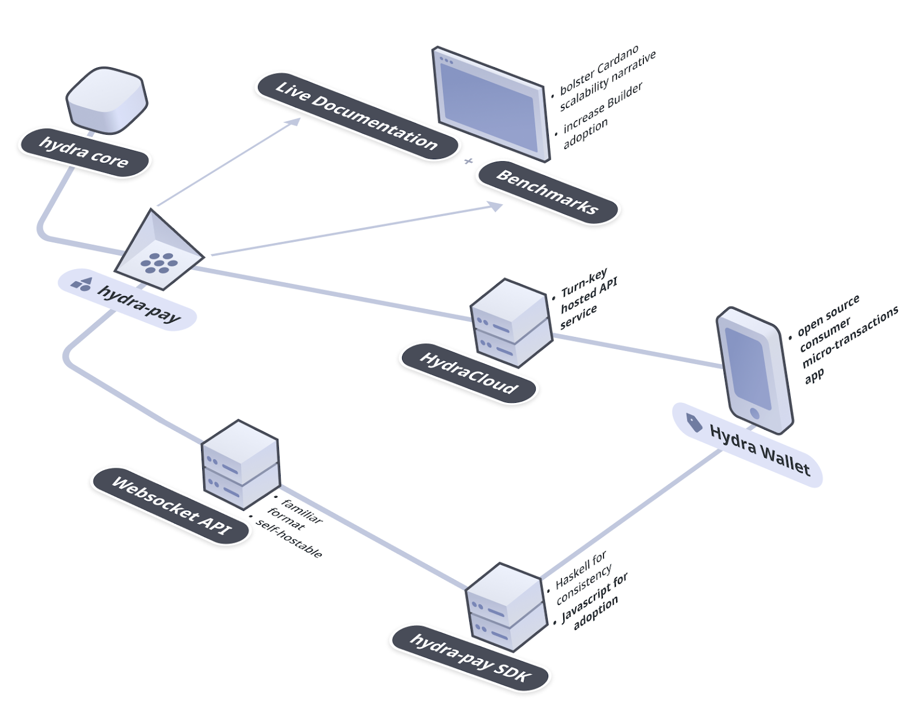

# Hydra for Payments

:::caution This category will be restructured

The payments category will be restructured into a more consistent
use-case-centric roadmap of application scenarios. For now it still contains
some legacy use case articles.
:::

Hydra for Payments is an ongoing collaboration with Obsidian Systems meant to complement the evolving Hydra Head Protocol with tooling designed for payment-specific use cases.

The current phase of development is focused on extending the existing open-source Hydra for Payments library by providing the following:

- An expanded **payment channel API** with convenience features meant to reduce builder ramp-up and time-to-market for their projects.

- High-assurance mechanisms especially important for builders of commercial projects trusted with user assets.

- Flexible **configurations** with sensible defaults to help builders dynamically scale their product and implement compelling user experiences.

The plan is to consolidate this work and make it available as the **mainnet-compatible Hydra for Payments SDK**.

To validate these aims, the launch of a **mobile reference application** will follow. The application will directly utilize the Hydra for Payments SDK for all of critical payment channel functionality.

### Further Reading

- The post introducing the Hydra for Payments project can be found [here](https://iohk.io/en/blog/posts/2022/11/10/hydra-for-payments-introducing-developer-tooling-to-unlock-micropayments-on-cardano/).

- Hydra for Payments is under active development and the source code and documentation can be found [here](https://github.com/obsidiansystems/hydra-pay).

### An Example Configuration

