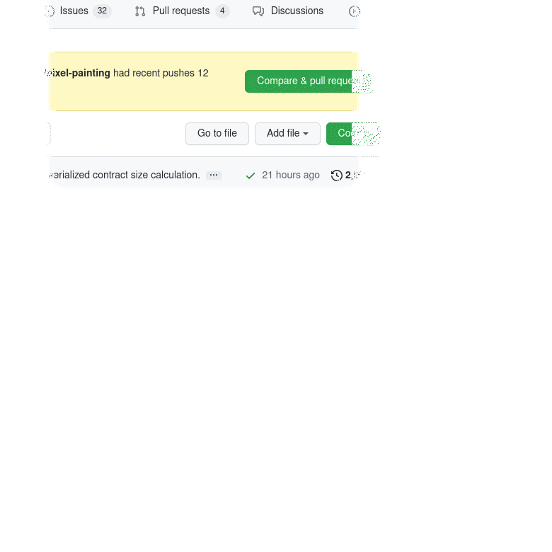

# Hydraw



_Hydraw_ is the result of a 3 days Hackathon that took place in Lyon March 2022. It's a simple web application that can connect to a Hydra node's Client API. It provides the following features:
* Participants in the Head can request coloring individual pixels using the provided user interface which results in a _transaction_ being posted into the Head,
* Metadata from _Confirmed_ transactions happening in the Head is interpreted as instructions to draw individual pixels with some RGB color.

# Build

To build the web server that connects serves frontend and connects to Hydra API:

```
cabal build
```

The frontend is written in vanilla HTML/CSS/JS and is dynamically served from the web server. The latter also provides a WebSocket "proxy" to the Hydra node's Client API.

# Run

All command from within `pixel-painting/` and assuming your Hydra API host+port is `hydra.example.io:4001` and your cardano signing key is `cardano.sk`:

Edit the API endpoint in the `bundle.js` to your API host+port, e.g.

``` javascript
const HYDRA_API_HOST = "hydra.example.io:4001";
```

Launching the pixel-painting bridge (assumes current directory is the `pixel-painting` directory):

``` sh
HYDRA_API_HOST=hydra.example.io:4001 HYDRA_SIGNING_KEY=cardano.sk cabal exec pixel-painting
```
