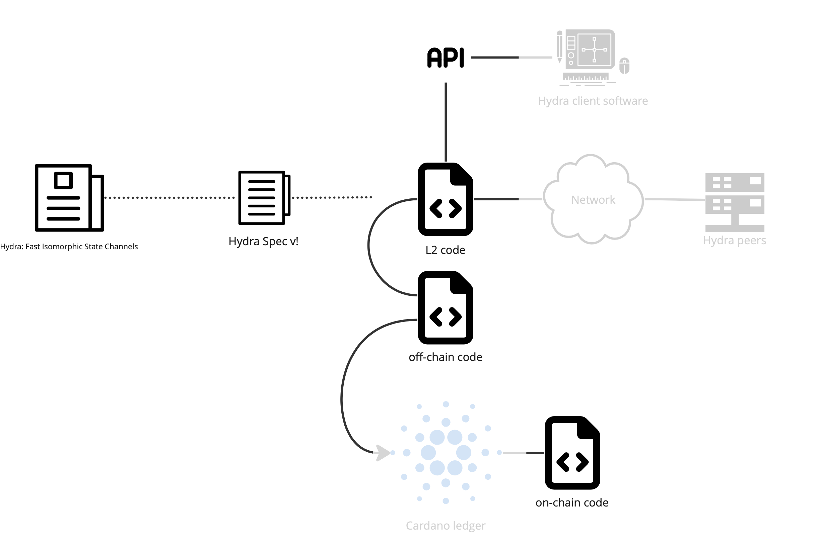

# 2 - Background

Hydra is the layer 2 (L2) scalability solution for Cardano, which aims to minimize transaction cost and increase transaction speed via low latency & high throughput.
Hydra Head is the first of whole family of protocols and embodies the foundation for more advanced constructions relying on isomorphic, multi-party state-channels. Detailed information can be found at https://hydra.family/head-protocol/.

# 4 - Project Scope

We are issuing this solicitation to perform an assessment of the security of the Hydra Head protocol implementation. The hydra team is looking for a comprehensive and best practice security audit, including static and dynamic analysis, focused, but not limited to, the areas of concern below. Any additional materials and documentation can be referenced and attached to your submission.

Per [CIP-52](https://github.com/cardano-foundation/CIPs/tree/master/CIP-0052),
1. Any discrepancies, deviations or spotted vulnerabilities shall be described and classified with an appropriate severity level. Recommendations to rectify the identified deficiencies shall also be provided whenever appropriate.
2. When automated tools are used as a replacement for manual review/code inspection, they shall be documented or referenced. Note that it’s the responsibility of the auditor to ensure that such tooling may not exhibit potential failures that can adversely affect the review outcome.
3. Any strategies/methodologies used to assess the consistency, correctness and completeness of the requirements shall also be documented or referenced.

## Context and assumptions

The Hydra Head protocol is implemented in the `hydra-node`, which connects to the Cardano network as layer 1 (L1) through a `cardano-node`, to other Hydra Head compliant nodes over an off-chain network, and exposes an API to users of the layer 2. Most relevant artifacts for this audit are:
 - Coordinated Hydra Head V1 Specification
 - Hydra plutus scripts (on-chain code)
 - Hydra node chain layer code (off-chain code)

As described in the following figure, the main entry points of a Hydra node are:
* The API through wich a client can connect to the node;
* The network communication with other Hydra node peers;
* The transactions posted on the Cardano ledger (accessed through a network connection).
 

A detailed description of each of the artifacts relevant for this audit can be found in the above section _Artifacts_.

For its operations, the hydra-node process relies on a cardano-node process and client processes can connect to the hydra-node process through API. Any assessment performed during this audit must be done under the following assumptions about the environment of the Hydra node implementation:
* Organizational procedures for managing the hydra and cardano signing keys are trusted;
* The system running the hydra-node is trusted;
* The cardano-node software is trusted as is the system running it;
* Any client software connecting through the API is trusted as are the systems running them;
* The communications between the cardano-node and the hydra-node are trusted;
* The communications between the hydra-node and any client software connecting through the API are trusted;
* The cardano-node is assumed to have a responsive communication line with the Cardano network such that the hydra-node can react to on-chain transactions in a timely manner. In particular, hydra-node is able to observe head closure and contest in a delay shorter than the contestation period fixed by the protocol.

What is not explicitly trusted in the above list is deemed untrusted. In particular, the other hydra nodes participating in a head are not trusted.

Any discovery not compliant with one of these assumptions is out of scope.

Responder can formulate comments about any of the above. Especially if they can suggest less restricting assumptions under which the security properties of Hydra still hold. Or if they would suggest practical suggestions on how to implement these assumptions. We accept recommendations about how to ensure these assumptions hold in a real environment.

## Tasks

Broadly speaking, our goal is to ensure that the security properties proven in _Coordinated Hydra Head V1 Specification_ hold for the implementation, taking also into acount the main entry points of a `hydra-node` which are the node to node network communications, the API and the Cardano ledger.
Furthermore, we want to focus efforts on ensuring correctness and robustness of the _Hydra plutus scripts_ (on-chain code) as it is harder (or impossible) to fix in the field and attackers could side-step all measures but the on-chain code (i.e. use their own off-chain code).

We are requesting proposals to assess the following statements, which will be detailed in the next sections:
1. Coordinated Hydra Head V1 specification proofs are sound.
2. Hydra plutus scripts (on-chain code) are consistent with Hydra Head V1 specification and immune to common Cardano smart-contract weaknesses.
3. Hydra node chain layer code generates transactions which are consistent with Hydra Head V1 specification.

### Coordinated Hydra Head V1 specification proofs are sound

The Hydra Head V1 specification describes Coordinated Hydra Head V1 Protocol.

This specification provides several important security properties:
* Consistency: No two uncorrupted parties see conflicting transactions confirmed.
* Liveness: If all parties remain uncorrupted and the adversary delivers all messages, then every transaction becomes confirmed at some point.
* Soundness: The final UTxO set accepted on the mainchain results from a set of seen transactions.
* Completeness: All transactions observed as confirmed by an honest party at the end of the protocol are considered on the mainchain.

Review this specification to give us comments and assess that the above properties hold.
The outcome of the review should include, but not being limited to:
* Identification of any inconsistencies or lack of generality within the specification;
* Identification of any inconsistencies in the proofs exposed in the specification;
* Identification of any behavior that could lead, with an adverserial mindset, to one of the above properties to be falsified.

### Hydra plutus scripts are consistent with Hydra Head V1 specification and immune to common Cardano smart-contract weaknesses

The Coordinated Hydra Head V1 specification defines the checks the on-chain scripts must perform for a functioning Hydra Head.

Assess that the Hydra plutus scripts are consistent with the Coordinated Hydra Head V1 specification and immune to common possible vulnerabilities for Cardano smart contracts, such as but not limited to the following attacks:
* Execution cost limits;
* Double satisfaction;
* Replay;
* Denial of service.

The outcome of the review should also include, but not being limited to:
* a validation that the Hydra plutus scripts validators do check the transaction constraints defined in the Coordinated Hydra Head V1 specification;
* a review and comment on the mutation-based tests applied to the Hydra plutus scripts and, in particular, any adversarial situation that would not be covered by them but should be in the context of this audit;

See the documentation of our [Mutation-Based tests](https://hydra.family/head-protocol/haddock/hydra-node/tests/Hydra-Chain-Direct-Contract-Mutation.html)

See [Common Weaknesses](https://plutus.readthedocs.io/en/latest/reference/writing-scripts/common-weaknesses/index.html) and [Vulnerabilities](https://github.com/Plutonomicon/plutonomicon/blob/main/vulnerabilities.md).

### Hydra node chain layer code generates transactions which are consistent with Hydra Head V1 specification

The Coordinated Hydra Head V1 specification defines the transactions the off-chain code should build and post to evolve the head status on-chain.

Assess that the Hydra node chain layer code can only build transactions which are consistent with the Coordinated Hydra Head V1 specification.

## Out of Scope

The scope of this audit has been described in the above sections. What is not in scope is out of scope. In particular, the following items are out of scope of this audit:

* Hydra Head protocol implementation is immune to attacks via chain transactions.
* Hydra Head protocol implementation is immune to attacks via network.
* Hydra Head protocol implementation faithfully reflects the head state through the API.
* Hydra Head protocol implementation is immune to API attacks.
* Any attack which would be invalid under the assumptions stated above in the document.

## Artifacts

This sections gives a detailed description of the aritfacts mentioned in this RFP:
 - Coordinated Hydra Head V1 Specification
 - Hydra plutus scripts (on-chain code)
 - Hydra node chain layer code (off-chain code)

### Artifact 1: Coordinated Hydra Head V1 Specification

The Hydra Head protocol implementation derives from [Hydra: Fast Isomorphic State Channels](https://eprint.iacr.org/2020/299.pdf) in several ways. Especially some simplifications have been introduced and generalizations removed.

The [Coordinated Hydra Head V1 specification](https://docs.google.com/document/d/1XQ0C7Ko3Ifo5a4TOcW1fDT8gMYryB54PCEgOiFaAwGE/) captures these deviations and also includes the "formal notation" of the actual transaction constraints (which are foregone in the original paper). Also, it details the L2 protocol logic for the **Coordinated** Head protocol - which is implemented in V1.

### Artifact 2: Hydra Head Protocol Implementation

With Hydra Head Protocol Implementation we refer to the software component that is used to operate a node in the Hydra Head protocol. The `hydra-node` allows its users to open a head, lock funds in it, connect to peers, process transactions as a layer 2, close a head and unlock the corresponding funds. It is comprised by the Hydra plutus scripts, Hydra head chain layer, layer 2 code, network communication between peers, and an API for clients to connect and use the node.

* Source code repository: [input-output-hk/hydra](https://github.com/input-output-hk/hydra)
* Version to be audited: [0.9.0](https://github.com/input-output-hk/hydra/releases/tag/0.9.0)

The scope of this audit is limited to the following parts (described below):
 - Hydra plutus scripts (on-chain code)
 - Hydra node chain layer code (off-chain code)

#### Artifact 2.1: Hydra plutus scripts (on-chain code)

Hydra plutus scripts source code can be found in the [hydra-plutus module](https://github.com/input-output-hk/hydra/tree/master/hydra-plutus).

Hydra plutus mutation based testing can be found in the [hydra-node module](https://github.com/input-output-hk/hydra/tree/master/hydra-node) in test/Hydra/Chain/Direct/Contract/.

#### Artifact 2.2: Hydra node chain layer code (off-chain code)

Hydra node chain layer code can be found in the [hydra-node module](https://github.com/input-output-hk/hydra/tree/master/hydra-node) in src/Hydra/Chain/Direct/

Hydra node chain layer tests can be found in the [hydra-node module](https://github.com/input-output-hk/hydra/tree/master/hydra-node) in test/Hydra/Chain/Direct/
